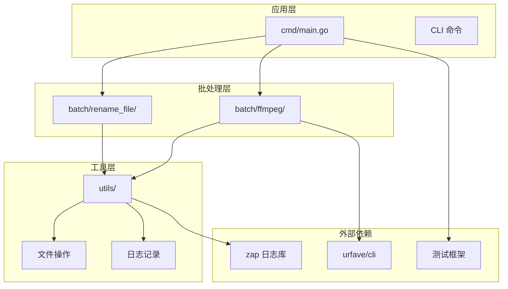
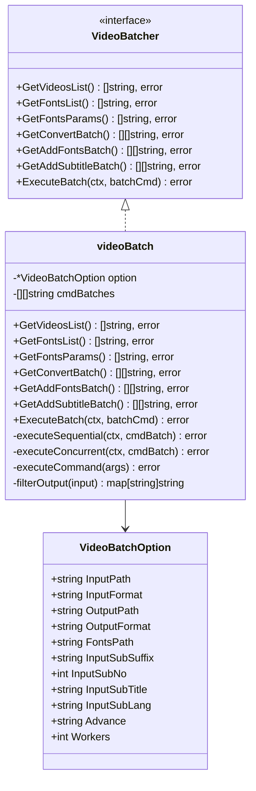
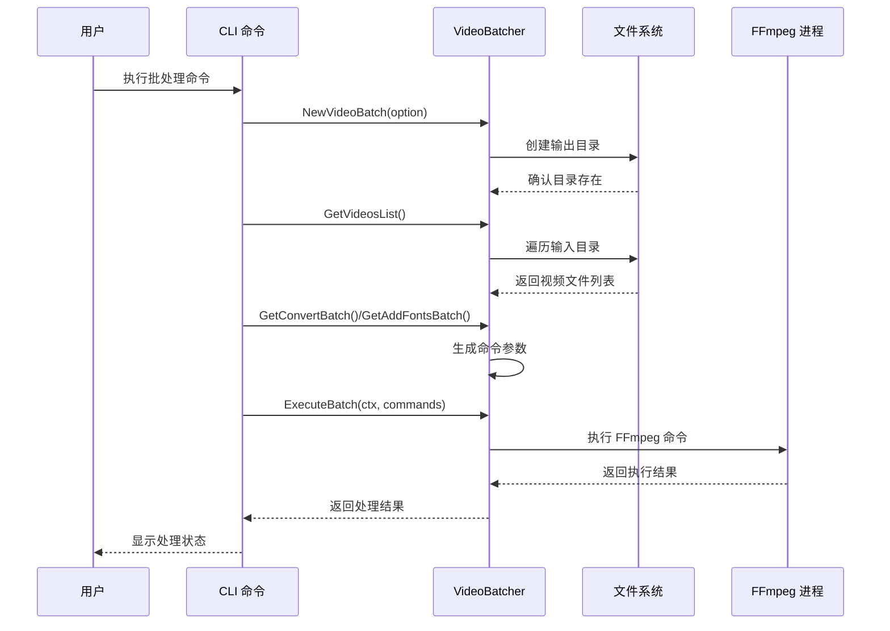
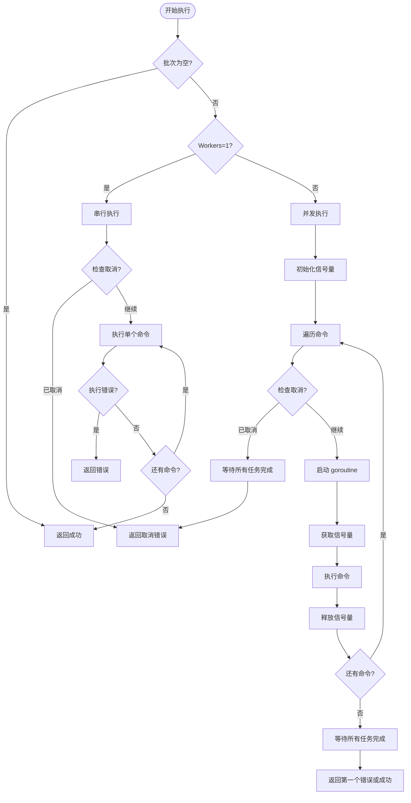
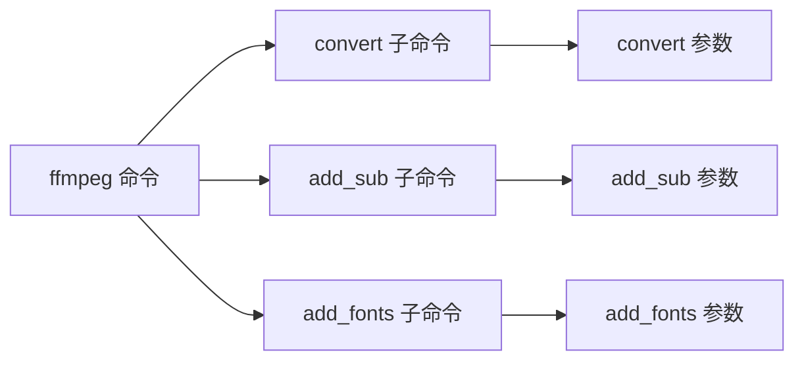
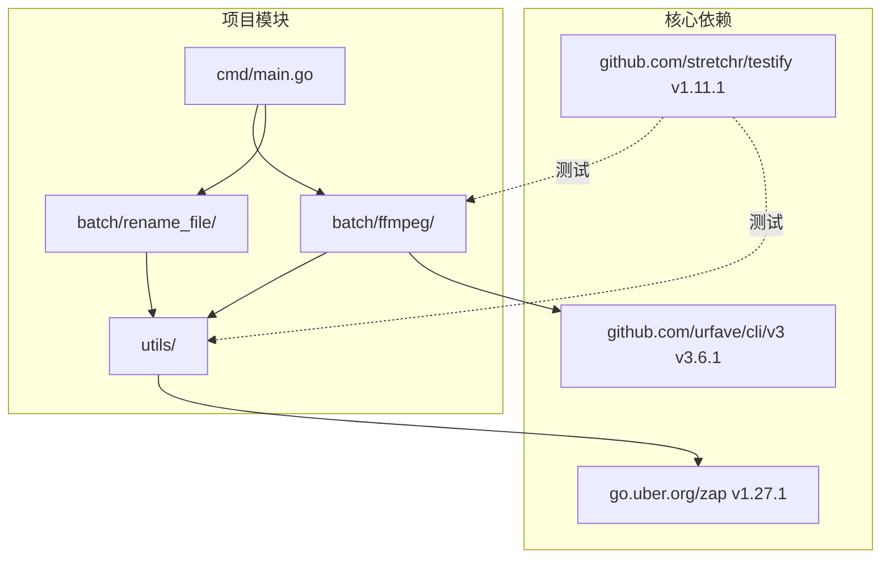

# API 参考文档

<cite>
**本文档引用的文件**
- [cmd/main.go](file://cmd/main.go)
- [batch/ffmpeg/ffmpeg.go](file://batch/ffmpeg/ffmpeg.go)
- [batch/ffmpeg/init.go](file://batch/ffmpeg/init.go)
- [batch/ffmpeg/convert.go](file://batch/ffmpeg/convert.go)
- [batch/ffmpeg/add_sub.go](file://batch/ffmpeg/add_sub.go)
- [batch/ffmpeg/add_font.go](file://batch/ffmpeg/add_font.go)
- [batch/rename_file/init.go](file://batch/rename_file/init.go)
- [utils/file.go](file://utils/file.go)
- [utils/logger.go](file://utils/logger.go)
- [batch/ffmpeg/ffmpeg_test.go](file://batch/ffmpeg/ffmpeg_test.go)
- [utils/file_test.go](file://utils/file_test.go)
- [go.mod](file://go.mod)
- [docs/ffmpeg.md](file://docs/ffmpeg.md)
</cite>

## 目录
1. [简介](#简介)
2. [项目结构](#项目结构)
3. [核心组件](#核心组件)
4. [架构概览](#架构概览)
5. [详细组件分析](#详细组件分析)
6. [依赖分析](#依赖分析)
7. [性能考虑](#性能考虑)
8. [故障排除指南](#故障排除指南)
9. [结论](#结论)
10. [附录](#附录)

## 简介

batcher 是一个基于 FFmpeg 的视频批量处理工具，提供了视频格式转换、字幕添加和字体嵌入等批处理功能。该项目采用模块化设计，通过 CLI 命令行界面提供易用的操作接口。

## 项目结构



**图表来源**
- [cmd/main.go:1-29](file://cmd/main.go#L1-L29)
- [batch/ffmpeg/ffmpeg.go:1-324](file://batch/ffmpeg/ffmpeg.go#L1-L324)
- [batch/rename_file/init.go:1-35](file://batch/rename_file/init.go#L1-L35)

**章节来源**
- [cmd/main.go:1-29](file://cmd/main.go#L1-L29)
- [go.mod:1-17](file://go.mod#L1-L17)

## 核心组件

### VideoBatcher 接口

VideoBatcher 是视频批处理的核心接口，定义了视频处理的完整生命周期：



**图表来源**
- [batch/ffmpeg/ffmpeg.go:30-64](file://batch/ffmpeg/ffmpeg.go#L30-L64)
- [batch/ffmpeg/ffmpeg.go:16-28](file://batch/ffmpeg/ffmpeg.go#L16-L28)

### VideoBatchOption 配置结构体

VideoBatchOption 定义了视频批处理的所有配置选项：

| 字段名 | 类型 | 默认值 | 必填 | 描述 |
|--------|------|--------|------|------|
| InputPath | string | "./" | 否 | 输入视频文件夹路径 |
| InputFormat | string | "mp4" | 否 | 输入视频文件扩展名 |
| OutputPath | string | "./result/" | 是 | 输出文件夹路径 |
| OutputFormat | string | "mkv" | 否 | 输出视频文件扩展名 |
| FontsPath | string | "" | 否 | 字体文件夹路径 |
| InputSubSuffix | string | "" | 否 | 字幕后缀（如 ass） |
| InputSubNo | int | 0 | 否 | 字幕流编号 |
| InputSubTitle | string | "" | 否 | 字幕标题 |
| InputSubLang | string | "" | 否 | 字幕语言代码 |
| Advance | string | "" | 否 | 高级自定义参数 |
| Workers | int | 1 | 否 | 并发工作线程数 |

**章节来源**
- [batch/ffmpeg/ffmpeg.go:16-28](file://batch/ffmpeg/ffmpeg.go#L16-L28)

## 架构概览



**图表来源**
- [batch/ffmpeg/ffmpeg.go:47-64](file://batch/ffmpeg/ffmpeg.go#L47-L64)
- [batch/ffmpeg/ffmpeg.go:137-156](file://batch/ffmpeg/ffmpeg.go#L137-L156)
- [batch/ffmpeg/ffmpeg.go:218-231](file://batch/ffmpeg/ffmpeg.go#L218-L231)

## 详细组件分析

### 视频批处理实现

#### NewVideoBatch 函数

创建新的视频批处理器实例：

**函数签名**: `NewVideoBatch(opt *VideoBatchOption) (VideoBatcher, error)`

**参数**:
- `opt`: VideoBatchOption 配置对象

**返回值**:
- `VideoBatcher`: 新创建的批处理器实例
- `error`: 错误信息（如果配置无效）

**错误处理**:
- 当 `opt` 为 `nil` 时返回错误
- 当输出目录创建失败时返回错误

**章节来源**
- [batch/ffmpeg/ffmpeg.go:47-64](file://batch/ffmpeg/ffmpeg.go#L47-L64)

#### 视频文件扫描

##### GetVideosList 方法

扫描指定目录下的视频文件：

**函数签名**: `GetVideosList() []string, error`

**功能**: 遍历 `InputPath` 目录，查找扩展名为 `InputFormat` 的视频文件

**返回值**:
- `[]string`: 匹配的视频文件绝对路径列表
- `error`: 文件系统遍历错误

**章节来源**
- [batch/ffmpeg/ffmpeg.go:66-87](file://batch/ffmpeg/ffmpeg.go#L66-L87)

##### GetFontsList 方法

扫描字体文件：

**函数签名**: `GetFontsList() []string, error`

**功能**: 遍历 `FontsPath` 目录，查找支持的字体文件（.ttf, .otf, .ttc）

**返回值**:
- `[]string`: 字体文件绝对路径列表
- `error`: 文件系统遍历错误

**章节来源**
- [batch/ffmpeg/ffmpeg.go:89-113](file://batch/ffmpeg/ffmpeg.go#L89-L113)

#### 命令生成器

##### GetConvertBatch 方法

生成视频转换命令批次：

**函数签名**: `GetConvertBatch() ([][]string, error)`

**功能**: 为每个输入视频生成 FFmpeg 转换命令

**返回值**:
- `[][]string`: 命令参数二维数组
- `error`: 命令生成错误

**命令格式**: `["-i", "input.mp4", "output.mkv"]`

**章节来源**
- [batch/ffmpeg/ffmpeg.go:137-156](file://batch/ffmpeg/ffmpeg.go#L137-L156)

##### GetAddFontsBatch 方法

生成添加字体命令批次：

**函数签名**: `GetAddFontsBatch() ([][]string, error)`

**功能**: 为每个输入视频生成嵌入字体的命令

**返回值**:
- `[][]string`: 命令参数二维数组
- `error`: 命令生成错误

**命令格式**: `["-i", "input.mkv", "-c", "copy", "-attach", "font.ttf", ...]`

**章节来源**
- [batch/ffmpeg/ffmpeg.go:158-178](file://batch/ffmpeg/ffmpeg.go#L158-L178)

##### GetAddSubtitleBatch 方法

生成添加字幕命令批次：

**函数签名**: `GetAddSubtitleBatch() ([][]string, error)`

**功能**: 为每个输入视频生成添加字幕的命令

**返回值**:
- `[][]string`: 命令参数二维数组
- `error`: 命令生成错误

**命令格式**: `["-i", "input.mkv", "-sub_charenc", "UTF-8", "-i", "subtitle.ass", "-map", "0", "-map", "1", "-c", "copy", ...]`

**章节来源**
- [batch/ffmpeg/ffmpeg.go:180-216](file://batch/ffmpeg/ffmpeg.go#L180-L216)

#### 执行引擎

##### ExecuteBatch 方法

执行批处理命令，支持并发控制：

**函数签名**: `ExecuteBatch(ctx context.Context, batchCmd [][]string) error`

**参数**:
- `ctx`: 上下文对象，支持取消操作
- `batchCmd`: 命令参数批次

**功能**: 
- 单线程模式：按顺序执行命令
- 并发模式：使用信号量控制最大并发数

**返回值**: 执行过程中的任何错误

**并发控制**: 
- `Workers = 1`: 串行执行
- `Workers > 1`: 并发执行，最大并发数为 `Workers`

**章节来源**
- [batch/ffmpeg/ffmpeg.go:218-231](file://batch/ffmpeg/ffmpeg.go#L218-L231)

##### 执行流程图



**图表来源**
- [batch/ffmpeg/ffmpeg.go:233-286](file://batch/ffmpeg/ffmpeg.go#L233-L286)

**章节来源**
- [batch/ffmpeg/ffmpeg.go:233-286](file://batch/ffmpeg/ffmpeg.go#L233-L286)

### 工具函数 API

#### MakeDir 函数

创建目录，如果不存在则创建：

**函数签名**: `MakeDir(fullPath string) error`

**参数**:
- `fullPath`: 要创建的目录路径

**返回值**: 创建过程中的任何错误

**行为**:
- 如果目录已存在且是目录：返回成功
- 如果路径存在但不是目录：返回错误
- 如果目录不存在：递归创建

**章节来源**
- [utils/file.go:8-31](file://utils/file.go#L8-L31)

#### NewLogger 函数

创建日志记录器实例：

**函数签名**: `NewLogger() *zap.Logger`

**返回值**: 配置好的日志记录器实例

**功能特性**:
- 控制台输出，带颜色编码
- 包含时间戳、调用者信息
- 支持调试级别日志

**章节来源**
- [utils/logger.go:11-28](file://utils/logger.go#L11-L28)

### CLI 命令接口

#### FfmpegBatchCmd 命令

主命令入口，包含三个子命令：



**图表来源**
- [batch/ffmpeg/init.go:62-71](file://batch/ffmpeg/init.go#L62-L71)

##### Convert 子命令

视频转换功能，支持硬件加速和自定义参数。

**主要参数**:
- `--input_path`: 输入目录路径
- `--input_format`: 输入文件格式（默认 mp4）
- `--output_path`: 输出目录路径
- `--output_format`: 输出文件格式（默认 mkv）
- `--advance`: 高级自定义参数
- `--dry-run`: 预览模式，不实际执行
- `--workers`: 并发工作数

**章节来源**
- [batch/ffmpeg/convert.go:11-63](file://batch/ffmpeg/convert.go#L11-L63)

##### Add Sub 子命令

添加字幕功能。

**主要参数**:
- `--input_sub_suffix`: 字幕后缀（默认 ass）
- `--input_sub_no`: 字幕流编号（默认 0）
- `--input_sub_lang`: 字幕语言代码（默认 chi）
- `--input_sub_title`: 字幕标题（默认 Chinese）

**章节来源**
- [batch/ffmpeg/add_sub.go:11-87](file://batch/ffmpeg/add_sub.go#L11-L87)

##### Add Fonts 子命令

添加字体功能。

**主要参数**:
- `--input_fonts_path`: 字体目录路径（必需）

**章节来源**
- [batch/ffmpeg/add_font.go:11-68](file://batch/ffmpeg/add_font.go#L11-L68)

## 依赖分析



**图表来源**
- [go.mod:5-16](file://go.mod#L5-L16)

**章节来源**
- [go.mod:1-17](file://go.mod#L1-L17)

## 性能考虑

### 并发执行策略

1. **信号量控制**: 使用固定大小的通道作为信号量，限制最大并发数
2. **goroutine 管理**: 每个命令在独立 goroutine 中执行
3. **错误聚合**: 第一个错误被记录并传播，后续错误被忽略
4. **上下文取消**: 支持优雅取消，立即停止新任务的启动

### 内存优化

1. **流式处理**: 不会将整个视频文件加载到内存
2. **分批执行**: 命令按批次生成和执行，避免内存累积
3. **路径映射**: 使用映射表管理输入输出文件对应关系

## 故障排除指南

### 常见错误类型

#### 配置错误

**错误场景**: `NewVideoBatch` 返回错误
**可能原因**:
- `opt` 为 `nil`
- `OutputPath` 为空
- 输出目录创建失败

**解决方案**:
- 确保传入有效的 `VideoBatchOption`
- 检查输出目录权限
- 验证路径格式正确

#### 文件系统错误

**错误场景**: `GetVideosList` 或 `GetFontsList` 返回错误
**可能原因**:
- 输入路径不存在
- 权限不足访问目录
- 文件系统异常

**解决方案**:
- 检查路径是否存在且可访问
- 确认有足够的文件系统权限
- 验证磁盘空间充足

#### FFmpeg 执行错误

**错误场景**: `ExecuteBatch` 返回错误
**可能原因**:
- FFmpeg 未安装或不可执行
- 输入文件损坏
- 参数格式错误

**解决方案**:
- 确保 FFmpeg 正确安装并可在 PATH 中找到
- 验证输入文件完整性
- 检查命令参数格式

### 调试建议

1. **启用预览模式**: 使用 `--dry-run` 参数查看将要执行的命令
2. **检查日志输出**: 查看详细的执行日志信息
3. **逐步验证**: 先测试单个文件，再扩展到整个目录

**章节来源**
- [batch/ffmpeg/ffmpeg_test.go:23-46](file://batch/ffmpeg/ffmpeg_test.go#L23-L46)
- [utils/file_test.go:10-54](file://utils/file_test.go#L10-L54)

## 结论

batcher 项目提供了一个功能完整、易于使用的视频批处理工具。其设计特点包括：

1. **模块化架构**: 清晰的分层设计，便于维护和扩展
2. **灵活配置**: 丰富的配置选项满足不同使用场景
3. **并发执行**: 支持多线程并行处理，提高效率
4. **错误处理**: 完善的错误处理机制和日志记录
5. **易于集成**: 提供清晰的 API 接口，便于在应用程序中集成

该工具特别适合需要批量处理视频文件的开发者和内容创作者使用。

## 附录

### 使用示例

#### 基本转换示例

```bash
# 基本视频转换
ffmpeg-batch convert --input_path="./videos" --output_path="./results"

# 使用硬件加速
ffmpeg-batch convert --input_path="./videos" --advance="-c:v h264_nvenc"

# 预览模式
ffmpeg-batch convert --input_path="./videos" --dry-run
```

#### 添加字幕示例

```bash
# 添加字幕
ffmpeg-batch add_sub --input_path="./videos" --input_sub_suffix="ass" --input_sub_lang="chi"

# 自定义字幕参数
ffmpeg-batch add_sub --input_path="./videos" --input_sub_no=1 --input_sub_title="English"
```

#### 添加字体示例

```bash
# 添加字体
ffmpeg-batch add_fonts --input_path="./videos" --input_fonts_path="./fonts"

# 并发处理
ffmpeg-batch add_fonts --input_path="./videos" --workers=4
```

### API 使用模式

#### 在应用程序中集成

```go
// 创建批处理器
opt := &VideoBatchOption{
    InputPath:    "./input",
    OutputPath:   "./output", 
    InputFormat:  "mp4",
    OutputFormat: "mkv",
    Workers:      4,
}

batcher, err := NewVideoBatch(opt)
if err != nil {
    log.Fatal(err)
}

// 获取命令批次
commands, err := batcher.GetConvertBatch()
if err != nil {
    log.Fatal(err)
}

// 执行批处理
ctx, cancel := context.WithCancel(context.Background())
defer cancel()

err = batcher.ExecuteBatch(ctx, commands)
if err != nil {
    log.Fatal(err)
}
```

**章节来源**
- [docs/ffmpeg.md:34-101](file://docs/ffmpeg.md#L34-L101)