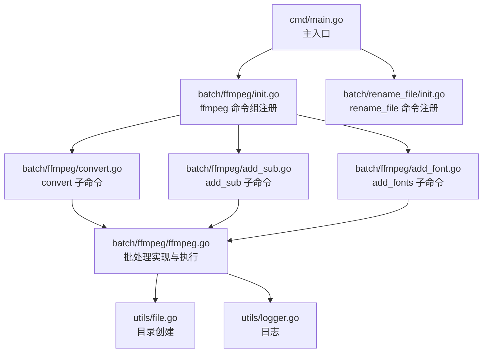
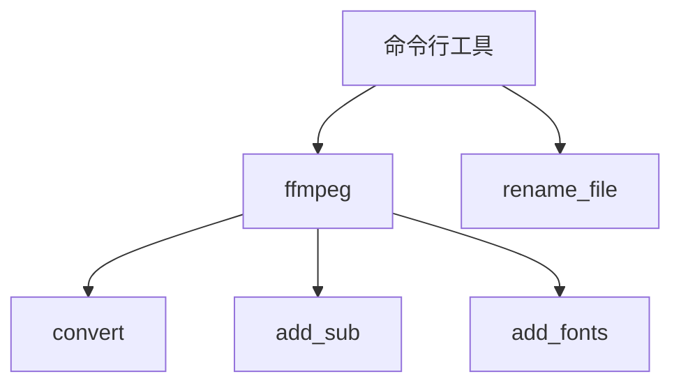
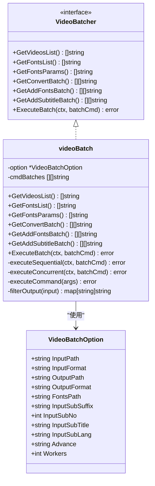
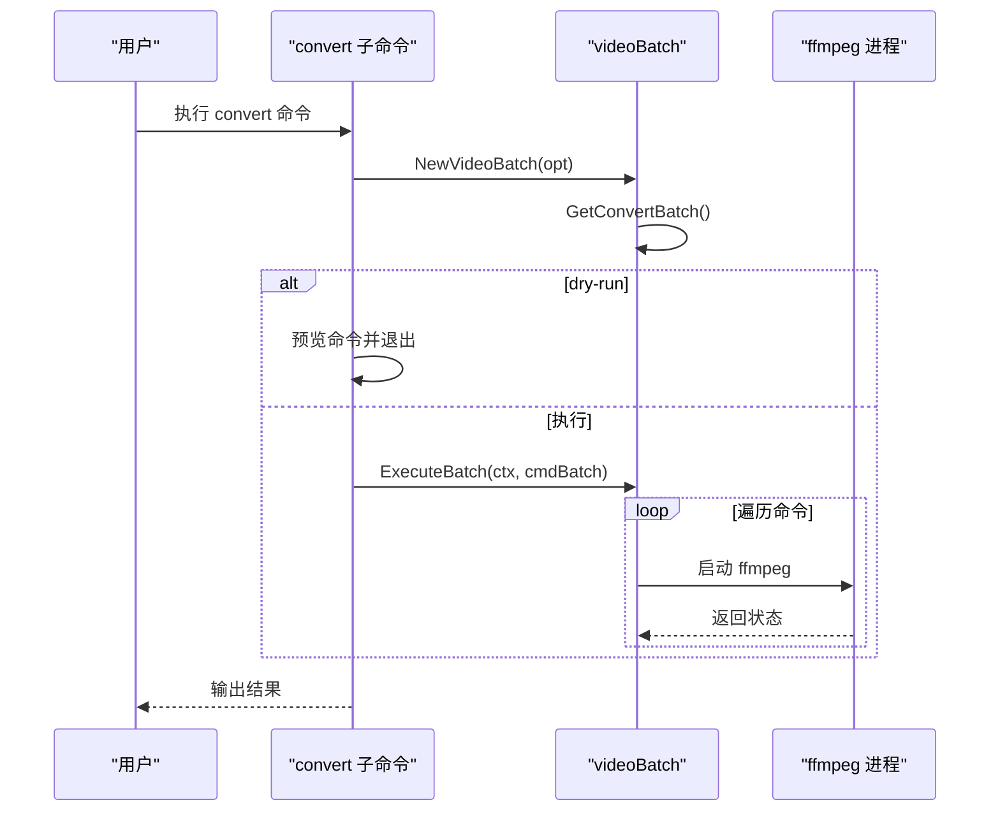
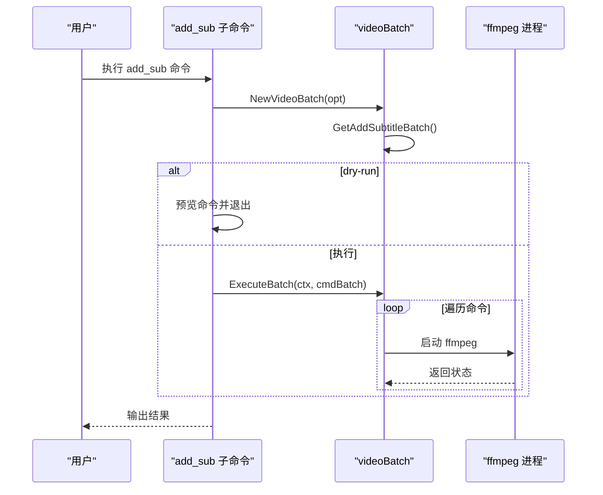
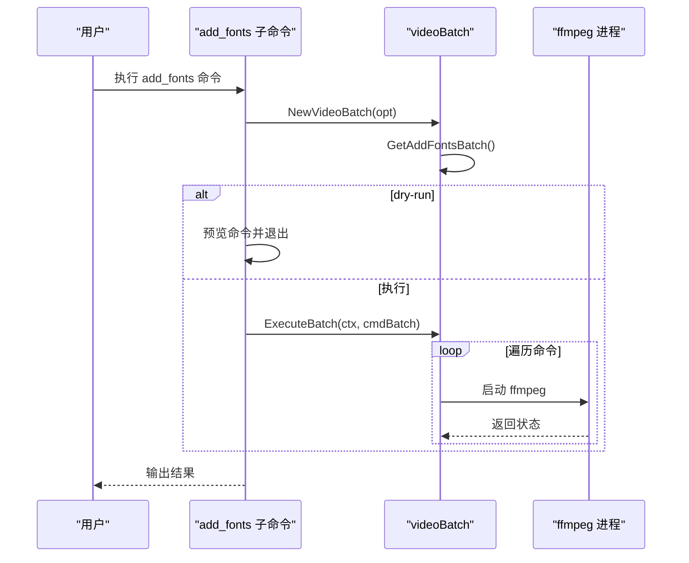
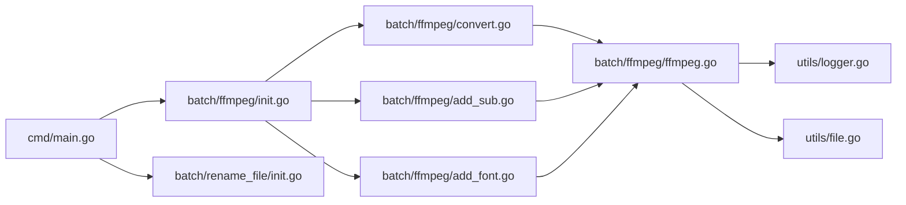

# 命令行接口

<cite>
**本文引用的文件**
- [cmd/main.go](file://cmd/main.go)
- [batch/ffmpeg/ffmpeg.go](file://batch/ffmpeg/ffmpeg.go)
- [batch/ffmpeg/init.go](file://batch/ffmpeg/init.go)
- [batch/ffmpeg/convert.go](file://batch/ffmpeg/convert.go)
- [batch/ffmpeg/add_sub.go](file://batch/ffmpeg/add_sub.go)
- [batch/ffmpeg/add_font.go](file://batch/ffmpeg/add_font.go)
- [batch/rename_file/init.go](file://batch/rename_file/init.go)
- [utils/logger.go](file://utils/logger.go)
- [utils/file.go](file://utils/file.go)
- [docs/ffmpeg.md](file://docs/ffmpeg.md)
</cite>

## 目录
1. [简介](#简介)
2. [项目结构](#项目结构)
3. [核心组件](#核心组件)
4. [架构总览](#架构总览)
5. [详细组件分析](#详细组件分析)
6. [依赖分析](#依赖分析)
7. [性能考虑](#性能考虑)
8. [故障排查指南](#故障排查指南)
9. [结论](#结论)
10. [附录：命令与参数参考](#附录命令与参数参考)

## 简介
本文件为 batcher 项目的命令行接口（CLI）完整 API 文档，覆盖以下内容：
- 全部 CLI 命令与子命令的参数规范、标志选项与默认值
- ffmpeg 子命令组 convert、add_sub、add_fonts 的参数配置与组合使用方法
- rename_file 命令的参数选项与使用场景
- 实际使用示例与常见命令组合模式，帮助快速上手

## 项目结构
项目采用模块化组织，CLI 主入口负责注册顶层命令；ffmpeg 批处理功能按子命令拆分；rename_file 提供独立的文件重命名能力；通用工具模块提供日志与目录创建等基础能力。

图表来源
- [cmd/main.go:13-28](file://cmd/main.go#L13-L28)
- [batch/ffmpeg/init.go:61-71](file://batch/ffmpeg/init.go#L61-L71)
- [batch/rename_file/init.go:25-34](file://batch/rename_file/init.go#L25-L34)
- [batch/ffmpeg/convert.go:11-63](file://batch/ffmpeg/convert.go#L11-L63)
- [batch/ffmpeg/add_sub.go:11-87](file://batch/ffmpeg/add_sub.go#L11-L87)
- [batch/ffmpeg/add_font.go:11-68](file://batch/ffmpeg/add_font.go#L11-L68)
- [batch/ffmpeg/ffmpeg.go:47-64](file://batch/ffmpeg/ffmpeg.go#L47-L64)

章节来源
- [cmd/main.go:13-28](file://cmd/main.go#L13-L28)
- [batch/ffmpeg/init.go:61-71](file://batch/ffmpeg/init.go#L61-L71)
- [batch/rename_file/init.go:25-34](file://batch/rename_file/init.go#L25-L34)

## 核心组件
- CLI 主入口：注册顶层命令，包含 ffmpeg 子命令组与 rename_file 命令。
- ffmpeg 批处理引擎：统一的视频批处理抽象与执行器，支持 convert、add_sub、add_fonts 三种模式。
- 工具模块：日志与目录创建，为批处理提供基础设施。

章节来源
- [cmd/main.go:13-28](file://cmd/main.go#L13-L28)
- [batch/ffmpeg/ffmpeg.go:16-64](file://batch/ffmpeg/ffmpeg.go#L16-L64)
- [utils/logger.go:11-28](file://utils/logger.go#L11-L28)
- [utils/file.go:8-31](file://utils/file.go#L8-L31)

## 架构总览
CLI 命令树如下所示，顶层命令为 ffmpeg 与 rename_file，其中 ffmpeg 下挂载三个子命令。

图表来源
- [cmd/main.go:17-20](file://cmd/main.go#L17-L20)
- [batch/ffmpeg/init.go:66-70](file://batch/ffmpeg/init.go#L66-L70)

## 详细组件分析

### ffmpeg 子命令组
该子命令组提供三类批处理能力：视频转换、添加字幕、添加字体。所有子命令共享一组通用标志，并在 Action 中组装 VideoBatchOption 后调用批处理引擎执行。

图表来源
- [batch/ffmpeg/ffmpeg.go:16-64](file://batch/ffmpeg/ffmpeg.go#L16-L64)
- [batch/ffmpeg/ffmpeg.go:40-63](file://batch/ffmpeg/ffmpeg.go#L40-L63)

章节来源
- [batch/ffmpeg/ffmpeg.go:16-64](file://batch/ffmpeg/ffmpeg.go#L16-L64)
- [batch/ffmpeg/ffmpeg.go:137-216](file://batch/ffmpeg/ffmpeg.go#L137-L216)
- [batch/ffmpeg/ffmpeg.go:218-286](file://batch/ffmpeg/ffmpeg.go#L218-L286)
- [batch/ffmpeg/ffmpeg.go:301-318](file://batch/ffmpeg/ffmpeg.go#L301-L318)

#### convert 子命令
- 功能：对指定目录下符合扩展名的视频进行批量转换，输出到目标目录。
- 关键标志：
  - input_path：输入目录（默认当前目录）
  - input_format：输入视频扩展名（默认 mp4）
  - output_path：输出目录（默认 ./result）
  - output_format：输出视频扩展名（默认 mkv）
  - advance：高级自定义参数字符串（透传给 ffmpeg）
  - dry-run：仅打印命令不执行
  - workers：并发工作数（默认 1）

- 行为流程：
  - 解析标志，构造 VideoBatchOption
  - 创建批处理器
  - 生成转换命令批次
  - 若 dry-run，则逐条打印命令
  - 否则按 workers 并发或串行执行

图表来源
- [batch/ffmpeg/convert.go:25-62](file://batch/ffmpeg/convert.go#L25-L62)
- [batch/ffmpeg/ffmpeg.go:137-156](file://batch/ffmpeg/ffmpeg.go#L137-L156)
- [batch/ffmpeg/ffmpeg.go:218-246](file://batch/ffmpeg/ffmpeg.go#L218-L246)

章节来源
- [batch/ffmpeg/convert.go:11-63](file://batch/ffmpeg/convert.go#L11-L63)
- [batch/ffmpeg/ffmpeg.go:137-156](file://batch/ffmpeg/ffmpeg.go#L137-L156)
- [batch/ffmpeg/ffmpeg.go:218-246](file://batch/ffmpeg/ffmpeg.go#L218-L246)

#### add_sub 子命令
- 功能：为视频添加字幕（单条），同时可选择性地附加字体。
- 关键标志：
  - input_path、input_format、output_path、output_format、advance、workers：同 convert
  - input_fonts_path：字体目录（可选）
  - input_sub_suffix：字幕后缀（默认 ass）
  - input_sub_no：字幕流编号（默认 0）
  - input_sub_lang：字幕语言代码（默认 chi）
  - input_sub_title：字幕标题（默认 Chinese）

- 行为流程：
  - 解析标志，构造 VideoBatchOption（含字幕相关字段）
  - 生成“添加字幕”命令批次（-i 原视频，-i 字幕文件，-map 0 -map 1，设置语言与标题，-c copy）
  - 若存在字体参数，追加字体附件参数
  - 执行逻辑与 convert 相同

图表来源
- [batch/ffmpeg/add_sub.go:45-86](file://batch/ffmpeg/add_sub.go#L45-L86)
- [batch/ffmpeg/ffmpeg.go:180-216](file://batch/ffmpeg/ffmpeg.go#L180-L216)
- [batch/ffmpeg/ffmpeg.go:218-246](file://batch/ffmpeg/ffmpeg.go#L218-L246)

章节来源
- [batch/ffmpeg/add_sub.go:11-87](file://batch/ffmpeg/add_sub.go#L11-L87)
- [batch/ffmpeg/ffmpeg.go:180-216](file://batch/ffmpeg/ffmpeg.go#L180-L216)
- [batch/ffmpeg/ffmpeg.go:218-246](file://batch/ffmpeg/ffmpeg.go#L218-L246)

#### add_fonts 子命令
- 功能：为视频附加字体文件（ttf/otf/ttc），常用于字幕渲染。
- 关键标志：
  - input_path、input_format、output_path、output_format、workers：同 convert
  - input_fonts_path：字体目录（必填）
  - dry-run：仅打印命令不执行

- 行为流程：
  - 解析标志，构造 VideoBatchOption（含 FontsPath）
  - 生成“添加字体”命令批次（-c copy + 多个 -attach 与 -metadata）
  - 执行逻辑与 convert 相同

图表来源
- [batch/ffmpeg/add_font.go:30-67](file://batch/ffmpeg/add_font.go#L30-L67)
- [batch/ffmpeg/ffmpeg.go:158-178](file://batch/ffmpeg/ffmpeg.go#L158-L178)
- [batch/ffmpeg/ffmpeg.go:218-246](file://batch/ffmpeg/ffmpeg.go#L218-L246)

章节来源
- [batch/ffmpeg/add_font.go:11-68](file://batch/ffmpeg/add_font.go#L11-L68)
- [batch/ffmpeg/ffmpeg.go:158-178](file://batch/ffmpeg/ffmpeg.go#L158-L178)
- [batch/ffmpeg/ffmpeg.go:218-246](file://batch/ffmpeg/ffmpeg.go#L218-L246)

### rename_file 命令
- 功能：文件重命名工具（当前 Action 未实现具体逻辑，保留占位）。
- 关键标志：
  - input_path：源视频路径（默认 ./）
  - md5：是否使用 MD5 哈希作为文件名（布尔）

- 使用场景：未来可用于批量重命名文件，结合 md5 标志实现去重或规范化命名。

章节来源
- [batch/rename_file/init.go:10-34](file://batch/rename_file/init.go#L10-L34)

## 依赖分析
- CLI 注册：主入口通过 urfave/cli 注册命令树。
- ffmpeg 批处理：依赖 utils/logger 与 utils/file，分别用于日志与输出目录创建。
- ffmpeg 子命令：共享同一套标志定义与执行逻辑，内部通过 VideoBatcher 抽象解耦不同批处理模式。

图表来源
- [cmd/main.go:13-28](file://cmd/main.go#L13-L28)
- [batch/ffmpeg/init.go:61-71](file://batch/ffmpeg/init.go#L61-L71)
- [batch/ffmpeg/convert.go:11-63](file://batch/ffmpeg/convert.go#L11-L63)
- [batch/ffmpeg/add_sub.go:11-87](file://batch/ffmpeg/add_sub.go#L11-L87)
- [batch/ffmpeg/add_font.go:11-68](file://batch/ffmpeg/add_font.go#L11-L68)
- [batch/ffmpeg/ffmpeg.go:47-64](file://batch/ffmpeg/ffmpeg.go#L47-L64)

章节来源
- [cmd/main.go:13-28](file://cmd/main.go#L13-L28)
- [batch/ffmpeg/ffmpeg.go:47-64](file://batch/ffmpeg/ffmpeg.go#L47-L64)

## 性能考虑
- 并发执行：通过 workers 控制并发度，默认串行（1）。合理设置可提升吞吐，但需考虑磁盘与 CPU 资源。
- 日志开销：日志级别为 Debug，建议在生产环境谨慎开启大量日志输出。
- 输出路径去重：当输入中存在同名文件时，自动追加序号避免覆盖。

章节来源
- [batch/ffmpeg/ffmpeg.go:55-58](file://batch/ffmpeg/ffmpeg.go#L55-L58)
- [batch/ffmpeg/ffmpeg.go:248-286](file://batch/ffmpeg/ffmpeg.go#L248-L286)
- [batch/ffmpeg/ffmpeg.go:301-318](file://batch/ffmpeg/ffmpeg.go#L301-L318)

## 故障排查指南
- ffmpeg 未安装：执行前确保系统已安装 ffmpeg，否则命令无法启动。
- 输出目录权限不足：若输出目录不存在，会尝试创建；若创建失败，检查权限。
- 输入路径无效：输入目录不存在或不可读会导致遍历失败。
- 并发执行异常：多 worker 模式下任一命令失败会记录首次错误并终止等待。

章节来源
- [utils/file.go:8-31](file://utils/file.go#L8-L31)
- [batch/ffmpeg/ffmpeg.go:218-286](file://batch/ffmpeg/ffmpeg.go#L218-L286)

## 结论
本 CLI 提供了 ffmpeg 批处理的核心能力，涵盖转换、添加字幕与添加字体三大场景，并通过统一的标志体系与并发执行机制，满足不同规模的批量处理需求。rename_file 命令目前为占位，后续可扩展为实用的重命名工具。

## 附录：命令与参数参考

### 顶层命令
- 命令：ffmpeg
  - 描述：ffmpeg 视频批处理工具，支持视频格式转换、字幕添加和字体添加
  - 子命令：
    - convert：视频转换批处理
    - add_sub：视频添加字幕批处理
    - add_fonts：视频添加字体批处理

- 命令：rename_file
  - 描述：文件重命名工具（当前未实现具体逻辑）

章节来源
- [batch/ffmpeg/init.go:61-71](file://batch/ffmpeg/init.go#L61-L71)
- [batch/rename_file/init.go:25-34](file://batch/rename_file/init.go#L25-L34)

### ffmpeg 子命令组通用标志
- input_path：输入目录（默认 ./）
- input_format：输入视频扩展名（默认 mp4）
- output_path：输出目录（默认 ./result）
- output_format：输出视频扩展名（默认 mkv）
- advance：高级自定义参数字符串（透传给 ffmpeg）
- dry-run：仅打印命令不执行（默认 false）
- workers：并发工作数（默认 1）

章节来源
- [batch/ffmpeg/init.go:8-56](file://batch/ffmpeg/init.go#L8-L56)

### convert 子命令
- 参数
  - 必需：无
  - 可选：上述通用标志
- 用途：批量转换视频格式
- 示例模式
  - 基础转换：指定 input_path/input_format/output_path/output_format
  - 高级参数：通过 advance 传递额外编码参数
  - 并发执行：通过 workers 调整并发度
  - 预览命令：dry-run 仅打印命令

章节来源
- [batch/ffmpeg/convert.go:11-63](file://batch/ffmpeg/convert.go#L11-L63)
- [batch/ffmpeg/ffmpeg.go:137-156](file://batch/ffmpeg/ffmpeg.go#L137-L156)

### add_sub 子命令
- 参数
  - 必需：无
  - 可选：上述通用标志 + input_fonts_path（可选）
  - 特有：input_sub_suffix（默认 ass）、input_sub_no（默认 0）、input_sub_lang（默认 chi）、input_sub_title（默认 Chinese）
- 用途：为视频添加单条字幕，可选附加字体
- 示例模式
  - 添加字幕：指定 input_path/input_format/input_sub_suffix 等
  - 设置字幕语言与标题：input_sub_lang/input_sub_title
  - 附加字体：input_fonts_path 指向字体目录
  - 并发执行与预览：同通用标志

章节来源
- [batch/ffmpeg/add_sub.go:11-87](file://batch/ffmpeg/add_sub.go#L11-L87)
- [batch/ffmpeg/ffmpeg.go:180-216](file://batch/ffmpeg/ffmpeg.go#L180-L216)

### add_fonts 子命令
- 参数
  - 必需：input_fonts_path（必填）
  - 可选：上述通用标志
- 用途：为视频附加字体文件（ttf/otf/ttc）
- 示例模式
  - 附加字体：指定 input_fonts_path
  - 输出与并发：同通用标志
  - 预览命令：dry-run 仅打印命令

章节来源
- [batch/ffmpeg/add_font.go:11-68](file://batch/ffmpeg/add_font.go#L11-L68)
- [batch/ffmpeg/ffmpeg.go:158-178](file://batch/ffmpeg/ffmpeg.go#L158-L178)

### rename_file 命令
- 参数
  - input_path：源视频路径（默认 ./）
  - md5：是否使用 MD5 哈希作为文件名（布尔）
- 用途：文件重命名（当前未实现具体逻辑）
- 示例模式
  - 指定输入目录：input_path
  - 使用哈希命名：md5

章节来源
- [batch/rename_file/init.go:10-34](file://batch/rename_file/init.go#L10-L34)

### 实际使用示例与常见组合
- 转换为 mkv（默认）
  - ffmpeg convert --input_path ./videos --output_path ./results
- 使用高级参数（如硬件加速）
  - ffmpeg convert --advance "-c:v hevc_nvenc -preset slow" --input_format mp4 --output_format mkv
- 添加字幕并附加字体
  - ffmpeg add_sub --input_path ./videos --input_fonts_path ./fonts --input_sub_suffix ass
- 仅预览命令（dry-run）
  - ffmpeg convert --input_path ./videos --dry-run
- 并发执行（提高吞吐）
  - ffmpeg convert --input_path ./videos --workers 4

章节来源
- [docs/ffmpeg.md:34-43](file://docs/ffmpeg.md#L34-L43)
- [docs/ffmpeg.md:54-66](file://docs/ffmpeg.md#L54-L66)
- [docs/ffmpeg.md:74-82](file://docs/ffmpeg.md#L74-L82)