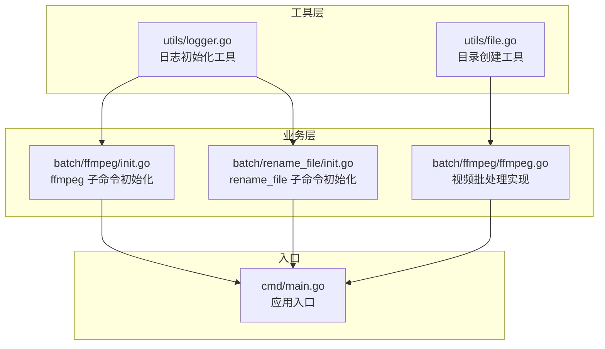
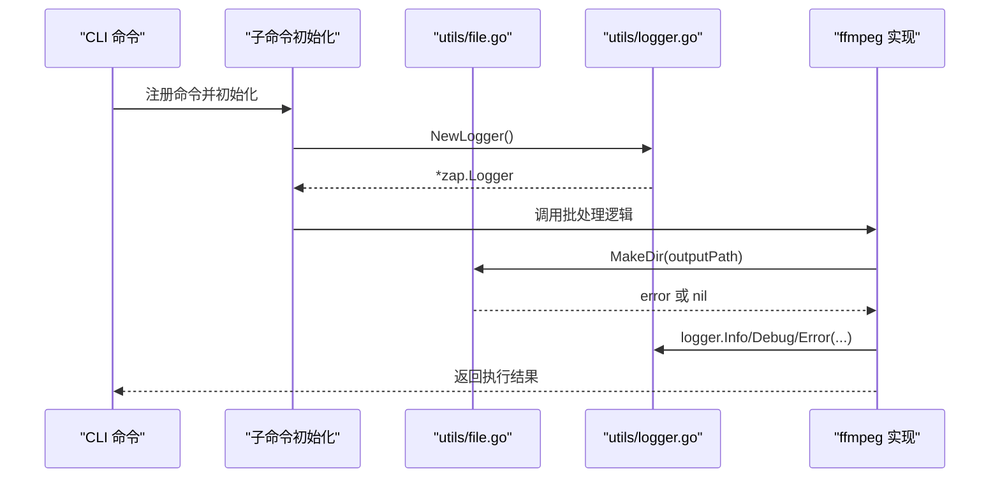
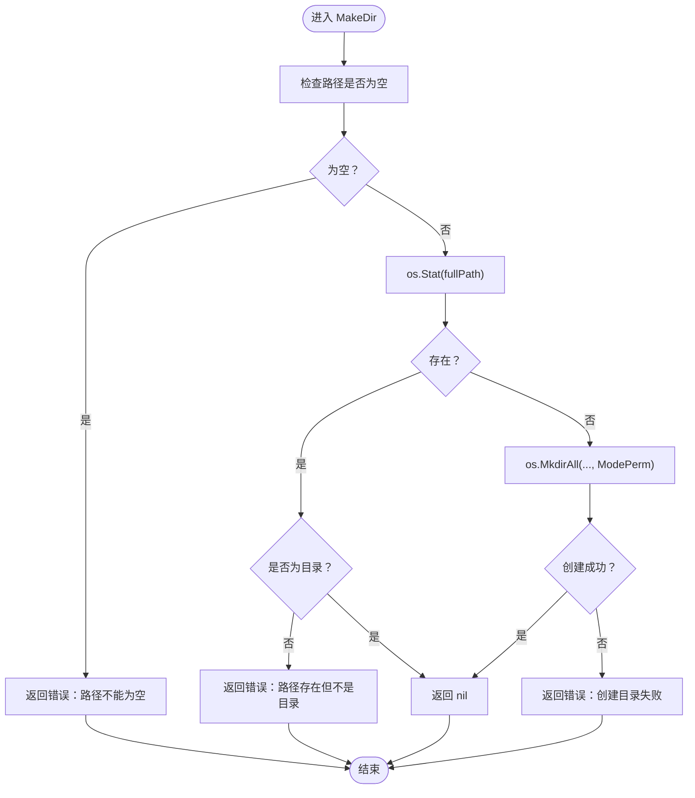
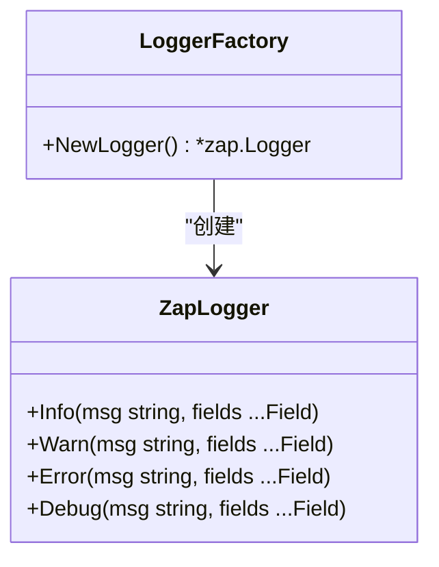
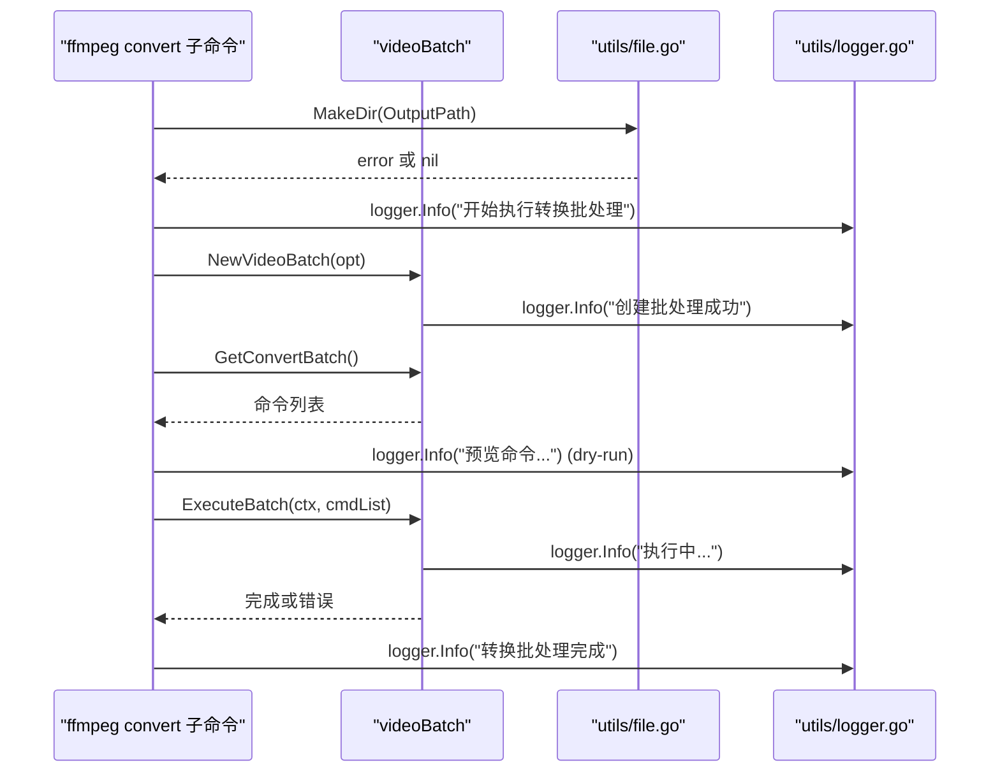
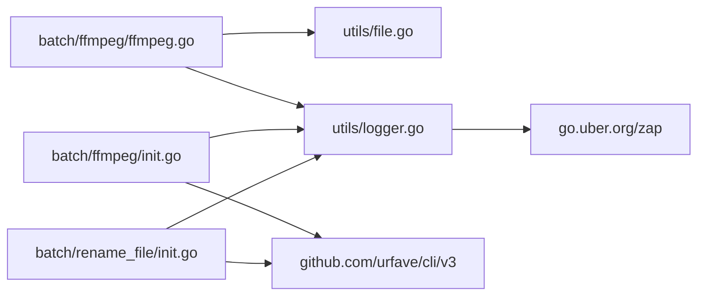

# 工具函数

<cite>
**本文引用的文件**
- [utils/file.go](file://utils/file.go)
- [utils/logger.go](file://utils/logger.go)
- [utils/file_test.go](file://utils/file_test.go)
- [batch/ffmpeg/ffmpeg.go](file://batch/ffmpeg/ffmpeg.go)
- [batch/ffmpeg/init.go](file://batch/ffmpeg/init.go)
- [batch/rename_file/init.go](file://batch/rename_file/init.go)
- [cmd/main.go](file://cmd/main.go)
- [go.mod](file://go.mod)
</cite>

## 目录
1. [简介](#简介)
2. [项目结构](#项目结构)
3. [核心组件](#核心组件)
4. [架构总览](#架构总览)
5. [详细组件分析](#详细组件分析)
6. [依赖分析](#依赖分析)
7. [性能考量](#性能考量)
8. [故障排查指南](#故障排查指南)
9. [结论](#结论)
10. [附录：使用示例与最佳实践](#附录使用示例与最佳实践)

## 简介
本文件聚焦于 batcher 项目的工具函数，系统性地梳理并文档化以下两类能力：
- 文件操作工具：目录创建、文件扫描与路径处理
- 日志记录工具：日志初始化、日志级别与日志格式

文档将从设计原则、API 签名、参数与返回值、错误处理、性能与并发、以及在应用中的集成方式等方面进行说明，并提供可直接定位到源码的“章节来源”与“图表来源”，便于进一步查阅。

## 项目结构
与工具函数相关的关键模块与文件如下：
- utils/file.go：提供 MakeDir 目录创建工具
- utils/logger.go：提供 NewLogger 日志初始化工具
- batch/ffmpeg/ffmpeg.go：在视频批处理中调用 MakeDir 与日志工具
- batch/ffmpeg/init.go、batch/rename_file/init.go：在各子命令中通过 NewLogger 初始化日志实例
- cmd/main.go：应用入口，负责命令注册与错误输出
- go.mod：外部依赖（zap、cli/v3）

图表来源
- [utils/file.go:1-32](file://utils/file.go#L1-L32)
- [utils/logger.go:1-29](file://utils/logger.go#L1-L29)
- [batch/ffmpeg/init.go:1-72](file://batch/ffmpeg/init.go#L1-L72)
- [batch/rename_file/init.go:1-35](file://batch/rename_file/init.go#L1-L35)
- [batch/ffmpeg/ffmpeg.go:1-324](file://batch/ffmpeg/ffmpeg.go#L1-L324)
- [cmd/main.go:1-29](file://cmd/main.go#L1-L29)

章节来源
- [utils/file.go:1-32](file://utils/file.go#L1-L32)
- [utils/logger.go:1-29](file://utils/logger.go#L1-L29)
- [batch/ffmpeg/ffmpeg.go:1-324](file://batch/ffmpeg/ffmpeg.go#L1-L324)
- [batch/ffmpeg/init.go:1-72](file://batch/ffmpeg/init.go#L1-L72)
- [batch/rename_file/init.go:1-35](file://batch/rename_file/init.go#L1-L35)
- [cmd/main.go:1-29](file://cmd/main.go#L1-L29)
- [go.mod:1-17](file://go.mod#L1-L17)

## 核心组件
本节对工具函数进行分门别类的 API 文档化，涵盖函数签名、参数说明、返回值、错误处理与典型用法。

- 目录创建工具
  - 函数：MakeDir(fullPath string) error
  - 功能：确保目标路径存在且为目录；若不存在则递归创建；若路径已存在但不是目录则报错
  - 参数
    - fullPath：目标完整路径（字符串）
  - 返回值
    - 成功：nil
    - 失败：错误对象（包含上下文信息）
  - 错误场景
    - 空路径：返回“路径不能为空”的错误
    - 路径存在但非目录：返回“路径存在但不是目录”的错误
    - 其他 stat 或 mkdir 错误：包装原始错误返回
  - 使用建议
    - 在执行任何需要输出目录的操作前统一调用该函数
    - 对用户输入路径进行校验后再传入

- 日志记录工具
  - 函数：NewLogger() *zap.Logger
  - 功能：创建一个控制台输出的日志器实例，配置包含字段键名、级别编码、时间编码、调用者信息与默认级别
  - 返回值
    - 成功：*zap.Logger 实例
  - 配置要点
    - 输出：标准输出
    - 编码器：控制台编码器，包含消息键、级别键、时间键、调用者键等
    - 时间编码：本地时间格式化为日期时间字符串
    - 调用者编码：短调用者路径
    - 持续时间编码：毫秒级
    - 默认级别：Debug
    - 上下文：启用调用者信息与调用栈偏移
  - 使用建议
    - 各子命令包内以包级变量形式持有 logger 实例，避免重复初始化
    - 在关键流程（如创建批处理、生成命令、执行命令前后）记录 Info/Error 等级日志

章节来源
- [utils/file.go:8-31](file://utils/file.go#L8-L31)
- [utils/logger.go:11-28](file://utils/logger.go#L11-L28)

## 架构总览
工具函数在应用中的角色与交互如下：

图表来源
- [batch/ffmpeg/init.go:58-71](file://batch/ffmpeg/init.go#L58-L71)
- [batch/rename_file/init.go:22-34](file://batch/rename_file/init.go#L22-L34)
- [batch/ffmpeg/ffmpeg.go:51-53](file://batch/ffmpeg/ffmpeg.go#L51-L53)
- [utils/file.go:9-31](file://utils/file.go#L9-L31)
- [utils/logger.go:11-28](file://utils/logger.go#L11-L28)

## 详细组件分析

### 目录创建工具 MakeDir
- 设计原则
  - 幂等：多次调用不会产生副作用
  - 明确错误：区分“空路径”“路径存在但非目录”“其他 stat/mkdir 错误”
  - 递归创建：使用权限模式创建多级目录
- 数据结构与复杂度
  - 时间复杂度：O(k)，k 为路径层级数（stat + mkdir 的开销）
  - 空间复杂度：O(1)
- 错误处理
  - 对空路径直接返回错误
  - 对非存在错误尝试创建目录
  - 对 stat 其他错误包装返回
- 并发与性能
  - 无并发安全问题；在高并发场景下建议由上层协调调用顺序或加锁
- 适用场景
  - 批处理输出目录准备
  - 临时目录清理前的前置准备

图表来源
- [utils/file.go:9-31](file://utils/file.go#L9-L31)

章节来源
- [utils/file.go:8-31](file://utils/file.go#L8-L31)
- [utils/file_test.go:10-52](file://utils/file_test.go#L10-L52)

### 日志记录工具 NewLogger
- 设计原则
  - 统一编码：控制台友好、包含时间、调用者、级别
  - 默认级别：Debug，便于开发调试
  - 可扩展：可通过替换编码器或核心适配文件输出
- 数据结构与复杂度
  - 时间复杂度：初始化一次，后续日志写入 O(1)
  - 空间复杂度：按日志条目增长
- 错误处理
  - 初始化阶段不抛错；运行期日志错误通常被吞掉或忽略，需结合上层策略处理
- 性能与并发
  - zap 为高性能日志库；在高并发场景下建议使用带缓冲与异步的配置
  - 控制台输出在高吞吐下可能成为瓶颈，必要时切换到文件输出
- 适用场景
  - CLI 子命令生命周期日志
  - 批处理任务状态与错误日志

图表来源
- [utils/logger.go:11-28](file://utils/logger.go#L11-L28)

章节来源
- [utils/logger.go:11-28](file://utils/logger.go#L11-L28)

### 在业务模块中的集成与使用
- ffmpeg 批处理
  - 在创建批处理器时，先调用 MakeDir 确保输出目录存在
  - 使用包级 logger 记录关键事件（创建批处理、生成命令、执行命令、完成）
  - 支持 dry-run 模式下仅打印命令而不实际执行
- rename_file 批处理
  - 通过包级 logger 记录命令执行状态

图表来源
- [batch/ffmpeg/ffmpeg.go:51-53](file://batch/ffmpeg/ffmpeg.go#L51-L53)
- [batch/ffmpeg/convert.go:25-62](file://batch/ffmpeg/convert.go#L25-L62)
- [batch/ffmpeg/init.go:58-71](file://batch/ffmpeg/init.go#L58-L71)
- [utils/file.go:9-31](file://utils/file.go#L9-L31)
- [utils/logger.go:11-28](file://utils/logger.go#L11-L28)

章节来源
- [batch/ffmpeg/ffmpeg.go:47-64](file://batch/ffmpeg/ffmpeg.go#L47-L64)
- [batch/ffmpeg/convert.go:25-62](file://batch/ffmpeg/convert.go#L25-L62)
- [batch/ffmpeg/init.go:58-71](file://batch/ffmpeg/init.go#L58-L71)
- [batch/rename_file/init.go:22-34](file://batch/rename_file/init.go#L22-L34)

## 依赖分析
- 内部依赖
  - batch/ffmpeg/ffmpeg.go 依赖 utils/file.go 与 utils/logger.go
  - batch/ffmpeg/init.go、batch/rename_file/init.go 依赖 utils/logger.go
- 外部依赖
  - zap：高性能日志库
  - cli/v3：命令行框架

图表来源
- [batch/ffmpeg/ffmpeg.go:13-14](file://batch/ffmpeg/ffmpeg.go#L13-L14)
- [batch/ffmpeg/init.go:4-6](file://batch/ffmpeg/init.go#L4-L6)
- [batch/rename_file/init.go:6](file://batch/rename_file/init.go#L6)
- [utils/logger.go:7-8](file://utils/logger.go#L7-L8)
- [go.mod:6-8](file://go.mod#L6-L8)

章节来源
- [batch/ffmpeg/ffmpeg.go:13-14](file://batch/ffmpeg/ffmpeg.go#L13-L14)
- [batch/ffmpeg/init.go:4-6](file://batch/ffmpeg/init.go#L4-L6)
- [batch/rename_file/init.go:6](file://batch/rename_file/init.go#L6)
- [utils/logger.go:7-8](file://utils/logger.go#L7-L8)
- [go.mod:6-8](file://go.mod#L6-L8)

## 性能考量
- MakeDir
  - 仅进行一次 stat 与必要时的一次 mkdirall，时间复杂度低；在批量创建时建议合并调用，减少系统调用次数
- NewLogger
  - zap 初始化成本低，日志写入为 O(1)；在高并发下建议：
    - 使用带缓冲与异步的配置
    - 将 Info/Warn/Error 级别日志输出到文件而非控制台
    - 控制日志字段数量，避免过重的序列化开销
- ffmpeg 执行
  - 并发执行时使用信号量限制 goroutine 数量，避免资源争用
  - 使用 context 控制取消，及时释放资源

[本节为通用性能建议，不直接分析具体文件，故不附“章节来源”]

## 故障排查指南
- 目录创建失败
  - 症状：调用 MakeDir 报错
  - 排查要点
    - 路径是否为空
    - 目标路径是否存在且为文件（非目录）
    - 权限不足或磁盘空间不足
  - 参考实现与测试
    - [utils/file.go:9-31](file://utils/file.go#L9-L31)
    - [utils/file_test.go:10-52](file://utils/file_test.go#L10-L52)
- 日志未输出或格式异常
  - 症状：控制台无日志或字段缺失
  - 排查要点
    - 是否正确初始化 logger（包级变量）
    - 是否设置了合适的日志级别
    - 是否在正确的上下文中调用 Info/Debug/Error
  - 参考实现
    - [utils/logger.go:11-28](file://utils/logger.go#L11-L28)
    - [batch/ffmpeg/init.go:58-71](file://batch/ffmpeg/init.go#L58-L71)
    - [batch/rename_file/init.go:22-34](file://batch/rename_file/init.go#L22-L34)
- 批处理执行中断
  - 症状：执行中途停止
  - 排查要点
    - 检查 context 是否被取消
    - 并发模式下是否存在第一个错误导致提前返回
  - 参考实现
    - [batch/ffmpeg/ffmpeg.go:218-286](file://batch/ffmpeg/ffmpeg.go#L218-L286)

章节来源
- [utils/file.go:9-31](file://utils/file.go#L9-L31)
- [utils/file_test.go:10-52](file://utils/file_test.go#L10-L52)
- [utils/logger.go:11-28](file://utils/logger.go#L11-L28)
- [batch/ffmpeg/init.go:58-71](file://batch/ffmpeg/init.go#L58-L71)
- [batch/rename_file/init.go:22-34](file://batch/rename_file/init.go#L22-L34)
- [batch/ffmpeg/ffmpeg.go:218-286](file://batch/ffmpeg/ffmpeg.go#L218-L286)

## 结论
- 工具函数以简洁、明确、可复用为目标，分别覆盖了“目录准备”和“日志初始化”两大基础能力
- 在业务模块中，工具函数与 CLI 框架协同，形成清晰的初始化—执行—收尾流程
- 建议在生产环境中进一步完善日志配置与错误传播策略，并在高并发场景下优化日志与执行性能

[本节为总结性内容，不直接分析具体文件，故不附“章节来源”]

## 附录：使用示例与最佳实践
- 在 ffmpeg 批处理中使用 MakeDir 与日志
  - 步骤
    - 初始化 logger（包级变量）
    - 调用 MakeDir 确保输出目录存在
    - 创建批处理器并生成命令列表
    - 在 dry-run 模式下打印命令
    - 执行批处理并记录结果
  - 参考实现
    - [batch/ffmpeg/ffmpeg.go:51-53](file://batch/ffmpeg/ffmpeg.go#L51-L53)
    - [batch/ffmpeg/convert.go:25-62](file://batch/ffmpeg/convert.go#L25-L62)
    - [batch/ffmpeg/init.go:58-71](file://batch/ffmpeg/init.go#L58-L71)
- 在 rename_file 批处理中使用日志
  - 步骤
    - 初始化 logger（包级变量）
    - 在 Action 中记录命令执行状态
  - 参考实现
    - [batch/rename_file/init.go:22-34](file://batch/rename_file/init.go#L22-L34)
- 应用入口错误处理
  - 步骤
    - 注册子命令
    - 使用 fmt.Fprintf 输出错误信息并退出
  - 参考实现
    - [cmd/main.go:13-27](file://cmd/main.go#L13-L27)

章节来源
- [batch/ffmpeg/ffmpeg.go:51-53](file://batch/ffmpeg/ffmpeg.go#L51-L53)
- [batch/ffmpeg/convert.go:25-62](file://batch/ffmpeg/convert.go#L25-L62)
- [batch/ffmpeg/init.go:58-71](file://batch/ffmpeg/init.go#L58-L71)
- [batch/rename_file/init.go:22-34](file://batch/rename_file/init.go#L22-L34)
- [cmd/main.go:13-27](file://cmd/main.go#L13-L27)