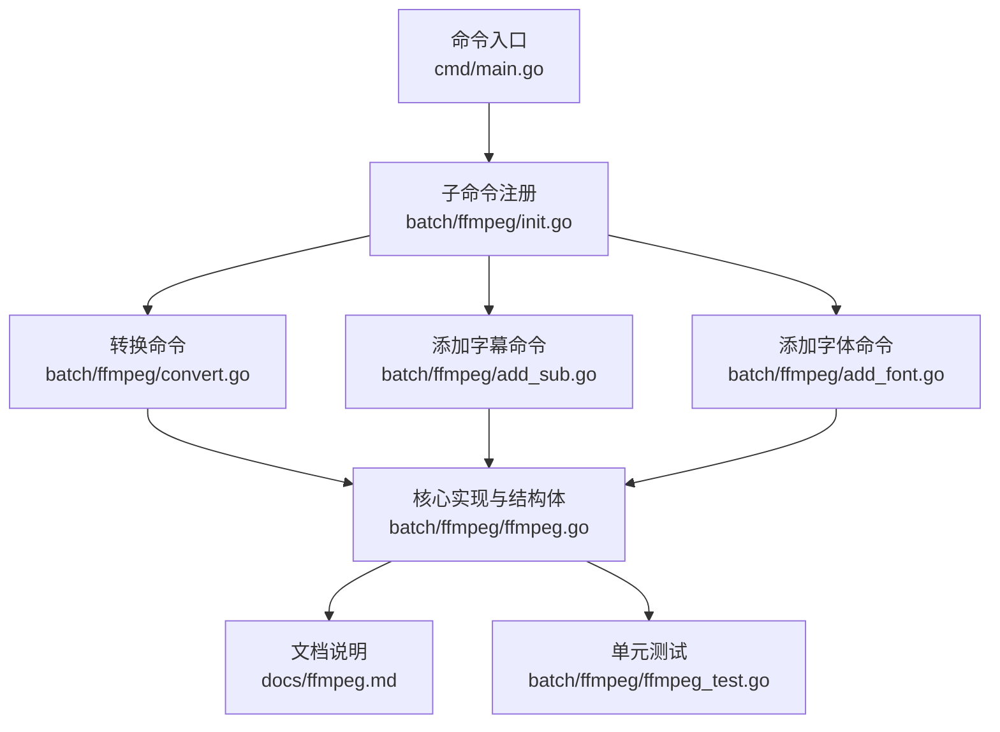
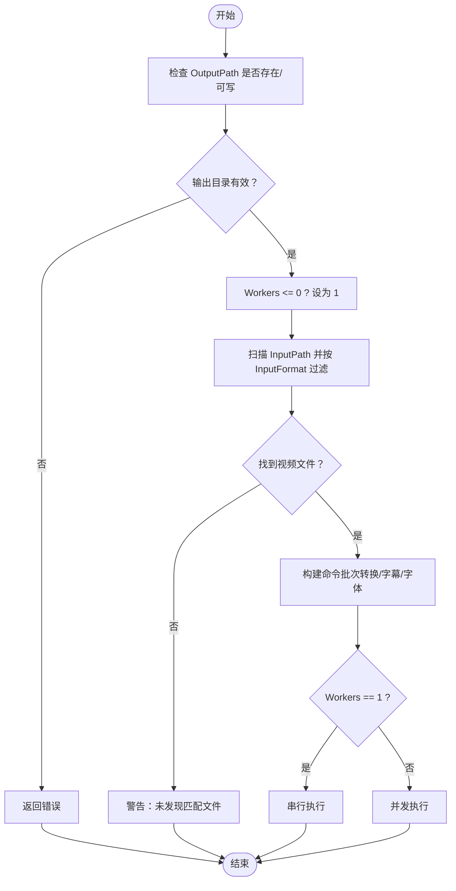

# 数据结构

<cite>
**本文引用的文件**
- [ffmpeg.go](file://batch/ffmpeg/ffmpeg.go)
- [init.go](file://batch/ffmpeg/init.go)
- [convert.go](file://batch/ffmpeg/convert.go)
- [add_sub.go](file://batch/ffmpeg/add_sub.go)
- [add_font.go](file://batch/ffmpeg/add_font.go)
- [ffmpeg_test.go](file://batch/ffmpeg/ffmpeg_test.go)
- [ffmpeg.md](file://docs/ffmpeg.md)
- [main.go](file://cmd/main.go)
</cite>

## 目录
1. [简介](#简介)
2. [项目结构](#项目结构)
3. [核心组件](#核心组件)
4. [架构总览](#架构总览)
5. [详细组件分析](#详细组件分析)
6. [依赖分析](#依赖分析)
7. [性能考虑](#性能考虑)
8. [故障排查指南](#故障排查指南)
9. [结论](#结论)
10. [附录](#附录)

## 简介
本文件面向 batcher 项目的数据结构，聚焦于 VideoBatchOption 结构体的字段定义、默认值、作用与配置选项，并结合实际代码实现说明字段之间的关系与约束条件。同时提供结构体初始化的最佳实践与配置示例，帮助使用者在不同场景下正确地组合与使用该结构体。

## 项目结构
- 项目采用分层与功能模块化组织：
  - 命令入口位于 cmd/main.go，注册子命令（如 ffmpeg 批处理）。
  - 批处理核心逻辑集中在 batch/ffmpeg 下，包含结构体定义、命令解析、批处理执行等。
  - 文档位于 docs/ffmpeg.md，提供使用说明与示例。
  - 测试位于 batch/ffmpeg/ffmpeg_test.go，覆盖关键行为与边界条件。



图表来源
- [main.go:13-28](file://cmd/main.go#L13-L28)
- [init.go:62-71](file://batch/ffmpeg/init.go#L62-L71)
- [convert.go:11-63](file://batch/ffmpeg/convert.go#L11-L63)
- [add_sub.go:11-88](file://batch/ffmpeg/add_sub.go#L11-L88)
- [add_font.go:11-69](file://batch/ffmpeg/add_font.go#L11-L69)
- [ffmpeg.go:16-64](file://batch/ffmpeg/ffmpeg.go#L16-L64)
- [ffmpeg.md:1-101](file://docs/ffmpeg.md#L1-L101)
- [ffmpeg_test.go:1-356](file://batch/ffmpeg/ffmpeg_test.go#L1-L356)

章节来源
- [main.go:1-29](file://cmd/main.go#L1-L29)
- [init.go:1-71](file://batch/ffmpeg/init.go#L1-L71)
- [ffmpeg.go:1-324](file://batch/ffmpeg/ffmpeg.go#L1-L324)

## 核心组件
本节围绕 VideoBatchOption 结构体进行系统性说明，包括字段定义、默认值、作用与配置要点，以及与其他字段的关系与约束。

- 结构体定义与字段清单
  - 字段：InputPath、InputFormat、OutputPath、OutputFormat、FontsPath、InputSubSuffix、InputSubNo、InputSubTitle、InputSubLang、Advance、Workers
  - 类型：字符串、整型、字符串、字符串、字符串、字符串、整型、字符串、字符串、字符串、整型
  - 作用：描述一次批处理任务的输入输出路径、格式、字幕与字体相关参数、高级自定义参数、并发工作数等

- 字段默认值与约束
  - OutputPath 必填：NewVideoBatch 在初始化时会校验并确保输出目录存在；若未提供或为空，将返回错误
  - Workers 默认值：当 Workers <= 0 时，会被强制设置为 1（串行执行）
  - 其他字段：未在 NewVideoBatch 中做显式校验，但后续方法会按其语义进行处理（例如输入/输出格式、字幕后缀、字体路径等）

- 字段间关系与约束
  - InputPath 与 InputFormat：共同决定扫描输入目录中符合扩展名的视频文件
  - OutputPath 与 OutputFormat：共同决定输出文件的保存路径与扩展名
  - FontsPath：当非空时，GetFontsParams 会枚举字体文件并生成附加参数；否则返回空参数
  - InputSubSuffix、InputSubNo、InputSubTitle、InputSubLang：用于拼接字幕文件路径与设置字幕元数据；需与 InputPath 保持一致的命名约定
  - Advance：作为高级自定义参数字符串，会在生成转换命令时被拆分为参数片段追加到命令中
  - Workers：控制并发执行数量；<=0 时回退为 1

章节来源
- [ffmpeg.go:16-28](file://batch/ffmpeg/ffmpeg.go#L16-L28)
- [ffmpeg.go:47-64](file://batch/ffmpeg/ffmpeg.go#L47-L64)
- [ffmpeg.go:55-58](file://batch/ffmpeg/ffmpeg.go#L55-L58)
- [ffmpeg.go:137-156](file://batch/ffmpeg/ffmpeg.go#L137-L156)
- [ffmpeg.go:180-216](file://batch/ffmpeg/ffmpeg.go#L180-L216)
- [ffmpeg.go:115-135](file://batch/ffmpeg/ffmpeg.go#L115-L135)
- [ffmpeg.go:194-195](file://batch/ffmpeg/ffmpeg.go#L194-L195)

## 架构总览
VideoBatchOption 作为批处理任务的配置载体，贯穿以下流程：
- 命令行参数解析：convert、add_sub、add_font 子命令分别将 CLI 标志映射到 VideoBatchOption
- 初始化：NewVideoBatch 校验并准备输出目录，设置默认并发数
- 批处理生成：根据字段生成视频列表、字体参数、字幕参数与最终命令批次
- 执行：根据 Workers 决定串行或并发执行

```mermaid
sequenceDiagram
participant CLI as "CLI 子命令"
participant Opt as "VideoBatchOption"
participant NB as "NewVideoBatch"
participant VB as "videoBatch"
participant Exec as "ExecuteBatch"
CLI->>Opt : 解析标志并填充字段
Opt->>NB : 传入结构体指针
NB->>NB : 校验输出目录/设置默认Workers
NB-->>VB : 返回实现对象
VB->>VB : 生成命令批次根据字段
CLI->>Exec : 调用执行可Dry-run
Exec-->>CLI : 返回结果/错误
```

图表来源
- [convert.go:25-39](file://batch/ffmpeg/convert.go#L25-L39)
- [add_sub.go:46-57](file://batch/ffmpeg/add_sub.go#L46-L57)
- [add_font.go:31-38](file://batch/ffmpeg/add_font.go#L31-L38)
- [ffmpeg.go:47-64](file://batch/ffmpeg/ffmpeg.go#L47-L64)
- [ffmpeg.go:218-231](file://batch/ffmpeg/ffmpeg.go#L218-L231)

## 详细组件分析

### VideoBatchOption 字段详解
- InputPath
  - 类型：字符串
  - 默认值：未在 NewVideoBatch 中设置
  - 作用：指定输入视频所在目录；GetVideosList 会遍历该目录并筛选扩展名为 InputFormat 的文件
  - 约束：必须存在且可访问；否则 GetVideosList 会返回错误
  - 示例路径：可指向包含多种格式视频的根目录
  - 章节来源
    - [ffmpeg.go:66-87](file://batch/ffmpeg/ffmpeg.go#L66-L87)
    - [ffmpeg_test.go:48-85](file://batch/ffmpeg/ffmpeg_test.go#L48-L85)

- InputFormat
  - 类型：字符串
  - 默认值：未在 NewVideoBatch 中设置
  - 作用：与 InputPath 组合确定要扫描的视频扩展名
  - 约束：应与实际文件扩展名一致；GetVideosList 通过比较扩展名进行过滤
  - 示例：mp4、mkv 等
  - 章节来源
    - [ffmpeg.go:66-87](file://batch/ffmpeg/ffmpeg.go#L66-L87)
    - [ffmpeg_test.go:48-85](file://batch/ffmpeg/ffmpeg_test.go#L48-L85)

- OutputPath
  - 类型：字符串
  - 默认值：未在 NewVideoBatch 中设置
  - 作用：指定输出目录；NewVideoBatch 会尝试创建该目录；filterOutput 会基于该路径生成输出文件绝对路径
  - 约束：必须可写；否则 NewVideoBatch 返回错误
  - 示例：./result 或 ../dest
  - 章节来源
    - [ffmpeg.go:51-53](file://batch/ffmpeg/ffmpeg.go#L51-L53)
    - [ffmpeg.go:301-318](file://batch/ffmpeg/ffmpeg.go#L301-L318)
    - [ffmpeg_test.go:23-46](file://batch/ffmpeg/ffmpeg_test.go#L23-L46)

- OutputFormat
  - 类型：字符串
  - 默认值：未在 NewVideoBatch 中设置
  - 作用：与 OutputPath 组合决定输出文件扩展名；filterOutput 会将输出文件名拼接为 filename.ext
  - 约束：应与目标容器/编码兼容
  - 示例：mkv、mp4 等
  - 章节来源
    - [ffmpeg.go:301-318](file://batch/ffmpeg/ffmpeg.go#L301-L318)

- FontsPath
  - 类型：字符串
  - 默认值：未在 NewVideoBatch 中设置
  - 作用：指定字体文件所在目录；GetFontsList 会枚举 ttf/otf/ttc 后缀文件；GetFontsParams 会为每个字体生成附加参数
  - 约束：若为空则 GetFontsParams 返回空参数；否则需确保目录存在
  - 示例：fonts 或 ./assets/fonts
  - 章节来源
    - [ffmpeg.go:89-113](file://batch/ffmpeg/ffmpeg.go#L89-L113)
    - [ffmpeg.go:115-135](file://batch/ffmpeg/ffmpeg.go#L115-L135)
    - [add_font.go:22-27](file://batch/ffmpeg/add_font.go#L22-L27)
    - [ffmpeg_test.go:94-125](file://batch/ffmpeg/ffmpeg_test.go#L94-L125)
    - [ffmpeg_test.go:134-163](file://batch/ffmpeg/ffmpeg_test.go#L134-L163)

- InputSubSuffix
  - 类型：字符串
  - 默认值：未在 NewVideoBatch 中设置
  - 作用：与 InputPath 和视频文件名组合，定位对应字幕文件；GetAddSubtitleBatch 会拼接 filename.suffix
  - 约束：需与实际字幕文件扩展名一致；建议与 add_sub 子命令的 input_sub_suffix 标志保持一致
  - 示例：ass、srt 等
  - 章节来源
    - [ffmpeg.go:194-195](file://batch/ffmpeg/ffmpeg.go#L194-L195)
    - [add_sub.go:24-28](file://batch/ffmpeg/add_sub.go#L24-L28)

- InputSubNo
  - 类型：整型
  - 默认值：未在 NewVideoBatch 中设置
  - 作用：指定字幕流在输出中的索引位置；GetAddSubtitleBatch 会将元数据写入 -metadata:s:s:no
  - 约束：通常为 0 表示第一条字幕流
  - 示例：0
  - 章节来源
    - [ffmpeg.go:202-202](file://batch/ffmpeg/ffmpeg.go#L202-L202)
    - [add_sub.go:29-33](file://batch/ffmpeg/add_sub.go#L29-L33)

- InputSubTitle
  - 类型：字符串
  - 默认值：未在 NewVideoBatch 中设置
  - 作用：设置字幕标题元数据；GetAddSubtitleBatch 会将标题写入 -metadata:s:s:no:title
  - 示例：Chinese、Japanese 等
  - 章节来源
    - [ffmpeg.go:204-205](file://batch/ffmpeg/ffmpeg.go#L204-L205)
    - [add_sub.go:39-43](file://batch/ffmpeg/add_sub.go#L39-L43)

- InputSubLang
  - 类型：字符串
  - 默认值：未在 NewVideoBatch 中设置
  - 作用：设置字幕语言元数据；GetAddSubtitleBatch 会将语言写入 -metadata:s:s:no:language
  - 示例：chi、eng、jpn 等
  - 章节来源
    - [ffmpeg.go:203-203](file://batch/ffmpeg/ffmpeg.go#L203-L203)
    - [add_sub.go:34-37](file://batch/ffmpeg/add_sub.go#L34-L37)

- Advance
  - 类型：字符串
  - 默认值：未在 NewVideoBatch 中设置
  - 作用：高级自定义参数；GetConvertBatch 会将该字符串按空格拆分并追加到命令中
  - 约束：需符合 ffmpeg 参数规范；建议使用经验证的参数组合
  - 示例：硬件加速参数、像素格式、码率控制等
  - 章节来源
    - [ffmpeg.go:147-150](file://batch/ffmpeg/ffmpeg.go#L147-L150)
    - [convert.go:14-22](file://batch/ffmpeg/convert.go#L14-L22)
    - [ffmpeg.md:18-32](file://docs/ffmpeg.md#L18-L32)

- Workers
  - 类型：整型
  - 默认值：未在 NewVideoBatch 中设置
  - 作用：控制并发执行的 goroutine 数量；<=0 时强制为 1（串行）
  - 约束：>0 时启用并发执行；过大可能受系统资源限制
  - 示例：1（默认）、2、4 等
  - 章节来源
    - [ffmpeg.go:55-58](file://batch/ffmpeg/ffmpeg.go#L55-L58)
    - [ffmpeg.go:218-231](file://batch/ffmpeg/ffmpeg.go#L218-L231)
    - [ffmpeg_test.go:329-356](file://batch/ffmpeg/ffmpeg_test.go#L329-L356)

### 初始化与最佳实践
- 初始化入口
  - NewVideoBatch 接收 *VideoBatchOption，进行必要校验与默认值处理
  - 校验：输出目录创建；Workers 回退为 1
  - 返回：videoBatch 实现对象，内部持有 option 指针
- 最佳实践
  - 显式设置 OutputPath；确保可写
  - 明确 InputFormat 与 OutputFormat，避免误匹配
  - 如需字幕/字体功能，确保 InputPath 与 InputSubSuffix、FontsPath 的一致性
  - Advance 参数需遵循 ffmpeg 语法；建议先 Dry-run 预览命令
  - Workers 根据 CPU/IO 资源选择；默认 1 更安全
- 章节来源
  - [ffmpeg.go:47-64](file://batch/ffmpeg/ffmpeg.go#L47-L64)
  - [ffmpeg_test.go:23-46](file://batch/ffmpeg/ffmpeg_test.go#L23-L46)

### 字段关系与约束图


图表来源
- [ffmpeg.go:51-53](file://batch/ffmpeg/ffmpeg.go#L51-L53)
- [ffmpeg.go:55-58](file://batch/ffmpeg/ffmpeg.go#L55-L58)
- [ffmpeg.go:66-87](file://batch/ffmpeg/ffmpeg.go#L66-L87)
- [ffmpeg.go:137-156](file://batch/ffmpeg/ffmpeg.go#L137-L156)
- [ffmpeg.go:180-216](file://batch/ffmpeg/ffmpeg.go#L180-L216)
- [ffmpeg.go:115-135](file://batch/ffmpeg/ffmpeg.go#L115-L135)

## 依赖分析
- 结构体与接口
  - VideoBatchOption 作为配置载体，被 NewVideoBatch 接收并封装到 videoBatch 实例中
  - VideoBatcher 接口定义了批处理能力集合，videoBatch 为其具体实现
- 关键依赖链
  - 命令行子命令 -> VideoBatchOption -> NewVideoBatch -> videoBatch -> 各种批处理方法 -> 执行器
- 外部依赖
  - ffmpeg 可执行程序（Windows 使用 ffmpeg.exe，其他平台使用 ffmpeg）
  - 日志库 zap（用于记录执行状态与错误）
- 章节来源
  - [ffmpeg.go:30-38](file://batch/ffmpeg/ffmpeg.go#L30-L38)
  - [ffmpeg.go:288-299](file://batch/ffmpeg/ffmpeg.go#L288-L299)
  - [ffmpeg.md:1-101](file://docs/ffmpeg.md#L1-L101)

## 性能考虑
- 并发策略
  - Workers 控制并发度；>1 时使用信号量限流，避免过多并发导致资源争用
  - 并发模式下首个错误会被记录并传播，保证失败可见性
- I/O 与磁盘
  - 输入/输出路径均涉及文件系统访问；建议确保磁盘空间充足与权限正确
- ffmpeg 参数
  - Advance 参数直接影响编码效率与质量；建议结合硬件加速参数优化性能
- 章节来源
  - [ffmpeg.go:248-286](file://batch/ffmpeg/ffmpeg.go#L248-L286)
  - [ffmpeg.md:18-32](file://docs/ffmpeg.md#L18-L32)

## 故障排查指南
- 常见错误与定位
  - 输出目录不可写：NewVideoBatch 创建输出目录失败
    - 章节来源：[ffmpeg.go:51-53](file://batch/ffmpeg/ffmpeg.go#L51-L53)
  - 输入路径不存在或无匹配文件：GetVideosList 返回错误或空列表
    - 章节来源：[ffmpeg.go:66-87](file://batch/ffmpeg/ffmpeg.go#L66-L87)
  - 字体路径为空：GetFontsParams 返回空参数（不影响执行，但不会注入字体）
    - 章节来源：[ffmpeg.go:115-135](file://batch/ffmpeg/ffmpeg.go#L115-L135)
  - 字幕参数缺失：若 InputSubSuffix 与实际字幕文件不一致，GetAddSubtitleBatch 无法找到字幕文件
    - 章节来源：[ffmpeg.go:194-195](file://batch/ffmpeg/ffmpeg.go#L194-L195)
  - 并发执行失败：并发模式下首个错误会被捕获并返回
    - 章节来源：[ffmpeg.go:275-279](file://batch/ffmpeg/ffmpeg.go#L275-L279)
- 调试建议
  - 使用 Dry-run 预览命令，确认参数拼接正确
  - 逐步缩小范围：先转换，再添加字体，最后添加字幕
  - 检查 Advance 参数是否与 ffmpeg 版本兼容
- 章节来源
  - [convert.go:47-52](file://batch/ffmpeg/convert.go#L47-L52)
  - [add_font.go:52-57](file://batch/ffmpeg/add_font.go#L52-L57)
  - [add_sub.go:71-76](file://batch/ffmpeg/add_sub.go#L71-L76)

## 结论
VideoBatchOption 提供了批处理任务的完整配置入口，涵盖输入输出路径与格式、字体与字幕参数、高级自定义参数以及并发控制。通过 NewVideoBatch 的初始化与各批处理方法的协作，用户可以灵活地完成视频格式转换、字幕添加与字体注入等任务。建议在生产使用中明确各项参数、优先 Dry-run 验证、合理设置并发度，并关注 ffmpeg 版本与硬件环境的适配。

## 附录
- 字段初始化与使用示例（路径引用）
  - 转换命令初始化示例：[convert.go:26-33](file://batch/ffmpeg/convert.go#L26-L33)
  - 添加字幕命令初始化示例：[add_sub.go:46-57](file://batch/ffmpeg/add_sub.go#L46-L57)
  - 添加字体命令初始化示例：[add_font.go:31-38](file://batch/ffmpeg/add_font.go#L31-L38)
  - 初始化校验与默认值处理：[ffmpeg.go:47-64](file://batch/ffmpeg/ffmpeg.go#L47-L64)
  - 并发执行模式切换：[ffmpeg.go:218-231](file://batch/ffmpeg/ffmpeg.go#L218-L231)
- 相关文档与示例
  - ffmpeg 使用与参数示例：[ffmpeg.md:18-32](file://docs/ffmpeg.md#L18-L32)
  - 命令行子命令注册与入口：[main.go:13-28](file://cmd/main.go#L13-L28)
  - 子命令标志定义（含默认值）：[init.go:8-56](file://batch/ffmpeg/init.go#L8-L56)