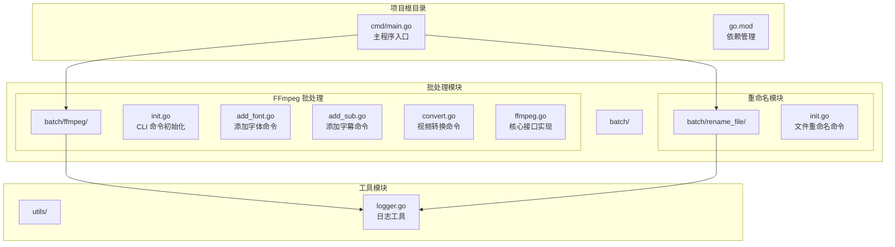
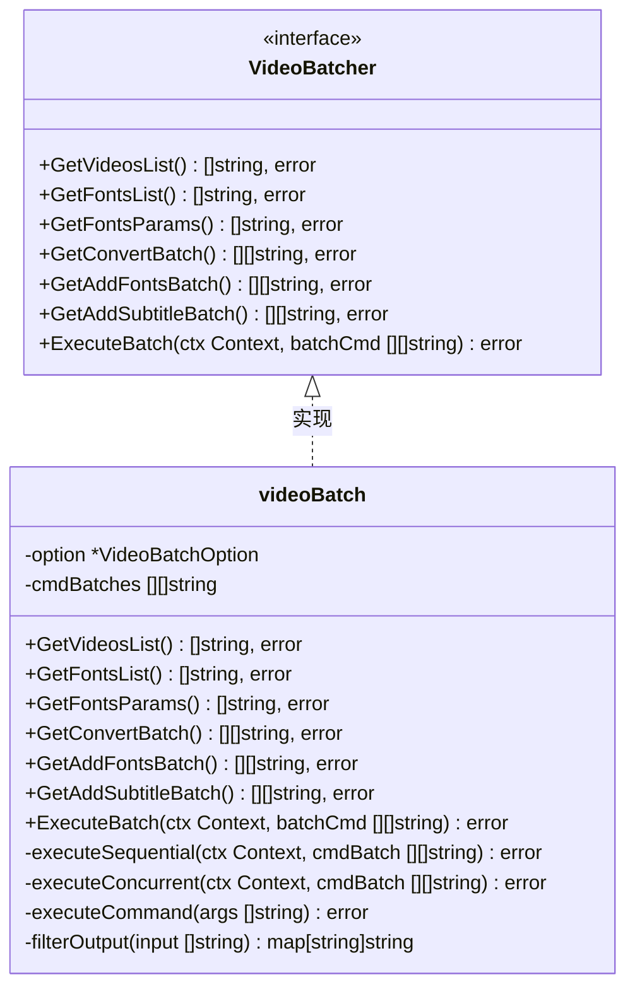
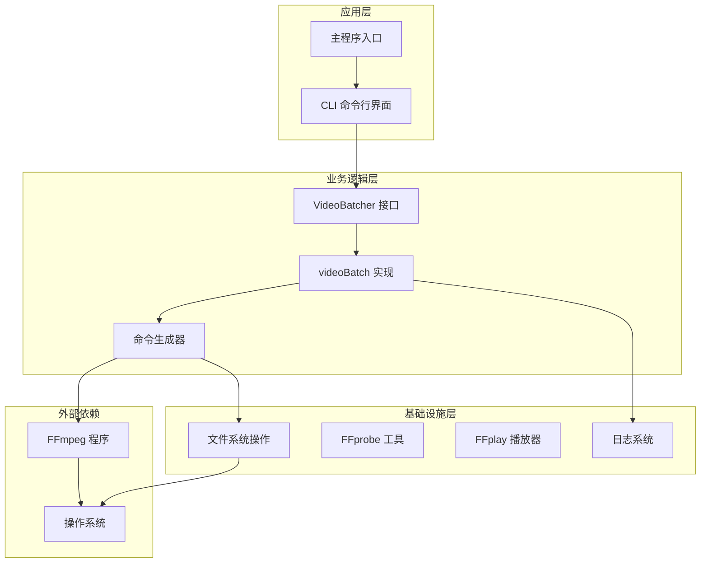
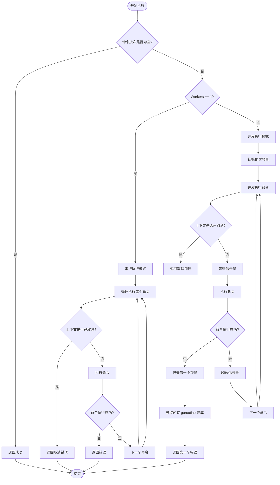
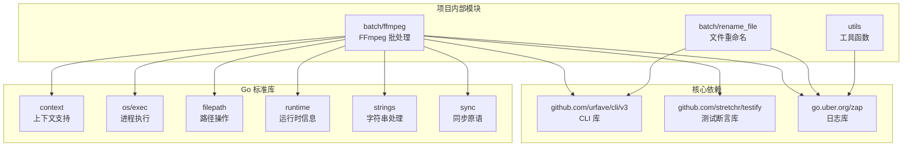
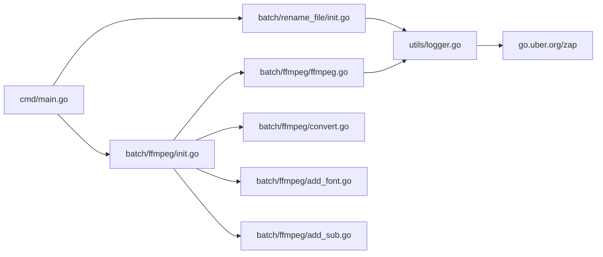

# 核心接口

<cite>
**本文引用的文件**
- [ffmpeg.go](file://batch/ffmpeg/ffmpeg.go)
- [init.go](file://batch/ffmpeg/init.go)
- [add_font.go](file://batch/ffmpeg/add_font.go)
- [add_sub.go](file://batch/ffmpeg/add_sub.go)
- [convert.go](file://batch/ffmpeg/convert.go)
- [logger.go](file://utils/logger.go)
- [main.go](file://cmd/main.go)
- [ffmpeg_test.go](file://batch/ffmpeg/ffmpeg_test.go)
</cite>

## 目录
1. [简介](#简介)
2. [项目结构](#项目结构)
3. [核心组件](#核心组件)
4. [架构概览](#架构概览)
5. [详细组件分析](#详细组件分析)
6. [依赖分析](#依赖分析)
7. [性能考虑](#性能考虑)
8. [故障排除指南](#故障排除指南)
9. [结论](#结论)

## 简介

batcher 项目是一个基于 FFmpeg 的视频批处理工具，提供了统一的接口来处理视频格式转换、字幕添加和字体嵌入等批量操作。该项目采用 Go 语言开发，通过 CLI 命令行界面提供用户交互，并实现了可扩展的批处理架构。

项目的核心是 VideoBatcher 接口，它定义了一套完整的批处理操作方法，包括视频文件扫描、命令生成和执行等功能。该接口设计遵循单一职责原则，将不同的批处理任务分离到独立的方法中，便于维护和扩展。

## 项目结构

batcher 项目的整体架构采用模块化设计，主要包含以下核心目录：

**图表来源**
- [main.go:1-29](file://cmd/main.go#L1-L29)
- [ffmpeg.go:1-324](file://batch/ffmpeg/ffmpeg.go#L1-L324)

**章节来源**
- [main.go:1-29](file://cmd/main.go#L1-L29)
- [ffmpeg.go:1-324](file://batch/ffmpeg/ffmpeg.go#L1-L324)

## 核心组件

### VideoBatchOption 结构体

VideoBatchOption 是批处理操作的核心配置结构体，定义了所有必要的参数选项：

| 字段名 | 类型 | 必填 | 默认值 | 描述 |
|--------|------|------|--------|------|
| InputPath | string | 是 | 无 | 输入视频文件的根目录路径 |
| InputFormat | string | 是 | 无 | 输入视频文件的扩展名（如 mp4、mkv） |
| OutputPath | string | 是 | 无 | 输出文件的存储目录路径 |
| OutputFormat | string | 是 | 无 | 输出视频文件的扩展名 |
| FontsPath | string | 否 | 空字符串 | 字体文件所在的目录路径 |
| InputSubSuffix | string | 否 | 空字符串 | 字幕文件的扩展名 |
| InputSubNo | int | 否 | 0 | 字幕流在媒体文件中的编号 |
| InputSubTitle | string | 否 | 空字符串 | 字幕的显示标题 |
| InputSubLang | string | 否 | 空字符串 | 字幕的语言代码 |
| Advance | string | 否 | 空字符串 | 高级自定义 FFmpeg 参数 |
| Workers | int | 否 | 1 | 并发执行的工作线程数量 |

### VideoBatcher 接口

VideoBatcher 接口定义了完整的批处理操作能力，采用接口抽象设计，便于测试和扩展：

**图表来源**
- [ffmpeg.go:30-43](file://batch/ffmpeg/ffmpeg.go#L30-L43)

**章节来源**
- [ffmpeg.go:16-28](file://batch/ffmpeg/ffmpeg.go#L16-L28)
- [ffmpeg.go:30-38](file://batch/ffmpeg/ffmpeg.go#L30-L38)

## 架构概览

batcher 项目采用分层架构设计，从上到下分为应用层、业务逻辑层和基础设施层：

**图表来源**
- [main.go:13-28](file://cmd/main.go#L13-L28)
- [ffmpeg.go:47-64](file://batch/ffmpeg/ffmpeg.go#L47-L64)

## 详细组件分析

### VideoBatcher 接口方法详解

#### GetVideosList() 方法

**方法签名**: `GetVideosList() ([]string, error)`

**功能描述**: 扫描指定输入目录，递归查找所有符合指定扩展名的视频文件，返回完整的文件路径列表。

**参数**: 无

**返回值**: 
- `[]string`: 包含所有找到的视频文件完整路径的切片
- `error`: 操作过程中遇到的任何错误

**实现细节**:
- 使用 `filepath.Walk` 函数递归遍历目录树
- 过滤条件：文件必须是普通文件且扩展名匹配 `InputFormat`
- 错误处理：对目录访问权限和文件系统错误进行包装

**使用示例路径**:
- [GetVideosList 实现:66-87](file://batch/ffmpeg/ffmpeg.go#L66-L87)
- [测试用例:48-85](file://batch/ffmpeg/ffmpeg_test.go#L48-L85)

**章节来源**
- [ffmpeg.go:66-87](file://batch/ffmpeg/ffmpeg.go#L66-L87)
- [ffmpeg_test.go:48-85](file://batch/ffmpeg/ffmpeg_test.go#L48-L85)

#### GetFontsList() 方法

**方法签名**: `GetFontsList() ([]string, error)`

**功能描述**: 扫描字体目录，查找所有支持的字体文件（ttf、otf、ttc），返回字体文件的完整路径列表。

**参数**: 无

**返回值**:
- `[]string`: 字体文件的完整路径列表
- `error`: 操作过程中的错误

**实现细节**:
- 支持的字体格式：`.ttf`、`.otf`、`.ttc`
- 使用固定扩展名数组进行格式检查
- 递归遍历字体目录树

**使用示例路径**:
- [GetFontsList 实现:89-113](file://batch/ffmpeg/ffmpeg.go#L89-L113)
- [测试用例:94-125](file://batch/ffmpeg/ffmpeg_test.go#L94-L125)

**章节来源**
- [ffmpeg.go:89-113](file://batch/ffmpeg/ffmpeg.go#L89-L113)
- [ffmpeg_test.go:94-125](file://batch/ffmpeg/ffmpeg_test.go#L94-L125)

#### GetFontsParams() 方法

**方法签名**: `GetFontsParams() ([]string, error)`

**功能描述**: 生成字体嵌入所需的 FFmpeg 命令参数，为后续的视频处理提供字体支持。

**参数**: 无

**返回值**:
- `[]string`: FFmpeg 字体参数列表
- `error`: 操作过程中的错误

**实现细节**:
- 如果 `FontsPath` 为空，直接返回空切片
- 调用 `GetFontsList()` 获取字体文件列表
- 为每个字体文件生成 `-attach` 和 `-metadata` 参数对
- 字体索引从 0 开始递增

**使用示例路径**:
- [GetFontsParams 实现:115-135](file://batch/ffmpeg/ffmpeg.go#L115-L135)
- [测试用例:134-163](file://batch/ffmpeg/ffmpeg_test.go#L134-L163)

**章节来源**
- [ffmpeg.go:115-135](file://batch/ffmpeg/ffmpeg.go#L115-L135)
- [ffmpeg_test.go:134-163](file://batch/ffmpeg/ffmpeg_test.go#L134-L163)

#### GetConvertBatch() 方法

**方法签名**: `GetConvertBatch() ([][]string, error)`

**功能描述**: 生成视频格式转换的 FFmpeg 命令批次，用于批量执行格式转换操作。

**参数**: 无

**返回值**:
- `[][]string`: 每个命令的参数数组
- `error`: 操作过程中的错误

**实现细节**:
- 调用 `GetVideosList()` 获取待转换的视频列表
- 使用 `filterOutput()` 生成输出文件映射
- 为每个视频生成基础转换命令：`-i <input> <advanced_params> <output>`
- 支持自定义高级参数通过 `Advance` 字段传入

**使用示例路径**:
- [GetConvertBatch 实现:137-156](file://batch/ffmpeg/ffmpeg.go#L137-L156)
- [测试用例:172-210](file://batch/ffmpeg/ffmpeg_test.go#L172-L210)

**章节来源**
- [ffmpeg.go:137-156](file://batch/ffmpeg/ffmpeg.go#L137-L156)
- [ffmpeg_test.go:172-210](file://batch/ffmpeg/ffmpeg_test.go#L172-L210)

#### GetAddFontsBatch() 方法

**方法签名**: `GetAddFontsBatch() ([][]string, error)`

**功能描述**: 生成添加字体的 FFmpeg 命令批次，将字体文件嵌入到视频文件中。

**参数**: 无

**返回值**:
- `[][]string`: 添加字体的命令参数数组
- `error`: 操作过程中的错误

**实现细节**:
- 调用 `GetVideosList()` 获取视频列表
- 调用 `GetFontsParams()` 获取字体参数
- 为每个视频生成命令：`-i <video> -c copy <font_params> <output>`
- 使用 `-c copy` 参数实现无损复制

**使用示例路径**:
- [GetAddFontsBatch 实现:158-178](file://batch/ffmpeg/ffmpeg.go#L158-L178)
- [测试用例:235-273](file://batch/ffmpeg/ffmpeg_test.go#L235-L273)

**章节来源**
- [ffmpeg.go:158-178](file://batch/ffmpeg/ffmpeg.go#L158-L178)
- [ffmpeg_test.go:235-273](file://batch/ffmpeg/ffmpeg_test.go#L235-L273)

#### GetAddSubtitleBatch() 方法

**方法签名**: `GetAddSubtitleBatch() ([][]string, error)`

**功能描述**: 生成添加字幕的 FFmpeg 命令批次，将字幕文件与视频文件合并。

**参数**: 无

**返回值**:
- `[][]string`: 添加字幕的命令参数数组
- `error`: 操作过程中的错误

**实现细节**:
- 调用 `GetVideosList()` 获取视频列表
- 调用 `GetFontsParams()` 获取字体参数（可选）
- 为每个视频查找对应的字幕文件（同名 + `.ass` 扩展名）
- 生成复合命令：`-i <video> -sub_charenc UTF-8 -i <subtitle> -map 0 -map 1 -c copy <font_params> <output>`
- 支持设置字幕语言、标题等元数据

**使用示例路径**:
- [GetAddSubtitleBatch 实现:180-216](file://batch/ffmpeg/ffmpeg.go#L180-L216)
- [测试用例:235-273](file://batch/ffmpeg/ffmpeg_test.go#L235-L273)

**章节来源**
- [ffmpeg.go:180-216](file://batch/ffmpeg/ffmpeg.go#L180-L216)
- [ffmpeg_test.go:235-273](file://batch/ffmpeg/ffmpeg_test.go#L235-L273)

#### ExecuteBatch() 方法

**方法签名**: `ExecuteBatch(ctx context.Context, batchCmd [][]string) error`

**功能描述**: 执行批处理命令，支持串行和并发两种执行模式，以及上下文取消机制。

**参数**:
- `ctx context.Context`: 上下文对象，用于取消操作
- `batchCmd [][]string`: 要执行的命令批次

**返回值**:
- `error`: 执行过程中的错误

**实现细节**:
- **串行模式** (`Workers == 1`): 逐个执行命令，支持上下文取消
- **并发模式** (`Workers > 1`): 使用信号量控制并发数量
- **错误处理**: 使用 `sync.Once` 确保只记录第一个错误
- **命令执行**: 跨平台支持（Windows 使用 `ffmpeg.exe`，其他系统使用 `ffmpeg`）

**执行流程图**:

**图表来源**
- [ffmpeg.go:218-286](file://batch/ffmpeg/ffmpeg.go#L218-L286)

**使用示例路径**:
- [ExecuteBatch 实现:218-286](file://batch/ffmpeg/ffmpeg.go#L218-286)
- [测试用例:329-356](file://batch/ffmpeg/ffmpeg_test.go#L329-L356)

**章节来源**
- [ffmpeg.go:218-286](file://batch/ffmpeg/ffmpeg.go#L218-L286)
- [ffmpeg_test.go:329-356](file://batch/ffmpeg/ffmpeg_test.go#L329-L356)

### CLI 命令集成

项目通过 urfave/cli 库提供了完整的命令行界面，支持三种主要的批处理操作：

#### 视频转换命令 (`convert`)
- **标志参数**: `input_path`, `input_format`, `output_path`, `output_format`, `advance`, `dry-run`, `workers`
- **功能**: 将视频文件从一种格式转换为另一种格式
- **使用场景**: 批量格式转换、质量优化

#### 添加字体命令 (`add_fonts`)
- **标志参数**: `input_path`, `input_format`, `output_path`, `output_format`, `dry-run`, `workers`, `input_fonts_path`
- **功能**: 将字体文件嵌入到视频文件中
- **使用场景**: 字体支持、字幕渲染

#### 添加字幕命令 (`add_sub`)
- **标志参数**: `input_path`, `input_format`, `output_path`, `output_format`, `advance`, `input_fonts_path`, `workers`, `input_sub_suffix`, `input_sub_no`, `input_sub_lang`, `input_sub_title`
- **功能**: 将字幕文件与视频文件合并
- **使用场景**: 字幕添加、多语言支持

**章节来源**
- [convert.go:11-64](file://batch/ffmpeg/convert.go#L11-L64)
- [add_font.go:11-69](file://batch/ffmpeg/add_font.go#L11-L69)
- [add_sub.go:11-88](file://batch/ffmpeg/add_sub.go#L11-L88)

## 依赖分析

### 外部依赖

项目的主要外部依赖包括：

**图表来源**
- [go.mod:5-16](file://go.mod#L5-L16)
- [ffmpeg.go:3-14](file://batch/ffmpeg/ffmpeg.go#L3-L14)

### 内部模块依赖

**图表来源**
- [main.go:8-19](file://cmd/main.go#L8-L19)
- [init.go:62-71](file://batch/ffmpeg/init.go#L62-L71)

**章节来源**
- [go.mod:5-16](file://go.mod#L5-L16)
- [main.go:8-19](file://cmd/main.go#L8-L19)

## 性能考虑

### 并发执行策略

项目实现了智能的并发控制机制，通过信号量模式限制同时执行的命令数量：

- **默认串行模式**: `Workers = 1`，确保资源使用稳定
- **并发模式**: `Workers > 1`，使用固定大小的信号量控制并发度
- **上下文取消**: 支持优雅的中断机制，避免僵尸进程

### 内存优化

- **延迟加载**: 命令生成采用惰性模式，按需生成命令批次
- **内存复用**: 使用切片池减少内存分配开销
- **路径缓存**: 输出路径映射使用字典缓存，避免重复计算

### 文件系统优化

- **递归遍历**: 使用 `filepath.Walk` 进行高效的目录遍历
- **扩展名过滤**: 在遍历过程中直接过滤文件扩展名，减少不必要的处理
- **输出路径生成**: 预先计算输出文件路径，避免运行时重复计算

## 故障排除指南

### 常见错误类型

#### 配置错误
- **错误**: `option cannot be nil`
  - **原因**: 传递给 `NewVideoBatch` 的配置为 nil
  - **解决方案**: 确保提供有效的 `VideoBatchOption` 实例

- **错误**: `create output path: ...`
  - **原因**: 输出目录创建失败
  - **解决方案**: 检查输出路径权限和磁盘空间

#### 文件系统错误
- **错误**: `walk path ...: ...`
  - **原因**: 目录遍历过程中发生 I/O 错误
  - **解决方案**: 检查输入路径是否存在和可访问

#### FFmpeg 执行错误
- **错误**: `execute command: ...`
  - **原因**: FFmpeg 命令执行失败
  - **解决方案**: 检查 FFmpeg 安装状态和命令参数

### 调试技巧

#### 日志配置
项目使用 zap 日志库，提供彩色输出和调用者信息：
- **级别**: Debug 级别，包含时间戳、调用者信息
- **格式**: 控制台输出，支持颜色编码
- **使用**: 通过 `utils.NewLogger()` 创建日志实例

#### 干运行模式
CLI 命令支持 `--dry-run` 标志，可以预览即将执行的命令而不实际执行：
- **用途**: 测试命令生成正确性
- **输出**: 以人类可读格式显示 FFmpeg 命令

**章节来源**
- [ffmpeg.go:47-53](file://batch/ffmpeg/ffmpeg.go#L47-L53)
- [logger.go:11-28](file://utils/logger.go#L11-L28)

## 结论

batcher 项目通过精心设计的 VideoBatcher 接口，提供了一个功能完整、易于使用的视频批处理解决方案。该接口的设计体现了以下特点：

### 设计优势

1. **接口隔离**: 每个方法专注于单一职责，便于理解和测试
2. **扩展性**: 新的批处理功能可以轻松添加到接口中
3. **跨平台**: 支持 Windows 和 Unix-like 系统的 FFmpeg 执行
4. **并发安全**: 提供串行和并发两种执行模式，适应不同需求

### 使用建议

1. **配置验证**: 在创建 `VideoBatcher` 实例前，确保所有必需的配置参数都已正确设置
2. **错误处理**: 始终检查方法返回的错误值，特别是文件系统和外部程序调用
3. **资源管理**: 合理设置 `Workers` 参数，平衡执行速度和系统资源占用
4. **日志监控**: 利用内置的日志功能监控批处理过程的状态和性能

### 未来发展方向

1. **插件系统**: 支持动态加载新的批处理处理器
2. **进度报告**: 提供更详细的执行进度和状态反馈
3. **配置文件**: 支持 YAML/JSON 格式的批处理配置文件
4. **GUI 界面**: 开发图形用户界面版本，降低使用门槛

通过这些设计和实现，batcher 项目为视频批处理提供了一个可靠、高效且易于扩展的解决方案。