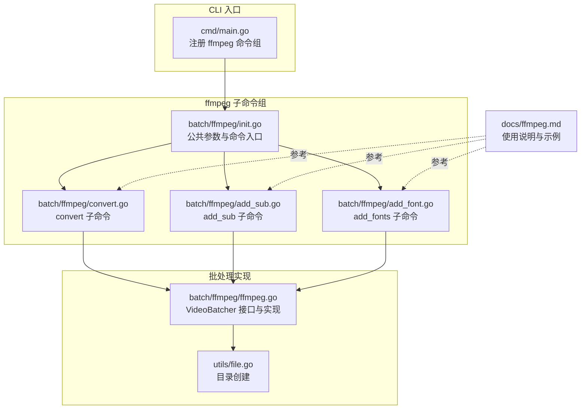
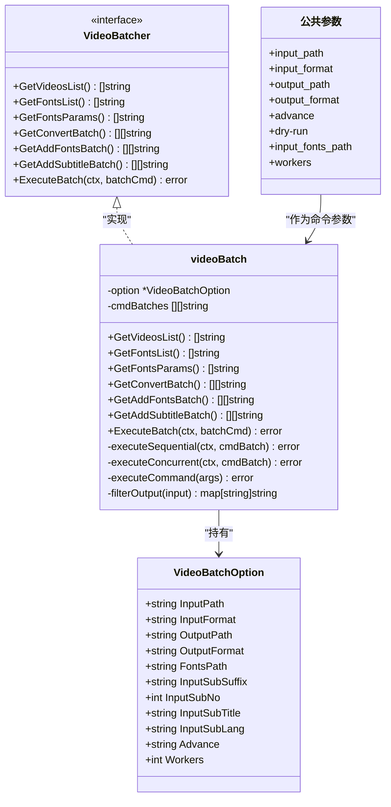
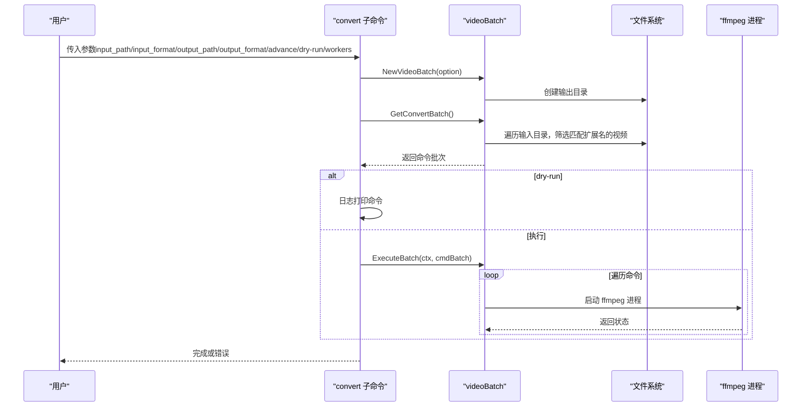
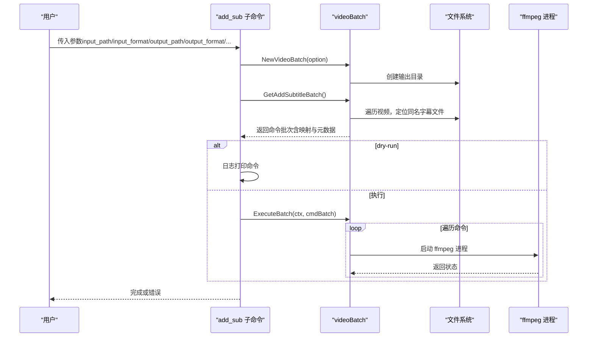
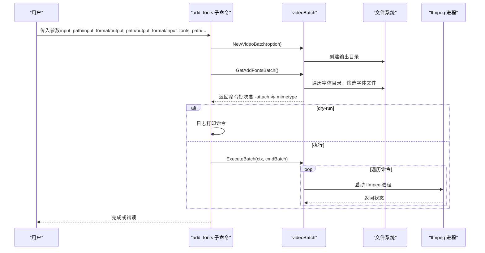
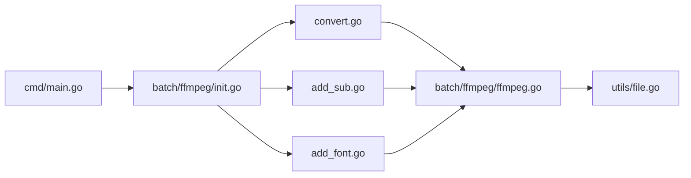

# FFmpeg 批处理命令

<cite>
**本文引用的文件**
- [convert.go](file://batch/ffmpeg/convert.go)
- [add_sub.go](file://batch/ffmpeg/add_sub.go)
- [add_font.go](file://batch/ffmpeg/add_font.go)
- [ffmpeg.go](file://batch/ffmpeg/ffmpeg.go)
- [init.go](file://batch/ffmpeg/init.go)
- [ffmpeg.md](file://docs/ffmpeg.md)
- [file.go](file://utils/file.go)
- [main.go](file://cmd/main.go)
- [ffmpeg_test.go](file://batch/ffmpeg/ffmpeg_test.go)
</cite>

## 目录
1. [简介](#简介)
2. [项目结构](#项目结构)
3. [核心组件](#核心组件)
4. [架构总览](#架构总览)
5. [详细组件分析](#详细组件分析)
6. [依赖分析](#依赖分析)
7. [性能考虑](#性能考虑)
8. [故障排查指南](#故障排查指南)
9. [结论](#结论)
10. [附录](#附录)

## 简介
本文件为 batcher 工具中 ffmpeg 子命令组的命令参考文档，覆盖以下三个核心子命令：
- convert（视频转换）
- add_sub（字幕添加）
- add_fonts（字体添加）

文档将从系统环境要求、命令功能与参数、使用示例与最佳实践、命令组合技巧、性能优化与常见问题等方面进行系统阐述，并结合代码实现细节提供可视化图示与来源标注，帮助不同技术背景的用户高效使用。

## 项目结构
该子命令组位于 batch/ffmpeg 目录下，采用“命令定义 + 批处理实现 + 公共参数定义”的分层组织方式：
- 命令定义：convert.go、add_sub.go、add_font.go
- 批处理实现：ffmpeg.go（VideoBatcher 接口、videoBatch 实现、命令生成与执行）
- 公共参数与入口：init.go（公共标志位、FfmpegBatchCmd）
- 文档与示例：docs/ffmpeg.md
- 工具函数：utils/file.go（目录创建）
- CLI 入口：cmd/main.go

图表来源
- [main.go:13-28](file://cmd/main.go#L13-L28)
- [init.go:61-71](file://batch/ffmpeg/init.go#L61-L71)
- [convert.go:11-63](file://batch/ffmpeg/convert.go#L11-L63)
- [add_sub.go:11-87](file://batch/ffmpeg/add_sub.go#L11-L87)
- [add_font.go:11-68](file://batch/ffmpeg/add_font.go#L11-L68)
- [ffmpeg.go:47-64](file://batch/ffmpeg/ffmpeg.go#L47-L64)
- [file.go:8-31](file://utils/file.go#L8-L31)
- [ffmpeg.md:1-101](file://docs/ffmpeg.md#L1-L101)

章节来源
- [main.go:13-28](file://cmd/main.go#L13-L28)
- [init.go:61-71](file://batch/ffmpeg/init.go#L61-L71)
- [ffmpeg.go:47-64](file://batch/ffmpeg/ffmpeg.go#L47-L64)

## 核心组件
- VideoBatchOption：批处理选项，包含输入/输出路径、输入/输出格式、字体路径、字幕参数、高级自定义参数、并发工作数等。
- VideoBatcher 接口：定义了获取视频列表、获取字体列表与参数、生成转换/添加字体/添加字幕命令批次、执行批处理等方法。
- videoBatch 实现：具体实现上述接口，负责扫描输入目录、生成 ffmpeg 命令、执行命令（支持串行与并发）。
- 公共参数：input_path、input_format、output_path、output_format、advance、dry-run、input_fonts_path、workers 等。

章节来源
- [ffmpeg.go:16-38](file://batch/ffmpeg/ffmpeg.go#L16-L38)
- [ffmpeg.go:30-38](file://batch/ffmpeg/ffmpeg.go#L30-L38)
- [ffmpeg.go:40-64](file://batch/ffmpeg/ffmpeg.go#L40-L64)
- [init.go:8-56](file://batch/ffmpeg/init.go#L8-L56)

## 架构总览
下面的类图展示了命令定义、公共参数与批处理实现之间的关系，以及关键数据结构与方法。

图表来源
- [ffmpeg.go:16-38](file://batch/ffmpeg/ffmpeg.go#L16-L38)
- [ffmpeg.go:30-38](file://batch/ffmpeg/ffmpeg.go#L30-L38)
- [ffmpeg.go:40-64](file://batch/ffmpeg/ffmpeg.go#L40-L64)
- [init.go:8-56](file://batch/ffmpeg/init.go#L8-L56)

## 详细组件分析

### convert（视频转换）
- 功能概述
  - 对指定输入目录中符合扩展名的视频进行批量转换，输出到目标目录，支持高级自定义参数透传。
- 必需参数
  - input_path：输入目录路径
  - input_format：输入文件扩展名（默认值见公共参数）
  - output_path：输出目录路径（自动创建）
  - output_format：输出文件扩展名（默认值见公共参数）
- 可选参数
  - advance：高级自定义参数字符串，将直接拼接到 ffmpeg 命令中
  - dry-run：仅打印命令，不实际执行
  - workers：并发工作数（默认 1，串行）
- 命令生成逻辑
  - 扫描 input_path 下匹配 input_format 的文件，生成每条 ffmpeg 命令的参数片段；若 advance 非空，则追加到命令中；最后映射到 output_path 下对应 output_format 的文件。
- 执行流程
  - 若 dry-run 为真，遍历生成的命令并记录日志；否则调用 ExecuteBatch 执行。
- 性能与并发
  - 支持并发执行，通过信号量控制最大并发数；支持 context 取消。
- 使用示例与最佳实践
  - 示例参考：docs/ffmpeg.md 中的“视频转码”部分。
  - 最佳实践：合理设置 workers；在 advance 中使用硬件加速参数以提升性能；使用 dry-run 预览命令后再执行。

图表来源
- [convert.go:25-62](file://batch/ffmpeg/convert.go#L25-L62)
- [ffmpeg.go:137-156](file://batch/ffmpeg/ffmpeg.go#L137-L156)
- [ffmpeg.go:218-231](file://batch/ffmpeg/ffmpeg.go#L218-L231)
- [ffmpeg.go:288-299](file://batch/ffmpeg/ffmpeg.go#L288-L299)
- [file.go:8-31](file://utils/file.go#L8-L31)

章节来源
- [convert.go:11-63](file://batch/ffmpeg/convert.go#L11-L63)
- [ffmpeg.go:137-156](file://batch/ffmpeg/ffmpeg.go#L137-L156)
- [ffmpeg.go:218-231](file://batch/ffmpeg/ffmpeg.go#L218-L231)
- [ffmpeg.go:288-299](file://batch/ffmpeg/ffmpeg.go#L288-L299)
- [ffmpeg.md:18-43](file://docs/ffmpeg.md#L18-L43)

### add_sub（字幕添加）
- 功能概述
  - 将与视频同名的字幕文件（默认 .ass）添加到视频中，支持设置字幕语言、标题与字幕流编号。
- 必需参数
  - input_path：输入目录路径
  - input_format：输入文件扩展名（默认值见公共参数）
  - output_path：输出目录路径（自动创建）
  - output_format：输出文件扩展名（默认值见公共参数）
- 可选参数
  - input_sub_suffix：字幕后缀（默认 ass）
  - input_sub_no：字幕流编号（默认 0）
  - input_sub_lang：字幕语言（默认 chi）
  - input_sub_title：字幕标题（默认 Chinese）
  - input_fonts_path：字体目录（可选，用于同时嵌入字体）
  - advance：高级自定义参数字符串
  - dry-run：仅打印命令，不实际执行
  - workers：并发工作数（默认 1）
- 命令生成逻辑
  - 为每个视频生成两条输入：原视频与字幕文件；设置字符集、映射流、元数据（语言、标题）；复制编码；如存在字体参数则一并附加。
- 执行流程
  - 与 convert 类似，支持 dry-run 与并发执行。
- 使用示例与最佳实践
  - 示例参考：docs/ffmpeg.md 中的“字幕添加”部分。
  - 最佳实践：确保字幕文件与视频同名且扩展名为 input_sub_suffix；根据需要设置语言与标题；必要时同时嵌入字体。

图表来源
- [add_sub.go:45-86](file://batch/ffmpeg/add_sub.go#L45-L86)
- [ffmpeg.go:180-216](file://batch/ffmpeg/ffmpeg.go#L180-L216)
- [ffmpeg.go:218-231](file://batch/ffmpeg/ffmpeg.go#L218-L231)
- [ffmpeg.go:288-299](file://batch/ffmpeg/ffmpeg.go#L288-L299)

章节来源
- [add_sub.go:11-87](file://batch/ffmpeg/add_sub.go#L11-L87)
- [ffmpeg.go:180-216](file://batch/ffmpeg/ffmpeg.go#L180-L216)
- [ffmpeg.go:218-231](file://batch/ffmpeg/ffmpeg.go#L218-L231)
- [ffmpeg.go:288-299](file://batch/ffmpeg/ffmpeg.go#L288-L299)
- [ffmpeg.md:45-66](file://docs/ffmpeg.md#L45-L66)

### add_fonts（字体添加）
- 功能概述
  - 将字体目录中的字体文件以附件形式嵌入到视频中，便于播放器渲染字幕时使用。
- 必需参数
  - input_path：输入目录路径
  - input_format：输入文件扩展名（默认值见公共参数）
  - output_path：输出目录路径（自动创建）
  - output_format：输出文件扩展名（默认值见公共参数）
  - input_fonts_path：字体目录（必填）
- 可选参数
  - advance：高级自定义参数字符串
  - dry-run：仅打印命令，不实际执行
  - workers：并发工作数（默认 1）
- 命令生成逻辑
  - 扫描字体目录，过滤 ttf/otf/ttc 扩展名；为每个字体生成 -attach 与对应的 mimetype 元数据；对每个视频复制编码并附加字体参数。
- 执行流程
  - 与前两个命令一致，支持 dry-run 与并发执行。
- 使用示例与最佳实践
  - 示例参考：docs/ffmpeg.md 中的“添加多个字体”部分。
  - 最佳实践：确保字体目录包含有效字体文件；与 add_sub 组合使用以保证字幕渲染效果。

图表来源
- [add_font.go:30-67](file://batch/ffmpeg/add_font.go#L30-L67)
- [ffmpeg.go:158-178](file://batch/ffmpeg/ffmpeg.go#L158-L178)
- [ffmpeg.go:218-231](file://batch/ffmpeg/ffmpeg.go#L218-L231)
- [ffmpeg.go:288-299](file://batch/ffmpeg/ffmpeg.go#L288-L299)

章节来源
- [add_font.go:11-68](file://batch/ffmpeg/add_font.go#L11-L68)
- [ffmpeg.go:158-178](file://batch/ffmpeg/ffmpeg.go#L158-L178)
- [ffmpeg.go:218-231](file://batch/ffmpeg/ffmpeg.go#L218-L231)
- [ffmpeg.go:288-299](file://batch/ffmpeg/ffmpeg.go#L288-L299)
- [ffmpeg.md:68-82](file://docs/ffmpeg.md#L68-L82)

### 命令组合使用与高级技巧
- 组合策略
  - add_fonts + add_sub：先嵌入字体，再添加字幕，确保字幕渲染一致性。
  - add_sub + convert：先添加字幕，再进行格式转换，适合统一输出格式。
- 高级自定义参数（advance）
  - 可直接传入 ffmpeg 参数字符串，例如编码器、像素格式、质量控制等，实现更精细的控制。
- 并发与性能
  - 通过 workers 控制并发度；在 CPU/IO 密集场景下适当提高 workers 可提升吞吐；注意磁盘与内存占用。
- 文件名冲突处理
  - 输出目录中若存在重名文件，会自动追加序号以避免覆盖。

章节来源
- [ffmpeg.go:301-318](file://batch/ffmpeg/ffmpeg.go#L301-L318)
- [ffmpeg.md:18-32](file://docs/ffmpeg.md#L18-L32)

## 依赖分析
- CLI 注册
  - cmd/main.go 将 ffmpeg 命令组注册为顶层命令，供用户调用。
- 命令组入口
  - batch/ffmpeg/init.go 定义公共参数与命令入口 FfmpegBatchCmd，包含 convert、add_sub、add_fonts 三个子命令。
- 批处理实现
  - ffmpeg.go 提供 VideoBatcher 接口与 videoBatch 实现，封装命令生成与执行逻辑。
- 工具函数
  - utils/file.go 提供目录创建能力，确保输出目录存在。

图表来源
- [main.go:13-28](file://cmd/main.go#L13-L28)
- [init.go:61-71](file://batch/ffmpeg/init.go#L61-L71)
- [convert.go:11-63](file://batch/ffmpeg/convert.go#L11-L63)
- [add_sub.go:11-87](file://batch/ffmpeg/add_sub.go#L11-L87)
- [add_font.go:11-68](file://batch/ffmpeg/add_font.go#L11-L68)
- [ffmpeg.go:47-64](file://batch/ffmpeg/ffmpeg.go#L47-L64)
- [file.go:8-31](file://utils/file.go#L8-L31)

章节来源
- [main.go:13-28](file://cmd/main.go#L13-L28)
- [init.go:61-71](file://batch/ffmpeg/init.go#L61-L71)
- [ffmpeg.go:47-64](file://batch/ffmpeg/ffmpeg.go#L47-L64)

## 性能考虑
- 并发执行
  - workers 默认为 1，串行执行；提高并发可显著缩短总耗时，但需评估磁盘与 CPU 资源。
- 硬件加速
  - 在 advance 中传入硬件编码器参数（如 h264_nvenc、hevc_nvenc、h264_videotoolbox 等），可大幅提升编码性能。
- 编码策略
  - 使用 -c copy 复制编码可避免重编码，加快处理速度；如需格式转换，请在 advance 中明确指定目标编码器与参数。
- I/O 优化
  - 输入/输出目录尽量位于高性能磁盘；避免跨盘符大量拷贝。

章节来源
- [ffmpeg.go:218-286](file://batch/ffmpeg/ffmpeg.go#L218-L286)
- [ffmpeg.md:18-32](file://docs/ffmpeg.md#L18-L32)

## 故障排查指南
- 环境要求
  - 系统需预先安装 ffmpeg，并确保其在 PATH 中可用。
- 常见错误与定位
  - 输出目录创建失败：检查路径权限与格式；确认 output_path 非空。
  - 输入目录不存在或为空：检查 input_path 与 input_format 是否正确。
  - 字体目录未找到：确认 input_fonts_path 存在且包含 ttf/otf/ttc 文件。
  - 命令执行失败：查看日志输出；使用 dry-run 预览命令；逐步缩小 advance 参数范围。
- 测试验证
  - 可参考单元测试对 GetVideosList、GetFontsList、GetFontsParams、GetConvertBatch、GetAddFontsBatch、filterOutput、ExecuteBatch 等方法进行验证。

章节来源
- [ffmpeg.md:3-5](file://docs/ffmpeg.md#L3-L5)
- [file.go:8-31](file://utils/file.go#L8-L31)
- [ffmpeg_test.go:23-46](file://batch/ffmpeg/ffmpeg_test.go#L23-L46)
- [ffmpeg_test.go:48-85](file://batch/ffmpeg/ffmpeg_test.go#L48-L85)
- [ffmpeg_test.go:94-125](file://batch/ffmpeg/ffmpeg_test.go#L94-L125)
- [ffmpeg_test.go:134-163](file://batch/ffmpeg/ffmpeg_test.go#L134-L163)
- [ffmpeg_test.go:172-210](file://batch/ffmpeg/ffmpeg_test.go#L172-L210)
- [ffmpeg_test.go:235-273](file://batch/ffmpeg/ffmpeg_test.go#L235-L273)
- [ffmpeg_test.go:282-310](file://batch/ffmpeg/ffmpeg_test.go#L282-L310)
- [ffmpeg_test.go:329-356](file://batch/ffmpeg/ffmpeg_test.go#L329-L356)

## 结论
本命令组提供了对 ffmpeg 的三类常用批处理能力：视频转换、字幕添加与字体嵌入。通过公共参数与接口抽象，实现了清晰的职责分离与良好的可扩展性。配合 dry-run、并发执行与硬件加速等特性，可在保证稳定性的前提下显著提升批量处理效率。建议在生产环境中结合 advance 参数与 workers 进行针对性优化，并通过 dry-run 与单元测试保障命令正确性。

## 附录
- 命令参数一览（基于公共参数定义）
  - input_path：输入目录路径
  - input_format：输入文件扩展名
  - output_path：输出目录路径
  - output_format：输出文件扩展名
  - advance：高级自定义参数字符串
  - dry-run：仅打印命令，不执行
  - input_fonts_path：字体目录（add_fonts 必填；add_sub 可选）
  - workers：并发工作数（默认 1）

章节来源
- [init.go:8-56](file://batch/ffmpeg/init.go#L8-L56)