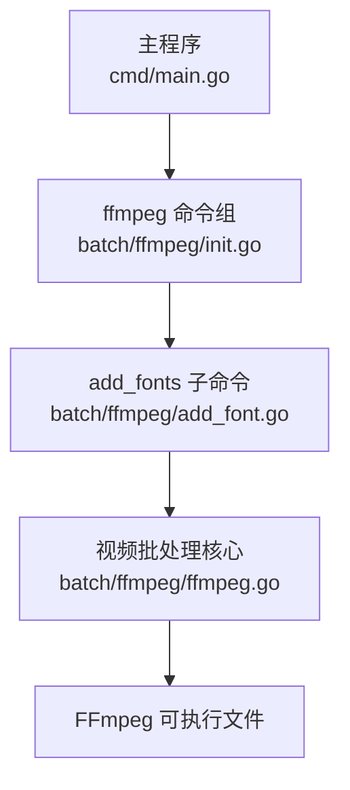
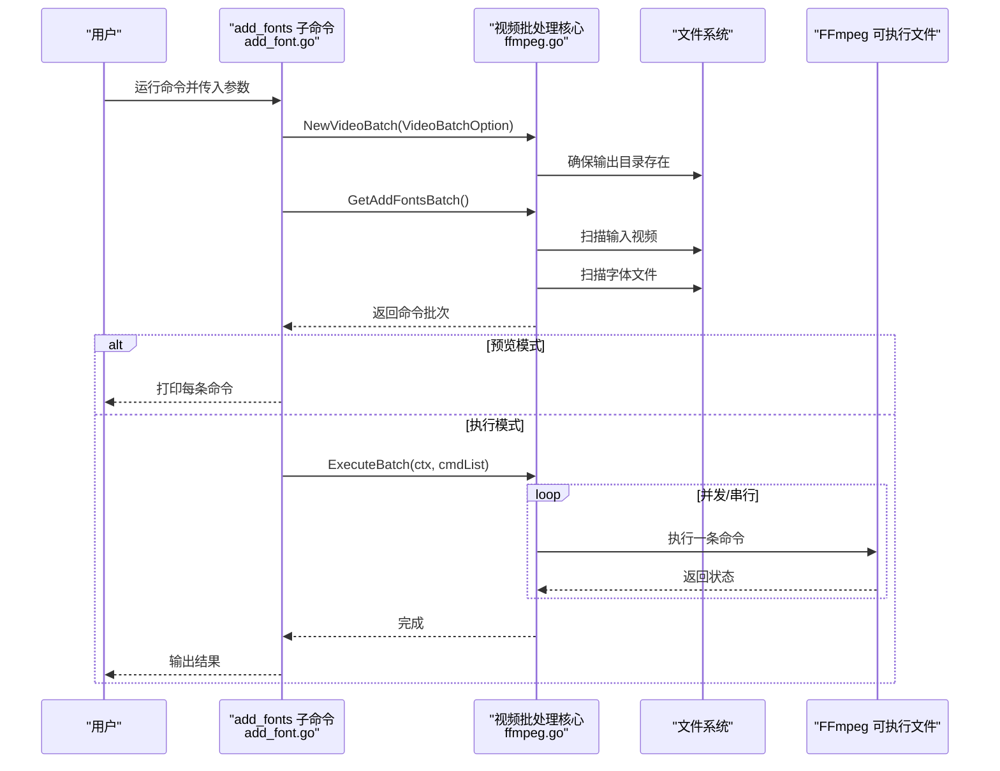

# add_font 子命令

<cite>
**本文引用的文件**
- [add_font.go](file://batch/ffmpeg/add_font.go)
- [init.go](file://batch/ffmpeg/init.go)
- [ffmpeg.go](file://batch/ffmpeg/ffmpeg.go)
- [ffmpeg.md](file://docs/ffmpeg.md)
- [main.go](file://cmd/main.go)
- [file.go](file://utils/file.go)
</cite>

## 目录
1. [简介](#简介)
2. [项目结构](#项目结构)
3. [核心组件](#核心组件)
4. [架构总览](#架构总览)
5. [详细组件分析](#详细组件分析)
6. [依赖分析](#依赖分析)
7. [性能考虑](#性能考虑)
8. [故障排查指南](#故障排查指南)
9. [结论](#结论)
10. [附录](#附录)

## 简介
本节面向使用 batcher 工具的用户，系统性介绍 add_font 子命令的功能与用法。该子命令用于将字体文件批量嵌入到视频中，使视频在播放时能够正确渲染指定字体资源。文档覆盖命令语法、参数说明、字体文件处理机制、FFmpeg 参数工作机制、使用示例、最佳实践与性能优化建议，并解释字体与视频的对应关系以及字体缓存机制。

## 项目结构
- 命令入口位于根目录的主程序，注册 ffmpeg 批处理子命令组。
- ffmpeg 子命令组包含 add_fonts、add_sub、convert 等子命令。
- add_fonts 的具体实现位于 ffmpeg 包内，负责解析参数、扫描视频与字体、生成 FFmpeg 嵌入字体的命令序列，并执行批处理。

图表来源
- [main.go:13-28](file://cmd/main.go#L13-L28)
- [init.go:62-71](file://batch/ffmpeg/init.go#L62-L71)
- [add_font.go:11-68](file://batch/ffmpeg/add_font.go#L11-L68)
- [ffmpeg.go:47-64](file://batch/ffmpeg/ffmpeg.go#L47-L64)

章节来源
- [main.go:13-28](file://cmd/main.go#L13-L28)
- [init.go:62-71](file://batch/ffmpeg/init.go#L62-L71)
- [add_font.go:11-68](file://batch/ffmpeg/add_font.go#L11-L68)
- [ffmpeg.go:47-64](file://batch/ffmpeg/ffmpeg.go#L47-L64)

## 核心组件
- add_fonts 子命令：定义命令名称、别名、帮助信息、参数与动作逻辑。
- 视频批处理核心：负责扫描输入视频、扫描字体文件、生成嵌入字体的 FFmpeg 命令批次、执行批处理。
- FFmpeg 可执行文件：通过系统环境调用，执行具体的视频处理任务。
- 日志与工具：统一的日志记录与目录创建工具。

章节来源
- [add_font.go:11-68](file://batch/ffmpeg/add_font.go#L11-L68)
- [ffmpeg.go:16-38](file://batch/ffmpeg/ffmpeg.go#L16-L38)
- [ffmpeg.go:47-64](file://batch/ffmpeg/ffmpeg.go#L47-L64)
- [file.go:8-31](file://utils/file.go#L8-L31)

## 架构总览
add_fonts 子命令的执行流程如下：
- 解析命令行参数，构建视频批处理选项。
- 创建视频批处理器实例。
- 生成“添加字体”的命令批次。
- 若为预览模式，则打印每条命令；否则并发或串行执行命令。
- 在执行前确保输出目录存在。

图表来源
- [add_font.go:30-67](file://batch/ffmpeg/add_font.go#L30-L67)
- [ffmpeg.go:47-64](file://batch/ffmpeg/ffmpeg.go#L47-L64)
- [ffmpeg.go:158-178](file://batch/ffmpeg/ffmpeg.go#L158-L178)
- [ffmpeg.go:218-286](file://batch/ffmpeg/ffmpeg.go#L218-L286)

## 详细组件分析

### add_fonts 子命令定义与参数
- 命令名称与用途：add_fonts，用于“视频添加字体批处理”。
- 公共参数（继承自 ffmpeg 基础参数）：
  - 输入路径：指定包含视频文件的目录。
  - 输入格式：限定扫描的视频扩展名。
  - 输出路径：指定处理后视频的输出目录。
  - 输出格式：指定输出视频的扩展名。
  - 预览开关：dry-run，仅打印命令不实际执行。
  - 并发工作数：workers，默认为 1（串行）。
- 专用参数：
  - input_fonts_path：必填，指定包含字体文件的目录。默认值为 fonts。

章节来源
- [add_font.go:11-28](file://batch/ffmpeg/add_font.go#L11-L28)
- [init.go:8-56](file://batch/ffmpeg/init.go#L8-L56)

### 视频与字体扫描机制
- 视频扫描：遍历输入目录，匹配扩展名为 input_format 的文件，作为待处理视频列表。
- 字体扫描：遍历 input_fonts_path 目录，匹配扩展名为 ttf、otf、ttc 的文件，作为待嵌入字体列表。
- 输出路径映射：根据输入视频名与输出格式生成去重后的输出文件路径，避免同名冲突。

章节来源
- [ffmpeg.go:66-87](file://batch/ffmpeg/ffmpeg.go#L66-L87)
- [ffmpeg.go:89-113](file://batch/ffmpeg/ffmpeg.go#L89-L113)
- [ffmpeg.go:302-318](file://batch/ffmpeg/ffmpeg.go#L302-L318)

### FFmpeg 嵌入字体参数生成
- 对每个字体文件，生成一组 FFmpeg 参数：
  - -attach 字体路径：将字体作为附件嵌入。
  - -metadata:s:t:N mimetype=application/x-truetype-font：为每个字体附件设置正确的 MIME 类型，其中 N 为附件序号。
- 将这些参数附加到“复制流”的命令中，避免重新编码视频轨道，提升性能。

章节来源
- [ffmpeg.go:115-135](file://batch/ffmpeg/ffmpeg.go#L115-L135)
- [ffmpeg.go:158-178](file://batch/ffmpeg/ffmpeg.go#L158-L178)

### 命令生成与执行
- 命令生成：对每个视频，拼接“输入视频 + 复制流 + 字体参数 + 输出路径”，形成一条 FFmpeg 命令。
- 执行策略：
  - 串行执行：当 workers=1 时，按顺序执行。
  - 并发执行：当 workers>1 时，使用信号量限制并发数量，提高吞吐。
- 上下文取消：执行过程中支持 context 取消，便于中断长时间运行的任务。

章节来源
- [ffmpeg.go:158-178](file://batch/ffmpeg/ffmpeg.go#L158-L178)
- [ffmpeg.go:218-286](file://batch/ffmpeg/ffmpeg.go#L218-L286)

### 字体文件处理与组织
- 支持的字体格式：ttf、otf、ttc。
- 字体目录组织：建议将字体文件放在独立目录（默认 fonts），便于批量扫描与管理。
- 字体参数与序号：每个字体附件会分配一个递增的流索引，确保 FFmpeg 正确识别与使用。

章节来源
- [ffmpeg.go:45](file://batch/ffmpeg/ffmpeg.go#L45)
- [ffmpeg.go:115-135](file://batch/ffmpeg/ffmpeg.go#L115-L135)

### 字体参数配置选项
- 字体选择策略：扫描 input_fonts_path 下所有符合扩展名的字体文件，全部参与嵌入。
- 字体嵌入参数设置：-attach + -metadata:s:t:N mimetype=application/x-truetype-font。
- 字体回退机制：当前实现未内置字体回退逻辑，若播放器无法找到指定字体，可能无法正确渲染文本。建议在字体目录中包含常用字体以增强兼容性。

章节来源
- [ffmpeg.go:89-113](file://batch/ffmpeg/ffmpeg.go#L89-L113)
- [ffmpeg.go:115-135](file://batch/ffmpeg/ffmpeg.go#L115-L135)

### 字体嵌入实现原理
- FFmpeg 字体处理参数：
  - -attach：将外部文件作为附件嵌入容器。
  - -metadata:s:t:N：为附件流设置元数据，N 为附件编号。
  - mimetype=application/x-truetype-font：声明附件类型为 TrueType 字体。
- 渲染过程：播放器在渲染字幕或文本时，优先使用容器内嵌入的字体资源；若未找到，则回退至系统字体或播放器内置字体。

章节来源
- [ffmpeg.go:115-135](file://batch/ffmpeg/ffmpeg.go#L115-L135)

### 使用示例
以下示例基于仓库文档与代码行为整理，展示常见使用场景。

- 单字体嵌入
  - 场景：将单个字体文件嵌入到所有视频。
  - 步骤：
    - 准备字体文件到 fonts 目录。
    - 运行命令，指定输入视频目录、输出目录与输出格式。
  - 参考命令与说明见文档中的“添加多个字体”部分。

- 多字体批量处理
  - 场景：将 fonts 目录下的多个字体文件全部嵌入到视频。
  - 步骤：
    - 将多种字体（ttf/otf/ttc）放入 fonts 目录。
    - 运行 add_fonts 子命令，自动扫描并嵌入所有字体。
  - 注意：嵌入多个字体会增加视频体积，建议仅保留必要字体。

- 字体样式定制
  - 场景：通过字幕样式与字体选择配合，实现不同字体的显示效果。
  - 步骤：
    - 在字幕文件中指定字体名称，确保该字体已在 fonts 目录中。
    - 使用 add_fonts 嵌入字体后，播放器将优先使用容器内的字体。

- 预览与执行
  - 预览：使用 dry-run 仅打印命令，便于核对参数与生成的命令。
  - 执行：移除 dry-run 或设置为 false，开始批量处理。

- 并发与性能
  - 并发：通过 workers 参数调整并发度，提升吞吐；注意磁盘与 CPU 资源占用。
  - 串行：默认串行，适合资源受限或调试阶段。

章节来源
- [ffmpeg.md:68-82](file://docs/ffmpeg.md#L68-L82)
- [add_font.go:52-67](file://batch/ffmpeg/add_font.go#L52-L67)
- [init.go:51-55](file://batch/ffmpeg/init.go#L51-L55)

### 字体文件与视频文件的对应关系
- 一对一映射：每个视频都会被处理一次，生成一个输出视频文件。
- 输出命名：基于输入视频名与输出格式生成唯一文件名，避免重名冲突。
- 字体参数复用：每个视频命令均包含相同的字体参数集合，确保所有字体均被嵌入。

章节来源
- [ffmpeg.go:158-178](file://batch/ffmpeg/ffmpeg.go#L158-L178)
- [ffmpeg.go:302-318](file://batch/ffmpeg/ffmpeg.go#L302-L318)

### 字体缓存机制
- 容器内嵌入：字体以附件形式写入目标容器，无需外部字体文件即可渲染。
- 播放器缓存：播放器加载视频后，会缓存已嵌入的字体资源，后续渲染更高效。
- 兼容性：不同播放器对嵌入字体的支持程度不同，建议在关键平台上进行验证。

章节来源
- [ffmpeg.go:115-135](file://batch/ffmpeg/ffmpeg.go#L115-L135)

## 依赖分析
- add_fonts 子命令依赖 ffmpeg 基础参数定义与视频批处理核心。
- 视频批处理核心依赖文件系统扫描、输出目录创建与 FFmpeg 可执行文件。
- 并发执行依赖 Go 标准库的 sync 与 context。

图表来源
- [add_font.go:11-28](file://batch/ffmpeg/add_font.go#L11-L28)
- [init.go:8-56](file://batch/ffmpeg/init.go#L8-L56)
- [ffmpeg.go:66-87](file://batch/ffmpeg/ffmpeg.go#L66-L87)
- [ffmpeg.go:89-113](file://batch/ffmpeg/ffmpeg.go#L89-L113)
- [ffmpeg.go:218-286](file://batch/ffmpeg/ffmpeg.go#L218-L286)

章节来源
- [add_font.go:11-28](file://batch/ffmpeg/add_font.go#L11-L28)
- [init.go:8-56](file://batch/ffmpeg/init.go#L8-L56)
- [ffmpeg.go:66-87](file://batch/ffmpeg/ffmpeg.go#L66-L87)
- [ffmpeg.go:89-113](file://batch/ffmpeg/ffmpeg.go#L89-L113)
- [ffmpeg.go:218-286](file://batch/ffmpeg/ffmpeg.go#L218-L286)

## 性能考虑
- 复制流处理：使用 -c copy 避免视频轨道重编码，显著降低 CPU 开销与处理时间。
- 并发执行：通过 workers 参数提升吞吐，但需关注磁盘 I/O 与内存占用。
- 字体体积：嵌入字体会增大视频文件体积，建议仅保留必要的字体。
- 输出目录：确保输出目录存在且有写权限，避免执行阶段因权限或路径问题导致失败。

章节来源
- [ffmpeg.go:158-178](file://batch/ffmpeg/ffmpeg.go#L158-L178)
- [ffmpeg.go:218-286](file://batch/ffmpeg/ffmpeg.go#L218-L286)
- [file.go:8-31](file://utils/file.go#L8-L31)

## 故障排查指南
- 未安装 FFmpeg：请先在系统环境中安装 FFmpeg，并确保其可在 PATH 中被调用。
- 权限不足：检查输出目录是否存在且具备写权限；确保输入目录可读。
- 字体未生效：确认字体文件扩展名为 ttf/otf/ttc；确认字体名称与字幕文件中使用的字体一致。
- 并发异常：若并发执行失败，尝试降低 workers 数量或改为串行执行。
- 预览模式：使用 dry-run 查看生成的命令，核对参数是否符合预期。

章节来源
- [ffmpeg.go:288-299](file://batch/ffmpeg/ffmpeg.go#L288-L299)
- [ffmpeg.go:218-286](file://batch/ffmpeg/ffmpeg.go#L218-L286)
- [add_font.go:52-67](file://batch/ffmpeg/add_font.go#L52-L67)

## 结论
add_fonts 子命令通过扫描输入视频与字体目录，为每个视频生成嵌入字体的 FFmpeg 命令，并支持预览与并发执行。其核心优势在于“复制流”处理与批量嵌入，既保证了处理效率，又提升了字体渲染的可靠性。合理组织字体目录、控制并发度与仅嵌入必要字体，是获得良好性能与兼容性的关键。

## 附录
- 命令参考与示例可参考仓库文档中的“添加多个字体”部分。
- 更多 FFmpeg 使用技巧与硬件加速建议，请参阅仓库文档。

章节来源
- [ffmpeg.md:68-82](file://docs/ffmpeg.md#L68-L82)