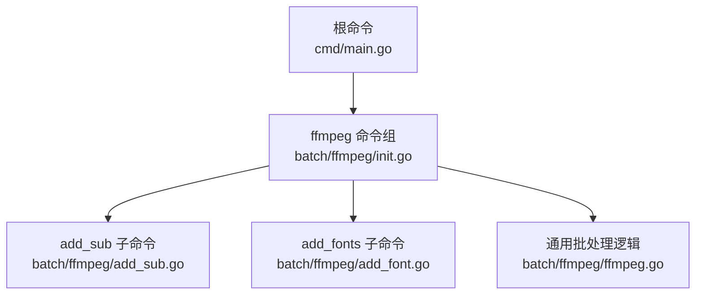
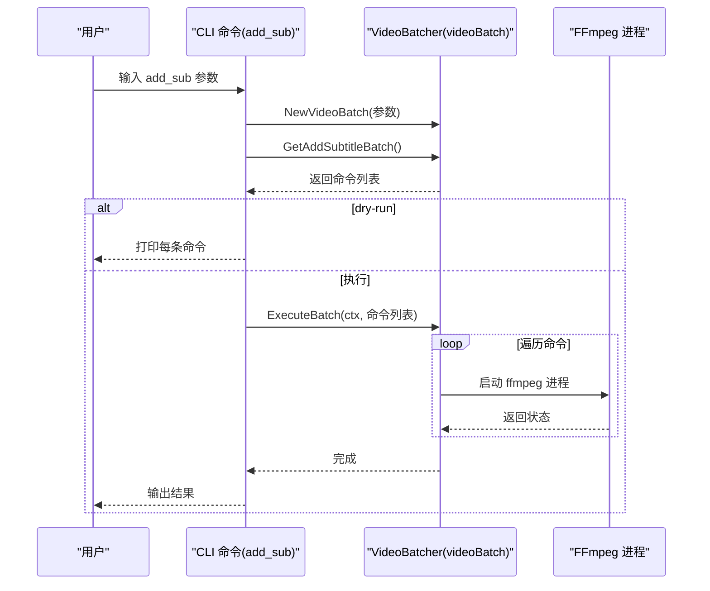
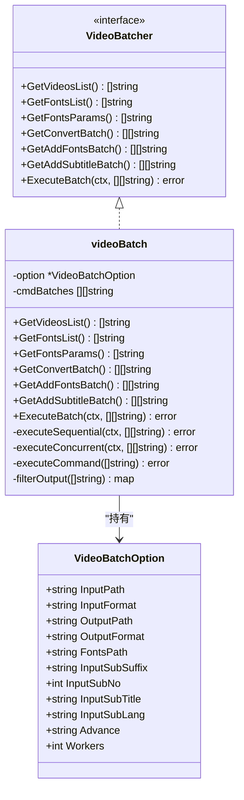

# add_sub 子命令

<cite>
**本文引用的文件**
- [add_sub.go](file://batch/ffmpeg/add_sub.go)
- [init.go](file://batch/ffmpeg/init.go)
- [ffmpeg.go](file://batch/ffmpeg/ffmpeg.go)
- [main.go](file://cmd/main.go)
- [ffmpeg.md](file://docs/ffmpeg.md)
</cite>

## 目录
1. [简介](#简介)
2. [项目结构](#项目结构)
3. [核心组件](#核心组件)
4. [架构总览](#架构总览)
5. [详细组件分析](#详细组件分析)
6. [依赖关系分析](#依赖关系分析)
7. [性能考量](#性能考量)
8. [故障排查指南](#故障排查指南)
9. [结论](#结论)
10. [附录：使用示例与最佳实践](#附录使用示例与最佳实践)

## 简介
本文件面向 batcher 工具中的 add_sub 子命令，系统性地说明“批量为视频添加字幕”的功能与用法。内容涵盖：
- 命令语法与参数说明
- 字幕文件处理机制与支持格式
- 字幕参数配置（轨道选择、样式与语言标识）
- 实现原理（FFmpeg 参数映射）
- 使用示例（单字幕、多字幕轨道、样式定制）
- 文件命名与视频/字幕对应关系
- 准备与排错建议、性能优化建议

## 项目结构
add_sub 属于 ffmpeg 批处理子模块，整体结构如下：
- 命令入口在根命令中注册 ffmpeg 子命令组
- ffmpeg 子命令组包含 convert、add_sub、add_fonts 三个子命令
- add_sub 的具体实现位于 ffmpeg 包内，参数定义与命令入口均在 ffmpeg 包中

图表来源
- [main.go:13-28](file://cmd/main.go#L13-L28)
- [init.go:62-71](file://batch/ffmpeg/init.go#L62-L71)
- [add_sub.go:11-87](file://batch/ffmpeg/add_sub.go#L11-L87)
- [ffmpeg.go:47-64](file://batch/ffmpeg/ffmpeg.go#L47-L64)

章节来源
- [main.go:13-28](file://cmd/main.go#L13-L28)
- [init.go:62-71](file://batch/ffmpeg/init.go#L62-L71)

## 核心组件
- add_sub 子命令：负责解析参数、构建批处理命令、执行或预览
- VideoBatcher 接口与 videoBatch 实现：封装视频扫描、命令生成、执行（串行/并发）
- 全局标志位：input_path、input_format、output_path、output_format、advance、dry-run、input_fonts_path、workers
- 字幕专用参数：input_sub_suffix、input_sub_no、input_sub_lang、input_sub_title

章节来源
- [add_sub.go:11-87](file://batch/ffmpeg/add_sub.go#L11-L87)
- [init.go:8-56](file://batch/ffmpeg/init.go#L8-L56)
- [ffmpeg.go:16-43](file://batch/ffmpeg/ffmpeg.go#L16-L43)

## 架构总览
add_sub 的执行流程：
- 解析命令行参数，构造 VideoBatchOption
- 创建 VideoBatcher 实例
- 生成“添加字幕”批处理命令列表
- 可选 dry-run 预览命令
- 执行批处理（串行或并发）

图表来源
- [add_sub.go:45-86](file://batch/ffmpeg/add_sub.go#L45-L86)
- [ffmpeg.go:180-216](file://batch/ffmpeg/ffmpeg.go#L180-L216)
- [ffmpeg.go:218-299](file://batch/ffmpeg/ffmpeg.go#L218-L299)

## 详细组件分析

### add_sub 子命令参数详解
- 通用参数
  - input_path：输入目录路径（默认当前目录）
  - input_format：输入视频扩展名（默认 mp4）
  - output_path：输出目录路径（默认 ./result/）
  - output_format：输出视频扩展名（默认 mkv）
  - advance：高级自定义参数字符串（透传给 ffmpeg）
  - dry-run：仅打印命令不执行
  - workers：并发工作数（默认 1）
  - input_fonts_path：字体目录（可选，用于同时附加字体）
- 字幕专用参数
  - input_sub_suffix：字幕后缀（默认 ass）
  - input_sub_no：字幕轨道编号（默认 0）
  - input_sub_lang：字幕语言标识（默认 chi）
  - input_sub_title：字幕标题（默认 Chinese）

章节来源
- [add_sub.go:16-44](file://batch/ffmpeg/add_sub.go#L16-L44)
- [init.go:8-56](file://batch/ffmpeg/init.go#L8-L56)

### 字幕文件处理机制与格式支持
- 字幕文件定位规则
  - 与视频同名，扩展名为 input_sub_suffix
  - 例如：输入视频为 video.mp4，input_sub_suffix=ass，则寻找 video.ass
- 支持的字幕格式
  - 通过 input_sub_suffix 控制，常见如 ass、srt、vtt 等
  - 代码层面未限制扩展名集合，实际受 FFmpeg 支持影响
- 字符集处理
  - 固定使用 UTF-8 字符集读取字幕文件
- 字幕轨道选择
  - 通过 -map 0 和 -map 1 将原视频与字幕合并
  - 通过 -metadata:s:s:N 指定目标字幕轨道 N
- 字幕语言与标题
  - 通过 -metadata:s:s:N language=LANG 设置语言
  - 通过 -metadata:s:s:N title=TITLE 设置标题

章节来源
- [ffmpeg.go:193-212](file://batch/ffmpeg/ffmpeg.go#L193-L212)
- [add_sub.go:24-43](file://batch/ffmpeg/add_sub.go#L24-L43)

### 实现原理与 FFmpeg 参数映射
- 基本命令拼装
  - 输入视频：-i 视频路径
  - 字幕文件：-i 字幕路径（字符集 UTF-8）
  - 映射策略：-map 0（保留原视频轨），-map 1（加入字幕轨）
  - 编码策略：-c copy（直接复制，不重编码）
- 字幕元数据
  - -metadata:s:s:N language=LANG
  - -metadata:s:s:N title=TITLE
- 字体附加（可选）
  - 若提供 input_fonts_path，会自动附加字体并设置 mimetype
- 输出路径
  - 与输入视频同名，扩展名为 output_format
  - 若存在重名，自动追加序号避免覆盖

章节来源
- [ffmpeg.go:180-216](file://batch/ffmpeg/ffmpeg.go#L180-L216)
- [ffmpeg.go:302-318](file://batch/ffmpeg/ffmpeg.go#L302-L318)

### 并发与执行模型
- 串行执行：workers=1 或未设置时
- 并发执行：workers>1 时，使用信号量控制并发度
- 上下文取消：支持 context 取消，提前终止执行

章节来源
- [ffmpeg.go:218-299](file://batch/ffmpeg/ffmpeg.go#L218-L299)

### 类图（代码级）

图表来源
- [ffmpeg.go:16-43](file://batch/ffmpeg/ffmpeg.go#L16-L43)
- [ffmpeg.go:40-64](file://batch/ffmpeg/ffmpeg.go#L40-L64)

## 依赖关系分析
- add_sub 依赖全局标志位（input_path、input_format、output_path、output_format、advance、dry-run、input_fonts_path、workers）
- add_sub 依赖 VideoBatcher 接口，具体实现在 videoBatch
- videoBatch 依赖 FFmpeg 可执行程序（ffmpeg 或 ffmpeg.exe）
- 命令入口由根命令注册到 ffmpeg 子命令组

图表来源
- [main.go:13-28](file://cmd/main.go#L13-L28)
- [init.go:62-71](file://batch/ffmpeg/init.go#L62-L71)
- [add_sub.go:45-86](file://batch/ffmpeg/add_sub.go#L45-L86)
- [ffmpeg.go:47-64](file://batch/ffmpeg/ffmpeg.go#L47-L64)

章节来源
- [main.go:13-28](file://cmd/main.go#L13-L28)
- [init.go:62-71](file://batch/ffmpeg/init.go#L62-L71)
- [add_sub.go:45-86](file://batch/ffmpeg/add_sub.go#L45-L86)
- [ffmpeg.go:47-64](file://batch/ffmpeg/ffmpeg.go#L47-L64)

## 性能考量
- 并发执行：通过 workers 提升吞吐，但需考虑磁盘 IO 与 CPU 资源竞争
- 串行执行：适合资源紧张或需要稳定性的环境
- 字幕与字体附加：会增加命令长度与处理时间，建议按需启用
- 输出路径：确保输出目录有足够空间与权限

章节来源
- [ffmpeg.go:218-299](file://batch/ffmpeg/ffmpeg.go#L218-L299)
- [ffmpeg.go:302-318](file://batch/ffmpeg/ffmpeg.go#L302-L318)

## 故障排查指南
- FFmpeg 未安装或不可执行
  - 现象：执行时报错找不到 ffmpeg
  - 处理：安装 FFmpeg 并确保 PATH 可找到
- 输入/输出路径不存在或权限不足
  - 现象：创建输出目录失败或无法写入
  - 处理：检查路径权限，确保输出目录存在且可写
- 字幕文件缺失或扩展名不匹配
  - 现象：找不到同名字幕文件
  - 处理：确认字幕与视频同名且扩展名正确；必要时调整 input_sub_suffix
- 字符集问题
  - 现象：字幕乱码
  - 处理：确保字幕文件为 UTF-8 编码；代码固定使用 UTF-8
- 并发冲突
  - 现象：磁盘写满或 CPU 占满
  - 处理：降低 workers，或分批执行

章节来源
- [ffmpeg.go:47-64](file://batch/ffmpeg/ffmpeg.go#L47-L64)
- [ffmpeg.go:193-212](file://batch/ffmpeg/ffmpeg.go#L193-L212)

## 结论
add_sub 子命令提供了简单可靠的批量字幕添加能力，通过严格的参数映射与 FFmpeg 参数组合，实现了对单条字幕的高效注入，并支持可选字体附加与并发执行。遵循本文的参数说明、文件命名规范与最佳实践，可在大多数场景下获得稳定、可预期的结果。

## 附录：使用示例与最佳实践

### 命令语法与参数速查
- 通用参数
  - --input_path：输入目录
  - --input_format：输入视频扩展名
  - --output_path：输出目录
  - --output_format：输出视频扩展名
  - --advance：高级自定义参数
  - --dry-run：仅打印命令
  - --workers：并发数
  - --input_fonts_path：字体目录（可选）
- 字幕参数
  - --input_sub_suffix：字幕后缀（默认 ass）
  - --input_sub_no：字幕轨道编号（默认 0）
  - --input_sub_lang：语言标识（默认 chi）
  - --input_sub_title：字幕标题（默认 Chinese）

章节来源
- [add_sub.go:16-44](file://batch/ffmpeg/add_sub.go#L16-L44)
- [init.go:8-56](file://batch/ffmpeg/init.go#L8-L56)

### 示例场景
- 单个字幕添加（默认）
  - 输入：video.mp4，字幕 video.ass
  - 输出：video.mkv（默认）
- 多字幕轨道处理
  - 使用 --input_sub_no 指定不同轨道编号，可叠加多条字幕
- 字幕样式定制
  - 通过 --input_sub_lang 与 --input_sub_title 设置语言与标题
- 字体与字幕同时添加
  - 提供 --input_fonts_path，将字体随视频一并嵌入

章节来源
- [ffmpeg.go:180-216](file://batch/ffmpeg/ffmpeg.go#L180-L216)
- [add_sub.go:24-43](file://batch/ffmpeg/add_sub.go#L24-L43)

### 文件命名与对应关系
- 视频与字幕必须同名，仅扩展名不同
- 输出文件与输入视频同名，扩展名为 output_format
- 若存在重名输出，自动追加序号避免覆盖

章节来源
- [ffmpeg.go:193-212](file://batch/ffmpeg/ffmpeg.go#L193-L212)
- [ffmpeg.go:302-318](file://batch/ffmpeg/ffmpeg.go#L302-L318)

### 最佳实践
- 字幕准备
  - 统一使用 UTF-8 编码
  - 与视频同名存放，便于自动匹配
- 格式选择
  - ass/srt/vtt 等均可，取决于 input_sub_suffix
- 语言与标题
  - 使用标准语言代码（参考 FFmpeg 文档）
  - 标题用于播放器显示，建议简洁明确
- 并发与资源
  - 在 SSD 与充足内存环境下提升 workers
  - 分批执行以避免磁盘写满

章节来源
- [ffmpeg.go:193-212](file://batch/ffmpeg/ffmpeg.go#L193-L212)
- [ffmpeg.go:302-318](file://batch/ffmpeg/ffmpeg.go#L302-L318)