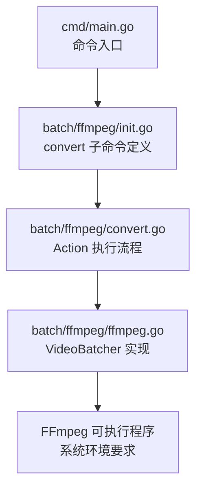
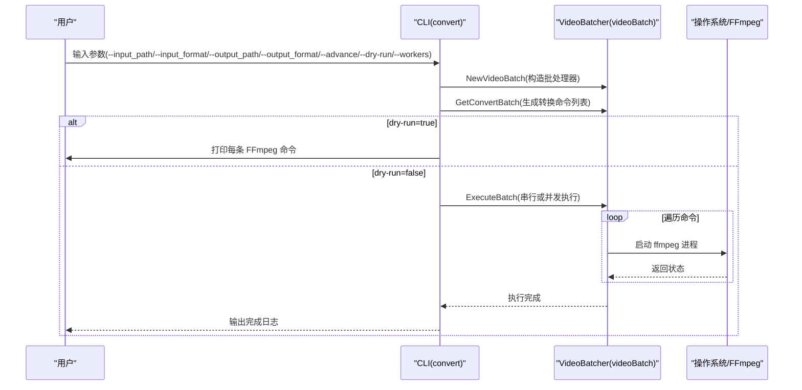
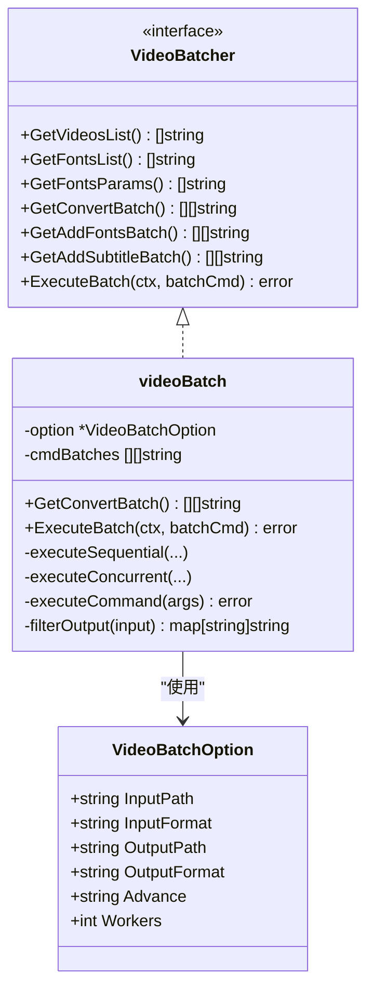
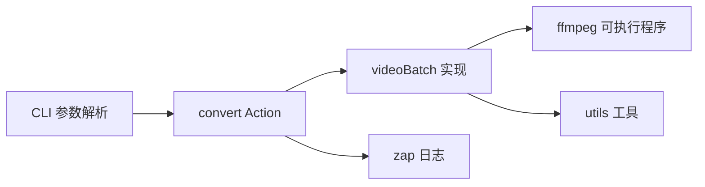
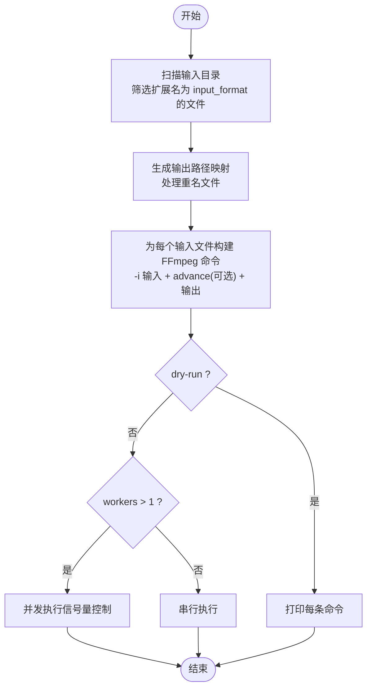

# convert 子命令

<cite>
**本文引用的文件**
- [cmd/main.go](file://cmd/main.go)
- [batch/ffmpeg/init.go](file://batch/ffmpeg/init.go)
- [batch/ffmpeg/convert.go](file://batch/ffmpeg/convert.go)
- [batch/ffmpeg/ffmpeg.go](file://batch/ffmpeg/ffmpeg.go)
- [docs/ffmpeg.md](file://docs/ffmpeg.md)
- [utils/logger.go](file://utils/logger.go)
</cite>

## 目录
1. [简介](#简介)
2. [项目结构与定位](#项目结构与定位)
3. [核心组件](#核心组件)
4. [架构总览](#架构总览)
5. [详细组件解析](#详细组件解析)
6. [依赖关系分析](#依赖关系分析)
7. [性能与并发](#性能与并发)
8. [使用指南与示例](#使用指南与示例)
9. [故障排查](#故障排查)
10. [结论](#结论)

## 简介
本节面向 batcher 工具的 convert 子命令，系统性说明“视频格式转换”的命令语法、参数含义与用法，覆盖输入/输出路径与格式、高级自定义参数、dry-run 预演、并发执行 workers 等关键能力，并给出常见场景示例、最佳实践与性能优化建议。

## 项目结构与定位
- 命令入口位于根目录主程序，注册 ffmpeg 子命令集合，convert 子命令即其中一项。
- convert 子命令通过 CLI 定义参数，收集用户输入后交由视频批处理模块执行。
- 视频批处理模块负责扫描输入目录、生成 FFmpeg 转换命令、按需并发执行，并输出到目标目录。

图表来源
- [cmd/main.go:13-28](file://cmd/main.go#L13-L28)
- [batch/ffmpeg/init.go:61-71](file://batch/ffmpeg/init.go#L61-L71)
- [batch/ffmpeg/convert.go:11-63](file://batch/ffmpeg/convert.go#L11-L63)
- [batch/ffmpeg/ffmpeg.go:47-64](file://batch/ffmpeg/ffmpeg.go#L47-L64)

章节来源
- [cmd/main.go:13-28](file://cmd/main.go#L13-L28)
- [batch/ffmpeg/init.go:61-71](file://batch/ffmpeg/init.go#L61-L71)

## 核心组件
- convert 子命令：定义参数、收集用户输入、生成转换命令列表、可选 dry-run 预览、最终执行或并发执行。
- VideoBatcher 接口与 videoBatch 实现：负责扫描输入、生成命令、执行命令、并发控制与上下文取消。
- 日志：统一使用 zap 输出，便于排障与审计。

章节来源
- [batch/ffmpeg/convert.go:11-63](file://batch/ffmpeg/convert.go#L11-L63)
- [batch/ffmpeg/ffmpeg.go:30-43](file://batch/ffmpeg/ffmpeg.go#L30-L43)
- [utils/logger.go:11-28](file://utils/logger.go#L11-L28)

## 架构总览
下图展示 convert 子命令从参数解析到执行的端到端流程。

图表来源
- [batch/ffmpeg/convert.go:25-62](file://batch/ffmpeg/convert.go#L25-L62)
- [batch/ffmpeg/ffmpeg.go:137-156](file://batch/ffmpeg/ffmpeg.go#L137-L156)
- [batch/ffmpeg/ffmpeg.go:218-286](file://batch/ffmpeg/ffmpeg.go#L218-L286)

## 详细组件解析

### convert 子命令参数定义
- input_path：输入目录路径（默认当前目录）。扫描该目录下匹配扩展名的文件作为待转换视频。
- input_format：输入文件扩展名（默认 mp4）。仅扫描该扩展名的文件。
- output_path：输出目录路径（默认 ./result/）。转换结果写入该目录。
- output_format：输出文件扩展名（默认 mkv）。转换后文件以该扩展名命名。
- advance：高级自定义参数字符串。将被拆分为参数片段追加到 FFmpeg 命令中。
- dry-run：布尔开关。开启后仅打印将要执行的 FFmpeg 命令，不实际运行。
- workers：并发工作数（默认 1）。>1 时启用并发执行；<=0 时自动回退为 1。

章节来源
- [batch/ffmpeg/init.go:9-55](file://batch/ffmpeg/init.go#L9-L55)
- [batch/ffmpeg/convert.go:14-22](file://batch/ffmpeg/convert.go#L14-L22)

### 命令执行流程
- 参数收集：convert Action 读取各 flag 值，封装为 VideoBatchOption。
- 构造批处理器：NewVideoBatch 校验并创建 videoBatch 实例，确保输出目录存在。
- 生成命令：GetConvertBatch 扫描输入目录，基于每个输入文件生成一条 ffmpeg 命令（包含输入、可选 advance 参数、输出文件）。
- 预览或执行：
  - dry-run=true：遍历命令列表，格式化并打印每条 FFmpeg 命令。
  - dry-run=false：记录命令总数，调用 ExecuteBatch 执行。
- 执行策略：单线程或并发，支持 context 取消。

章节来源
- [batch/ffmpeg/convert.go:25-62](file://batch/ffmpeg/convert.go#L25-L62)
- [batch/ffmpeg/ffmpeg.go:47-64](file://batch/ffmpeg/ffmpeg.go#L47-L64)
- [batch/ffmpeg/ffmpeg.go:137-156](file://batch/ffmpeg/ffmpeg.go#L137-L156)

### 命令生成与输出路径映射
- 输入扫描：递归遍历 input_path，筛选扩展名为 input_format 的文件。
- 输出映射：对每个输入文件，计算去扩展名后的基础名，若同名文件已存在则追加序号，最终拼接 output_path 与 output_format 生成输出路径。
- 命令拼装：每条命令以 -i 开头，随后追加 advance 参数（若提供），最后是输出文件路径。

章节来源
- [batch/ffmpeg/ffmpeg.go:66-86](file://batch/ffmpeg/ffmpeg.go#L66-L86)
- [batch/ffmpeg/ffmpeg.go:137-156](file://batch/ffmpeg/ffmpeg.go#L137-L156)
- [batch/ffmpeg/ffmpeg.go:301-318](file://batch/ffmpeg/ffmpeg.go#L301-L318)

### 并发执行与上下文取消
- 单线程：逐条执行，遇到错误立即返回。
- 并发：使用信号量限制并发度，goroutine 中执行命令，首个错误被捕获并返回。
- 上下文：在每次循环前检查 ctx.Done()，支持外部取消。

章节来源
- [batch/ffmpeg/ffmpeg.go:218-286](file://batch/ffmpeg/ffmpeg.go#L218-L286)

### 类关系与职责

图表来源
- [batch/ffmpeg/ffmpeg.go:16-43](file://batch/ffmpeg/ffmpeg.go#L16-L43)
- [batch/ffmpeg/ffmpeg.go:137-156](file://batch/ffmpeg/ffmpeg.go#L137-L156)
- [batch/ffmpeg/ffmpeg.go:218-286](file://batch/ffmpeg/ffmpeg.go#L218-L286)

## 依赖关系分析
- convert 子命令依赖 CLI 库解析参数，依赖日志库输出信息，依赖 utils 创建输出目录。
- videoBatch 依赖系统环境中的 ffmpeg 可执行程序，依赖标准库进行文件遍历、进程执行与并发控制。
- 文档中提供了 FFmpeg 常见转码示例，便于用户理解 advance 参数的使用方式。

图表来源
- [batch/ffmpeg/convert.go:25-62](file://batch/ffmpeg/convert.go#L25-L62)
- [batch/ffmpeg/ffmpeg.go:288-299](file://batch/ffmpeg/ffmpeg.go#L288-L299)
- [utils/logger.go:11-28](file://utils/logger.go#L11-L28)

章节来源
- [batch/ffmpeg/convert.go:25-62](file://batch/ffmpeg/convert.go#L25-L62)
- [batch/ffmpeg/ffmpeg.go:288-299](file://batch/ffmpeg/ffmpeg.go#L288-L299)
- [utils/logger.go:11-28](file://utils/logger.go#L11-L28)

## 性能与并发
- 并发模型：使用 goroutine + 信号量控制并发度，避免过度占用系统资源。
- 上下文取消：支持外部取消，提高长时间任务的可控性。
- 默认串行：workers<=0 或未显式设置时回退为 1，保证稳定性。
- 建议：
  - CPU 密集型转码：根据 CPU 核心数合理设置 workers，避免过载导致 I/O 抖动。
  - I/O 密集型：并发度可适当提升，但需关注磁盘吞吐与散热。
  - 大批量任务：结合 dry-run 预览命令，确认 advance 参数正确后再执行。

章节来源
- [batch/ffmpeg/ffmpeg.go:248-286](file://batch/ffmpeg/ffmpeg.go#L248-L286)
- [batch/ffmpeg/init.go:51-55](file://batch/ffmpeg/init.go#L51-L55)

## 使用指南与示例

### 基本语法
- 子命令：ffmpeg-batch ffmpeg convert
- 关键参数：
  - --input_path：输入目录
  - --input_format：输入扩展名（如 mp4、avi）
  - --output_path：输出目录
  - --output_format：输出扩展名（如 mkv、mp4）
  - --advance：高级自定义参数（FFmpeg 参数字符串）
  - --dry-run：仅预览命令，不执行
  - --workers：并发工作数

章节来源
- [batch/ffmpeg/init.go:9-55](file://batch/ffmpeg/init.go#L9-L55)
- [docs/ffmpeg.md:35-43](file://docs/ffmpeg.md#L35-L43)

### 常见场景示例
- 简单转换：将某目录下所有 mp4 文件转为 mkv，输出到默认 result 目录。
- 指定输入/输出格式：将 avi 输入转为 mov 输出。
- 自定义参数转换：通过 advance 传入 FFmpeg 编码器、像素格式、质量等参数。
- 并发执行：设置 workers 提升吞吐，适合多核 CPU 与高带宽磁盘。
- 预览命令：先用 dry-run 查看生成的 FFmpeg 命令，确认无误再执行。

章节来源
- [docs/ffmpeg.md:18-32](file://docs/ffmpeg.md#L18-L32)
- [batch/ffmpeg/convert.go:47-52](file://batch/ffmpeg/convert.go#L47-L52)

### 参数详解与配置要点
- input_path
  - 作用：扫描输入目录，匹配 input_format 的文件。
  - 配置：可为相对或绝对路径；需确保目录存在且有读权限。
- input_format
  - 作用：过滤输入文件的扩展名。
  - 配置：与文件扩展名一致（如 mp4、avi、mov）。
- output_path
  - 作用：存放转换结果。
  - 配置：不存在时会尝试创建；需具备写权限。
- output_format
  - 作用：输出文件扩展名。
  - 配置：与常用容器格式一致（如 mkv、mp4、webm）。
- advance
  - 作用：向 FFmpeg 命令追加自定义参数。
  - 传参方式：以空格分隔的参数字符串，例如“-c:v libx265 -crf 20”。
  - 注意：参数顺序与 FFmpeg 语义保持一致，避免冲突。
- dry-run
  - 作用：仅打印将要执行的 FFmpeg 命令，便于校验。
  - 使用场景：调试 advance 参数、确认输出路径映射、验证文件匹配。
- workers
  - 作用：并发工作数。
  - 配置：>1 时并发执行；<=0 回退为 1；过大可能引发 I/O 抖动。

章节来源
- [batch/ffmpeg/init.go:9-55](file://batch/ffmpeg/init.go#L9-L55)
- [batch/ffmpeg/convert.go:47-52](file://batch/ffmpeg/convert.go#L47-L52)
- [batch/ffmpeg/ffmpeg.go:137-156](file://batch/ffmpeg/ffmpeg.go#L137-L156)

### 命令生成流程（算法）

图表来源
- [batch/ffmpeg/ffmpeg.go:66-86](file://batch/ffmpeg/ffmpeg.go#L66-L86)
- [batch/ffmpeg/ffmpeg.go:137-156](file://batch/ffmpeg/ffmpeg.go#L137-L156)
- [batch/ffmpeg/convert.go:47-52](file://batch/ffmpeg/convert.go#L47-L52)

## 故障排查
- 无法找到 ffmpeg
  - 现象：执行时报错提示找不到 ffmpeg。
  - 处理：确保系统已安装并可从 PATH 中访问 ffmpeg。
- 输入目录为空或不存在
  - 现象：GetVideosList 返回空列表或报错。
  - 处理：确认 input_path 与 input_format 正确，必要时使用 dry-run 预览。
- 输出目录不可写
  - 现象：NewVideoBatch 创建输出目录失败。
  - 处理：检查输出目录权限或手动创建。
- advance 参数错误
  - 现象：FFmpeg 执行失败或输出异常。
  - 处理：先 dry-run 预览命令，逐步调整 advance 参数。
- 并发导致 I/O 抖动
  - 现象：磁盘占用过高、CPU 温度过高。
  - 处理：降低 workers，或改为串行执行；检查磁盘与散热。
- 上下文取消
  - 现象：执行中途被取消。
  - 处理：检查外部取消来源，或延长超时时间。

章节来源
- [batch/ffmpeg/ffmpeg.go:47-64](file://batch/ffmpeg/ffmpeg.go#L47-L64)
- [batch/ffmpeg/ffmpeg.go:288-299](file://batch/ffmpeg/ffmpeg.go#L288-L299)
- [batch/ffmpeg/convert.go:47-52](file://batch/ffmpeg/convert.go#L47-L52)

## 结论
convert 子命令提供了简洁而强大的视频格式转换能力：通过直观的参数即可完成批量转换，支持 dry-run 预览与并发执行，满足从入门到进阶的多种需求。建议在生产环境中优先使用 dry-run 校验命令，结合合理的 workers 设置与硬件条件，获得稳定高效的转换体验。