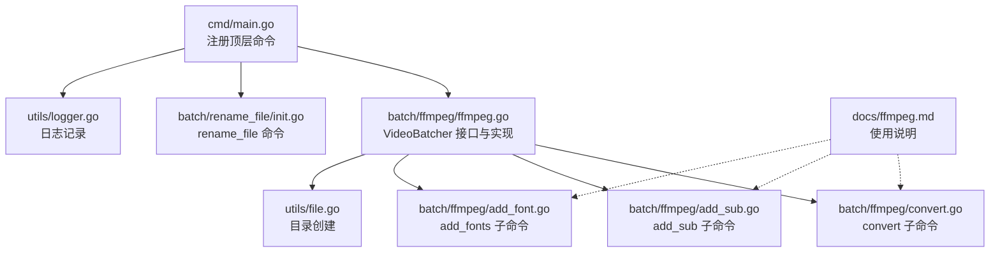
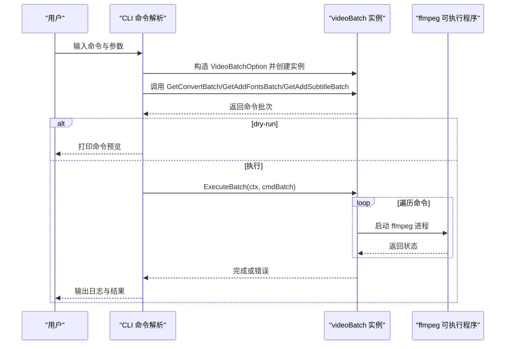
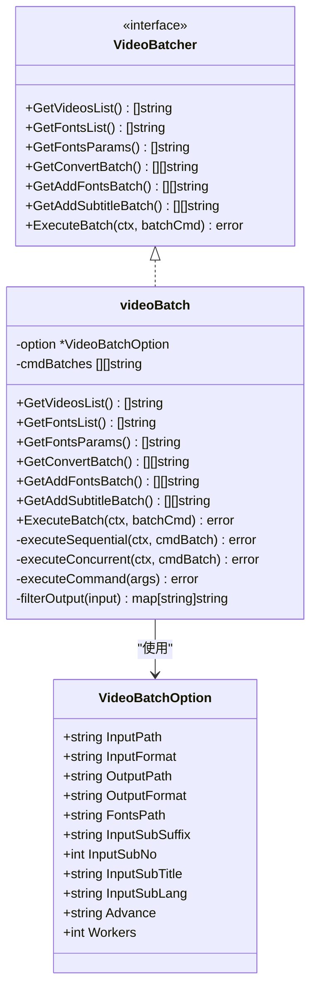
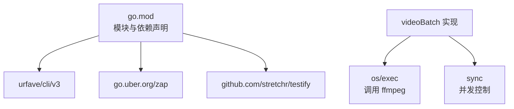

# 命令参考手册

<cite>
**本文引用的文件**
- [cmd/main.go](file://cmd/main.go)
- [batch/ffmpeg/ffmpeg.go](file://batch/ffmpeg/ffmpeg.go)
- [batch/ffmpeg/init.go](file://batch/ffmpeg/init.go)
- [batch/ffmpeg/convert.go](file://batch/ffmpeg/convert.go)
- [batch/ffmpeg/add_sub.go](file://batch/ffmpeg/add_sub.go)
- [batch/ffmpeg/add_font.go](file://batch/ffmpeg/add_font.go)
- [batch/rename_file/init.go](file://batch/rename_file/init.go)
- [utils/logger.go](file://utils/logger.go)
- [utils/file.go](file://utils/file.go)
- [docs/ffmpeg.md](file://docs/ffmpeg.md)
- [batch/ffmpeg/ffmpeg_test.go](file://batch/ffmpeg/ffmpeg_test.go)
- [go.mod](file://go.mod)
</cite>

## 目录
1. [简介](#简介)
2. [项目结构](#项目结构)
3. [核心组件](#核心组件)
4. [架构总览](#架构总览)
5. [详细组件分析](#详细组件分析)
6. [依赖分析](#依赖分析)
7. [性能考虑](#性能考虑)
8. [故障排查指南](#故障排查指南)
9. [结论](#结论)
10. [附录](#附录)

## 简介
本手册面向 batcher 工具的使用者与维护者，提供完整的命令参考与最佳实践。当前工具提供两类主要能力：
- ffmpeg 子命令组：convert（视频转换）、add_sub（添加字幕）、add_fonts（添加字体）
- rename_file 命令：对指定目录下的文件进行重命名（支持 MD5 哈希命名）

工具通过 CLI 框架注册命令，并在运行时根据用户传入的参数构建批处理命令序列，最终调用系统 ffmpeg 执行转换或封装操作。同时，工具内置日志记录与并发控制，便于在不同规模的数据集上高效稳定地完成批处理任务。

## 项目结构
- 入口程序位于 cmd/main.go，负责注册顶层命令与子命令
- ffmpeg 批处理逻辑集中在 batch/ffmpeg 下，包含通用接口、实现、子命令定义与初始化
- rename_file 命令位于 batch/rename_file 下，提供基础参数与占位 Action
- 日志与文件工具位于 utils 下，分别提供结构化日志与目录创建能力
- 文档与测试位于 docs 与 batch/ffmpeg/ffmpeg_test.go，覆盖使用说明与行为验证

图表来源
- [cmd/main.go:13-28](file://cmd/main.go#L13-L28)
- [batch/ffmpeg/ffmpeg.go:16-64](file://batch/ffmpeg/ffmpeg.go#L16-L64)
- [batch/ffmpeg/convert.go:11-63](file://batch/ffmpeg/convert.go#L11-L63)
- [batch/ffmpeg/add_sub.go:11-88](file://batch/ffmpeg/add_sub.go#L11-L88)
- [batch/ffmpeg/add_font.go:11-69](file://batch/ffmpeg/add_font.go#L11-L69)
- [batch/rename_file/init.go:25-34](file://batch/rename_file/init.go#L25-L34)
- [utils/file.go:8-31](file://utils/file.go#L8-L31)
- [utils/logger.go:11-28](file://utils/logger.go#L11-L28)
- [docs/ffmpeg.md:1-101](file://docs/ffmpeg.md#L1-L101)

章节来源
- [cmd/main.go:13-28](file://cmd/main.go#L13-L28)
- [batch/ffmpeg/ffmpeg.go:16-64](file://batch/ffmpeg/ffmpeg.go#L16-L64)
- [batch/ffmpeg/convert.go:11-63](file://batch/ffmpeg/convert.go#L11-L63)
- [batch/ffmpeg/add_sub.go:11-88](file://batch/ffmpeg/add_sub.go#L11-L88)
- [batch/ffmpeg/add_font.go:11-69](file://batch/ffmpeg/add_font.go#L11-L69)
- [batch/rename_file/init.go:25-34](file://batch/rename_file/init.go#L25-L34)
- [utils/file.go:8-31](file://utils/file.go#L8-L31)
- [utils/logger.go:11-28](file://utils/logger.go#L11-L28)
- [docs/ffmpeg.md:1-101](file://docs/ffmpeg.md#L1-L101)

## 核心组件
- VideoBatcher 接口：定义视频批处理的核心能力，包括获取视频/字体列表、生成转换/添加字体/添加字幕的命令批次、执行批处理等
- videoBatch 实现：具体实现上述接口，负责扫描输入目录、生成输出映射、拼接 ffmpeg 参数、执行命令（串行或并发）
- CLI 命令注册：通过 urfave/cli/v3 注册顶层命令与子命令，绑定参数与 Action
- 日志与工具：使用 zap 进行结构化日志输出；使用 utils.MakeDir 确保输出目录存在

章节来源
- [batch/ffmpeg/ffmpeg.go:30-64](file://batch/ffmpeg/ffmpeg.go#L30-L64)
- [batch/ffmpeg/ffmpeg.go:16-28](file://batch/ffmpeg/ffmpeg.go#L16-L28)
- [utils/logger.go:11-28](file://utils/logger.go#L11-L28)
- [utils/file.go:8-31](file://utils/file.go#L8-L31)

## 架构总览
整体流程如下：
- 用户在终端输入命令（如 ffmpeg convert），CLI 解析参数
- 根据参数构造 VideoBatchOption，并创建 videoBatch 实例
- 生成对应批处理命令序列（GetConvertBatch/GetAddFontsBatch/GetAddSubtitleBatch）
- 若 dry-run，则仅打印命令；否则并发或串行执行 ffmpeg 命令
- 执行完成后输出结果日志

图表来源
- [cmd/main.go:13-28](file://cmd/main.go#L13-L28)
- [batch/ffmpeg/ffmpeg.go:137-156](file://batch/ffmpeg/ffmpeg.go#L137-L156)
- [batch/ffmpeg/ffmpeg.go:158-178](file://batch/ffmpeg/ffmpeg.go#L158-L178)
- [batch/ffmpeg/ffmpeg.go:180-216](file://batch/ffmpeg/ffmpeg.go#L180-L216)
- [batch/ffmpeg/ffmpeg.go:218-286](file://batch/ffmpeg/ffmpeg.go#L218-L286)

## 详细组件分析

### ffmpeg 子命令组
- 命令入口：顶层命令 ffmpeg，包含三个子命令 convert、add_sub、add_fonts
- 共享参数：
  - input_path：输入目录（默认当前目录）
  - input_format：输入文件扩展名（默认 mp4）
  - output_path：输出目录（默认 ./result/）
  - output_format：输出文件扩展名（默认 mkv）
  - advance：高级自定义参数字符串（透传给 ffmpeg）
  - workers：并发工作数（默认 1，即串行）
  - dry-run：仅打印命令不执行（默认 false）

- convert 子命令
  - 功能：将指定目录下匹配扩展名的视频批量转换为目标格式
  - 关键参数：同上
  - 行为：扫描输入目录，生成每条 ffmpeg 命令，按 workers 控制并发执行
  - 示例：ffmpeg convert --input_path ./videos --output_path ./results --output_format mkv --workers 4

- add_sub 子命令
  - 功能：为视频添加字幕（单条字幕），并可选附加字体
  - 关键参数：
    - input_sub_suffix：字幕后缀（默认 ass）
    - input_sub_no：字幕流编号（默认 0）
    - input_sub_lang：字幕语言（默认 chi）
    - input_sub_title：字幕标题（默认 Chinese）
    - input_fonts_path：字体目录（可选）
  - 行为：扫描输入目录，按视频名匹配同名字幕文件，生成带 -map、-metadata 的命令
  - 示例：ffmpeg add_sub --input_path ./videos --input_sub_suffix ass --input_sub_lang chi --input_sub_title "简体中文"

- add_fonts 子命令
  - 功能：为视频封装嵌入字体（ttf/otf/ttc）
  - 关键参数：input_fonts_path（必填）
  - 行为：扫描字体目录，生成 -attach 与 mimetype 元数据参数，再复制封装
  - 示例：ffmpeg add_fonts --input_path ./videos --input_fonts_path ./fonts

- 执行模型与并发
  - 串行：workers=1，逐个执行命令
  - 并发：workers>1，使用信号量控制并发度，等待全部完成或首个错误返回
  - 取消：支持 context 取消，遇到取消信号立即停止后续执行

图表来源
- [batch/ffmpeg/ffmpeg.go:16-38](file://batch/ffmpeg/ffmpeg.go#L16-L38)
- [batch/ffmpeg/ffmpeg.go:40-64](file://batch/ffmpeg/ffmpeg.go#L40-L64)

章节来源
- [batch/ffmpeg/init.go:8-71](file://batch/ffmpeg/init.go#L8-L71)
- [batch/ffmpeg/convert.go:11-63](file://batch/ffmpeg/convert.go#L11-L63)
- [batch/ffmpeg/add_sub.go:11-88](file://batch/ffmpeg/add_sub.go#L11-L88)
- [batch/ffmpeg/add_font.go:11-69](file://batch/ffmpeg/add_font.go#L11-L69)
- [batch/ffmpeg/ffmpeg.go:137-216](file://batch/ffmpeg/ffmpeg.go#L137-L216)
- [batch/ffmpeg/ffmpeg.go:218-286](file://batch/ffmpeg/ffmpeg.go#L218-L286)

### rename_file 命令
- 命令入口：rename_file
- 参数：
  - input_path：源目录（默认当前目录）
  - md5：是否使用 MD5 哈希作为文件名（布尔开关）
- 当前 Action 为占位，未实现具体重命名逻辑，但保留了参数与日志记录

章节来源
- [batch/rename_file/init.go:10-34](file://batch/rename_file/init.go#L10-L34)

### 命令组合与高级技巧
- 组合顺序建议：
  - add_fonts -> add_sub -> convert：先封装字体，再添加字幕，最后转换格式，确保字幕与字体在目标容器中可用
- 性能优化：
  - 合理设置 workers：根据 CPU/IO 能力调整并发数，避免过度竞争
  - 使用 advance 传递硬件加速参数：例如 NVENC、VideoToolbox 等，减少 CPU 压力
  - 使用 dry-run 预览命令：在大规模执行前先 dry-run 校验参数与路径
- 错误处理：
  - 遇到首个错误会记录并返回；并发模式下后续任务可能被取消
  - 输出目录不存在时自动创建；若路径非目录则报错

章节来源
- [batch/ffmpeg/ffmpeg.go:51-58](file://batch/ffmpeg/ffmpeg.go#L51-L58)
- [batch/ffmpeg/ffmpeg.go:218-286](file://batch/ffmpeg/ffmpeg.go#L218-L286)
- [utils/file.go:8-31](file://utils/file.go#L8-L31)

### 使用示例与最佳实践
- 示例一：批量转换
  - ffmpeg convert --input_path ./videos --output_path ./results --output_format mkv --workers 4
- 示例二：添加字幕
  - ffmpeg add_sub --input_path ./videos --input_sub_suffix ass --input_sub_lang chi --input_sub_title "简体中文"
- 示例三：添加字体
  - ffmpeg add_fonts --input_path ./videos --input_fonts_path ./fonts
- 最佳实践：
  - 在执行前使用 dry-run 验证命令
  - 对于大文件建议开启硬件加速（通过 advance 传参）
  - 字幕与字体目录结构清晰，避免同名冲突

章节来源
- [docs/ffmpeg.md:34-43](file://docs/ffmpeg.md#L34-L43)
- [docs/ffmpeg.md:54-66](file://docs/ffmpeg.md#L54-L66)
- [docs/ffmpeg.md:75-82](file://docs/ffmpeg.md#L75-L82)

## 依赖分析
- CLI 框架：urfave/cli/v3 提供命令注册与参数解析
- 日志：go.uber.org/zap 提供结构化日志
- 测试：github.com/stretchr/testify 提供断言与测试框架
- 并发控制：Go 标准库 sync 与信号量实现

图表来源
- [go.mod:5-16](file://go.mod#L5-L16)
- [batch/ffmpeg/ffmpeg.go:288-299](file://batch/ffmpeg/ffmpeg.go#L288-L299)
- [batch/ffmpeg/ffmpeg.go:248-286](file://batch/ffmpeg/ffmpeg.go#L248-L286)

章节来源
- [go.mod:5-16](file://go.mod#L5-L16)
- [batch/ffmpeg/ffmpeg.go:288-299](file://batch/ffmpeg/ffmpeg.go#L288-L299)
- [batch/ffmpeg/ffmpeg.go:248-286](file://batch/ffmpeg/ffmpeg.go#L248-L286)

## 性能考虑
- 并发策略：通过信号量限制最大并发数，避免资源争用；串行模式适合小规模或磁盘受限场景
- 命令生成：按需拼接参数，避免冗余；dry-run 可提前发现潜在问题
- 硬件加速：通过 advance 传入硬件编码器参数，显著降低 CPU 占用
- I/O 优化：输出目录自动创建，减少手动准备步骤；同名文件自动追加序号，避免覆盖

章节来源
- [batch/ffmpeg/ffmpeg.go:248-286](file://batch/ffmpeg/ffmpeg.go#L248-L286)
- [batch/ffmpeg/ffmpeg.go:301-318](file://batch/ffmpeg/ffmpeg.go#L301-L318)
- [docs/ffmpeg.md:18-32](file://docs/ffmpeg.md#L18-L32)

## 故障排查指南
- ffmpeg 未找到
  - 现象：执行时报错提示找不到 ffmpeg
  - 处理：确认系统环境已安装 ffmpeg，并将其加入 PATH
- 输出目录权限不足
  - 现象：创建输出目录失败
  - 处理：检查目录权限或更换输出路径
- 参数错误导致命令失败
  - 现象：ffmpeg 返回参数解析错误
  - 处理：使用 dry-run 预览命令，核对 advance 与映射参数
- 并发执行异常
  - 现象：多任务同时失败或部分失败
  - 处理：降低 workers 或关闭并发，逐步定位问题

章节来源
- [batch/ffmpeg/ffmpeg.go:218-286](file://batch/ffmpeg/ffmpeg.go#L218-L286)
- [utils/file.go:8-31](file://utils/file.go#L8-L31)

## 结论
batcher 工具通过简洁的 CLI 设计与稳健的批处理实现，为视频格式转换、字幕与字体封装提供了高效的自动化方案。结合 dry-run、并发控制与硬件加速参数，可在保证稳定性的同时提升处理效率。rename_file 命令目前为占位实现，未来可扩展为更灵活的重命名策略。

## 附录
- 常用参数速查
  - input_path：输入目录
  - input_format：输入文件扩展名
  - output_path：输出目录
  - output_format：输出文件扩展名
  - advance：高级自定义参数
  - workers：并发工作数
  - dry-run：仅打印命令
  - input_fonts_path：字体目录（add_fonts 必填）
  - input_sub_suffix：字幕后缀（add_sub）
  - input_sub_no：字幕流编号（add_sub）
  - input_sub_lang：字幕语言（add_sub）
  - input_sub_title：字幕标题（add_sub）
  - md5：使用 MD5 哈希命名（rename_file）

章节来源
- [batch/ffmpeg/init.go:8-71](file://batch/ffmpeg/init.go#L8-L71)
- [batch/ffmpeg/add_sub.go:24-44](file://batch/ffmpeg/add_sub.go#L24-L44)
- [batch/ffmpeg/add_font.go:22-28](file://batch/ffmpeg/add_font.go#L22-L28)
- [batch/rename_file/init.go:10-20](file://batch/rename_file/init.go#L10-L20)