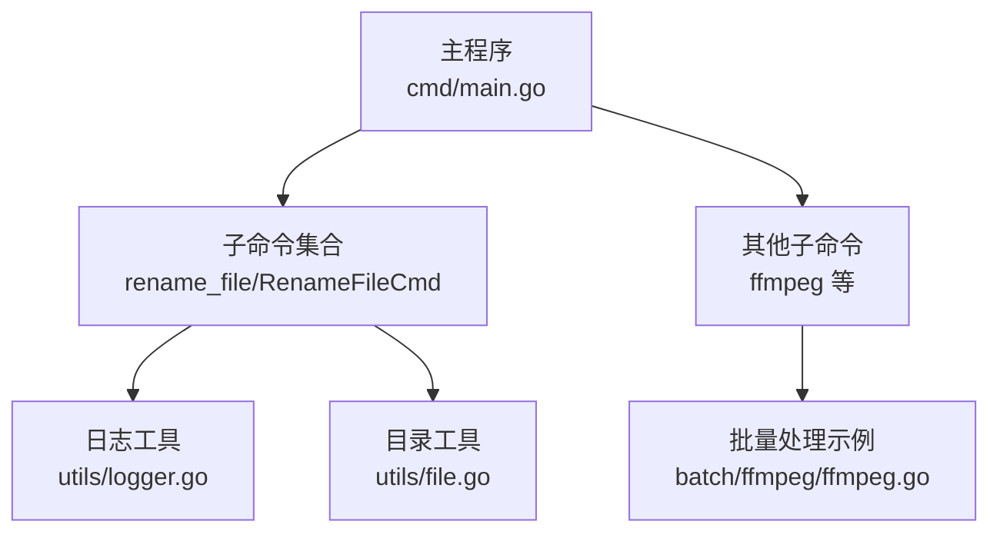
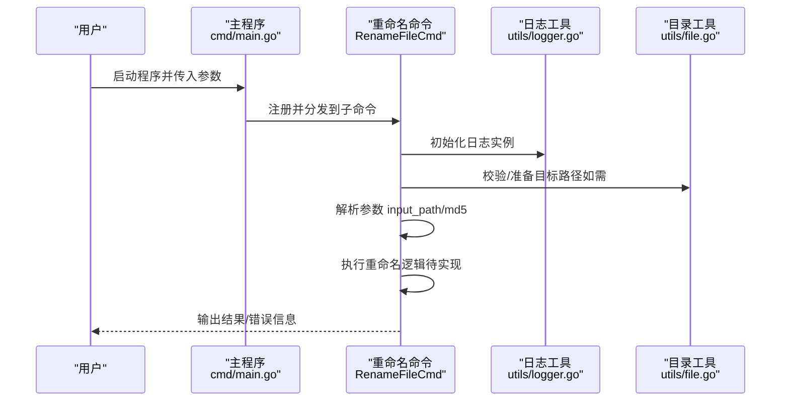
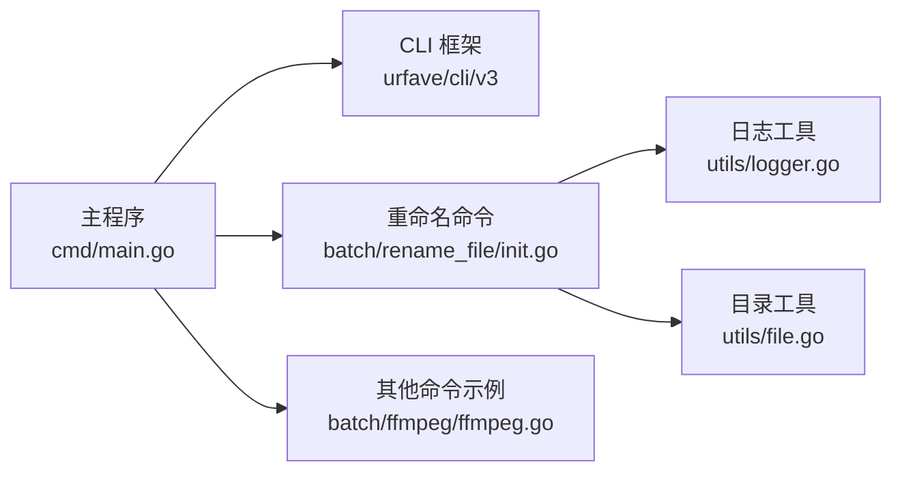

# 文件重命名命令

<cite>
**本文引用的文件**
- [cmd/main.go](file://cmd/main.go)
- [batch/rename_file/init.go](file://batch/rename_file/init.go)
- [utils/logger.go](file://utils/logger.go)
- [utils/file.go](file://utils/file.go)
- [batch/ffmpeg/ffmpeg.go](file://batch/ffmpeg/ffmpeg.go)
- [batch/ffmpeg/ffmpeg_test.go](file://batch/ffmpeg/ffmpeg_test.go)
- [go.mod](file://go.mod)
</cite>

## 目录
1. [简介](#简介)
2. [项目结构](#项目结构)
3. [核心组件](#核心组件)
4. [架构总览](#架构总览)
5. [详细组件分析](#详细组件分析)
6. [依赖分析](#依赖分析)
7. [性能考虑](#性能考虑)
8. [故障排除指南](#故障排除指南)
9. [结论](#结论)
10. [附录：命令参考与用法示例](#附录命令参考与用法示例)

## 简介
本文件重命名命令用于对指定目录下的文件进行批量重命名。当前版本提供了基础的命令注册与参数定义，但未实现具体的重命名逻辑。本文档在不泄露具体实现的前提下，基于现有代码结构与测试用例，给出完整的命令参考、使用说明、常见场景与最佳实践，并提供故障排除建议。

## 项目结构
该工具采用模块化的命令组织方式：
- 主程序负责注册子命令并启动 CLI 框架
- rename_file 子命令负责文件重命名功能的入口与参数解析
- 工具模块提供通用的日志与目录操作能力
- 其他子命令（如 ffmpeg）展示了批量处理的典型模式，可作为理解“批量”语义的参考

图表来源
- [cmd/main.go:13-28](file://cmd/main.go#L13-L28)
- [batch/rename_file/init.go:25-34](file://batch/rename_file/init.go#L25-L34)
- [utils/logger.go:11-28](file://utils/logger.go#L11-L28)
- [utils/file.go:8-31](file://utils/file.go#L8-L31)
- [batch/ffmpeg/ffmpeg.go:16-64](file://batch/ffmpeg/ffmpeg.go#L16-L64)

章节来源
- [cmd/main.go:13-28](file://cmd/main.go#L13-L28)
- [batch/rename_file/init.go:25-34](file://batch/rename_file/init.go#L25-L34)
- [utils/logger.go:11-28](file://utils/logger.go#L11-L28)
- [utils/file.go:8-31](file://utils/file.go#L8-L31)
- [batch/ffmpeg/ffmpeg.go:16-64](file://batch/ffmpeg/ffmpeg.go#L16-L64)

## 核心组件
- 命令入口与参数定义
  - 命令名称：rename_file
  - 参数：
    - input_path：输入目录路径，默认为当前目录
    - md5：是否使用 MD5 哈希作为文件名
- 日志系统
  - 使用 zap 提供彩色控制台日志，支持时间、调用者、级别等字段
- 目录工具
  - 提供目录创建与存在性校验能力

章节来源
- [batch/rename_file/init.go:10-20](file://batch/rename_file/init.go#L10-L20)
- [batch/rename_file/init.go:25-34](file://batch/rename_file/init.go#L25-L34)
- [utils/logger.go:11-28](file://utils/logger.go#L11-L28)
- [utils/file.go:8-31](file://utils/file.go#L8-L31)

## 架构总览
命令执行流程概览如下：

图表来源
- [cmd/main.go:13-28](file://cmd/main.go#L13-L28)
- [batch/rename_file/init.go:25-34](file://batch/rename_file/init.go#L25-L34)
- [utils/logger.go:11-28](file://utils/logger.go#L11-L28)
- [utils/file.go:8-31](file://utils/file.go#L8-L31)

## 详细组件分析

### 命令入口与参数
- 命令名称：rename_file
- 功能定位：文件重命名工具
- 参数定义：
  - input_path：指定输入目录路径，默认值为当前目录
  - md5：布尔开关，启用后使用 MD5 哈希作为文件名
- 行为说明：
  - 当前 Action 仅记录调试日志，实际重命名逻辑尚未实现

章节来源
- [batch/rename_file/init.go:25-34](file://batch/rename_file/init.go#L25-L34)
- [batch/rename_file/init.go:10-20](file://batch/rename_file/init.go#L10-L20)

### 日志系统
- 初始化方式：通过 NewLogger 创建 zap 控制台日志器
- 输出特性：包含时间戳、级别、调用者位置、耗时等字段
- 使用场景：便于在命令执行过程中输出调试信息与状态

章节来源
- [utils/logger.go:11-28](file://utils/logger.go#L11-L28)

### 目录工具
- 能力：创建目录（递归）、校验路径是否存在且为目录
- 错误处理：对空路径、非目录存在、创建失败等情况返回明确错误

章节来源
- [utils/file.go:8-31](file://utils/file.go#L8-L31)

### 批量处理参考模式
虽然 rename_file 的 Action 尚未实现，但项目中 ffmpeg 子命令展示了典型的“批量处理”思路，可作为理解“批量”的参考：
- 遍历输入目录，收集符合条件的文件
- 生成输出文件名映射，避免重名冲突
- 组装命令批次并并发执行

章节来源
- [batch/ffmpeg/ffmpeg.go:66-87](file://batch/ffmpeg/ffmpeg.go#L66-L87)
- [batch/ffmpeg/ffmpeg.go:301-318](file://batch/ffmpeg/ffmpeg.go#L301-L318)
- [batch/ffmpeg/ffmpeg_test.go:275-310](file://batch/ffmpeg/ffmpeg_test.go#L275-L310)

## 依赖分析
- CLI 框架：urfave/cli/v3
- 日志：go.uber.org/zap
- 测试断言：github.com/stretchr/testify

图表来源
- [go.mod:5-9](file://go.mod#L5-L9)
- [cmd/main.go:3-11](file://cmd/main.go#L3-L11)
- [batch/rename_file/init.go:3-8](file://batch/rename_file/init.go#L3-L8)
- [utils/logger.go:3-8](file://utils/logger.go#L3-L8)
- [utils/file.go:3-6](file://utils/file.go#L3-L6)
- [batch/ffmpeg/ffmpeg.go:3-14](file://batch/ffmpeg/ffmpeg.go#L3-L14)

章节来源
- [go.mod:5-9](file://go.mod#L5-L9)
- [cmd/main.go:3-11](file://cmd/main.go#L3-L11)
- [batch/rename_file/init.go:3-8](file://batch/rename_file/init.go#L3-L8)
- [utils/logger.go:3-8](file://utils/logger.go#L3-L8)
- [utils/file.go:3-6](file://utils/file.go#L3-L6)
- [batch/ffmpeg/ffmpeg.go:3-14](file://batch/ffmpeg/ffmpeg.go#L3-L14)

## 性能考虑
- 并发策略：可参考 ffmpeg 的并发设计，合理设置工作线程数量以平衡吞吐与资源占用
- I/O 优化：批量读取与预分配容器，减少内存重分配
- 路径处理：统一使用标准库路径函数，避免跨平台兼容问题
- 日志开销：在生产环境适当降低日志级别，避免频繁 I/O 影响性能

## 故障排除指南
- 输入路径为空或无效
  - 现象：创建输出目录时报错或遍历输入目录失败
  - 排查：确认 input_path 是否存在、是否为目录；必要时使用绝对路径
- 目录权限不足
  - 现象：无法创建或写入目标目录
  - 排查：检查目录权限与磁盘空间
- 重名冲突
  - 现象：多个文件重名导致输出冲突
  - 排查：参考批量处理中的去重策略，为重复名称追加序号
- 日志输出异常
  - 现象：日志格式不符合预期
  - 排查：确认日志初始化是否成功，以及终端编码支持情况

章节来源
- [utils/file.go:8-31](file://utils/file.go#L8-L31)
- [batch/ffmpeg/ffmpeg.go:301-318](file://batch/ffmpeg/ffmpeg.go#L301-L318)

## 结论
rename_file 命令目前处于可注册但未实现的状态。本文档提供了完整的命令参考、使用说明与最佳实践，帮助用户在后续迭代中快速实现批量重命名功能。同时，项目中 ffmpeg 的批量处理模式可作为实现思路的重要参考。

## 附录：命令参考与用法示例

### 命令语法
- 基本形式
  - batcher rename_file [选项]
- 选项
  - --input_path：输入目录路径（默认为当前目录）
  - --md5：启用后使用 MD5 哈希作为文件名

章节来源
- [batch/rename_file/init.go:10-20](file://batch/rename_file/init.go#L10-L20)
- [batch/rename_file/init.go:25-34](file://batch/rename_file/init.go#L25-L34)

### 使用示例（概念性）
- 将当前目录下所有文件重命名为 MD5 哈希
  - batcher rename_file --input_path ./videos --md5
- 将指定目录下的文件按原名转换为小写并保留扩展名
  - batcher rename_file --input_path ./files
- 对同名文件自动追加序号，避免覆盖
  - batcher rename_file --input_path ./dupes

说明
- 上述示例展示的是功能预期与常见场景，具体实现需在后续版本中完成。

### 重命名规则与匹配模式（概念性）
- 匹配范围
  - 默认遍历 input_path 下的所有文件（不递归子目录）
- 去重策略
  - 若多个文件重名，自动追加序号（如：原名-1、原名-2…）
- 名称生成
  - md5 开启时：使用文件内容的 MD5 哈希作为新文件名
  - md5 关闭时：保持原文件名（仅调整大小写或格式）

章节来源
- [batch/ffmpeg/ffmpeg.go:301-318](file://batch/ffmpeg/ffmpeg.go#L301-L318)

### 常见场景与最佳实践（概念性）
- 文件名格式化
  - 统一大小写：全部转为小写或首字母大写
  - 替换非法字符：将空格、特殊符号替换为下划线或连字符
- 序号添加
  - 为同名文件自动编号，避免覆盖已有文件
- 批量处理
  - 合理设置并发度，避免磁盘与 CPU 过载
- 安全性
  - 在执行前先备份重要文件
  - 使用 dry-run 或预览功能验证结果

### 错误处理机制（概念性）
- 参数校验
  - input_path 必须存在且为目录
  - md5 为布尔开关，不影响路径合法性
- 文件系统错误
  - 读取失败、写入失败、权限不足等均应返回明确错误
- 冲突处理
  - 自动检测并解决重名冲突，保证输出唯一性

### 故障排除清单（概念性）
- 症状：命令无响应
  - 检查 CLI 是否正确注册，Action 是否被调用
- 症状：报错“路径不存在”
  - 确认 input_path 是否拼写正确，是否为绝对路径
- 症状：重名文件被覆盖
  - 检查去重逻辑是否生效，必要时手动清理冲突文件
- 症状：MD5 未生效
  - 确认 md5 开关是否开启，以及文件内容是否发生变化