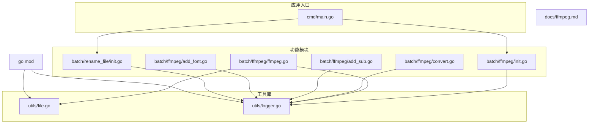
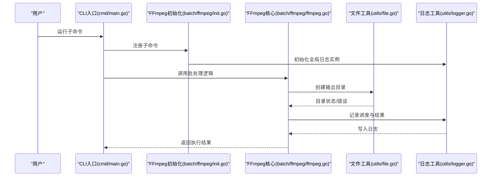
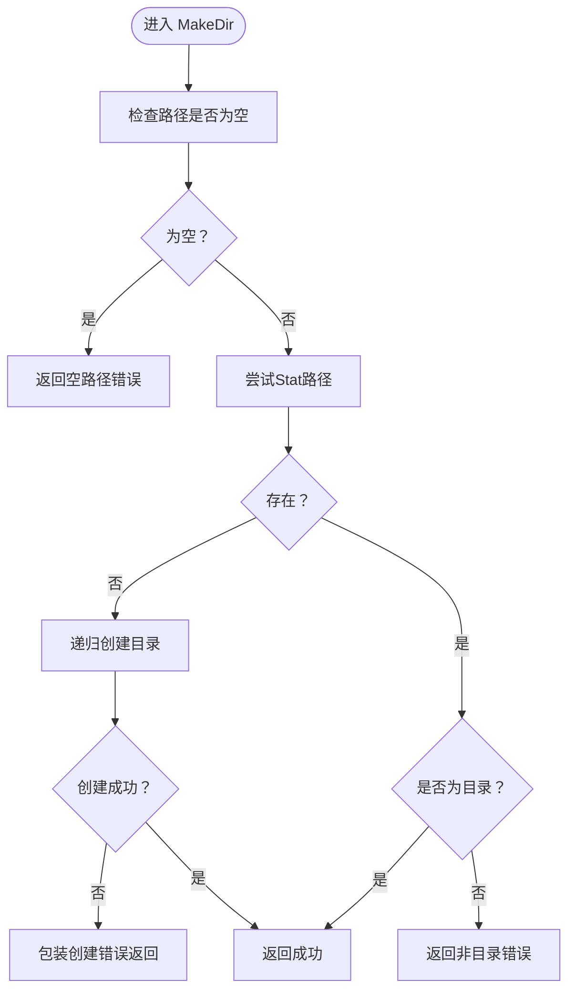
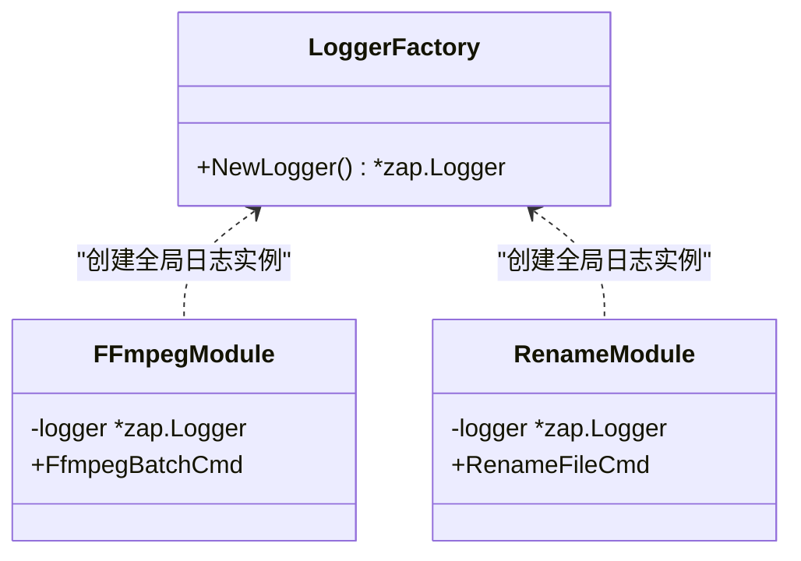
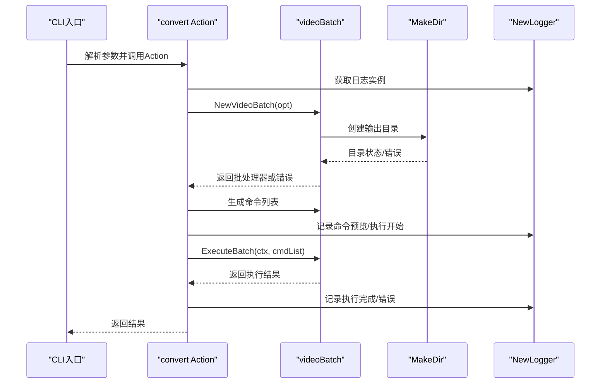
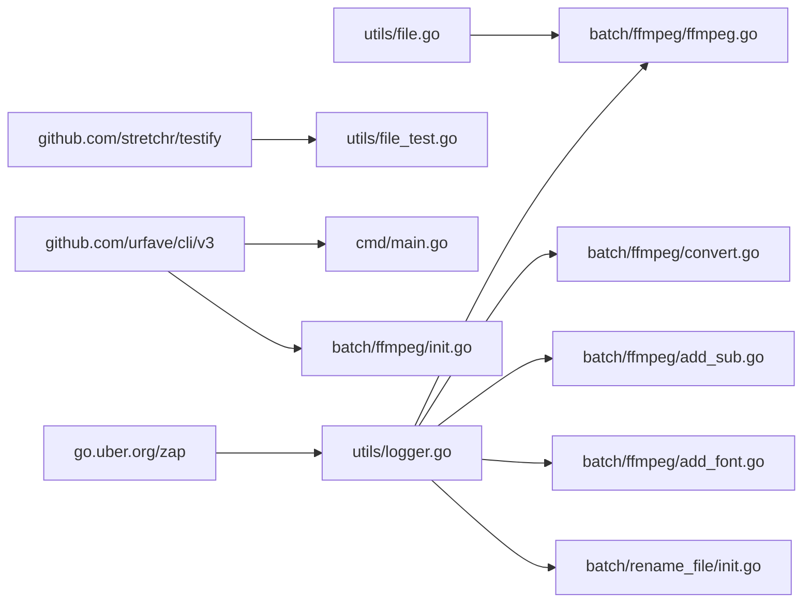

# 工具库和基础设施

<cite>
**本文引用的文件**
- [cmd/main.go](file://cmd/main.go)
- [utils/file.go](file://utils/file.go)
- [utils/file_test.go](file://utils/file_test.go)
- [utils/logger.go](file://utils/logger.go)
- [batch/ffmpeg/init.go](file://batch/ffmpeg/init.go)
- [batch/ffmpeg/ffmpeg.go](file://batch/ffmpeg/ffmpeg.go)
- [batch/ffmpeg/convert.go](file://batch/ffmpeg/convert.go)
- [batch/ffmpeg/add_sub.go](file://batch/ffmpeg/add_sub.go)
- [batch/ffmpeg/add_font.go](file://batch/ffmpeg/add_font.go)
- [batch/rename_file/init.go](file://batch/rename_file/init.go)
- [go.mod](file://go.mod)
- [docs/ffmpeg.md](file://docs/ffmpeg.md)
- [taskfile.yaml](file://taskfile.yaml)
</cite>

## 目录
1. [简介](#简介)
2. [项目结构](#项目结构)
3. [核心组件](#核心组件)
4. [架构总览](#架构总览)
5. [详细组件分析](#详细组件分析)
6. [依赖分析](#依赖分析)
7. [性能考虑](#性能考虑)
8. [故障排查指南](#故障排查指南)
9. [结论](#结论)
10. [附录](#附录)

## 简介
本章节介绍 batcher 项目的工具库与基础设施组件，重点覆盖以下方面：
- 文件操作工具：目录创建与路径处理能力，确保批处理任务所需的输出目录可用，并正确生成输出文件路径映射。
- 日志系统：基于 zap 的统一日志配置，包含时间格式、调用者信息、颜色编码等，支持在各功能模块中一致地记录调试、信息与错误信息。
- 基础设施对上层功能的支持：通过工具库提供的目录准备与日志能力，上层 ffmpeg 批处理模块能够稳定地扫描输入、生成命令、并发执行并输出结果；重命名模块也复用相同的日志能力。

## 项目结构
项目采用按功能域分层的组织方式：
- cmd：应用入口，注册 CLI 子命令，负责程序启动与错误输出。
- utils：通用工具库，提供文件操作与日志能力。
- batch：功能模块，当前包含 ffmpeg 批处理与文件重命名两个子模块。
- docs：文档，包含 ffmpeg 功能使用说明。
- go.mod：依赖声明与版本约束。
- taskfile.yaml：开发辅助任务，如测试数据准备与清理。

**图示来源**
- [cmd/main.go:13-28](file://cmd/main.go#L13-L28)
- [utils/file.go:8-31](file://utils/file.go#L8-L31)
- [utils/logger.go:11-28](file://utils/logger.go#L11-L28)
- [batch/ffmpeg/init.go:58-71](file://batch/ffmpeg/init.go#L58-L71)
- [batch/ffmpeg/ffmpeg.go:47-64](file://batch/ffmpeg/ffmpeg.go#L47-L64)
- [batch/ffmpeg/convert.go:25-62](file://batch/ffmpeg/convert.go#L25-L62)
- [batch/ffmpeg/add_sub.go:45-86](file://batch/ffmpeg/add_sub.go#L45-L86)
- [batch/ffmpeg/add_font.go:30-68](file://batch/ffmpeg/add_font.go#L30-L68)
- [batch/rename_file/init.go:22-34](file://batch/rename_file/init.go#L22-L34)
- [go.mod:1-17](file://go.mod#L1-L17)

**章节来源**
- [cmd/main.go:13-28](file://cmd/main.go#L13-L28)
- [go.mod:1-17](file://go.mod#L1-L17)

## 核心组件
- 文件工具（目录创建与路径处理）
  - 目录创建：确保指定输出目录存在，若不存在则递归创建；若路径已存在但不是目录则报错；空路径直接返回错误。
  - 路径处理：在生成输出文件映射时，对同名文件进行编号去重，保证输出文件名唯一性。
- 日志系统（zap）
  - 控制台编码器：字段键名、级别、时间、调用者、持续时间等格式可配置。
  - 时间编码：本地时间格式化，便于人类阅读。
  - 调用者编码：短调用者路径，便于定位日志来源。
  - 级别：默认 Debug 级别，便于开发期调试。
  - 全局日志实例：在 ffmpeg 与 rename_file 模块中以包级变量共享，保持日志风格一致。

**章节来源**
- [utils/file.go:8-31](file://utils/file.go#L8-L31)
- [batch/ffmpeg/ffmpeg.go:301-318](file://batch/ffmpeg/ffmpeg.go#L301-L318)
- [utils/logger.go:11-28](file://utils/logger.go#L11-L28)
- [batch/ffmpeg/init.go:58-59](file://batch/ffmpeg/init.go#L58-L59)
- [batch/rename_file/init.go:22-23](file://batch/rename_file/init.go#L22-L23)

## 架构总览
下图展示了 CLI 启动、工具库与功能模块之间的交互关系，以及日志与文件工具在流程中的作用点。

**图示来源**
- [cmd/main.go:13-28](file://cmd/main.go#L13-L28)
- [batch/ffmpeg/init.go:58-71](file://batch/ffmpeg/init.go#L58-L71)
- [batch/ffmpeg/ffmpeg.go:47-64](file://batch/ffmpeg/ffmpeg.go#L47-L64)
- [utils/file.go:8-31](file://utils/file.go#L8-L31)
- [utils/logger.go:11-28](file://utils/logger.go#L11-L28)

## 详细组件分析

### 文件工具：目录创建与路径处理
- 目录创建（MakeDir）
  - 输入校验：空路径直接报错。
  - 存在性检查：若路径存在且为目录则直接返回；若存在但非目录则报错。
  - 不存在：递归创建目录，失败时包装错误返回。
- 路径处理（filterOutput）
  - 输入视频列表映射到输出文件路径，自动处理重名文件，通过计数后缀保证唯一性。
  - 输出路径拼接：基于输出根目录与目标扩展名生成最终文件路径。

**图示来源**
- [utils/file.go:8-31](file://utils/file.go#L8-L31)

**章节来源**
- [utils/file.go:8-31](file://utils/file.go#L8-L31)
- [batch/ffmpeg/ffmpeg.go:301-318](file://batch/ffmpeg/ffmpeg.go#L301-L318)

### 日志系统：zap 配置与使用
- 配置要点
  - 编码器：控制台编码器，字段键名、级别、时间、调用者、持续时间等均可定制。
  - 时间编码：本地时间格式化，便于人类阅读。
  - 调用者编码：短调用者路径，便于定位来源。
  - 级别：Debug 级别，便于开发期调试。
  - 上下文：启用调用者信息与调用栈偏移。
- 使用方式
  - 包级日志实例：ffmpeg 与 rename_file 模块均在包初始化阶段创建全局日志实例，供 Action 中使用。
  - 日志内容：记录命令预览、执行开始/结束、错误信息等，便于追踪问题。

**图示来源**
- [utils/logger.go:11-28](file://utils/logger.go#L11-L28)
- [batch/ffmpeg/init.go:58-59](file://batch/ffmpeg/init.go#L58-L59)
- [batch/rename_file/init.go:22-23](file://batch/rename_file/init.go#L22-L23)

**章节来源**
- [utils/logger.go:11-28](file://utils/logger.go#L11-L28)
- [batch/ffmpeg/init.go:58-59](file://batch/ffmpeg/init.go#L58-L59)
- [batch/rename_file/init.go:22-23](file://batch/rename_file/init.go#L22-L23)

### 基础设施对上层功能的支持
- ffmpeg 批处理模块
  - 依赖文件工具：在创建视频批处理器时，先确保输出目录存在，失败即终止并返回错误。
  - 依赖日志工具：在 Action 中记录命令生成、执行开始/结束、错误等信息，便于用户与维护者理解执行过程。
  - 并发执行：根据 workers 参数选择串行或并发执行，支持 context 取消。
- 文件重命名模块
  - 复用日志工具：在 Action 中记录调试信息，便于验证参数与行为。

**图示来源**
- [batch/ffmpeg/convert.go:25-62](file://batch/ffmpeg/convert.go#L25-L62)
- [batch/ffmpeg/ffmpeg.go:47-64](file://batch/ffmpeg/ffmpeg.go#L47-L64)
- [utils/file.go:8-31](file://utils/file.go#L8-L31)
- [utils/logger.go:11-28](file://utils/logger.go#L11-L28)

**章节来源**
- [batch/ffmpeg/convert.go:25-62](file://batch/ffmpeg/convert.go#L25-L62)
- [batch/ffmpeg/add_sub.go:45-86](file://batch/ffmpeg/add_sub.go#L45-L86)
- [batch/ffmpeg/add_font.go:30-68](file://batch/ffmpeg/add_font.go#L30-L68)
- [batch/ffmpeg/ffmpeg.go:47-64](file://batch/ffmpeg/ffmpeg.go#L47-L64)

## 依赖分析
- 外部依赖
  - zap：高性能日志库，提供结构化日志与可配置编码器。
  - testify：单元测试断言库，用于测试文件工具与 ffmpeg 核心逻辑。
  - cli/v3：命令行框架，用于注册与解析子命令及参数。
- 内部依赖
  - utils/file.go 与 utils/logger.go 为 batch/ffmpeg 与 batch/rename_file 提供基础能力。
  - batch/ffmpeg/ffmpeg.go 依赖 utils/file.go 与 utils/logger.go，并通过 CLI 参数驱动。

**图示来源**
- [go.mod:5-9](file://go.mod#L5-L9)
- [utils/logger.go:3-9](file://utils/logger.go#L3-L9)
- [utils/file.go:3-6](file://utils/file.go#L3-L6)
- [batch/ffmpeg/ffmpeg.go:3-14](file://batch/ffmpeg/ffmpeg.go#L3-L14)
- [batch/ffmpeg/convert.go:3-9](file://batch/ffmpeg/convert.go#L3-L9)
- [batch/ffmpeg/add_sub.go:3-9](file://batch/ffmpeg/add_sub.go#L3-L9)
- [batch/ffmpeg/add_font.go:3-9](file://batch/ffmpeg/add_font.go#L3-L9)
- [batch/rename_file/init.go:3-8](file://batch/rename_file/init.go#L3-L8)
- [cmd/main.go:3-11](file://cmd/main.go#L3-L11)

**章节来源**
- [go.mod:1-17](file://go.mod#L1-L17)

## 性能考虑
- 目录创建
  - 仅在初始化阶段执行一次，成本极低；使用递归创建避免重复判断。
- 日志
  - 控制台编码器开销较小，Debug 级别适合开发期；生产部署可调整级别以减少开销。
- ffmpeg 执行
  - 并发执行通过信号量限制 worker 数量，避免资源争用；context 支持取消，提升交互体验。
  - 输出路径映射为内存操作，复杂度与输入文件数量线性相关，通常可忽略不计。

[本节为通用建议，无需特定文件来源]

## 故障排查指南
- 目录创建失败
  - 现象：输出目录无法创建或已存在但非目录。
  - 排查：确认路径非空；检查权限；查看返回的错误信息。
  - 参考实现：[utils/file.go:8-31](file://utils/file.go#L8-L31)
- ffmpeg 执行失败
  - 现象：命令执行返回错误。
  - 排查：查看 Action 中的日志记录；确认 ffmpeg 是否安装；核对输入/输出路径与格式；必要时启用 dry-run 预览命令。
  - 参考实现：[batch/ffmpeg/convert.go:25-62](file://batch/ffmpeg/convert.go#L25-L62)，[batch/ffmpeg/add_sub.go:45-86](file://batch/ffmpeg/add_sub.go#L45-L86)，[batch/ffmpeg/add_font.go:30-68](file://batch/ffmpeg/add_font.go#L30-L68)
- 日志未输出或格式异常
  - 现象：日志缺失或时间/调用者信息不显示。
  - 排查：确认使用包级日志实例；检查 zap 配置；确认级别设置为 Debug 或更低。
  - 参考实现：[utils/logger.go:11-28](file://utils/logger.go#L11-L28)，[batch/ffmpeg/init.go:58-59](file://batch/ffmpeg/init.go#L58-L59)，[batch/rename_file/init.go:22-23](file://batch/rename_file/init.go#L22-L23)
- 测试数据准备
  - 使用 Taskfile 在测试前生成 testdata 目录与示例文件，便于验证功能。
  - 参考实现：[taskfile.yaml:5-10](file://taskfile.yaml#L5-L10)

**章节来源**
- [utils/file.go:8-31](file://utils/file.go#L8-L31)
- [batch/ffmpeg/convert.go:25-62](file://batch/ffmpeg/convert.go#L25-L62)
- [batch/ffmpeg/add_sub.go:45-86](file://batch/ffmpeg/add_sub.go#L45-L86)
- [batch/ffmpeg/add_font.go:30-68](file://batch/ffmpeg/add_font.go#L30-L68)
- [utils/logger.go:11-28](file://utils/logger.go#L11-L28)
- [batch/ffmpeg/init.go:58-59](file://batch/ffmpeg/init.go#L58-L59)
- [batch/rename_file/init.go:22-23](file://batch/rename_file/init.go#L22-L23)
- [taskfile.yaml:5-10](file://taskfile.yaml#L5-L10)

## 结论
- 工具库提供了简洁可靠的文件操作与日志能力，为上层功能模块奠定稳定基础。
- ffmpeg 与 rename_file 模块通过复用工具库，实现了清晰的职责分离与一致的可观测性。
- 建议在生产环境适当调整日志级别与输出格式，在保证可观测性的前提下降低开销；同时为后续新增功能预留统一的日志与文件工具接口。

[本节为总结，无需特定文件来源]

## 附录
- 使用示例与最佳实践
  - 目录创建
    - 在创建批处理器前调用目录创建函数，确保输出目录存在；对空路径与非目录情况做好前置校验。
    - 参考实现：[utils/file.go:8-31](file://utils/file.go#L8-L31)
  - 日志使用
    - 在 Action 开始与结束记录关键事件；遇到错误时记录 zap.Error；必要时记录命令预览以便审计。
    - 参考实现：[batch/ffmpeg/convert.go:25-62](file://batch/ffmpeg/convert.go#L25-L62)，[batch/ffmpeg/add_sub.go:45-86](file://batch/ffmpeg/add_sub.go#L45-L86)，[batch/ffmpeg/add_font.go:30-68](file://batch/ffmpeg/add_font.go#L30-L68)
  - ffmpeg 执行
    - 合理设置 workers；在 dry-run 模式下预览命令；利用 context 支持取消；对输出路径映射进行单元测试验证。
    - 参考实现：[batch/ffmpeg/ffmpeg.go:218-286](file://batch/ffmpeg/ffmpeg.go#L218-L286)，[batch/ffmpeg/ffmpeg.go:301-318](file://batch/ffmpeg/ffmpeg.go#L301-L318)
  - 文档参考
    - ffmpeg 功能使用说明与示例命令。
    - 参考实现：[docs/ffmpeg.md:1-101](file://docs/ffmpeg.md#L1-L101)

**章节来源**
- [utils/file.go:8-31](file://utils/file.go#L8-L31)
- [batch/ffmpeg/convert.go:25-62](file://batch/ffmpeg/convert.go#L25-L62)
- [batch/ffmpeg/add_sub.go:45-86](file://batch/ffmpeg/add_sub.go#L45-L86)
- [batch/ffmpeg/add_font.go:30-68](file://batch/ffmpeg/add_font.go#L30-L68)
- [batch/ffmpeg/ffmpeg.go:218-286](file://batch/ffmpeg/ffmpeg.go#L218-L286)
- [batch/ffmpeg/ffmpeg.go:301-318](file://batch/ffmpeg/ffmpeg.go#L301-L318)
- [docs/ffmpeg.md:1-101](file://docs/ffmpeg.md#L1-L101)