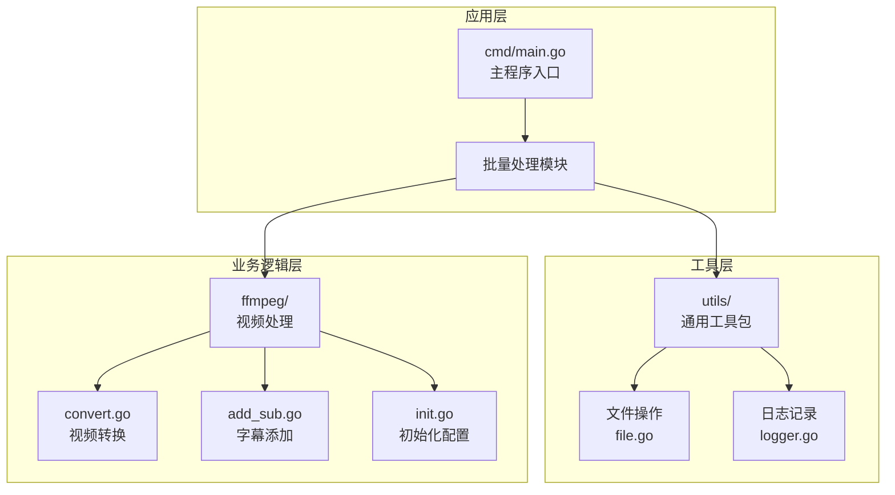
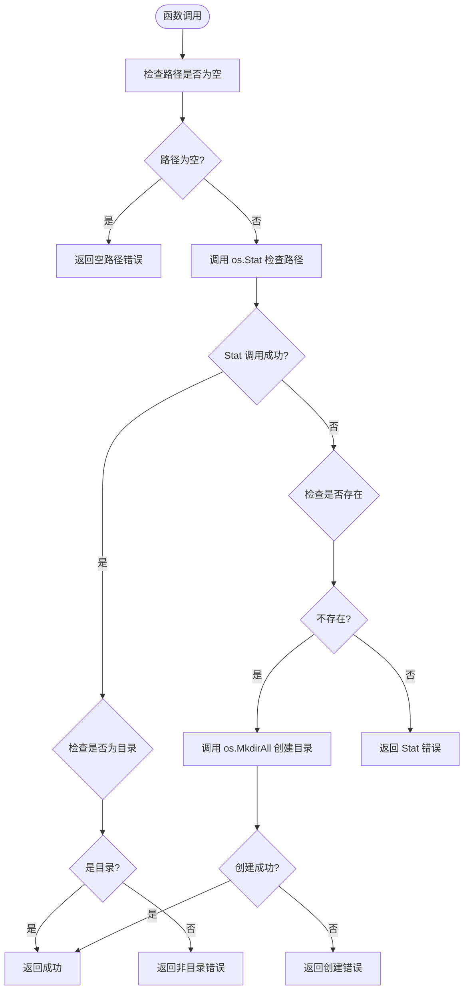
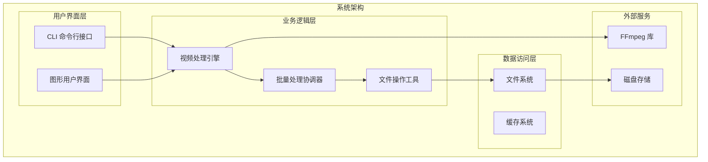
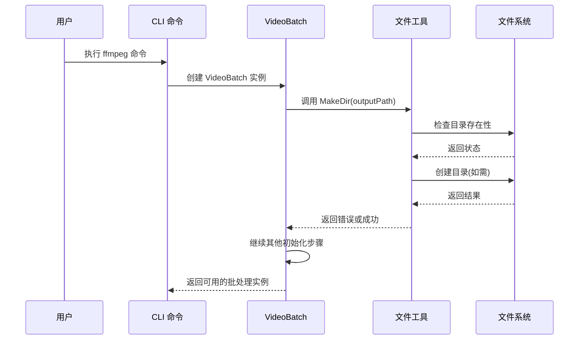
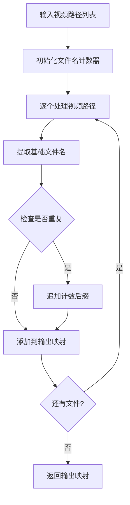
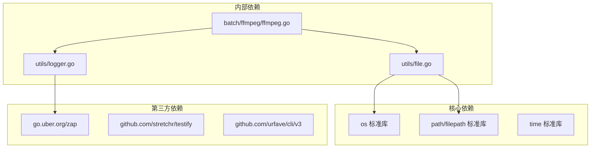

# 文件操作工具

<cite>
**本文档引用的文件**
- [utils/file.go](file://utils/file.go)
- [utils/file_test.go](file://utils/file_test.go)
- [utils/logger.go](file://utils/logger.go)
- [batch/ffmpeg/ffmpeg.go](file://batch/ffmpeg/ffmpeg.go)
- [batch/ffmpeg/convert.go](file://batch/ffmpeg/convert.go)
- [batch/ffmpeg/add_sub.go](file://batch/ffmpeg/add_sub.go)
- [batch/ffmpeg/init.go](file://batch/ffmpeg/init.go)
- [batch/ffmpeg/ffmpeg_test.go](file://batch/ffmpeg/ffmpeg_test.go)
- [cmd/main.go](file://cmd/main.go)
- [go.mod](file://go.mod)
</cite>

## 目录
1. [简介](#简介)
2. [项目结构](#项目结构)
3. [核心组件](#核心组件)
4. [架构概览](#架构概览)
5. [详细组件分析](#详细组件分析)
6. [依赖关系分析](#依赖关系分析)
7. [性能考虑](#性能考虑)
8. [故障排除指南](#故障排除指南)
9. [结论](#结论)

## 简介

文件操作工具是批量处理工具集中的核心基础设施组件，主要负责文件系统操作，特别是目录创建功能。该工具集提供了高效、可靠的文件系统操作能力，支持视频转换和字幕处理等批量处理任务。

本工具集采用模块化设计，通过清晰的接口定义和完善的错误处理机制，确保在复杂的批量处理场景中能够稳定运行。工具集的核心功能包括：

- 目录创建和管理
- 路径验证和检查
- 递归目录创建
- 错误处理和日志记录
- 与视频处理流程的无缝集成

## 项目结构

项目采用分层架构设计，将不同功能模块清晰分离：

**图表来源**
- [cmd/main.go:13-28](file://cmd/main.go#L13-L28)
- [utils/file.go:8-31](file://utils/file.go#L8-L31)
- [batch/ffmpeg/ffmpeg.go:47-64](file://batch/ffmpeg/ffmpeg.go#L47-L64)

**章节来源**
- [cmd/main.go:1-29](file://cmd/main.go#L1-L29)
- [go.mod:1-17](file://go.mod#L1-L17)

## 核心组件

### MakeDir 函数详解

MakeDir 是文件操作工具的核心函数，负责创建目录并处理各种边界情况。该函数实现了完整的目录创建逻辑，包括路径验证、存在性检查和错误处理。

#### 函数签名和基本结构

**图表来源**
- [utils/file.go:9-31](file://utils/file.go#L9-L31)

#### 关键特性分析

1. **路径验证**: 函数首先检查输入路径是否为空，防止无效操作
2. **存在性检查**: 使用 `os.Stat` 确认路径状态
3. **类型验证**: 确保目标路径是目录而非文件
4. **递归创建**: 使用 `os.MkdirAll` 支持多级目录创建
5. **权限设置**: 使用 `os.ModePerm` 设置完整权限
6. **错误处理**: 提供详细的错误信息和上下文

**章节来源**
- [utils/file.go:8-31](file://utils/file.go#L8-L31)

### 日志记录系统

工具集使用 Zap 日志库提供结构化日志记录功能，支持彩色输出和调用者信息追踪。

#### 日志配置特点

- **结构化编码**: 使用 ConsoleEncoder 提供人类可读的日志格式
- **时间戳格式**: 自定义时间格式显示本地时间
- **调用者追踪**: 启用调用者信息显示，便于调试
- **级别控制**: 支持 Debug 级别及以上的日志输出

**章节来源**
- [utils/logger.go:11-28](file://utils/logger.go#L11-L28)

## 架构概览

文件操作工具在整个系统架构中扮演着基础设施的角色，为上层的视频处理功能提供可靠的基础服务。

**图表来源**
- [batch/ffmpeg/ffmpeg.go:47-64](file://batch/ffmpeg/ffmpeg.go#L47-L64)
- [batch/ffmpeg/init.go:58-71](file://batch/ffmpeg/init.go#L58-L71)

## 详细组件分析

### 视频批处理系统集成

视频批处理系统深度集成了文件操作工具，特别是在目录管理和输出路径处理方面。

#### 目录创建集成点

**图表来源**
- [batch/ffmpeg/ffmpeg.go:51-53](file://batch/ffmpeg/ffmpeg.go#L51-L53)
- [utils/file.go:9-31](file://utils/file.go#L9-L31)

#### 输出路径处理机制

视频批处理系统使用 `filterOutput` 方法处理输出文件路径，避免文件名冲突：

**图表来源**
- [batch/ffmpeg/ffmpeg.go:302-318](file://batch/ffmpeg/ffmpeg.go#L302-L318)

**章节来源**
- [batch/ffmpeg/ffmpeg.go:47-64](file://batch/ffmpeg/ffmpeg.go#L47-L64)
- [batch/ffmpeg/ffmpeg.go:301-318](file://batch/ffmpeg/ffmpeg.go#L301-L318)

### 测试框架和最佳实践

工具集提供了完整的测试覆盖，确保功能的可靠性和稳定性。

#### 测试策略

1. **单元测试**: 针对 MakeDir 函数的各种场景进行测试
2. **集成测试**: 验证与视频处理系统的协同工作
3. **边界测试**: 检查空路径、重复文件名等边界情况
4. **错误测试**: 验证错误处理机制的有效性

**章节来源**
- [utils/file_test.go:10-53](file://utils/file_test.go#L10-L53)
- [batch/ffmpeg/ffmpeg_test.go:23-46](file://batch/ffmpeg/ffmpeg_test.go#L23-L46)

## 依赖关系分析

文件操作工具的依赖关系相对简单，主要依赖标准库和第三方日志库。

**图表来源**
- [utils/file.go:3-6](file://utils/file.go#L3-L6)
- [utils/logger.go:3-8](file://utils/logger.go#L3-L8)
- [batch/ffmpeg/ffmpeg.go:3-14](file://batch/ffmpeg/ffmpeg.go#L3-L14)

**章节来源**
- [go.mod:5-9](file://go.mod#L5-L9)
- [utils/file.go:3-6](file://utils/file.go#L3-L6)

## 性能考虑

### 目录创建性能优化

MakeDir 函数在设计时充分考虑了性能因素：

1. **最小化系统调用**: 通过一次 `os.Stat` 调用同时完成存在性检查和类型验证
2. **早返回机制**: 在检测到路径为空或目录已存在时立即返回
3. **权限设置优化**: 使用 `os.ModePerm` 一次性设置完整权限
4. **错误处理优化**: 提供详细的错误信息但避免不必要的额外检查

### 批量处理性能

视频批处理系统采用了多种性能优化策略：

1. **并发控制**: 使用信号量控制最大并发数，避免资源耗尽
2. **内存优化**: 采用流式处理减少内存占用
3. **I/O 优化**: 合理安排文件操作顺序，减少磁盘寻道
4. **错误快速传播**: 并发模式下快速传播第一个错误

**章节来源**
- [batch/ffmpeg/ffmpeg.go:248-286](file://batch/ffmpeg/ffmpeg.go#L248-L286)

## 故障排除指南

### 常见问题和解决方案

#### 目录创建失败

**问题症状**: MakeDir 返回错误，提示无法创建目录

**可能原因**:
1. 权限不足
2. 路径包含非法字符
3. 磁盘空间不足
4. 父目录不可写

**解决方法**:
1. 检查目标路径的父目录权限
2. 验证路径格式是否正确
3. 确认磁盘空间充足
4. 使用管理员权限运行程序

#### 路径验证错误

**问题症状**: MakeDir 返回"路径为空"或"路径存在但不是目录"

**解决方法**:
1. 确保传入的路径不为空
2. 检查目标路径是否已被文件占用
3. 使用绝对路径而非相对路径

#### 并发执行问题

**问题症状**: 批处理过程中出现文件冲突或资源竞争

**解决方法**:
1. 减少并发数或设置合适的 Workers 参数
2. 确保输出目录具有适当的权限
3. 检查是否有其他进程同时访问相同文件

**章节来源**
- [utils/file_test.go:10-53](file://utils/file_test.go#L10-L53)
- [batch/ffmpeg/ffmpeg_test.go:329-356](file://batch/ffmpeg/ffmpeg_test.go#L329-L356)

## 结论

文件操作工具作为批量处理系统的核心基础设施，展现了优秀的工程实践：

1. **简洁而强大的设计**: MakeDir 函数以最少的代码实现了完整的目录管理功能
2. **完善的错误处理**: 提供详细的错误信息和上下文，便于调试和问题定位
3. **良好的集成性**: 与视频处理系统无缝集成，支持复杂的批量处理场景
4. **可测试性**: 完整的测试覆盖确保了功能的可靠性
5. **性能优化**: 在保证功能完整性的同时，充分考虑了性能因素

该工具集为视频转换和字幕处理等批量处理任务提供了坚实的基础，其设计原则和实现模式可以作为其他文件操作场景的参考模板。