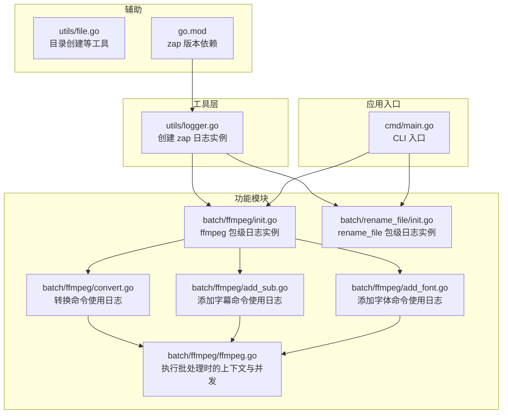
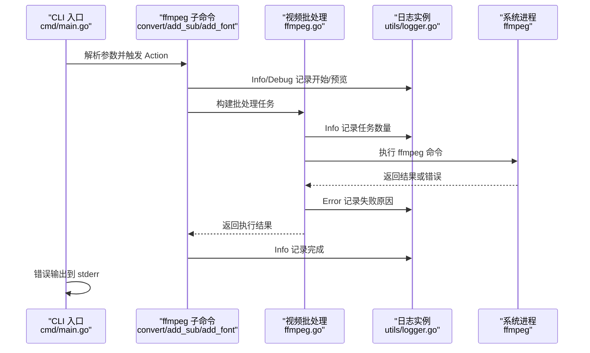
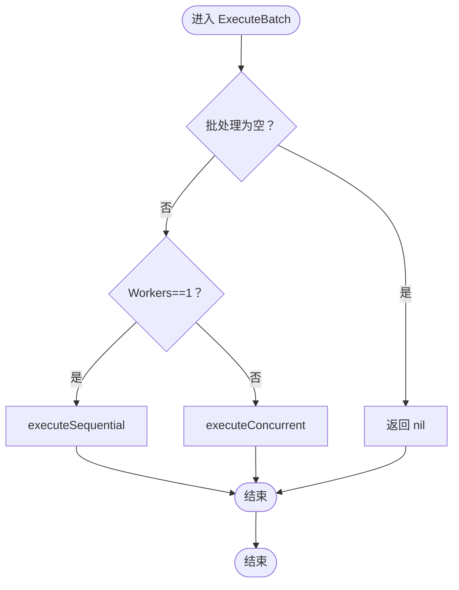
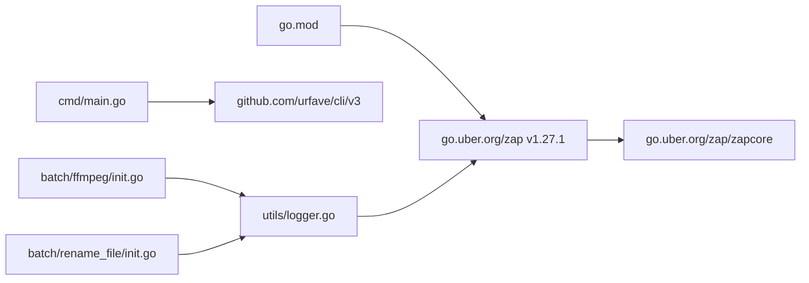

# 日志系统

<cite>
**本文引用的文件**
- [logger.go](file://utils/logger.go)
- [main.go](file://cmd/main.go)
- [init.go](file://batch/ffmpeg/init.go)
- [convert.go](file://batch/ffmpeg/convert.go)
- [add_sub.go](file://batch/ffmpeg/add_sub.go)
- [add_font.go](file://batch/ffmpeg/add_font.go)
- [ffmpeg.go](file://batch/ffmpeg/ffmpeg.go)
- [init.go](file://batch/rename_file/init.go)
- [file.go](file://utils/file.go)
- [ffmpeg_test.go](file://batch/ffmpeg/ffmpeg_test.go)
- [go.mod](file://go.mod)
</cite>

## 目录
1. [简介](#简介)
2. [项目结构](#项目结构)
3. [核心组件](#核心组件)
4. [架构总览](#架构总览)
5. [详细组件分析](#详细组件分析)
6. [依赖分析](#依赖分析)
7. [性能考虑](#性能考虑)
8. [故障排除指南](#故障排除指南)
9. [结论](#结论)
10. [附录](#附录)

## 简介
本文件为该仓库的日志系统综合文档，聚焦于基于 zap 的日志集成与配置、日志级别与使用场景、日志格式化与输出策略、并发环境下的日志记录实践、视频批处理过程中的日志调试与监控方法，以及性能优化与故障排除建议。文档以实际代码为依据，避免臆造信息，并通过图示帮助不同技术背景的读者快速理解与应用。

## 项目结构
日志系统主要由以下部分组成：
- 工具层：统一的日志工厂函数，负责创建 zap 日志实例并配置编码器与输出级别。
- 应用入口：CLI 主程序，负责组织命令与错误输出。
- 功能模块：视频批处理模块与文件重命名模块，均在包级共享同一日志实例。
- 测试与工具：测试中对日志行为有间接验证，工具函数提供基础能力支撑。

图表来源
- [logger.go:11-28](file://utils/logger.go#L11-L28)
- [main.go:13-28](file://cmd/main.go#L13-L28)
- [init.go:58-59](file://batch/ffmpeg/init.go#L58-L59)
- [convert.go:37-59](file://batch/ffmpeg/convert.go#L37-L59)
- [add_sub.go:61-83](file://batch/ffmpeg/add_sub.go#L61-L83)
- [add_font.go:42-64](file://batch/ffmpeg/add_font.go#L42-L64)
- [ffmpeg.go:218-286](file://batch/ffmpeg/ffmpeg.go#L218-L286)
- [init.go:22-23](file://batch/rename_file/init.go#L22-L23)
- [file.go:8-31](file://utils/file.go#L8-L31)
- [go.mod:5-8](file://go.mod#L5-L8)

章节来源
- [logger.go:11-28](file://utils/logger.go#L11-L28)
- [main.go:13-28](file://cmd/main.go#L13-L28)
- [init.go:58-59](file://batch/ffmpeg/init.go#L58-L59)
- [init.go:22-23](file://batch/rename_file/init.go#L22-L23)
- [go.mod:5-8](file://go.mod#L5-L8)

## 核心组件
- 日志工厂：在工具层提供统一的日志实例创建函数，采用控制台编码器，启用调用者信息与跳过层级，时间、级别、调用者、耗时等字段键名可读性强。
- 包级日志实例：ffmpeg 与 rename_file 模块在包级持有共享日志实例，便于各命令 Action 中直接使用。
- CLI 错误输出：主程序在命令执行失败时使用标准错误输出，避免直接抛出异常导致非结构化错误信息。
- 视频批处理日志：在创建批处理器、生成命令、执行批处理、干跑预览等关键节点记录日志，便于调试与监控。
- 文件重命名日志：在 Action 中记录执行状态，体现日志在不同子命令中的使用方式。

章节来源
- [logger.go:11-28](file://utils/logger.go#L11-L28)
- [init.go:58-59](file://batch/ffmpeg/init.go#L58-L59)
- [init.go:22-23](file://batch/rename_file/init.go#L22-L23)
- [convert.go:37-59](file://batch/ffmpeg/convert.go#L37-L59)
- [add_sub.go:61-83](file://batch/ffmpeg/add_sub.go#L61-L83)
- [add_font.go:42-64](file://batch/ffmpeg/add_font.go#L42-L64)
- [main.go:23-27](file://cmd/main.go#L23-L27)

## 架构总览
下图展示了日志在系统中的流向与调用关系：CLI 入口 -> 子命令 -> 批处理逻辑 -> ffmpeg 进程执行；日志贯穿每个环节，用于记录状态、错误与性能指标。

图表来源
- [main.go:13-28](file://cmd/main.go#L13-L28)
- [convert.go:25-62](file://batch/ffmpeg/convert.go#L25-L62)
- [add_sub.go:45-86](file://batch/ffmpeg/add_sub.go#L45-L86)
- [add_font.go:30-67](file://batch/ffmpeg/add_font.go#L30-L67)
- [ffmpeg.go:218-299](file://batch/ffmpeg/ffmpeg.go#L218-L299)
- [logger.go:11-28](file://utils/logger.go#L11-L28)

## 详细组件分析

### 日志工厂与配置
- 编码器：控制台编码器，字段键名包括消息、级别、时间、调用者等，便于人类阅读与结构化检索。
- 时间编码：本地时间格式化，时间键值包含方括号，增强可读性。
- 调用者编码：短路径调用者信息，便于定位日志来源。
- 耗时编码：毫秒级显示，便于性能观察。
- 级别：默认 Debug 级别，适合开发与调试阶段。
- 上下文：启用调用者信息与调用者跳过层级，便于在多层封装中定位真实调用点。

章节来源
- [logger.go:11-28](file://utils/logger.go#L11-L28)

### ffmpeg 包级日志实例
- 在包初始化时创建共享日志实例，供所有子命令使用，确保日志风格一致。
- 通过包级变量持有，避免在每个 Action 中重复创建实例，降低开销。

章节来源
- [init.go:58-59](file://batch/ffmpeg/init.go#L58-L59)

### 文件重命名模块日志
- 同样在包级创建日志实例，Action 中记录执行状态，体现日志在不同子命令中的统一使用方式。

章节来源
- [init.go:22-23](file://batch/rename_file/init.go#L22-L23)

### 视频批处理命令中的日志使用
- 创建批处理器失败：记录错误并返回包装后的错误，便于上层处理。
- 获取命令失败：记录错误并返回包装后的错误。
- 干跑预览：逐条记录即将执行的命令，便于核对参数。
- 开始执行与完成：记录任务总数与完成状态，便于监控进度。
- 执行失败：记录错误并返回包装后的错误，保留原始错误链路。

章节来源
- [convert.go:37-59](file://batch/ffmpeg/convert.go#L37-L59)
- [add_sub.go:61-83](file://batch/ffmpeg/add_sub.go#L61-L83)
- [add_font.go:42-64](file://batch/ffmpeg/add_font.go#L42-L64)

### 执行批处理与并发中的日志
- 单线程模式：顺序执行，每条命令前检查上下文取消，失败即返回。
- 并发模式：使用信号量控制并发度，WaitGroup 等待全部完成，首次错误一次性记录并返回。
- 进程执行：直接将 ffmpeg 标准输出与标准错误传递给系统进程，日志由外部工具输出；内部通过 zap 记录状态与错误。

图表来源
- [ffmpeg.go:218-231](file://batch/ffmpeg/ffmpeg.go#L218-L231)

章节来源
- [ffmpeg.go:218-286](file://batch/ffmpeg/ffmpeg.go#L218-L286)

### 日志级别与使用场景
- Debug：用于开发调试，记录详细流程与中间状态，如命令预览、内部状态变化。
- Info：用于记录关键事件与进度，如开始执行、任务数量、完成状态。
- Warn：当前代码未显式使用，但可扩展用于警告信息（例如参数不合法但可继续处理的情况）。
- Error：用于记录错误与失败，保留原始错误链路，便于定位问题。

章节来源
- [convert.go:37-59](file://batch/ffmpeg/convert.go#L37-L59)
- [add_sub.go:61-83](file://batch/ffmpeg/add_sub.go#L61-L83)
- [add_font.go:42-64](file://batch/ffmpeg/add_font.go#L42-L64)

### 日志格式化与输出配置
- 控制台编码器：字段键名清晰，时间与调用者格式化，便于人类阅读。
- 结构化字段：在错误记录时使用 zap.Error(err) 保持错误链路，便于后续解析与检索。
- 输出目标：控制台输出，结合外部工具（ffmpeg）的标准输出/错误，形成完整的日志链路。

章节来源
- [logger.go:11-28](file://utils/logger.go#L11-L28)
- [convert.go:37-59](file://batch/ffmpeg/convert.go#L37-L59)
- [add_sub.go:61-83](file://batch/ffmpeg/add_sub.go#L61-L83)
- [add_font.go:42-64](file://batch/ffmpeg/add_font.go#L42-L64)

### 并发处理中的日志记录策略
- 包级共享日志实例：避免重复创建实例，减少资源消耗。
- 并发安全：zap 内置并发安全，可在 goroutine 中安全调用。
- 错误聚合：并发执行中首次错误一次性记录，避免重复日志与噪声。
- 上下文取消：在循环与 goroutine 中定期检查上下文取消，及时退出并记录状态。

章节来源
- [ffmpeg.go:248-286](file://batch/ffmpeg/ffmpeg.go#L248-L286)

### 视频批处理过程中的日志调试与监控
- 预览阶段：在干跑模式下逐条记录即将执行的命令，便于核对参数与预期行为。
- 执行阶段：记录任务总数与执行状态，便于监控进度与规模。
- 失败阶段：记录错误并返回包装后的错误，保留原始错误链路，便于定位问题。

章节来源
- [convert.go:47-59](file://batch/ffmpeg/convert.go#L47-L59)
- [add_sub.go:71-83](file://batch/ffmpeg/add_sub.go#L71-L83)
- [add_font.go:52-64](file://batch/ffmpeg/add_font.go#L52-L64)

## 依赖分析
- zap 版本：在模块依赖中声明了 zap v1.27.1，确保日志库版本稳定。
- zapcore：用于构建编码器与核心组件，支持控制台编码与字段定制。
- CLI：命令行框架，负责参数解析与子命令调度，与日志配合实现友好的用户反馈。

图表来源
- [go.mod:5-8](file://go.mod#L5-L8)
- [logger.go:3-8](file://utils/logger.go#L3-L8)
- [main.go:3-10](file://cmd/main.go#L3-L10)
- [init.go:3-4](file://batch/ffmpeg/init.go#L3-L4)
- [init.go:3-6](file://batch/rename_file/init.go#L3-L6)

章节来源
- [go.mod:5-8](file://go.mod#L5-L8)
- [logger.go:3-8](file://utils/logger.go#L3-L8)
- [main.go:3-10](file://cmd/main.go#L3-L10)
- [init.go:3-4](file://batch/ffmpeg/init.go#L3-L4)
- [init.go:3-6](file://batch/rename_file/init.go#L3-L6)

## 性能考虑
- 日志级别：在生产环境中可将默认级别提升至 Info 或更高，减少 Debug 级别的输出量。
- 编码器选择：控制台编码器便于人类阅读，但在高吞吐场景可考虑 JSON 编码器以便机器解析与收集。
- 调用者信息：启用调用者信息会增加少量开销，若对性能敏感可按需关闭。
- 并发控制：通过 Workers 参数控制并发度，避免过度并发导致系统资源紧张。
- 错误链路：使用 zap.Error(err) 保留原始错误，有助于快速定位问题，减少重复排查成本。

## 故障排除指南
- 日志未输出或输出异常
  - 检查日志工厂是否正确创建，确认编码器配置与级别设置。
  - 确认调用者信息启用与跳过层级设置是否合理。
- 错误信息不可读
  - 使用结构化字段记录错误，结合 zap.Error(err) 保留原始错误链路。
- 并发执行卡住或崩溃
  - 检查上下文取消逻辑，确保在循环与 goroutine 中定期检查。
  - 使用 WaitGroup 等待全部完成，避免提前退出导致资源泄漏。
- 干跑模式无法预览命令
  - 确认干跑标志位设置，检查命令拼接与格式化函数。
- 目录创建失败
  - 使用工具函数创建输出目录，确保路径有效且权限充足。

章节来源
- [logger.go:11-28](file://utils/logger.go#L11-L28)
- [ffmpeg.go:218-286](file://batch/ffmpeg/ffmpeg.go#L218-L286)
- [convert.go:47-59](file://batch/ffmpeg/convert.go#L47-L59)
- [file.go:8-31](file://utils/file.go#L8-L31)

## 结论
该日志系统以 zap 为核心，提供了统一、可读、可扩展的日志能力。通过包级共享日志实例与结构化字段记录，结合 CLI 与批处理流程，实现了从开发调试到生产监控的完整覆盖。建议在生产环境中根据需求调整日志级别与编码器，并持续关注并发与错误处理策略，以获得更优的性能与可观测性。

## 附录
- 最佳实践清单
  - 在关键节点记录 Info/Debug/Warning/Error，保持一致性。
  - 使用结构化字段记录关键参数与状态，便于检索与分析。
  - 在并发场景中注意上下文取消与错误聚合，避免重复日志。
  - 在干跑模式下记录即将执行的命令，便于核对与审计。
  - 定期评估日志级别与编码器，平衡可读性与性能。