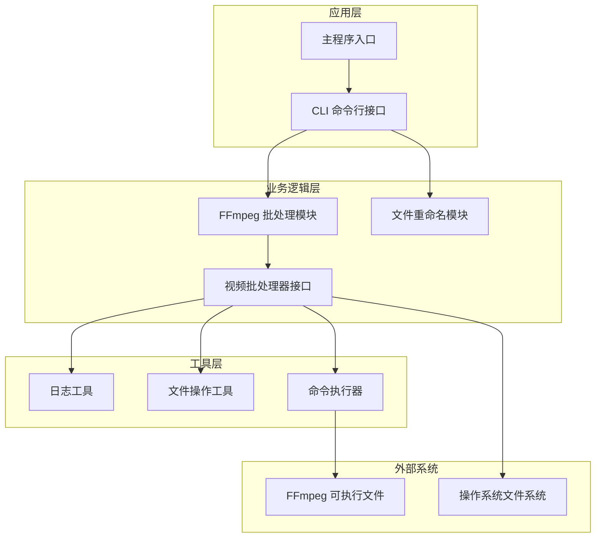
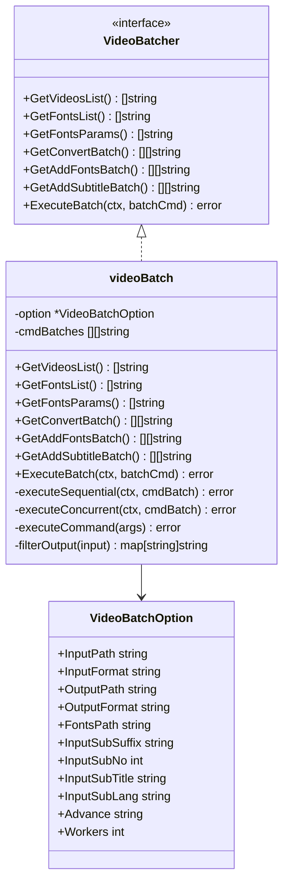
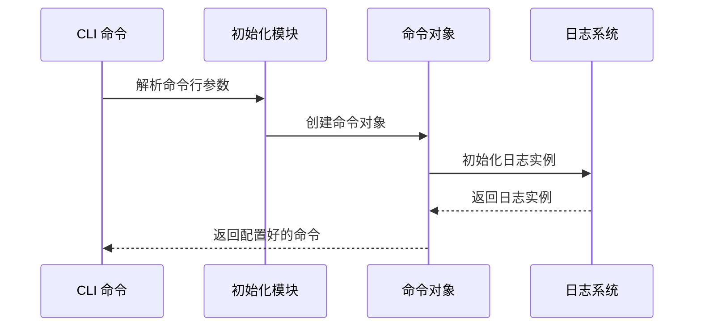
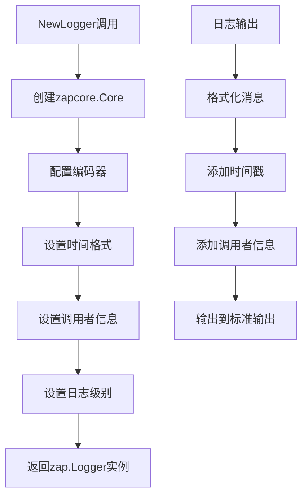
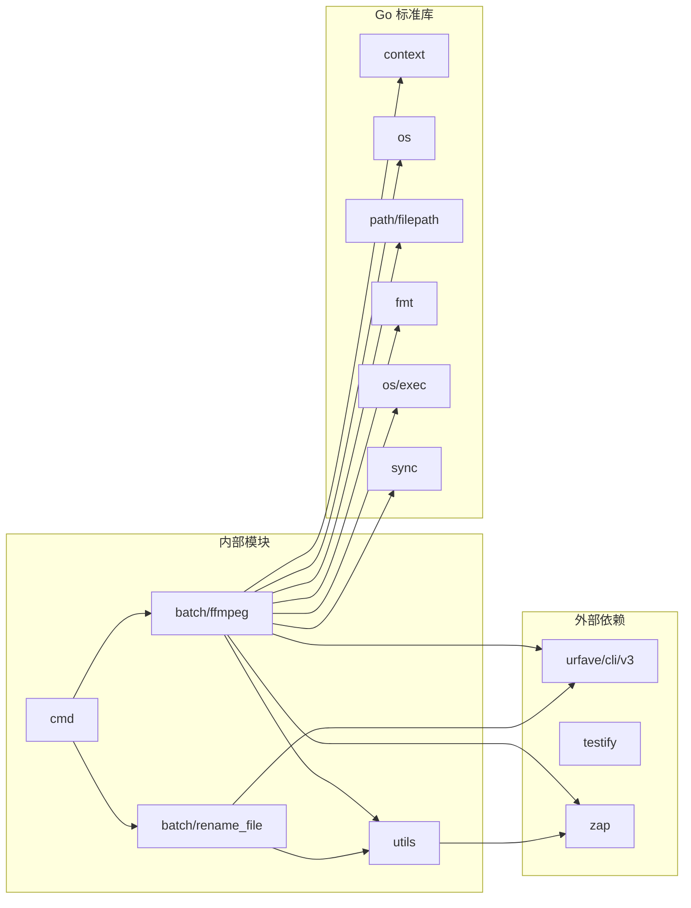
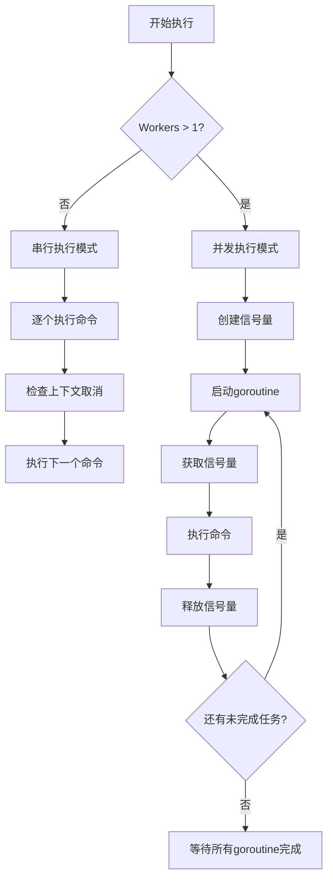

# 开发环境搭建

<cite>
**本文档引用的文件**
- [taskfile.yaml](file://taskfile.yaml)
- [go.mod](file://go.mod)
- [cmd/main.go](file://cmd/main.go)
- [docs/ffmpeg.md](file://docs/ffmpeg.md)
- [.goreleaser.yaml](file://.goreleaser.yaml)
- [batch/ffmpeg/init.go](file://batch/ffmpeg/init.go)
- [batch/ffmpeg/ffmpeg.go](file://batch/ffmpeg/ffmpeg.go)
- [utils/logger.go](file://utils/logger.go)
- [utils/file.go](file://utils/file.go)
- [batch/ffmpeg/ffmpeg_test.go](file://batch/ffmpeg/ffmpeg_test.go)
- [utils/file_test.go](file://utils/file_test.go)
- [batch/rename_file/init.go](file://batch/rename_file/init.go)
- [.gitignore](file://.gitignore)
</cite>

## 目录
1. [简介](#简介)
2. [项目结构](#项目结构)
3. [核心组件](#核心组件)
4. [架构概览](#架构概览)
5. [详细组件分析](#详细组件分析)
6. [依赖关系分析](#依赖关系分析)
7. [性能考虑](#性能考虑)
8. [故障排除指南](#故障排除指南)
9. [结论](#结论)
10. [附录](#附录)

## 简介

batcher 是一个基于 Go 语言开发的命令行工具，专门用于批量处理视频文件。该项目提供了两个主要功能模块：FFmpeg 视频批处理工具和文件重命名工具。通过 CLI 接口，用户可以轻松地进行视频格式转换、字幕添加、字体添加等批量操作。

该项目采用模块化的架构设计，使用 urfave/cli/v3 进行命令行解析，使用 zap 日志库进行日志记录，并通过 Taskfile 提供便捷的任务管理功能。

## 项目结构

batcher 项目采用清晰的分层架构，主要包含以下核心目录：

```mermaid
graph TB
subgraph "项目根目录"
A[cmd/] -- 主程序入口
B[batch/] -- 功能模块
C[utils/] -- 工具库
D[docs/] -- 文档
end
subgraph "batch/"
E[ffmpeg/] -- FFmpeg 批处理模块
F[rename_file/] -- 文件重命名模块
end
subgraph "batch/ffmpeg/"
G[init.go] -- 初始化配置
H[ffmpeg.go] -- 核心实现
I[ffmpeg_test.go] -- 测试用例
end
subgraph "utils/"
J[logger.go] -- 日志工具
K[file.go] -- 文件操作工具
L[file_test.go] -- 文件工具测试
end
subgraph "其他配置文件"
M[taskfile.yaml] -- 任务管理
N[go.mod] -- Go 模块配置
O[.goreleaser.yaml] -- 发布配置
P[docs/ffmpeg.md] -- FFmpeg 文档
end
```

**图表来源**
- [taskfile.yaml:1-16](file://taskfile.yaml#L1-L16)
- [go.mod:1-17](file://go.mod#L1-L17)
- [cmd/main.go:1-29](file://cmd/main.go#L1-L29)

**章节来源**
- [taskfile.yaml:1-16](file://taskfile.yaml#L1-L16)
- [go.mod:1-17](file://go.mod#L1-L17)
- [cmd/main.go:1-29](file://cmd/main.go#L1-L29)

## 核心组件

### Go 语言版本要求

项目明确要求使用 Go 1.22.2 或更高版本。这是通过 go.mod 文件中的 go 1.22.2 指令指定的。

**章节来源**
- [go.mod:3](file://go.mod#L3)

### 依赖管理

项目使用 Go modules 进行依赖管理，主要依赖包括：
- urfave/cli/v3：命令行界面框架
- testify：测试断言库
- zap：高性能日志库

**章节来源**
- [go.mod:5-9](file://go.mod#L5-L9)

### 架构设计原则

项目采用模块化设计，每个功能模块都是独立的包，具有清晰的职责分离：
- batch/ffmpeg：FFmpeg 批处理功能
- batch/rename_file：文件重命名功能  
- utils：通用工具函数
- cmd：应用程序入口点

## 架构概览



**图表来源**
- [cmd/main.go:13-28](file://cmd/main.go#L13-L28)
- [batch/ffmpeg/ffmpeg.go:30-38](file://batch/ffmpeg/ffmpeg.go#L30-L38)
- [utils/logger.go:11-28](file://utils/logger.go#L11-L28)

## 详细组件分析

### FFmpeg 批处理模块

#### 核心接口设计



**图表来源**
- [batch/ffmpeg/ffmpeg.go:30-64](file://batch/ffmpeg/ffmpeg.go#L30-L64)
- [batch/ffmpeg/ffmpeg.go:16-28](file://batch/ffmpeg/ffmpeg.go#L16-L28)

#### 命令行参数配置



**图表来源**
- [batch/ffmpeg/init.go:8-71](file://batch/ffmpeg/init.go#L8-L71)
- [batch/ffmpeg/init.go:58-59](file://batch/ffmpeg/init.go#L58-L59)

**章节来源**
- [batch/ffmpeg/ffmpeg.go:30-64](file://batch/ffmpeg/ffmpeg.go#L30-L64)
- [batch/ffmpeg/init.go:8-71](file://batch/ffmpeg/init.go#L8-L71)

### 文件重命名模块

该模块提供了简单的文件重命名功能，支持基于 MD5 哈希的文件名生成。

**章节来源**
- [batch/rename_file/init.go:25-34](file://batch/rename_file/init.go#L25-L34)

### 工具库模块

#### 日志系统



**图表来源**
- [utils/logger.go:11-28](file://utils/logger.go#L11-L28)

**章节来源**
- [utils/logger.go:11-28](file://utils/logger.go#L11-L28)

#### 文件操作工具

文件操作工具提供了目录创建功能，确保输出目录的存在性。

**章节来源**
- [utils/file.go:8-31](file://utils/file.go#L8-L31)

## 依赖关系分析



**图表来源**
- [go.mod:5-9](file://go.mod#L5-L9)
- [cmd/main.go:3-10](file://cmd/main.go#L3-L10)
- [batch/ffmpeg/ffmpeg.go:3-14](file://batch/ffmpeg/ffmpeg.go#L3-L14)

**章节来源**
- [go.mod:5-9](file://go.mod#L5-L9)
- [cmd/main.go:3-10](file://cmd/main.go#L3-L10)

## 性能考虑

### 并发处理机制

项目实现了智能的并发控制机制，通过信号量模式限制同时执行的进程数量：



**图表来源**
- [batch/ffmpeg/ffmpeg.go:248-286](file://batch/ffmpeg/ffmpeg.go#L248-L286)

### 内存管理

- 使用切片预分配策略减少内存重新分配
- 通过 map 结构处理输出文件路径映射
- 实现了优雅的错误处理和资源清理

## 故障排除指南

### FFmpeg 环境配置问题

**问题症状**：执行命令时报错，提示找不到 ffmpeg 可执行文件

**解决方案**：
1. 验证 FFmpeg 是否正确安装
2. 检查系统 PATH 环境变量
3. 确认 FFmpeg 可执行文件在系统路径中可用

**章节来源**
- [docs/ffmpeg.md:3](file://docs/ffmpeg.md#L3)

### Go 版本兼容性问题

**问题症状**：编译时报错，提示 Go 版本不兼容

**解决方案**：
1. 确认 Go 版本为 1.22.2 或更高版本
2. 更新 Go 环境到支持的版本
3. 清理模块缓存并重新初始化

### 依赖包安装失败

**问题症状**：go mod tidy 或 go mod download 失败

**解决方案**：
1. 检查网络连接和代理设置
2. 清理模块缓存：`go clean -modcache`
3. 重新下载依赖：`go mod download`

### 并发执行问题

**问题症状**：并发执行时出现资源竞争或死锁

**解决方案**：
1. 检查 Workers 参数设置
2. 确保上下文正确传递
3. 验证信号量机制正常工作

## 结论

batcher 项目提供了一个功能完整、架构清晰的视频批处理工具。通过合理的模块化设计和并发控制机制，该工具能够高效地处理大量视频文件。项目的主要优势包括：

1. **模块化架构**：清晰的功能分离便于维护和扩展
2. **并发处理**：智能的并发控制提升处理效率
3. **完善的日志系统**：详细的日志记录便于调试和监控
4. **跨平台兼容**：支持多种操作系统和硬件架构
5. **自动化测试**：全面的单元测试确保代码质量

对于开发者而言，该项目展示了如何构建一个实用的命令行工具，包括命令行解析、并发处理、日志记录等关键技术点。

## 附录

### 开发环境要求清单

#### 系统要求
- **操作系统**：Linux、macOS、Windows
- **Go 版本**：1.22.2 或更高版本
- **FFmpeg**：已正确安装并配置

#### 开发工具
- **IDE**：GoLand、VS Code 或其他 Go 支持的编辑器
- **调试器**：Delve 或 IDE 内置调试器
- **测试框架**：Go 标准测试框架

### 安装步骤

#### 1. 克隆项目
```bash
git clone https://github.com/gsxhnd/batcher.git
cd batcher
```

#### 2. 安装依赖
```bash
go mod tidy
```

#### 3. 验证安装
```bash
go run cmd/main.go --help
```

#### 4. 运行测试
```bash
go test ./...
```

### 开发工具配置

#### IDE 设置建议
1. **GoLand**：
   - 启用 Go Modules 支持
   - 配置 GOPATH 和 GOBIN
   - 设置代码格式化工具

2. **VS Code**：
   - 安装 Go 扩展
   - 配置 gofmt 和 goimports
   - 设置调试配置文件

#### 代码格式化
```bash
go fmt ./...
```

#### Lint 工具配置
```bash
# 安装 golangci-lint
curl -sSfL https://raw.githubusercontent.com/golangci/golangci-lint/master/install.sh | sh -s -- -b $(go env GOPATH)/bin v1.54.2

# 运行 lint
golangci-lint run
```

### 任务管理工具使用

#### Taskfile 任务定义
项目使用 Taskfile 进行任务管理，主要任务包括：

1. **测试任务** (`task test`)：
   - 创建测试数据目录
   - 生成测试文件
   - 执行测试套件

2. **清理任务** (`task clean`)：
   - 清理 Go 缓存
   - 删除构建产物
   - 清理测试数据

#### 任务执行示例
```bash
# 查看可用任务
task --list

# 执行测试任务
task test

# 清理项目
task clean
```

### 调试环境配置

#### 断点设置
1. 在 `batch/ffmpeg/ffmpeg.go` 中的 `executeCommand` 方法设置断点
2. 在 `utils/logger.go` 中的日志方法设置断点
3. 在 `cmd/main.go` 的主函数入口设置断点

#### 日志配置
```go
// 在开发模式下启用详细日志
logger := zap.New(zap.NewDevelopmentConfig())
```

#### 性能分析
```bash
# 生成 CPU 性能分析数据
go test -bench=. -cpuprofile=cpu.prof ./batch/ffmpeg

# 生成内存性能分析数据
go test -bench=. -memprofile=mem.prof ./batch/ffmpeg

# 分析性能数据
go tool pprof cpu.prof
go tool pprof mem.prof
```

### 最佳实践建议

1. **代码组织**：保持模块间的松耦合
2. **错误处理**：使用包装错误提供上下文信息
3. **并发安全**：确保共享资源的访问安全
4. **资源管理**：及时清理临时文件和资源
5. **测试覆盖**：编写全面的单元测试和集成测试
6. **文档维护**：保持代码注释和文档的同步更新