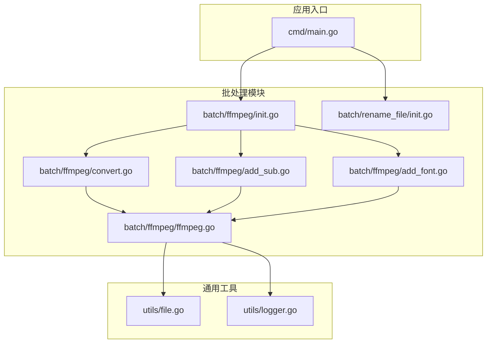
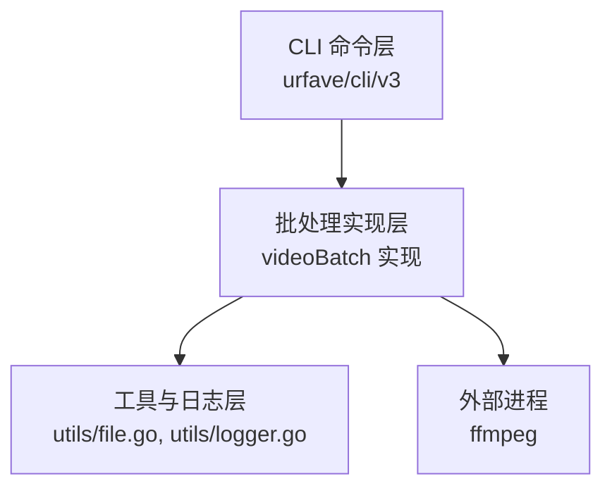
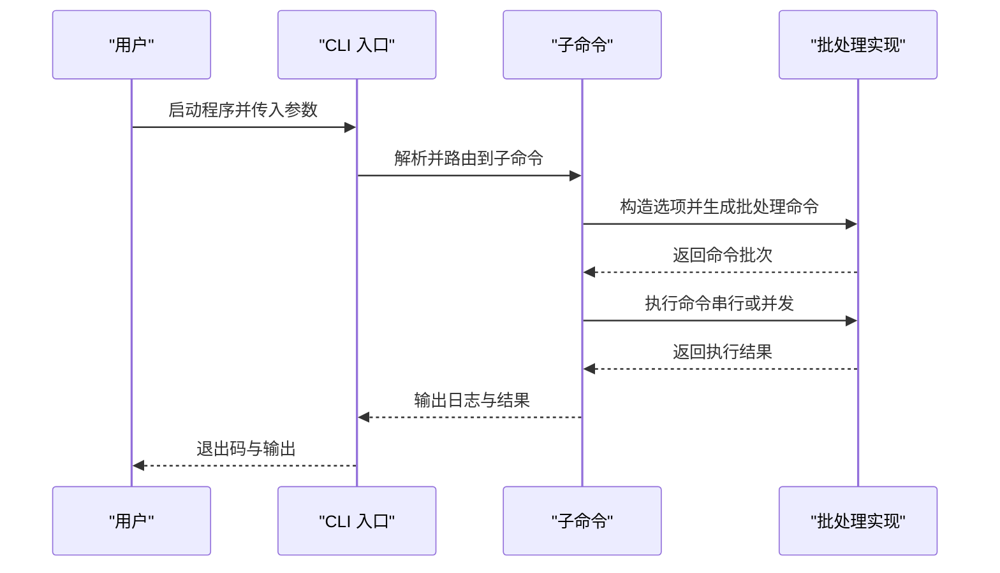
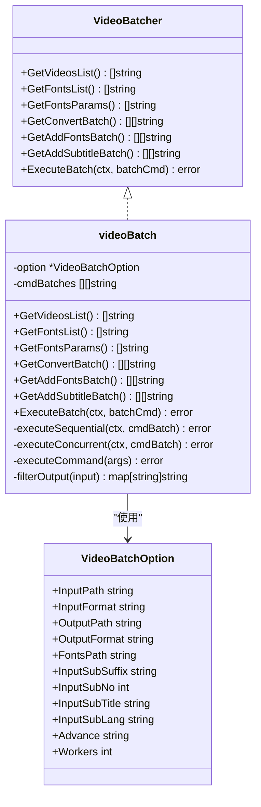
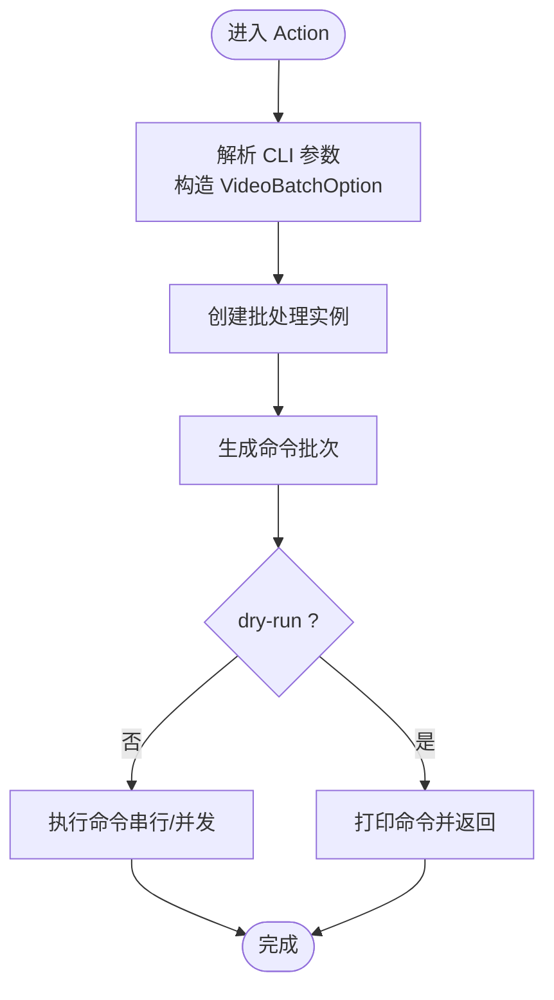
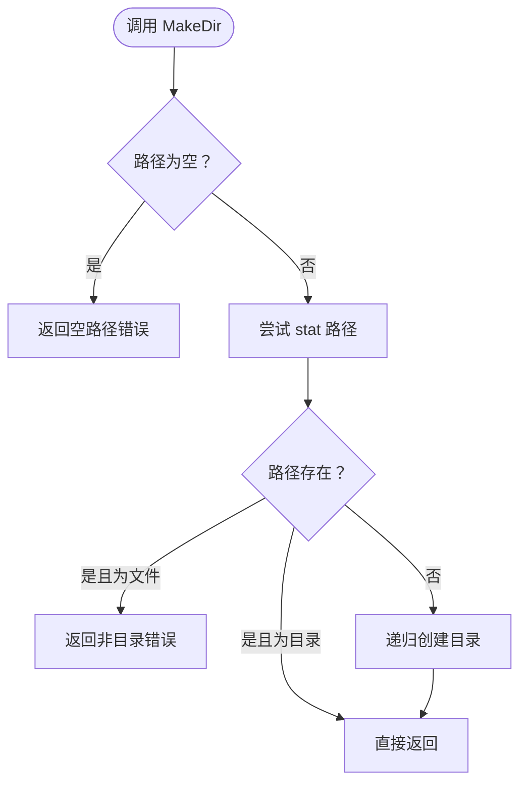
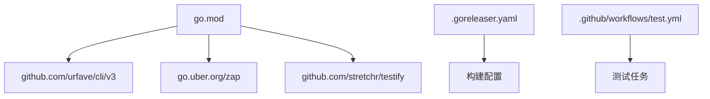
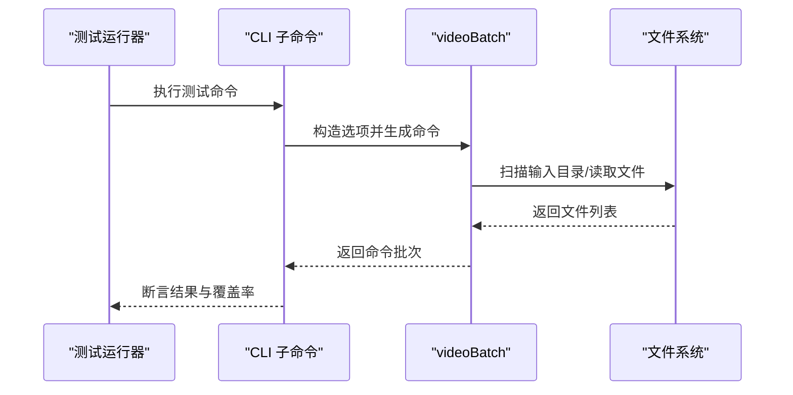
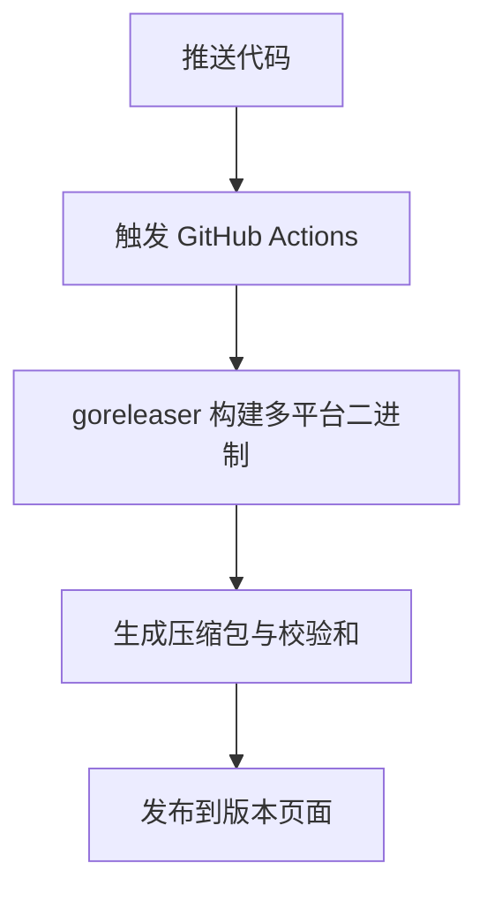

# 开发者指南

<cite>
**本文引用的文件**
- [cmd/main.go](file://cmd/main.go)
- [batch/ffmpeg/ffmpeg.go](file://batch/ffmpeg/ffmpeg.go)
- [batch/ffmpeg/init.go](file://batch/ffmpeg/init.go)
- [batch/ffmpeg/convert.go](file://batch/ffmpeg/convert.go)
- [batch/ffmpeg/add_sub.go](file://batch/ffmpeg/add_sub.go)
- [batch/ffmpeg/add_font.go](file://batch/ffmpeg/add_font.go)
- [batch/ffmpeg/ffmpeg_test.go](file://batch/ffmpeg/ffmpeg_test.go)
- [batch/rename_file/init.go](file://batch/rename_file/init.go)
- [utils/file.go](file://utils/file.go)
- [utils/logger.go](file://utils/logger.go)
- [utils/file_test.go](file://utils/file_test.go)
- [.github/workflows/test.yml](file://.github/workflows/test.yml)
- [.goreleaser.yaml](file://.goreleaser.yaml)
- [taskfile.yaml](file://taskfile.yaml)
- [go.mod](file://go.mod)
</cite>

## 目录
1. [简介](#简介)
2. [项目结构](#项目结构)
3. [核心组件](#核心组件)
4. [架构总览](#架构总览)
5. [详细组件分析](#详细组件分析)
6. [依赖分析](#依赖分析)
7. [性能考虑](#性能考虑)
8. [测试策略与覆盖率](#测试策略与覆盖率)
9. [开发环境搭建](#开发环境搭建)
10. [构建与发布流程](#构建与发布流程)
11. [代码贡献指南与最佳实践](#代码贡献指南与最佳实践)
12. [故障排查指南](#故障排查指南)
13. [结论](#结论)

## 简介
本项目是一个基于命令行的批处理工具，当前提供两类功能：
- 视频批处理：通过封装 ffmpeg 实现视频格式转换、添加字幕、附加字体等操作，并支持串行与并发执行。
- 文件重命名：提供基础的文件重命名能力入口（当前逻辑为空，便于后续扩展）。

项目采用模块化设计，CLI 命令由 urfave/cli/v3 组织，核心批处理逻辑集中在 batch/ffmpeg 模块，通用工具与日志封装在 utils 包中。构建与发布通过 goreleaser 配置实现跨平台打包，GitHub Actions 工作流负责测试与发布流程的自动化。

## 项目结构
项目采用按功能域划分的模块化组织方式：
- cmd：应用入口，注册 CLI 子命令。
- batch：功能域模块，包含 ffmpeg 批处理与 rename_file 批处理。
- utils：通用工具与日志封装。
- 根目录：CI/CD、构建与发布配置文件。

**图表来源**
- [cmd/main.go:1-29](file://cmd/main.go#L1-L29)
- [batch/ffmpeg/ffmpeg.go:1-324](file://batch/ffmpeg/ffmpeg.go#L1-L324)
- [batch/ffmpeg/init.go:1-72](file://batch/ffmpeg/init.go#L1-L72)
- [batch/ffmpeg/convert.go:1-64](file://batch/ffmpeg/convert.go#L1-L64)
- [batch/ffmpeg/add_sub.go:1-88](file://batch/ffmpeg/add_sub.go#L1-L88)
- [batch/ffmpeg/add_font.go:1-69](file://batch/ffmpeg/add_font.go#L1-L69)
- [batch/rename_file/init.go:1-35](file://batch/rename_file/init.go#L1-L35)
- [utils/file.go:1-32](file://utils/file.go#L1-L32)
- [utils/logger.go:1-29](file://utils/logger.go#L1-L29)

**章节来源**
- [cmd/main.go:1-29](file://cmd/main.go#L1-L29)
- [batch/ffmpeg/ffmpeg.go:1-324](file://batch/ffmpeg/ffmpeg.go#L1-L324)
- [batch/ffmpeg/init.go:1-72](file://batch/ffmpeg/init.go#L1-L72)
- [batch/ffmpeg/convert.go:1-64](file://batch/ffmpeg/convert.go#L1-L64)
- [batch/ffmpeg/add_sub.go:1-88](file://batch/ffmpeg/add_sub.go#L1-L88)
- [batch/ffmpeg/add_font.go:1-69](file://batch/ffmpeg/add_font.go#L1-L69)
- [batch/rename_file/init.go:1-35](file://batch/rename_file/init.go#L1-L35)
- [utils/file.go:1-32](file://utils/file.go#L1-L32)
- [utils/logger.go:1-29](file://utils/logger.go#L1-L29)

## 核心组件
- CLI 入口与命令注册：应用入口负责注册 ffmpeg 与 rename_file 两个子命令，统一管理命令行参数与错误输出。
- 批处理接口与实现：VideoBatcher 接口抽象了视频批处理的通用能力；videoBatch 结构体实现具体逻辑，包括扫描输入、生成命令、执行命令与并发控制。
- 工具与日志：utils 包提供目录创建与结构化日志能力，供批处理模块复用。
- 命令实现：convert、add_sub、add_font 三个子命令分别对应不同批处理场景，均通过 VideoBatchOption 驱动 videoBatch 执行。

**章节来源**
- [cmd/main.go:13-28](file://cmd/main.go#L13-L28)
- [batch/ffmpeg/ffmpeg.go:30-64](file://batch/ffmpeg/ffmpeg.go#L30-L64)
- [batch/ffmpeg/ffmpeg.go:40-63](file://batch/ffmpeg/ffmpeg.go#L40-L63)
- [utils/file.go:8-31](file://utils/file.go#L8-L31)
- [utils/logger.go:11-28](file://utils/logger.go#L11-L28)

## 架构总览
系统采用“CLI 命令层 -> 批处理实现层 -> 工具与日志层”的分层架构。CLI 层负责参数解析与命令调度；批处理层负责业务逻辑与外部进程调用；工具层提供基础设施能力。

**图表来源**
- [cmd/main.go:14-20](file://cmd/main.go#L14-L20)
- [batch/ffmpeg/ffmpeg.go:218-299](file://batch/ffmpeg/ffmpeg.go#L218-L299)
- [utils/file.go:8-31](file://utils/file.go#L8-L31)
- [utils/logger.go:11-28](file://utils/logger.go#L11-L28)

## 详细组件分析

### CLI 命令与入口
- 入口函数注册两个子命令：ffmpeg 与 rename_file。
- 错误处理：通过标准错误输出错误信息并退出非零状态码，避免异常恐慌。

**图表来源**
- [cmd/main.go:13-28](file://cmd/main.go#L13-L28)
- [batch/ffmpeg/convert.go:25-62](file://batch/ffmpeg/convert.go#L25-L62)
- [batch/ffmpeg/add_sub.go:45-86](file://batch/ffmpeg/add_sub.go#L45-L86)
- [batch/ffmpeg/add_font.go:30-67](file://batch/ffmpeg/add_font.go#L30-L67)

**章节来源**
- [cmd/main.go:13-28](file://cmd/main.go#L13-L28)

### 批处理接口与实现
- 接口职责：定义获取视频列表、字体列表、生成命令批次、执行命令等能力。
- 实现要点：
  - 输入扫描：遍历输入目录，按扩展名筛选目标文件。
  - 字体参数：根据字体文件生成附加参数，支持多字体映射。
  - 命令生成：将输入、输出与附加参数拼装为 ffmpeg 命令片段。
  - 执行策略：支持串行与并发两种模式，使用信号量控制并发度，支持 context 取消。
  - 输出路径映射：处理同名文件重命名，避免覆盖。

**图表来源**
- [batch/ffmpeg/ffmpeg.go:30-64](file://batch/ffmpeg/ffmpeg.go#L30-L64)
- [batch/ffmpeg/ffmpeg.go:40-63](file://batch/ffmpeg/ffmpeg.go#L40-L63)
- [batch/ffmpeg/ffmpeg.go:16-28](file://batch/ffmpeg/ffmpeg.go#L16-L28)

**章节来源**
- [batch/ffmpeg/ffmpeg.go:30-64](file://batch/ffmpeg/ffmpeg.go#L30-L64)
- [batch/ffmpeg/ffmpeg.go:40-63](file://batch/ffmpeg/ffmpeg.go#L40-L63)
- [batch/ffmpeg/ffmpeg.go:16-28](file://batch/ffmpeg/ffmpeg.go#L16-L28)

### 命令实现与参数驱动
- convert：生成视频转换命令，支持高级参数与干跑模式。
- add_sub：生成添加字幕命令，支持字幕语言、标题与编号。
- add_font：生成附加字体命令，要求字体目录必填。

**图表来源**
- [batch/ffmpeg/convert.go:25-62](file://batch/ffmpeg/convert.go#L25-L62)
- [batch/ffmpeg/add_sub.go:45-86](file://batch/ffmpeg/add_sub.go#L45-L86)
- [batch/ffmpeg/add_font.go:30-67](file://batch/ffmpeg/add_font.go#L30-L67)

**章节来源**
- [batch/ffmpeg/convert.go:11-64](file://batch/ffmpeg/convert.go#L11-L64)
- [batch/ffmpeg/add_sub.go:11-88](file://batch/ffmpeg/add_sub.go#L11-L88)
- [batch/ffmpeg/add_font.go:11-69](file://batch/ffmpeg/add_font.go#L11-L69)

### 工具与日志
- 目录创建：确保输出目录存在，若路径已存在但不是目录则报错。
- 日志：基于 zap 提供带时间、级别、调用者信息的日志输出。

**图表来源**
- [utils/file.go:8-31](file://utils/file.go#L8-L31)

**章节来源**
- [utils/file.go:8-31](file://utils/file.go#L8-L31)
- [utils/logger.go:11-28](file://utils/logger.go#L11-L28)

## 依赖分析
- 运行时依赖：urfave/cli/v3（命令行框架）、go.uber.org/zap（日志）、github.com/stretchr/testify（断言）。
- 构建与发布：goreleaser 用于跨平台打包与发布元数据注入；GitHub Actions 负责测试与构建流水线。

**图表来源**
- [go.mod:5-16](file://go.mod#L5-L16)
- [.goreleaser.yaml:14-40](file://.goreleaser.yaml#L14-L40)
- [.github/workflows/test.yml:36-36](file://.github/workflows/test.yml#L36-L36)

**章节来源**
- [go.mod:5-16](file://go.mod#L5-L16)
- [.goreleaser.yaml:14-40](file://.goreleaser.yaml#L14-L40)
- [.github/workflows/test.yml:36-36](file://.github/workflows/test.yml#L36-L36)

## 性能考虑
- 并发控制：通过信号量限制最大并发数，避免资源争用；在并发模式下优先返回首个错误，减少无效开销。
- 命令生成：尽量一次性生成完整命令片段，减少重复计算。
- I/O 优化：批量生成命令后统一执行，降低系统调用次数。
- 上下文取消：在执行过程中响应 context 取消，提升长任务的可控性。

**章节来源**
- [batch/ffmpeg/ffmpeg.go:248-286](file://batch/ffmpeg/ffmpeg.go#L248-L286)
- [batch/ffmpeg/ffmpeg.go:218-231](file://batch/ffmpeg/ffmpeg.go#L218-L231)

## 测试策略与覆盖率
- 单元测试：针对 videoBatch 的核心方法（扫描、命令生成、输出映射、执行）进行断言验证；对 utils 的 MakeDir 进行边界条件测试。
- 集成测试：通过 CLI 子命令驱动批处理流程，结合 dry-run 验证命令生成正确性。
- 覆盖率：测试脚本使用 -coverprofile 与 -covermode=atomic 生成覆盖率报告，便于持续改进。
- 测试数据：使用 Taskfile 在本地快速准备测试数据目录与文件。

**图表来源**
- [.github/workflows/test.yml:35-36](file://.github/workflows/test.yml#L35-L36)
- [taskfile.yaml:5-15](file://taskfile.yaml#L5-L15)
- [batch/ffmpeg/ffmpeg_test.go:23-46](file://batch/ffmpeg/ffmpeg_test.go#L23-L46)
- [utils/file_test.go:10-54](file://utils/file_test.go#L10-L54)

**章节来源**
- [.github/workflows/test.yml:35-36](file://.github/workflows/test.yml#L35-L36)
- [taskfile.yaml:5-15](file://taskfile.yaml#L5-L15)
- [batch/ffmpeg/ffmpeg_test.go:23-46](file://batch/ffmpeg/ffmpeg_test.go#L23-L46)
- [batch/ffmpeg/ffmpeg_test.go:48-85](file://batch/ffmpeg/ffmpeg_test.go#L48-L85)
- [batch/ffmpeg/ffmpeg_test.go:94-125](file://batch/ffmpeg/ffmpeg_test.go#L94-L125)
- [batch/ffmpeg/ffmpeg_test.go:134-163](file://batch/ffmpeg/ffmpeg_test.go#L134-L163)
- [batch/ffmpeg/ffmpeg_test.go:172-210](file://batch/ffmpeg/ffmpeg_test.go#L172-L210)
- [batch/ffmpeg/ffmpeg_test.go:235-273](file://batch/ffmpeg/ffmpeg_test.go#L235-L273)
- [batch/ffmpeg/ffmpeg_test.go:282-310](file://batch/ffmpeg/ffmpeg_test.go#L282-L310)
- [batch/ffmpeg/ffmpeg_test.go:312-327](file://batch/ffmpeg/ffmpeg_test.go#L312-L327)
- [batch/ffmpeg/ffmpeg_test.go:329-356](file://batch/ffmpeg/ffmpeg_test.go#L329-L356)
- [utils/file_test.go:10-54](file://utils/file_test.go#L10-L54)

## 开发环境搭建
- 语言版本：Go 1.22.2（建议使用 1.21+）。
- 依赖安装：使用 go mod tidy 自动拉取依赖。
- CLI 框架：urfave/cli/v3 提供命令行解析与帮助信息。
- 日志框架：zap 提供高性能日志输出。
- 测试框架：testify 提供断言与测试辅助。
- 任务编排：Taskfile 用于本地测试数据准备与清理。

**章节来源**
- [go.mod:3-3](file://go.mod#L3-L3)
- [go.mod:5-16](file://go.mod#L5-L16)
- [.github/workflows/test.yml:18-22](file://.github/workflows/test.yml#L18-L22)
- [taskfile.yaml:1-16](file://taskfile.yaml#L1-L16)

## 构建与发布流程
- 构建配置：goreleaser 定义多平台（linux/freebsd/windows/darwin）、多架构（amd64/386/arm/arm64）打包规则，启用 CGO 禁用与链接器裁剪以减小体积。
- 归档命名：根据操作系统与架构生成兼容的文件名模板，Windows 使用 zip，其他平台使用 tar.gz。
- 版本注入：通过 ldflags 注入 tag、buildDate、gitCommit 等构建信息。
- 发布元数据：包含变更日志与校验和文件生成。
- CI 集成：GitHub Actions 在推送时自动执行测试与发布流程（可选）。

**图表来源**
- [.goreleaser.yaml:14-58](file://.goreleaser.yaml#L14-L58)
- [.goreleaser.yaml:22-27](file://.goreleaser.yaml#L22-L27)
- [.goreleaser.yaml:41-54](file://.goreleaser.yaml#L41-L54)

**章节来源**
- [.goreleaser.yaml:14-58](file://.goreleaser.yaml#L14-L58)
- [.goreleaser.yaml:22-27](file://.goreleaser.yaml#L22-L27)
- [.goreleaser.yaml:41-54](file://.goreleaser.yaml#L41-L54)

## 代码贡献指南与最佳实践
- 分支策略：建议采用特性分支开发，提交前确保通过本地测试与格式检查。
- 提交流程：提交信息遵循简洁清晰的规范；涉及功能变更需补充或更新单元测试。
- 代码风格：保持一致的命名与注释规范；避免在公共接口中引入硬编码路径。
- 并发安全：在并发执行时注意错误收集与上下文取消，避免资源泄漏。
- 日志规范：使用结构化日志记录关键事件与错误，便于问题定位。
- 文档同步：新增或修改 CLI 参数与行为时，同步更新相关文档与示例。

## 故障排查指南
- 常见错误类型与处理：
  - 输出目录创建失败：检查路径权限与是否存在非目录项。
  - ffmpeg 命令执行失败：确认 ffmpeg 是否安装并可被系统找到；查看 dry-run 输出的命令片段核对参数。
  - 并发执行中断：检查 context 是否提前取消；适当调整 workers 数值。
- 日志定位：通过 zap 输出的时间戳、调用者与错误详情快速定位问题。
- 测试辅助：使用 Taskfile 快速准备测试数据，验证扫描与命令生成逻辑。

**章节来源**
- [utils/file.go:8-31](file://utils/file.go#L8-L31)
- [batch/ffmpeg/ffmpeg.go:288-299](file://batch/ffmpeg/ffmpeg.go#L288-L299)
- [batch/ffmpeg/ffmpeg.go:218-231](file://batch/ffmpeg/ffmpeg.go#L218-L231)
- [utils/logger.go:11-28](file://utils/logger.go#L11-L28)
- [taskfile.yaml:5-15](file://taskfile.yaml#L5-L15)

## 结论
本项目通过清晰的模块化设计与分层架构，实现了可扩展的批处理工具体系。CLI 层提供统一入口，批处理层聚焦业务逻辑与外部进程交互，工具层提供通用能力支撑。配合完善的测试与发布流程，能够稳定地支持多平台部署与持续迭代。