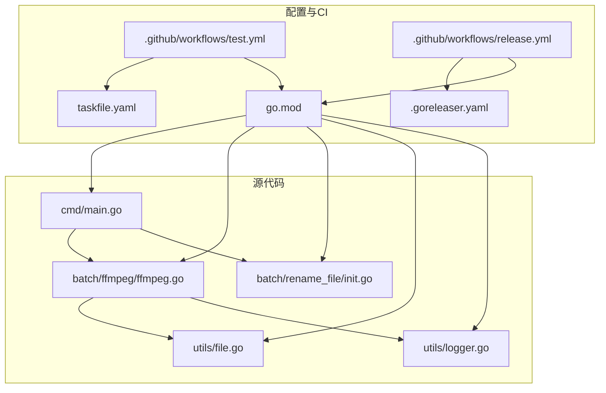
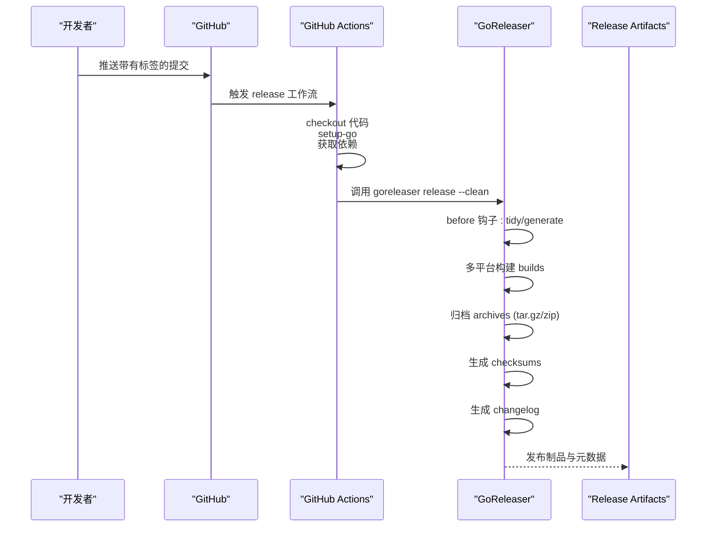
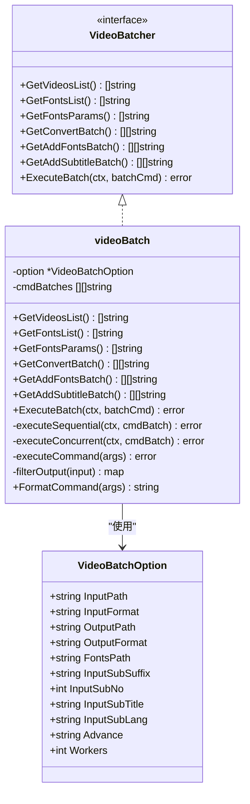
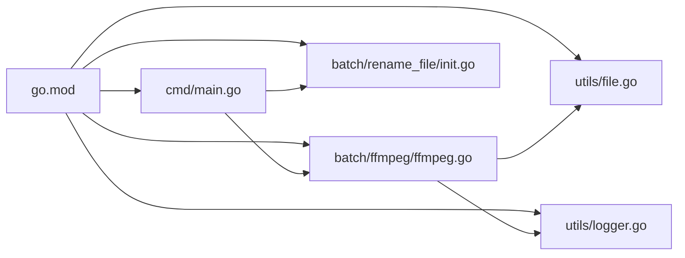

# 构建与发布流程

<cite>
**本文引用的文件**
- [.goreleaser.yaml](file://.goreleaser.yaml)
- [taskfile.yaml](file://taskfile.yaml)
- [.github/workflows/test.yml](file://.github/workflows/test.yml)
- [.github/workflows/release.yml](file://.github/workflows/release.yml)
- [go.mod](file://go.mod)
- [cmd/main.go](file://cmd/main.go)
- [batch/ffmpeg/ffmpeg.go](file://batch/ffmpeg/ffmpeg.go)
- [batch/rename_file/init.go](file://batch/rename_file/init.go)
- [utils/logger.go](file://utils/logger.go)
- [utils/file.go](file://utils/file.go)
- [batch/ffmpeg/ffmpeg_test.go](file://batch/ffmpeg/ffmpeg_test.go)
- [utils/file_test.go](file://utils/file_test.go)
- [docs/ffmpeg.md](file://docs/ffmpeg.md)
- [CHANGELOG.md](file://CHANGELOG.md)
</cite>

## 目录
1. [简介](#简介)
2. [项目结构](#项目结构)
3. [核心组件](#核心组件)
4. [架构总览](#架构总览)
5. [详细组件分析](#详细组件分析)
6. [依赖关系分析](#依赖关系分析)
7. [性能考量](#性能考量)
8. [故障排查指南](#故障排查指南)
9. [结论](#结论)
10. [附录](#附录)

## 简介
本文件面向 batcher 项目的构建与发布流程，系统性梳理多平台构建配置、构建脚本与任务、发布自动化、CI 集成、质量检查与发布后运维等环节。内容基于仓库中的实际配置文件与源代码进行归纳总结，帮助开发者在不同平台上高效完成构建与发布。

## 项目结构
- 核心可执行程序位于 cmd/main.go，采用 urfave/cli/v3 提供子命令入口，当前包含 ffmpeg 批处理与文件重命名两个命令模块。
- 批处理能力集中在 batch/ffmpeg，提供视频列表扫描、字体与字幕附加、并发执行等能力；batch/rename_file 提供重命名命令占位。
- 工具库位于 utils，包含日志与目录创建等通用能力。
- 版本化与发布由 .goreleaser.yaml 驱动，配合 GitHub Actions 在打标签时自动发布。
- 测试通过 go test 与 Taskfile 任务进行数据准备与执行。

图表来源
- [cmd/main.go:1-29](file://cmd/main.go#L1-L29)
- [batch/ffmpeg/ffmpeg.go:1-324](file://batch/ffmpeg/ffmpeg.go#L1-L324)
- [batch/rename_file/init.go:1-35](file://batch/rename_file/init.go#L1-L35)
- [utils/logger.go:1-29](file://utils/logger.go#L1-L29)
- [utils/file.go:1-32](file://utils/file.go#L1-L32)
- [.goreleaser.yaml:1-75](file://.goreleaser.yaml#L1-L75)
- [.github/workflows/test.yml:1-44](file://.github/workflows/test.yml#L1-L44)
- [.github/workflows/release.yml:1-32](file://.github/workflows/release.yml#L1-L32)
- [taskfile.yaml:1-16](file://taskfile.yaml#L1-L16)
- [go.mod:1-17](file://go.mod#L1-L17)

章节来源
- [cmd/main.go:1-29](file://cmd/main.go#L1-L29)
- [batch/ffmpeg/ffmpeg.go:1-324](file://batch/ffmpeg/ffmpeg.go#L1-L324)
- [batch/rename_file/init.go:1-35](file://batch/rename_file/init.go#L1-L35)
- [utils/logger.go:1-29](file://utils/logger.go#L1-L29)
- [utils/file.go:1-32](file://utils/file.go#L1-L32)
- [.goreleaser.yaml:1-75](file://.goreleaser.yaml#L1-L75)
- [.github/workflows/test.yml:1-44](file://.github/workflows/test.yml#L1-L44)
- [.github/workflows/release.yml:1-32](file://.github/workflows/release.yml#L1-L32)
- [taskfile.yaml:1-16](file://taskfile.yaml#L1-L16)
- [go.mod:1-17](file://go.mod#L1-L17)

## 核心组件
- CLI 入口与命令注册：主程序通过 urfave/cli/v3 注册子命令，当前包含 ffmpeg 批处理与文件重命名命令。
- 批处理引擎：ffmpeg 批处理模块负责扫描输入目录、生成命令批次、并发/串行执行、输出路径去重与冲突处理。
- 工具库：日志模块基于 zap，提供带调用者信息与时间格式化的控制台输出；文件工具提供目录创建与存在性校验。
- 构建与发布：Go 模块版本在 go.mod 中声明；.goreleaser.yaml 定义多平台构建、归档、校验和、变更日志与快照版本；GitHub Actions 在打标签时触发发布。

章节来源
- [cmd/main.go:13-28](file://cmd/main.go#L13-L28)
- [batch/ffmpeg/ffmpeg.go:16-64](file://batch/ffmpeg/ffmpeg.go#L16-L64)
- [utils/logger.go:11-28](file://utils/logger.go#L11-L28)
- [utils/file.go:8-31](file://utils/file.go#L8-L31)
- [go.mod:3](file://go.mod#L3)
- [.goreleaser.yaml:14-70](file://.goreleaser.yaml#L14-L70)

## 架构总览
下图展示从 CI 触发到产物发布的整体流程，包括测试、构建、打包与发布步骤。

图表来源
- [.github/workflows/release.yml:25-31](file://.github/workflows/release.yml#L25-L31)
- [.goreleaser.yaml:9-12](file://.goreleaser.yaml#L9-L12)
- [.goreleaser.yaml:14-58](file://.goreleaser.yaml#L14-L58)
- [.goreleaser.yaml:59-62](file://.goreleaser.yaml#L59-L62)
- [.goreleaser.yaml:64-70](file://.goreleaser.yaml#L64-L70)

## 详细组件分析

### 多平台构建与交叉编译配置（.goreleaser.yaml）
- 项目名称与 Git 行为：定义项目名、按创建日期排序标签，启用报告尺寸。
- 构建阶段钩子：在构建前执行模块整理与代码生成。
- 构建目标：指定主入口目录、禁用 CGO、传递调试与路径裁剪标志、设置链接器标志（去除符号表与调试信息）。
- 版本注入：通过 ldflags 注入标签、构建时间、提交哈希等构建元数据。
- 平台矩阵：覆盖 Linux、FreeBSD、Windows、Darwin；架构覆盖 amd64、386、arm、arm64；ARM 版本覆盖 armv6/armv7。
- 归档策略：统一名称模板，Linux/macOS 使用 tar.gz，Windows 使用 zip；包含 LICENSE 与变更日志。
- 校验与快照：生成 checksums.txt；快照版本模板为 patch 递增后缀。
- 变更日志：按升序排序，排除以特定前缀开头的提交。

章节来源
- [.goreleaser.yaml:4-7](file://.goreleaser.yaml#L4-L7)
- [.goreleaser.yaml:9-12](file://.goreleaser.yaml#L9-L12)
- [.goreleaser.yaml:14-27](file://.goreleaser.yaml#L14-L27)
- [.goreleaser.yaml:28-40](file://.goreleaser.yaml#L28-L40)
- [.goreleaser.yaml:41-58](file://.goreleaser.yaml#L41-L58)
- [.goreleaser.yaml:59-62](file://.goreleaser.yaml#L59-L62)
- [.goreleaser.yaml:64-70](file://.goreleaser.yaml#L64-L70)

### 构建脚本与任务（Taskfile）
- test 任务：清理旧测试数据目录，创建临时测试目录与文件，便于本地或 CI 环境下的测试准备。
- clean 任务：清理 Go 缓存、构建输出与归档目录，以及测试数据目录，确保环境干净。

章节来源
- [taskfile.yaml:5-10](file://taskfile.yaml#L5-L10)
- [taskfile.yaml:11-16](file://taskfile.yaml#L11-L16)

### 发布自动化（GitHub Actions）
- 触发条件：推送匹配 “v*” 的标签时触发。
- 步骤概览：检出代码、设置 Go 版本、获取依赖、调用 goreleaser-action 执行 release --clean。
- 环境变量：通过 GITHUB_TOKEN 传递给 goreleaser-action。

章节来源
- [.github/workflows/release.yml:3-6](file://.github/workflows/release.yml#L3-L6)
- [.github/workflows/release.yml:13-31](file://.github/workflows/release.yml#L13-L31)

### 测试自动化（GitHub Actions）
- 触发条件：除文档与 README 等文件外的推送触发。
- 步骤概览：检出代码、设置 Go 版本、获取依赖、安装 Task（用于测试数据准备）、执行 Task test 任务、运行 go test 并生成覆盖率报告。
- 覆盖率上传（注释）：保留了上传到 Codecov 的注释配置，便于扩展。

章节来源
- [.github/workflows/test.yml:3-9](file://.github/workflows/test.yml#L3-L9)
- [.github/workflows/test.yml:15-36](file://.github/workflows/test.yml#L15-L36)

### 批处理引擎（ffmpeg 批处理）
- 数据结构：VideoBatchOption 描述输入/输出路径、格式、字体路径、字幕参数、并发度等；VideoBatcher 接口定义批处理能力；videoBatch 为实现。
- 功能点：
  - 扫描视频与字体：遍历目录，过滤扩展名，返回列表。
  - 生成命令批次：根据输入/输出格式生成 ffmpeg 参数；支持附加字体参数与字幕合并。
  - 执行策略：支持串行与并发两种模式，使用信号量控制并发数量；支持 context 取消。
  - 输出去重：对同名文件追加序号，避免覆盖。
  - 日志格式化：提供命令字符串格式化方法，便于日志输出。
- 错误处理：各步骤均返回错误，上层调用可据此判断失败原因。

图表来源
- [batch/ffmpeg/ffmpeg.go:16-64](file://batch/ffmpeg/ffmpeg.go#L16-L64)
- [batch/ffmpeg/ffmpeg.go:137-216](file://batch/ffmpeg/ffmpeg.go#L137-L216)
- [batch/ffmpeg/ffmpeg.go:218-299](file://batch/ffmpeg/ffmpeg.go#L218-L299)
- [batch/ffmpeg/ffmpeg.go:301-323](file://batch/ffmpeg/ffmpeg.go#L301-L323)

章节来源
- [batch/ffmpeg/ffmpeg.go:16-64](file://batch/ffmpeg/ffmpeg.go#L16-L64)
- [batch/ffmpeg/ffmpeg.go:137-216](file://batch/ffmpeg/ffmpeg.go#L137-L216)
- [batch/ffmpeg/ffmpeg.go:218-299](file://batch/ffmpeg/ffmpeg.go#L218-L299)
- [batch/ffmpeg/ffmpeg.go:301-323](file://batch/ffmpeg/ffmpeg.go#L301-L323)

### CLI 命令与入口
- 主程序注册命令：HideVersion、Usage、Commands 列表包含 ffmpeg 与文件重命名命令。
- 文件重命名命令：定义输入路径与是否使用 MD5 的标志位，提供 Action 占位以便后续扩展。

章节来源
- [cmd/main.go:13-28](file://cmd/main.go#L13-L28)
- [batch/rename_file/init.go:25-34](file://batch/rename_file/init.go#L25-L34)

### 工具库
- 日志：基于 zap 的控制台编码器，彩色级别、时间、调用者与耗时格式化。
- 文件：目录创建与存在性校验，若路径为空或非目录则报错。

章节来源
- [utils/logger.go:11-28](file://utils/logger.go#L11-L28)
- [utils/file.go:8-31](file://utils/file.go#L8-L31)

### 测试与覆盖率
- 测试数据准备：Taskfile 的 test 任务创建临时目录与文件，便于单元测试使用。
- 单元测试：覆盖 NewVideoBatch、视频/字体扫描、命令生成、输出映射、命令格式化、并发/串行执行等场景。
- 覆盖率：go test 生成覆盖率文件，便于后续上传至覆盖率服务。

章节来源
- [taskfile.yaml:5-10](file://taskfile.yaml#L5-L10)
- [batch/ffmpeg/ffmpeg_test.go:23-46](file://batch/ffmpeg/ffmpeg_test.go#L23-L46)
- [batch/ffmpeg/ffmpeg_test.go:48-85](file://batch/ffmpeg/ffmpeg_test.go#L48-L85)
- [batch/ffmpeg/ffmpeg_test.go:94-125](file://batch/ffmpeg/ffmpeg_test.go#L94-L125)
- [batch/ffmpeg/ffmpeg_test.go:134-163](file://batch/ffmpeg/ffmpeg_test.go#L134-L163)
- [batch/ffmpeg/ffmpeg_test.go:172-210](file://batch/ffmpeg/ffmpeg_test.go#L172-L210)
- [batch/ffmpeg/ffmpeg_test.go:235-273](file://batch/ffmpeg/ffmpeg_test.go#L235-L273)
- [batch/ffmpeg/ffmpeg_test.go:282-310](file://batch/ffmpeg/ffmpeg_test.go#L282-L310)
- [batch/ffmpeg/ffmpeg_test.go:312-327](file://batch/ffmpeg/ffmpeg_test.go#L312-L327)
- [batch/ffmpeg/ffmpeg_test.go:329-356](file://batch/ffmpeg/ffmpeg_test.go#L329-L356)
- [utils/file_test.go:10-53](file://utils/file_test.go#L10-L53)

## 依赖关系分析
- 模块版本：go.mod 声明 Go 版本与依赖，包括测试断言库、CLI 库与日志库。
- 运行时依赖：ffmpeg 命令需在系统环境中可用，文档中明确要求。

图表来源
- [go.mod:1-17](file://go.mod#L1-L17)
- [cmd/main.go:1-11](file://cmd/main.go#L1-L11)
- [batch/ffmpeg/ffmpeg.go:1-14](file://batch/ffmpeg/ffmpeg.go#L1-L14)
- [batch/rename_file/init.go:1-8](file://batch/rename_file/init.go#L1-L8)
- [utils/file.go:1-6](file://utils/file.go#L1-L6)
- [utils/logger.go:1-9](file://utils/logger.go#L1-L9)

章节来源
- [go.mod:1-17](file://go.mod#L1-L17)

## 性能考量
- 并发执行：通过信号量限制并发度，避免资源争用；支持 context 取消，提升中断响应能力。
- 构建优化：禁用 CGO、裁剪路径、移除符号表与调试信息，减小二进制体积并提升加载速度。
- I/O 与磁盘：输出去重避免重复写入；目录创建前置校验减少异常开销。
- 归档策略：按操作系统与架构命名，便于用户直接下载对应平台的压缩包。

章节来源
- [batch/ffmpeg/ffmpeg.go:248-286](file://batch/ffmpeg/ffmpeg.go#L248-L286)
- [.goreleaser.yaml:17-27](file://.goreleaser.yaml#L17-L27)
- [batch/ffmpeg/ffmpeg.go:301-318](file://batch/ffmpeg/ffmpeg.go#L301-L318)
- [utils/file.go:8-31](file://utils/file.go#L8-L31)

## 故障排查指南
- 构建失败（缺少 ffmpeg）：确认系统已安装 ffmpeg，或在 CI 中显式安装。
- 并发执行卡住：检查 Workers 参数与系统资源；必要时降低并发度。
- 输出覆盖问题：确认输入/输出路径与格式配置；利用输出去重逻辑避免覆盖。
- 测试数据缺失：在本地或 CI 中先执行 Task test 任务准备测试数据。
- 发布未触发：确认推送的是符合 “v*” 规范的标签；检查 GITHUB_TOKEN 权限。

章节来源
- [docs/ffmpeg.md:3](file://docs/ffmpeg.md#L3)
- [batch/ffmpeg/ffmpeg.go:301-318](file://batch/ffmpeg/ffmpeg.go#L301-L318)
- [taskfile.yaml:5-10](file://taskfile.yaml#L5-L10)
- [.github/workflows/release.yml:3-6](file://.github/workflows/release.yml#L3-L6)

## 结论
本项目通过 GoReleaser 实现多平台交叉编译与归档，结合 GitHub Actions 在打标签时自动发布；通过 Taskfile 与测试用例保障构建与质量门禁。建议在现有基础上补充安全扫描与覆盖率上报，完善发布后的监控与回滚策略，以进一步提升交付稳定性与可观测性。

## 附录

### 版本标签与变更日志
- 版本标签：遵循 “v*” 规范，例如 v0.0.4。
- 变更日志：CHANGELOG.md 记录每个版本的变更摘要，便于发布说明与用户沟通。

章节来源
- [.github/workflows/release.yml:5](file://.github/workflows/release.yml#L5)
- [CHANGELOG.md:3-6](file://CHANGELOG.md#L3-L6)

### 发布前质量检查清单
- 代码审查：确保新增/修改逻辑通过 Review。
- 测试验证：执行 go test 与 Task test 准备的数据集。
- 安全扫描：建议在 CI 中集成静态分析与依赖漏洞扫描（如 golangci-lint、aquasecurity/trivy）。
- 文档更新：更新 docs/ffmpeg.md 与 CHANGELOG.md。

章节来源
- [.github/workflows/test.yml:35-36](file://.github/workflows/test.yml#L35-L36)
- [docs/ffmpeg.md:1-101](file://docs/ffmpeg.md#L1-L101)
- [CHANGELOG.md:1-7](file://CHANGELOG.md#L1-L7)

### 发布后监控与回滚
- 监控：关注发布产物完整性与用户反馈渠道（Issue/讨论区）。
- 回滚：若发现严重问题，可基于快照版本或重新打标签触发新版本发布；必要时提供降级版本说明。

章节来源
- [.goreleaser.yaml:61-62](file://.goreleaser.yaml#L61-L62)