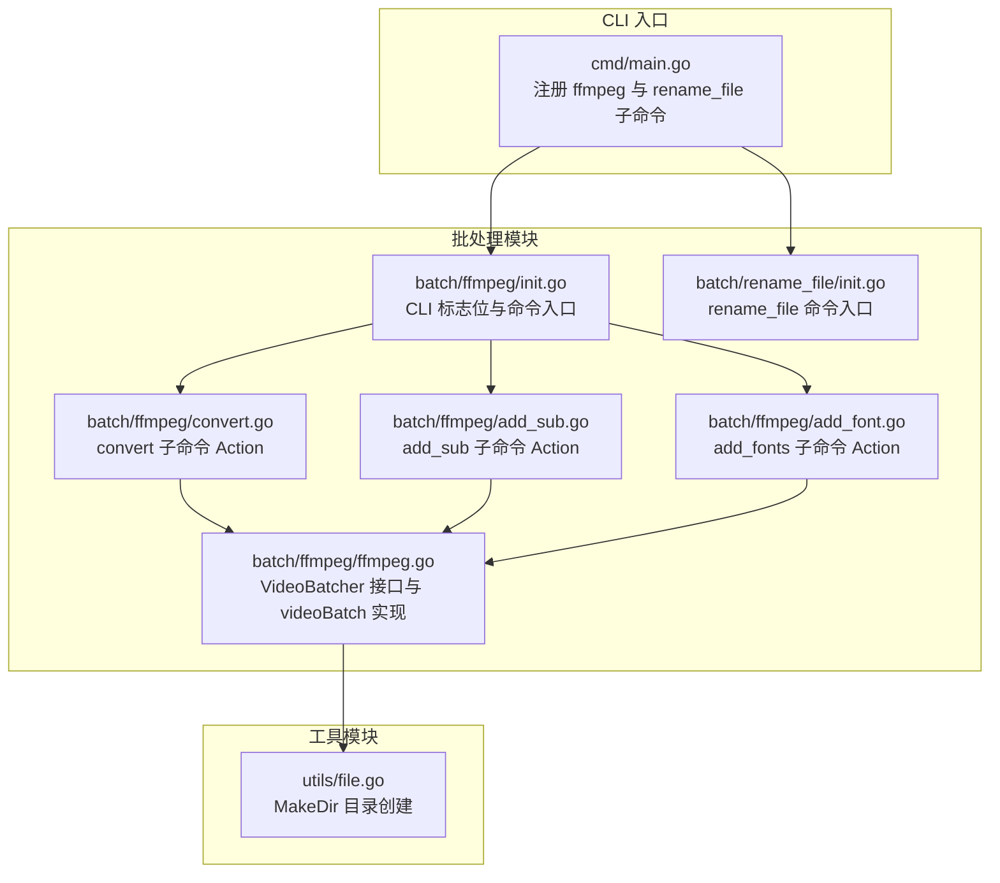
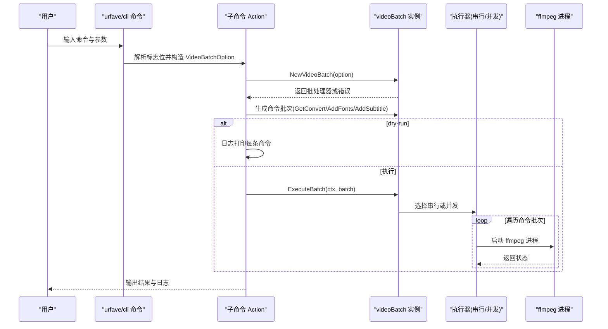
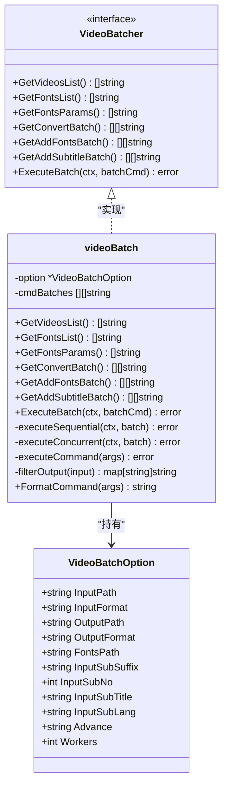
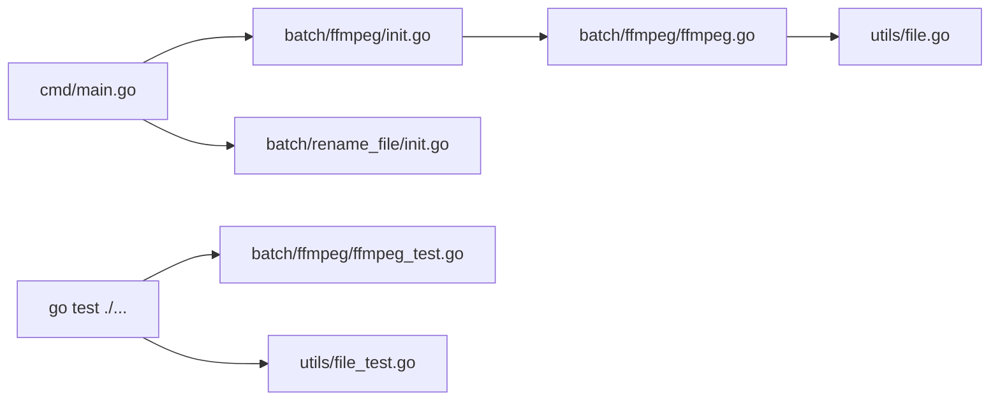

# 测试策略与实践

<cite>
**本文引用的文件**
- [cmd/main.go](file://cmd/main.go)
- [batch/ffmpeg/ffmpeg.go](file://batch/ffmpeg/ffmpeg.go)
- [batch/ffmpeg/ffmpeg_test.go](file://batch/ffmpeg/ffmpeg_test.go)
- [batch/ffmpeg/init.go](file://batch/ffmpeg/init.go)
- [batch/ffmpeg/convert.go](file://batch/ffmpeg/convert.go)
- [batch/ffmpeg/add_sub.go](file://batch/ffmpeg/add_sub.go)
- [batch/ffmpeg/add_font.go](file://batch/ffmpeg/add_font.go)
- [batch/rename_file/init.go](file://batch/rename_file/init.go)
- [utils/file.go](file://utils/file.go)
- [utils/file_test.go](file://utils/file_test.go)
- [.github/workflows/test.yml](file://.github/workflows/test.yml)
- [taskfile.yaml](file://taskfile.yaml)
- [go.mod](file://go.mod)
- [docs/ffmpeg.md](file://docs/ffmpeg.md)
</cite>

## 目录
1. [引言](#引言)
2. [项目结构](#项目结构)
3. [核心组件](#核心组件)
4. [架构总览](#架构总览)
5. [详细组件分析](#详细组件分析)
6. [依赖分析](#依赖分析)
7. [性能考虑](#性能考虑)
8. [故障排查指南](#故障排查指南)
9. [结论](#结论)
10. [附录](#附录)

## 引言
本测试策略文档面向 batcher 项目，系统性地阐述单元测试与集成测试的设计与实施方法，覆盖测试用例设计原则、Mock 对象使用、断言策略、覆盖率与质量标准、TDD 实践、CLI 命令测试、批处理功能测试与工具函数测试，并提供调试技巧与常见问题解决方案。文档以现有代码为依据，结合 GitHub Actions 工作流与 Taskfile 的测试数据准备流程，给出可落地的测试方案。

## 项目结构
项目采用按功能域分层的组织方式：CLI 入口位于 cmd/main.go；批处理能力集中在 batch/ffmpeg 与 batch/rename_file；通用工具在 utils；测试通过 go test 执行，GitHub Actions 在 CI 中统一运行测试并生成覆盖率报告；Taskfile 提供本地测试数据准备任务。

图表来源
- [cmd/main.go:13-28](file://cmd/main.go#L13-L28)
- [batch/ffmpeg/init.go:62-71](file://batch/ffmpeg/init.go#L62-L71)
- [batch/ffmpeg/convert.go:25-62](file://batch/ffmpeg/convert.go#L25-L62)
- [batch/ffmpeg/add_sub.go:45-86](file://batch/ffmpeg/add_sub.go#L45-L86)
- [batch/ffmpeg/add_font.go:30-67](file://batch/ffmpeg/add_font.go#L30-L67)
- [batch/ffmpeg/ffmpeg.go:47-64](file://batch/ffmpeg/ffmpeg.go#L47-L64)
- [utils/file.go:8-31](file://utils/file.go#L8-L31)

章节来源
- [cmd/main.go:13-28](file://cmd/main.go#L13-L28)
- [batch/ffmpeg/init.go:62-71](file://batch/ffmpeg/init.go#L62-L71)
- [batch/ffmpeg/convert.go:25-62](file://batch/ffmpeg/convert.go#L25-L62)
- [batch/ffmpeg/add_sub.go:45-86](file://batch/ffmpeg/add_sub.go#L45-L86)
- [batch/ffmpeg/add_font.go:30-67](file://batch/ffmpeg/add_font.go#L30-L67)
- [batch/ffmpeg/ffmpeg.go:47-64](file://batch/ffmpeg/ffmpeg.go#L47-L64)
- [utils/file.go:8-31](file://utils/file.go#L8-L31)

## 核心组件
- VideoBatcher 接口与 videoBatch 实现：负责视频批处理的核心逻辑，包括扫描输入、生成命令批次、并发/串行执行、输出路径映射与命令格式化等。
- CLI 命令子系统：convert、add_sub、add_fonts 三个子命令通过 urfave/cli 注入标志位并调用 videoBatch 执行。
- 工具函数 MakeDir：封装目录创建与存在性校验，被 NewVideoBatch 内部调用以确保输出目录可用。

章节来源
- [batch/ffmpeg/ffmpeg.go:30-64](file://batch/ffmpeg/ffmpeg.go#L30-L64)
- [batch/ffmpeg/ffmpeg.go:47-64](file://batch/ffmpeg/ffmpeg.go#L47-L64)
- [batch/ffmpeg/convert.go:25-62](file://batch/ffmpeg/convert.go#L25-L62)
- [batch/ffmpeg/add_sub.go:45-86](file://batch/ffmpeg/add_sub.go#L45-L86)
- [batch/ffmpeg/add_font.go:30-67](file://batch/ffmpeg/add_font.go#L30-L67)
- [utils/file.go:8-31](file://utils/file.go#L8-L31)

## 架构总览
下图展示了 CLI 命令到批处理执行的整体流程，以及关键断点（如 dry-run 预览、并发执行、错误记录）。

图表来源
- [batch/ffmpeg/convert.go:25-62](file://batch/ffmpeg/convert.go#L25-L62)
- [batch/ffmpeg/add_sub.go:45-86](file://batch/ffmpeg/add_sub.go#L45-L86)
- [batch/ffmpeg/add_font.go:30-67](file://batch/ffmpeg/add_font.go#L30-L67)
- [batch/ffmpeg/ffmpeg.go:218-299](file://batch/ffmpeg/ffmpeg.go#L218-L299)

## 详细组件分析

### 单元测试最佳实践与用例设计
- 测试金字塔与分层
  - 工具函数层：对 MakeDir 进行边界条件与异常分支测试（空路径、已存在非目录、创建失败），使用清理钩子保证幂等性。
  - 组件层：对 videoBatch 的核心方法进行参数组合、错误传播与行为断言，覆盖正常路径与异常路径。
  - 集成层：通过 CLI Action 串联生成命令批次与执行流程，验证干跑(dry-run)与实际执行的差异。
- 断言策略
  - 使用 testify assert 进行等值断言、错误非空断言与日志输出断言（通过 mock 或外部可观测性）。
  - 对并发执行，断言上下文取消能正确中断后续任务，且首错返回一致。
- Mock 对象使用
  - 对外部进程调用（ffmpeg）建议通过接口抽象与注入，以便在测试中替换为假实现，从而避免真实外部依赖。
  - 对文件系统访问，可通过临时目录与清理钩子替代真实文件系统，减少副作用。
- 测试数据管理
  - 使用 Taskfile 在本地快速生成测试数据目录与文件，CI 中同样执行该任务以保证一致性。
- 测试执行策略
  - CI 使用 go test -coverprofile=coverage.out -covermode=atomic ./... 生成覆盖率文件，便于后续上传至覆盖率平台。

章节来源
- [utils/file_test.go:10-53](file://utils/file_test.go#L10-L53)
- [batch/ffmpeg/ffmpeg_test.go:23-46](file://batch/ffmpeg/ffmpeg_test.go#L23-L46)
- [batch/ffmpeg/ffmpeg_test.go:48-85](file://batch/ffmpeg/ffmpeg_test.go#L48-L85)
- [batch/ffmpeg/ffmpeg_test.go:94-125](file://batch/ffmpeg/ffmpeg_test.go#L94-L125)
- [batch/ffmpeg/ffmpeg_test.go:134-163](file://batch/ffmpeg/ffmpeg_test.go#L134-L163)
- [batch/ffmpeg/ffmpeg_test.go:172-210](file://batch/ffmpeg/ffmpeg_test.go#L172-L210)
- [batch/ffmpeg/ffmpeg_test.go:235-273](file://batch/ffmpeg/ffmpeg_test.go#L235-L273)
- [batch/ffmpeg/ffmpeg_test.go:282-310](file://batch/ffmpeg/ffmpeg_test.go#L282-L310)
- [batch/ffmpeg/ffmpeg_test.go:312-327](file://batch/ffmpeg/ffmpeg_test.go#L312-L327)
- [batch/ffmpeg/ffmpeg_test.go:329-356](file://batch/ffmpeg/ffmpeg_test.go#L329-L356)
- [.github/workflows/test.yml:35-36](file://.github/workflows/test.yml#L35-L36)
- [taskfile.yaml:5-10](file://taskfile.yaml#L5-L10)

### CLI 命令测试
- convert 子命令
  - 行为：解析标志位 -> 生成转换命令批次 -> 可选 dry-run 预览 -> 执行批处理。
  - 测试要点：输入/输出路径与格式、高级参数拼接、并发数、上下文取消、错误日志。
- add_sub 子命令
  - 行为：解析字幕相关标志位 -> 生成添加字幕命令批次 -> 可选字体参数 -> 执行批处理。
  - 测试要点：字幕后缀、字幕编号/语言/标题、输入输出路径与格式、字体参数拼接。
- add_fonts 子命令
  - 行为：解析字体路径 -> 生成添加字体命令批次 -> 执行批处理。
  - 测试要点：字体路径存在性、字体参数序列、输出映射。
- 测试建议
  - 使用 testify suite 或表驱动测试组织多组参数组合。
  - 对 dry-run 场景，断言日志输出包含格式化命令字符串。
  - 对执行场景，断言执行器返回值与错误传播。

章节来源
- [batch/ffmpeg/convert.go:25-62](file://batch/ffmpeg/convert.go#L25-L62)
- [batch/ffmpeg/add_sub.go:45-86](file://batch/ffmpeg/add_sub.go#L45-L86)
- [batch/ffmpeg/add_font.go:30-67](file://batch/ffmpeg/add_font.go#L30-L67)
- [batch/ffmpeg/ffmpeg_test.go:329-356](file://batch/ffmpeg/ffmpeg_test.go#L329-L356)

### 批处理功能测试
- NewVideoBatch
  - 行为：校验选项、创建输出目录、设置默认并发数。
  - 测试要点：nil 选项、空输出路径、输出目录创建失败。
- GetVideosList / GetFontsList
  - 行为：递归扫描指定路径，过滤扩展名。
  - 测试要点：不存在路径、空路径、扩展名匹配。
- GetFontsParams / GetConvertBatch / GetAddFontsBatch / GetAddSubtitleBatch
  - 行为：生成 ffmpeg 命令参数序列，处理输出映射与附加参数。
  - 测试要点：命令序列等值断言、输出映射去重与重名处理。
- ExecuteBatch（并发/串行）
  - 行为：根据 Workers 选择执行策略；支持 context 取消；并发使用信号量控制。
  - 测试要点：空批次、单/多 worker、上下文取消、首个错误返回。

章节来源
- [batch/ffmpeg/ffmpeg.go:47-64](file://batch/ffmpeg/ffmpeg.go#L47-L64)
- [batch/ffmpeg/ffmpeg.go:66-87](file://batch/ffmpeg/ffmpeg.go#L66-L87)
- [batch/ffmpeg/ffmpeg.go:89-113](file://batch/ffmpeg/ffmpeg.go#L89-L113)
- [batch/ffmpeg/ffmpeg.go:115-135](file://batch/ffmpeg/ffmpeg.go#L115-L135)
- [batch/ffmpeg/ffmpeg.go:137-156](file://batch/ffmpeg/ffmpeg.go#L137-L156)
- [batch/ffmpeg/ffmpeg.go:158-178](file://batch/ffmpeg/ffmpeg.go#L158-L178)
- [batch/ffmpeg/ffmpeg.go:180-216](file://batch/ffmpeg/ffmpeg.go#L180-L216)
- [batch/ffmpeg/ffmpeg.go:218-299](file://batch/ffmpeg/ffmpeg.go#L218-L299)
- [batch/ffmpeg/ffmpeg_test.go:23-46](file://batch/ffmpeg/ffmpeg_test.go#L23-L46)
- [batch/ffmpeg/ffmpeg_test.go:48-85](file://batch/ffmpeg/ffmpeg_test.go#L48-L85)
- [batch/ffmpeg/ffmpeg_test.go:94-125](file://batch/ffmpeg/ffmpeg_test.go#L94-L125)
- [batch/ffmpeg/ffmpeg_test.go:134-163](file://batch/ffmpeg/ffmpeg_test.go#L134-L163)
- [batch/ffmpeg/ffmpeg_test.go:172-210](file://batch/ffmpeg/ffmpeg_test.go#L172-L210)
- [batch/ffmpeg/ffmpeg_test.go:235-273](file://batch/ffmpeg/ffmpeg_test.go#L235-L273)
- [batch/ffmpeg/ffmpeg_test.go:282-310](file://batch/ffmpeg/ffmpeg_test.go#L282-L310)
- [batch/ffmpeg/ffmpeg_test.go:312-327](file://batch/ffmpeg/ffmpeg_test.go#L312-L327)
- [batch/ffmpeg/ffmpeg_test.go:329-356](file://batch/ffmpeg/ffmpeg_test.go#L329-L356)

### 工具函数测试
- MakeDir
  - 行为：空路径报错、已存在非目录报错、不存在则创建。
  - 测试要点：表驱动用例覆盖上述三种分支；使用 cleanup 钩子删除临时目录。

章节来源
- [utils/file.go:8-31](file://utils/file.go#L8-L31)
- [utils/file_test.go:10-53](file://utils/file_test.go#L10-L53)

### 类图：VideoBatcher 接口与 videoBatch 实现

图表来源
- [batch/ffmpeg/ffmpeg.go:30-64](file://batch/ffmpeg/ffmpeg.go#L30-L64)
- [batch/ffmpeg/ffmpeg.go:40-43](file://batch/ffmpeg/ffmpeg.go#L40-L43)
- [batch/ffmpeg/ffmpeg.go:16-28](file://batch/ffmpeg/ffmpeg.go#L16-L28)

## 依赖分析
- 外部依赖
  - urfave/cli/v3：CLI 命令与标志位解析。
  - testify：断言与测试辅助。
  - zap：日志记录（Action 中使用）。
- 内部依赖
  - batch/ffmpeg 依赖 utils 文件工具。
  - CLI 入口依赖各子命令模块。
- 循环依赖
  - 当前结构未见循环导入；若未来扩展，需避免模块间双向依赖。

图表来源
- [cmd/main.go:13-28](file://cmd/main.go#L13-L28)
- [batch/ffmpeg/init.go:62-71](file://batch/ffmpeg/init.go#L62-L71)
- [batch/ffmpeg/ffmpeg.go:47-64](file://batch/ffmpeg/ffmpeg.go#L47-L64)
- [utils/file.go:8-31](file://utils/file.go#L8-L31)
- [batch/ffmpeg/ffmpeg_test.go:1-357](file://batch/ffmpeg/ffmpeg_test.go#L1-L357)
- [utils/file_test.go:1-54](file://utils/file_test.go#L1-L54)

章节来源
- [go.mod:5-9](file://go.mod#L5-L9)
- [cmd/main.go:13-28](file://cmd/main.go#L13-L28)
- [batch/ffmpeg/ffmpeg.go:47-64](file://batch/ffmpeg/ffmpeg.go#L47-L64)
- [utils/file.go:8-31](file://utils/file.go#L8-L31)
- [batch/ffmpeg/ffmpeg_test.go:1-357](file://batch/ffmpeg/ffmpeg_test.go#L1-L357)
- [utils/file_test.go:1-54](file://utils/file_test.go#L1-L54)

## 性能考虑
- 并发执行
  - 通过信号量限制并发度，避免过多进程同时启动导致资源争用。
  - 对于 CPU/IO 密集型任务，合理设置 Workers 数量以平衡吞吐与稳定性。
- 上下文取消
  - 在串行与并发路径均检查 ctx.Done()，确保快速响应取消信号。
- 命令生成与输出映射
  - 输出路径映射避免重名冲突，减少后续重命名开销。
- 外部进程调用
  - 建议在测试中替换为假实现，避免真实 ffmpeg 进程带来的性能与稳定性波动。

章节来源
- [batch/ffmpeg/ffmpeg.go:218-299](file://batch/ffmpeg/ffmpeg.go#L218-L299)
- [batch/ffmpeg/ffmpeg.go:301-318](file://batch/ffmpeg/ffmpeg.go#L301-L318)

## 故障排查指南
- 测试数据准备
  - 本地与 CI 均通过 Taskfile 生成 testdata 目录与文件，若测试失败，优先检查 testdata 是否存在且权限正确。
- 覆盖率报告
  - CI 使用 go test -coverprofile=coverage.out -covermode=atomic ./... 生成覆盖率文件，可在本地复用相同命令验证。
- 常见问题
  - ffmpeg 未安装：docs/ffmpeg.md 明确需要系统已安装 ffmpeg，测试前请确认环境。
  - 权限不足：MakeDir 对非目录路径会报错，检查输出目录权限。
  - 并发执行卡住：检查 Workers 设置与系统资源，必要时降低并发度或启用串行模式。
  - 日志定位：Action 中使用 zap 记录错误，结合 dry-run 预览命令核对参数。

章节来源
- [taskfile.yaml:5-10](file://taskfile.yaml#L5-L10)
- [.github/workflows/test.yml:35-36](file://.github/workflows/test.yml#L35-L36)
- [docs/ffmpeg.md:3](file://docs/ffmpeg.md#L3-L3)
- [utils/file.go:8-31](file://utils/file.go#L8-L31)
- [batch/ffmpeg/convert.go:52-61](file://batch/ffmpeg/convert.go#L52-L61)
- [batch/ffmpeg/add_sub.go:78-83](file://batch/ffmpeg/add_sub.go#L78-L83)
- [batch/ffmpeg/add_font.go:60-64](file://batch/ffmpeg/add_font.go#L60-L64)

## 结论
本测试策略以现有代码为基础，构建了从工具函数到批处理核心再到 CLI 命令的完整测试体系。通过表驱动测试、上下文取消与并发控制、dry-run 预览与日志可观测性，既能保障功能正确性，也能提升可维护性与可调试性。建议在后续迭代中逐步引入接口抽象与外部依赖替换，进一步增强测试隔离性与稳定性。

## 附录

### 测试覆盖率与质量标准
- 覆盖率目标
  - 建议核心模块（batch/ffmpeg 与 utils）达到中高覆盖率（例如 ≥80%），关键路径（并发执行、错误处理、命令生成）达到高覆盖率（例如 ≥90%）。
- 质量门禁
  - CI 中保留 go test -coverprofile=coverage.out -covermode=atomic ./...，并在后续步骤上传覆盖率报告。
- 执行策略
  - 本地开发：go test -v ./...；CI：actions 中统一执行测试与覆盖率生成。

章节来源
- [.github/workflows/test.yml:35-36](file://.github/workflows/test.yml#L35-L36)

### TDD 实践方法
- 从最小可行测试开始
  - 为新功能先编写失败的测试用例，再实现最小逻辑使其通过，随后重构与补充用例。
- 分层推进
  - 先测试工具函数（如 MakeDir），再测试组件方法（如 GetConvertBatch），最后测试 CLI Action。
- 集成与回归
  - 新增用例后，运行全量测试确保不破坏既有功能；对并发与外部依赖场景增加回归用例。

### CLI 命令测试示例路径
- convert 子命令 Action 测试：[batch/ffmpeg/convert.go:25-62](file://batch/ffmpeg/convert.go#L25-L62)
- add_sub 子命令 Action 测试：[batch/ffmpeg/add_sub.go:45-86](file://batch/ffmpeg/add_sub.go#L45-L86)
- add_fonts 子命令 Action 测试：[batch/ffmpeg/add_font.go:30-67](file://batch/ffmpeg/add_font.go#L30-L67)
- dry-run 预览断言：在 Action 中对 FormatCommand 的日志输出进行断言（参考 convert/add_sub/add_font 的 Action 实现）。

### 批处理功能测试示例路径
- NewVideoBatch 错误分支：[batch/ffmpeg/ffmpeg_test.go:23-46](file://batch/ffmpeg/ffmpeg_test.go#L23-L46)
- GetVideosList/GetFontsList 正常与异常：[batch/ffmpeg/ffmpeg_test.go:48-85](file://batch/ffmpeg/ffmpeg_test.go#L48-L85)
- GetFontsParams 命令序列断言：[batch/ffmpeg/ffmpeg_test.go:134-163](file://batch/ffmpeg/ffmpeg_test.go#L134-L163)
- GetConvertBatch/GetAddFontsBatch/GetAddSubtitleBatch 断言：[batch/ffmpeg/ffmpeg_test.go:172-210](file://batch/ffmpeg/ffmpeg_test.go#L172-L210), [batch/ffmpeg/ffmpeg_test.go:235-273](file://batch/ffmpeg/ffmpeg_test.go#L235-L273)
- ExecuteBatch 并发/串行与上下文取消：[batch/ffmpeg/ffmpeg_test.go:329-356](file://batch/ffmpeg/ffmpeg_test.go#L329-L356)

### 工具函数测试示例路径
- MakeDir 表驱动用例与清理钩子：[utils/file_test.go:10-53](file://utils/file_test.go#L10-L53)