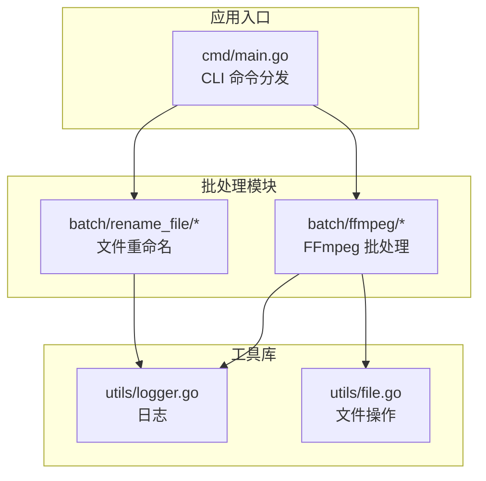
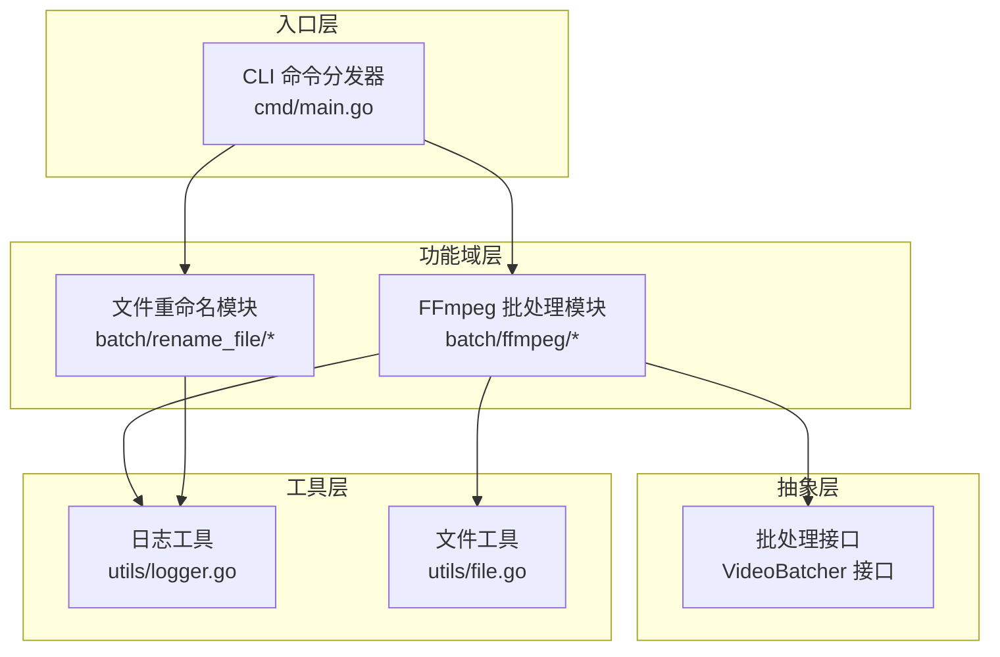
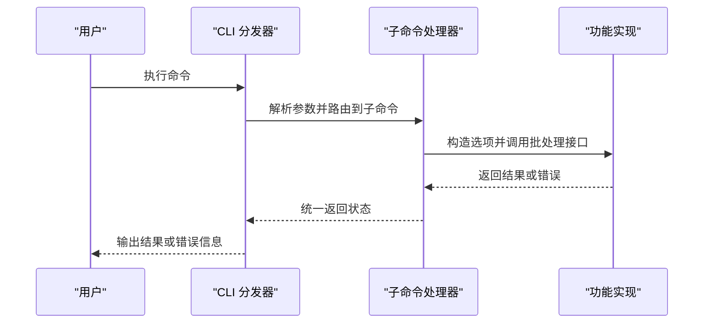
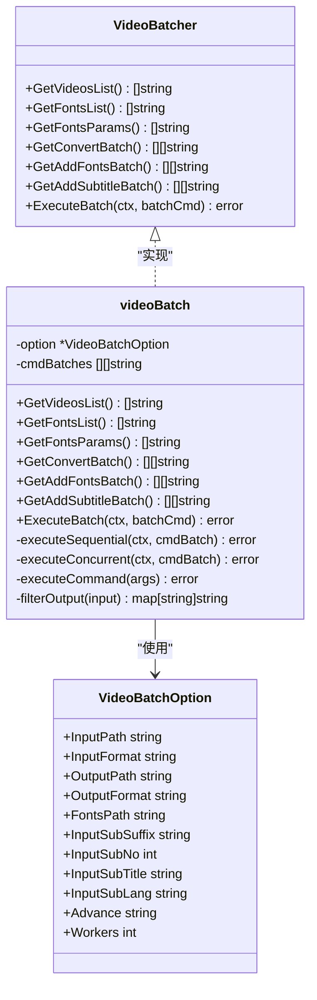
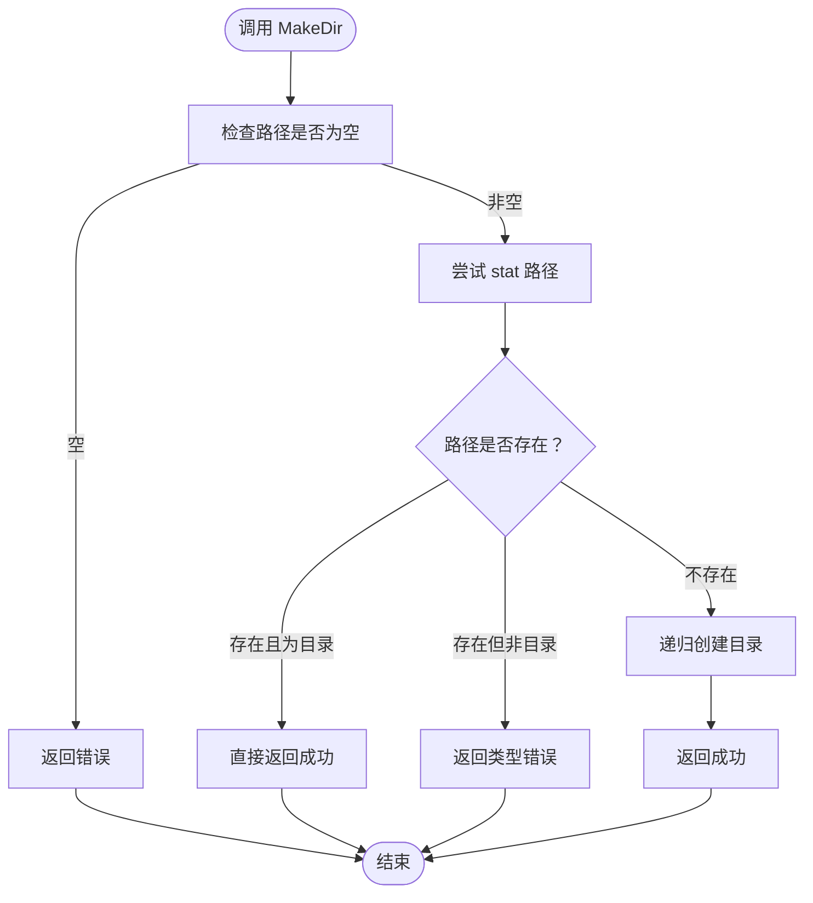
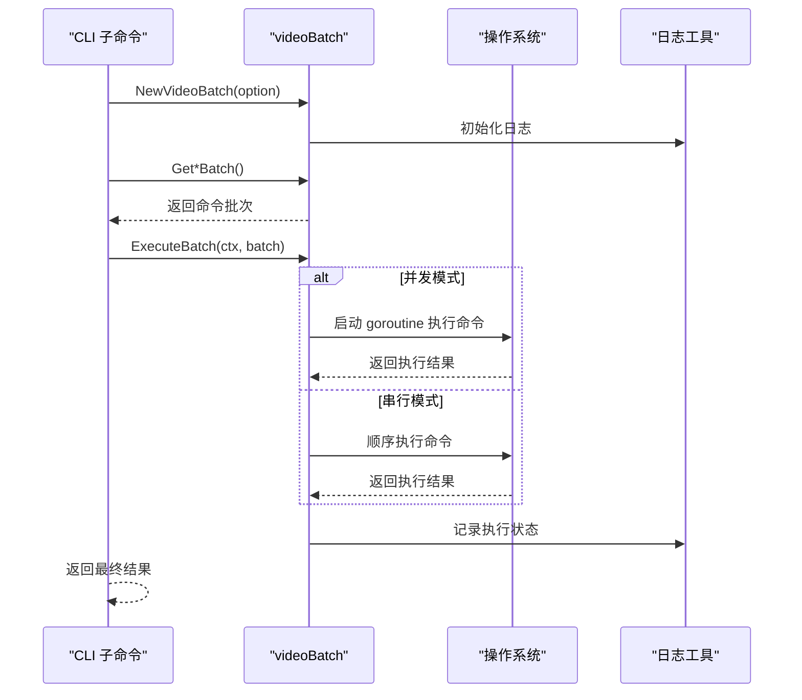
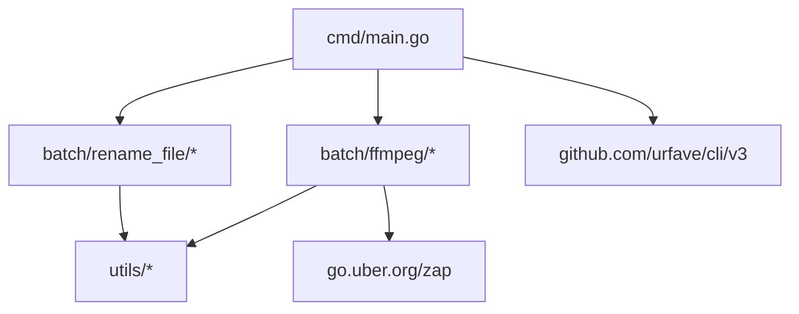

# 项目架构设计

<cite>
**本文档引用的文件**
- [cmd/main.go](file://cmd/main.go)
- [batch/ffmpeg/ffmpeg.go](file://batch/ffmpeg/ffmpeg.go)
- [batch/ffmpeg/init.go](file://batch/ffmpeg/init.go)
- [batch/ffmpeg/convert.go](file://batch/ffmpeg/convert.go)
- [batch/ffmpeg/add_sub.go](file://batch/ffmpeg/add_sub.go)
- [batch/ffmpeg/add_font.go](file://batch/ffmpeg/add_font.go)
- [batch/rename_file/init.go](file://batch/rename_file/init.go)
- [utils/logger.go](file://utils/logger.go)
- [utils/file.go](file://utils/file.go)
- [batch/ffmpeg/ffmpeg_test.go](file://batch/ffmpeg/ffmpeg_test.go)
- [utils/file_test.go](file://utils/file_test.go)
- [go.mod](file://go.mod)
- [docs/ffmpeg.md](file://docs/ffmpeg.md)
</cite>

## 目录
1. [简介](#简介)
2. [项目结构](#项目结构)
3. [核心组件](#核心组件)
4. [架构总览](#架构总览)
5. [详细组件分析](#详细组件分析)
6. [依赖关系分析](#依赖关系分析)
7. [性能考虑](#性能考虑)
8. [故障排除指南](#故障排除指南)
9. [结论](#结论)

## 简介
本项目是一个基于 Go 的命令行批处理工具，主要围绕多媒体文件（尤其是视频）的批量处理能力构建。其核心目标是通过 CLI 提供统一的入口，将不同类型的批处理任务（如视频格式转换、字幕添加、字体嵌入等）以模块化的方式组织与执行。项目采用分层架构与模块化设计，结合 CLI 命令分发机制、批处理模块的接口抽象以及通用工具库的封装，实现了良好的可扩展性与可维护性。

## 项目结构
项目采用按功能域划分的模块化布局：
- cmd：应用入口与 CLI 命令分发
- batch：各功能域的批处理模块（当前包含 ffmpeg 批处理与文件重命名）
- utils：通用工具库（日志、文件操作等）
- docs：用户文档与使用示例
- 测试：针对批处理模块与工具库的单元测试

图表来源
- [cmd/main.go:13-28](file://cmd/main.go#L13-L28)
- [batch/ffmpeg/init.go:62-71](file://batch/ffmpeg/init.go#L62-L71)
- [batch/rename_file/init.go:25-34](file://batch/rename_file/init.go#L25-L34)
- [utils/logger.go:11-28](file://utils/logger.go#L11-L28)
- [utils/file.go:8-31](file://utils/file.go#L8-L31)

章节来源
- [cmd/main.go:1-29](file://cmd/main.go#L1-L29)
- [batch/ffmpeg/init.go:1-72](file://batch/ffmpeg/init.go#L1-L72)
- [batch/rename_file/init.go:1-35](file://batch/rename_file/init.go#L1-L35)
- [utils/logger.go:1-29](file://utils/logger.go#L1-L29)
- [utils/file.go:1-32](file://utils/file.go#L1-L32)

## 核心组件
- CLI 命令分发器：负责注册子命令、解析参数并调用对应的功能模块
- 批处理接口与实现：定义统一的批处理抽象，屏蔽底层执行细节
- 工具库：提供日志记录与文件系统操作等基础能力
- 功能域模块：按功能拆分的子模块，每个模块内部包含命令定义、参数解析与执行逻辑

章节来源
- [cmd/main.go:13-28](file://cmd/main.go#L13-L28)
- [batch/ffmpeg/ffmpeg.go:30-64](file://batch/ffmpeg/ffmpeg.go#L30-L64)
- [utils/logger.go:11-28](file://utils/logger.go#L11-L28)
- [utils/file.go:8-31](file://utils/file.go#L8-L31)

## 架构总览
整体架构遵循“入口分发 + 模块化功能 + 抽象接口 + 工具库”的分层设计。CLI 入口集中管理所有子命令；每个功能域模块内部再细分为命令定义、参数解析与执行流程；批处理模块通过统一接口抽象对外暴露能力；工具库提供跨模块复用的日志与文件操作能力。

图表来源
- [cmd/main.go:13-28](file://cmd/main.go#L13-L28)
- [batch/ffmpeg/ffmpeg.go:30-64](file://batch/ffmpeg/ffmpeg.go#L30-L64)
- [batch/ffmpeg/init.go:62-71](file://batch/ffmpeg/init.go#L62-L71)
- [batch/rename_file/init.go:25-34](file://batch/rename_file/init.go#L25-L34)
- [utils/logger.go:11-28](file://utils/logger.go#L11-L28)
- [utils/file.go:8-31](file://utils/file.go#L8-L31)

## 详细组件分析

### CLI 命令分发机制
- 入口函数创建一个根命令，并注册子命令（如 ffmpeg、rename_file）
- 使用 urfave/cli/v3 进行参数解析与帮助信息展示
- 错误处理采用标准输出错误流，避免直接 panic，提升健壮性

图表来源
- [cmd/main.go:13-28](file://cmd/main.go#L13-L28)
- [batch/ffmpeg/convert.go:25-62](file://batch/ffmpeg/convert.go#L25-L62)
- [batch/ffmpeg/add_sub.go:45-85](file://batch/ffmpeg/add_sub.go#L45-L85)
- [batch/ffmpeg/add_font.go:30-67](file://batch/ffmpeg/add_font.go#L30-L67)

章节来源
- [cmd/main.go:1-29](file://cmd/main.go#L1-L29)

### 批处理模块组织方式
- 统一的批处理接口 VideoBatcher 定义了获取文件列表、生成命令批次、执行命令等方法
- 具体实现 videoBatch 封装了输入输出路径、并发度、命令生成与执行逻辑
- 通过 NewVideoBatch 工厂函数创建实例，确保输出目录存在并进行默认值校验

图表来源
- [batch/ffmpeg/ffmpeg.go:16-64](file://batch/ffmpeg/ffmpeg.go#L16-L64)
- [batch/ffmpeg/ffmpeg.go:40-63](file://batch/ffmpeg/ffmpeg.go#L40-L63)
- [batch/ffmpeg/ffmpeg.go:16-28](file://batch/ffmpeg/ffmpeg.go#L16-L28)

章节来源
- [batch/ffmpeg/ffmpeg.go:16-324](file://batch/ffmpeg/ffmpeg.go#L16-L324)

### 工具库抽象设计
- 日志工具：基于 zap 提供彩色控制台日志，包含时间、级别、调用者信息等字段
- 文件工具：封装目录创建逻辑，处理路径存在性与类型检查，避免重复创建

图表来源
- [utils/file.go:8-31](file://utils/file.go#L8-L31)

章节来源
- [utils/logger.go:11-28](file://utils/logger.go#L11-L28)
- [utils/file.go:8-31](file://utils/file.go#L8-L31)

### 设计模式应用
- 命令模式：CLI 子命令 Action 函数封装了具体的执行逻辑，便于扩展新的子命令
- 策略模式：VideoBatcher 接口定义了多种批处理策略（转换、添加字幕、添加字体），具体实现根据策略生成不同的命令序列
- 工厂模式：NewVideoBatch 工厂函数负责创建 videoBatch 实例，统一初始化与校验流程

章节来源
- [batch/ffmpeg/ffmpeg.go:47-64](file://batch/ffmpeg/ffmpeg.go#L47-L64)
- [batch/ffmpeg/convert.go:11-63](file://batch/ffmpeg/convert.go#L11-L63)
- [batch/ffmpeg/add_sub.go:11-88](file://batch/ffmpeg/add_sub.go#L11-L88)
- [batch/ffmpeg/add_font.go:11-69](file://batch/ffmpeg/add_font.go#L11-L69)

### 组件交互关系与数据流向
- 参数解析：CLI 子命令从命令行读取参数，构造 VideoBatchOption
- 命令生成：videoBatch 根据选项生成对应的命令批次（转换、添加字幕、添加字体）
- 执行控制：支持串行与并发两种执行模式，通过 context 控制取消
- 输出与日志：执行过程通过统一日志工具输出进度与错误信息

图表来源
- [batch/ffmpeg/ffmpeg.go:218-286](file://batch/ffmpeg/ffmpeg.go#L218-L286)
- [batch/ffmpeg/convert.go:25-62](file://batch/ffmpeg/convert.go#L25-L62)
- [batch/ffmpeg/add_sub.go:45-85](file://batch/ffmpeg/add_sub.go#L45-L85)
- [batch/ffmpeg/add_font.go:30-67](file://batch/ffmpeg/add_font.go#L30-L67)
- [utils/logger.go:11-28](file://utils/logger.go#L11-L28)

## 依赖关系分析
- 应用模块依赖第三方 CLI 框架与日志库
- 批处理模块依赖工具库与外部 ffmpeg 命令
- 模块间通过接口解耦，降低耦合度与循环依赖风险

图表来源
- [go.mod:5-9](file://go.mod#L5-L9)
- [cmd/main.go:8-10](file://cmd/main.go#L8-L10)
- [batch/ffmpeg/init.go:3-6](file://batch/ffmpeg/init.go#L3-L6)
- [batch/rename_file/init.go:6-8](file://batch/rename_file/init.go#L6-L8)

章节来源
- [go.mod:1-17](file://go.mod#L1-L17)
- [cmd/main.go:1-29](file://cmd/main.go#L1-L29)

## 性能考虑
- 并发执行：通过信号量控制并发数量，避免资源争用与过载
- 上下文取消：支持 context 取消，及时终止长时间运行的任务
- 命令生成优化：按需生成命令参数，减少不必要的 I/O 与计算
- 日志开销：使用结构化日志，避免频繁格式化带来的性能损耗

章节来源
- [batch/ffmpeg/ffmpeg.go:248-286](file://batch/ffmpeg/ffmpeg.go#L248-L286)
- [batch/ffmpeg/ffmpeg.go:218-231](file://batch/ffmpeg/ffmpeg.go#L218-L231)

## 故障排除指南
- CLI 参数错误：检查命令行参数是否正确传入，确认必填项与默认值
- 输出目录创建失败：确认输出路径权限与磁盘空间，避免路径为空或类型不匹配
- 执行中断：通过 context 取消机制中止执行，查看日志定位问题
- ffmpeg 未安装：确保系统环境已安装 ffmpeg，并在 PATH 中可用

章节来源
- [batch/ffmpeg/ffmpeg.go:288-299](file://batch/ffmpeg/ffmpeg.go#L288-L299)
- [utils/file.go:8-31](file://utils/file.go#L8-L31)
- [docs/ffmpeg.md:3-4](file://docs/ffmpeg.md#L3-L4)

## 结论
本项目通过清晰的分层架构与模块化设计，实现了 CLI 命令分发、批处理接口抽象与工具库复用的有机结合。借助命令模式、策略模式与工厂模式，系统在保持良好扩展性的同时，也兼顾了性能与可维护性。未来可在以下方面进一步完善：增加更多批处理策略、完善错误恢复与重试机制、引入配置文件支持以及增强测试覆盖率。