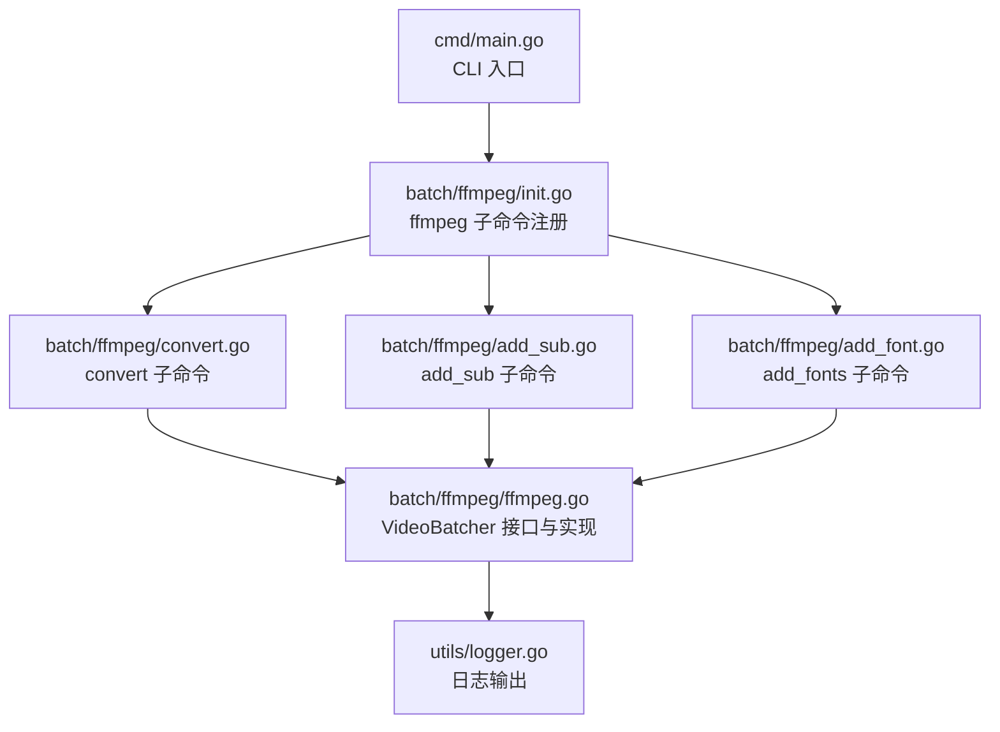
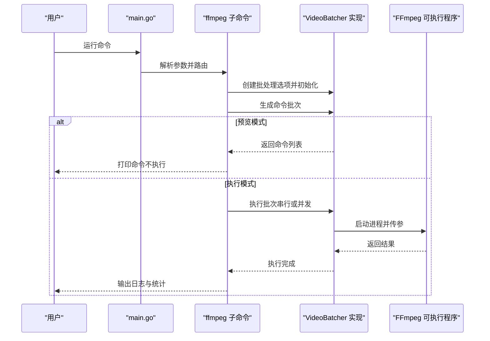
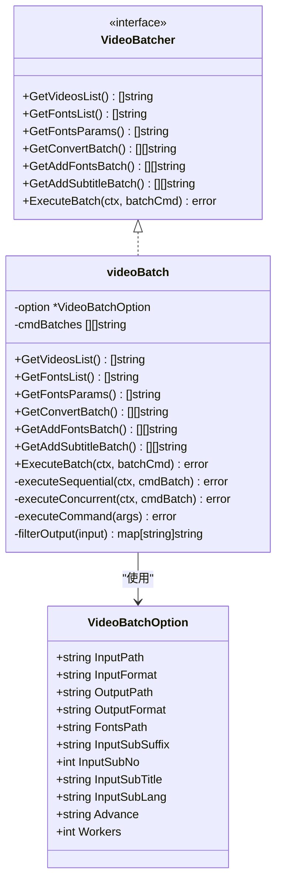
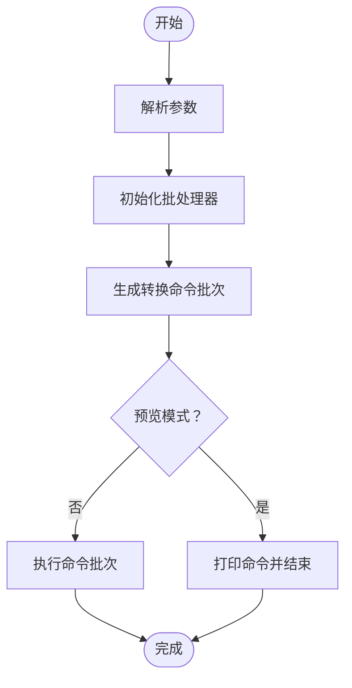
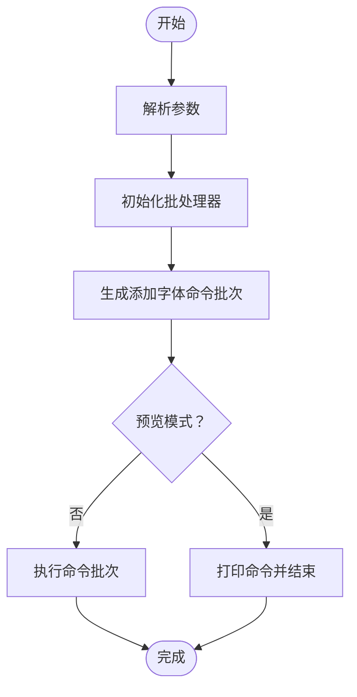
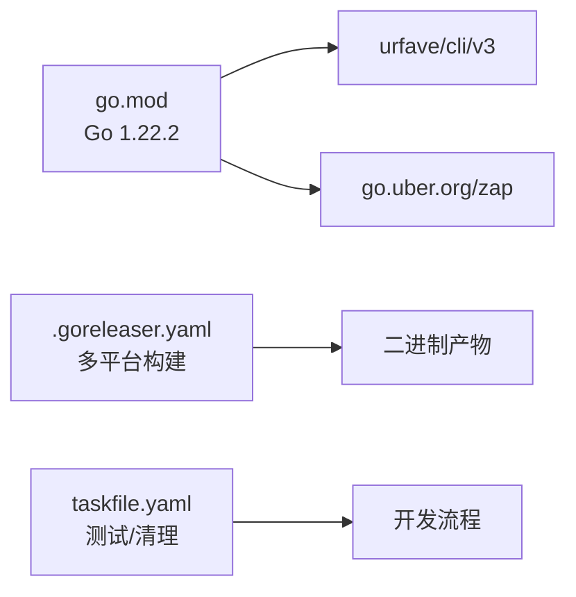

# 快速开始

<cite>
**本文引用的文件**
- [cmd/main.go](file://cmd/main.go)
- [batch/ffmpeg/ffmpeg.go](file://batch/ffmpeg/ffmpeg.go)
- [batch/ffmpeg/init.go](file://batch/ffmpeg/init.go)
- [batch/ffmpeg/convert.go](file://batch/ffmpeg/convert.go)
- [batch/ffmpeg/add_sub.go](file://batch/ffmpeg/add_sub.go)
- [batch/ffmpeg/add_font.go](file://batch/ffmpeg/add_font.go)
- [batch/rename_file/init.go](file://batch/rename_file/init.go)
- [utils/logger.go](file://utils/logger.go)
- [docs/ffmpeg.md](file://docs/ffmpeg.md)
- [.goreleaser.yaml](file://.goreleaser.yaml)
- [taskfile.yaml](file://taskfile.yaml)
- [go.mod](file://go.mod)
</cite>

## 目录
1. [简介](#简介)
2. [项目结构](#项目结构)
3. [核心组件](#核心组件)
4. [架构总览](#架构总览)
5. [详细组件分析](#详细组件分析)
6. [依赖分析](#依赖分析)
7. [性能考虑](#性能考虑)
8. [故障排除指南](#故障排除指南)
9. [结论](#结论)
10. [附录](#附录)

## 简介
本指南面向初学者与进阶用户，帮助您在最短时间内完成 batcher 工具的安装、配置与使用。该工具基于命令行界面，提供视频批量转换、字幕添加与字体嵌入等能力，并通过 FFmpeg 实现底层处理。文档覆盖：
- 环境要求与前置条件（Go 版本、FFmpeg 安装）
- 多种安装方式（源码编译、二进制下载）
- 基本使用示例（视频转换、字幕添加、文件重命名）
- 常见问题排查与最佳实践

## 项目结构
batcher 采用模块化设计，核心逻辑集中在 batch/ffmpeg 包中，CLI 入口位于 cmd/main.go，日志由 utils/logger 提供统一输出。

图表来源
- [cmd/main.go:13-28](file://cmd/main.go#L13-L28)
- [batch/ffmpeg/init.go:61-71](file://batch/ffmpeg/init.go#L61-L71)
- [batch/ffmpeg/convert.go:11-63](file://batch/ffmpeg/convert.go#L11-L63)
- [batch/ffmpeg/add_sub.go:11-87](file://batch/ffmpeg/add_sub.go#L11-L87)
- [batch/ffmpeg/add_font.go:11-68](file://batch/ffmpeg/add_font.go#L11-L68)
- [batch/ffmpeg/ffmpeg.go:30-64](file://batch/ffmpeg/ffmpeg.go#L30-L64)
- [utils/logger.go:11-28](file://utils/logger.go#L11-L28)

章节来源
- [cmd/main.go:13-28](file://cmd/main.go#L13-L28)
- [batch/ffmpeg/init.go:61-71](file://batch/ffmpeg/init.go#L61-L71)
- [batch/ffmpeg/convert.go:11-63](file://batch/ffmpeg/convert.go#L11-L63)
- [batch/ffmpeg/add_sub.go:11-87](file://batch/ffmpeg/add_sub.go#L11-L87)
- [batch/ffmpeg/add_font.go:11-68](file://batch/ffmpeg/add_font.go#L11-L68)
- [batch/ffmpeg/ffmpeg.go:30-64](file://batch/ffmpeg/ffmpeg.go#L30-L64)
- [utils/logger.go:11-28](file://utils/logger.go#L11-L28)

## 核心组件
- CLI 入口：负责注册 ffmpeg 与 rename_file 子命令，并处理错误输出。
- ffmpeg 批处理引擎：提供 VideoBatcher 接口及其实现，支持视频扫描、命令生成、并发执行。
- 子命令实现：convert、add_sub、add_fonts 分别对应“转换”“添加字幕”“添加字体”三大场景。
- 日志系统：基于 zap 的彩色控制台日志，便于调试与运行状态观察。

章节来源
- [cmd/main.go:13-28](file://cmd/main.go#L13-L28)
- [batch/ffmpeg/ffmpeg.go:30-64](file://batch/ffmpeg/ffmpeg.go#L30-L64)
- [batch/ffmpeg/convert.go:11-63](file://batch/ffmpeg/convert.go#L11-L63)
- [batch/ffmpeg/add_sub.go:11-87](file://batch/ffmpeg/add_sub.go#L11-L87)
- [batch/ffmpeg/add_font.go:11-68](file://batch/ffmpeg/add_font.go#L11-L68)
- [utils/logger.go:11-28](file://utils/logger.go#L11-L28)

## 架构总览
下图展示了从 CLI 到具体处理流程的调用链路与数据流向。

图表来源
- [cmd/main.go:13-28](file://cmd/main.go#L13-L28)
- [batch/ffmpeg/init.go:61-71](file://batch/ffmpeg/init.go#L61-L71)
- [batch/ffmpeg/ffmpeg.go:218-299](file://batch/ffmpeg/ffmpeg.go#L218-L299)
- [batch/ffmpeg/convert.go:25-62](file://batch/ffmpeg/convert.go#L25-L62)
- [batch/ffmpeg/add_sub.go:45-86](file://batch/ffmpeg/add_sub.go#L45-L86)
- [batch/ffmpeg/add_font.go:30-67](file://batch/ffmpeg/add_font.go#L30-L67)

## 详细组件分析

### CLI 入口与命令注册
- 注册 ffmpeg 与 rename_file 两个子命令。
- 错误统一输出至标准错误并退出非零码，便于脚本捕获。

章节来源
- [cmd/main.go:13-28](file://cmd/main.go#L13-L28)

### ffmpeg 批处理引擎（VideoBatcher）
- 数据结构与职责
  - VideoBatchOption：输入/输出路径、格式、字幕参数、字体路径、并发数等。
  - VideoBatcher 接口：列出视频、生成命令、执行批次。
  - videoBatch 实现：扫描目录、生成命令、串行/并发执行、输出路径去重。
- 关键算法
  - GetVideosList：遍历输入目录，按扩展名筛选视频。
  - GetFontsList：遍历字体目录，按扩展名筛选字体。
  - GetFontsParams：为每个字体生成附加参数。
  - GetConvertBatch / GetAddFontsBatch / GetAddSubtitleBatch：根据场景拼接 ffmpeg 参数。
  - ExecuteBatch：支持上下文取消与并发控制。
  - filterOutput：处理同名文件重命名冲突。
- 并发模型
  - 信号量控制最大并发数，WaitGroup 等待所有 goroutine 结束，首次错误记录并返回。

图表来源
- [batch/ffmpeg/ffmpeg.go:16-64](file://batch/ffmpeg/ffmpeg.go#L16-L64)
- [batch/ffmpeg/ffmpeg.go:30-64](file://batch/ffmpeg/ffmpeg.go#L30-L64)
- [batch/ffmpeg/ffmpeg.go:40-63](file://batch/ffmpeg/ffmpeg.go#L40-L63)

章节来源
- [batch/ffmpeg/ffmpeg.go:16-64](file://batch/ffmpeg/ffmpeg.go#L16-L64)
- [batch/ffmpeg/ffmpeg.go:66-87](file://batch/ffmpeg/ffmpeg.go#L66-L87)
- [batch/ffmpeg/ffmpeg.go:89-113](file://batch/ffmpeg/ffmpeg.go#L89-L113)
- [batch/ffmpeg/ffmpeg.go:115-135](file://batch/ffmpeg/ffmpeg.go#L115-L135)
- [batch/ffmpeg/ffmpeg.go:137-156](file://batch/ffmpeg/ffmpeg.go#L137-L156)
- [batch/ffmpeg/ffmpeg.go:158-178](file://batch/ffmpeg/ffmpeg.go#L158-L178)
- [batch/ffmpeg/ffmpeg.go:180-216](file://batch/ffmpeg/ffmpeg.go#L180-L216)
- [batch/ffmpeg/ffmpeg.go:218-299](file://batch/ffmpeg/ffmpeg.go#L218-L299)
- [batch/ffmpeg/ffmpeg.go:301-318](file://batch/ffmpeg/ffmpeg.go#L301-L318)

### convert 子命令
- 功能：批量视频格式转换。
- 关键参数：输入/输出路径与格式、高级自定义参数、并发数、预览开关。
- 流程：解析参数 -> 初始化批处理器 -> 生成转换命令 -> 执行或预览。

图表来源
- [batch/ffmpeg/convert.go:25-62](file://batch/ffmpeg/convert.go#L25-L62)
- [batch/ffmpeg/ffmpeg.go:137-156](file://batch/ffmpeg/ffmpeg.go#L137-L156)
- [batch/ffmpeg/ffmpeg.go:218-246](file://batch/ffmpeg/ffmpeg.go#L218-L246)

章节来源
- [batch/ffmpeg/convert.go:11-63](file://batch/ffmpeg/convert.go#L11-L63)
- [batch/ffmpeg/convert.go:25-62](file://batch/ffmpeg/convert.go#L25-L62)

### add_sub 子命令
- 功能：批量为视频添加字幕（单条），可选嵌入字体。
- 关键参数：字幕后缀、字幕编号/语言/标题、输入字体路径、并发数、预览开关。
- 流程：解析参数 -> 初始化批处理器 -> 生成添加字幕命令 -> 执行或预览。

图表来源
- [batch/ffmpeg/add_sub.go:45-86](file://batch/ffmpeg/add_sub.go#L45-L86)
- [batch/ffmpeg/ffmpeg.go:180-216](file://batch/ffmpeg/ffmpeg.go#L180-L216)
- [batch/ffmpeg/ffmpeg.go:218-246](file://batch/ffmpeg/ffmpeg.go#L218-L246)

章节来源
- [batch/ffmpeg/add_sub.go:11-87](file://batch/ffmpeg/add_sub.go#L11-L87)
- [batch/ffmpeg/add_sub.go:45-86](file://batch/ffmpeg/add_sub.go#L45-L86)

### add_fonts 子命令
- 功能：批量为视频嵌入字体文件。
- 关键参数：字体目录、输入/输出路径与格式、并发数、预览开关。
- 流程：解析参数 -> 初始化批处理器 -> 生成添加字体命令 -> 执行或预览。

图表来源
- [batch/ffmpeg/add_font.go:30-67](file://batch/ffmpeg/add_font.go#L30-L67)
- [batch/ffmpeg/ffmpeg.go:158-178](file://batch/ffmpeg/ffmpeg.go#L158-L178)
- [batch/ffmpeg/ffmpeg.go:218-246](file://batch/ffmpeg/ffmpeg.go#L218-L246)

章节来源
- [batch/ffmpeg/add_font.go:11-68](file://batch/ffmpeg/add_font.go#L11-L68)
- [batch/ffmpeg/add_font.go:30-67](file://batch/ffmpeg/add_font.go#L30-L67)

### rename_file 子命令（预留）
- 当前 Action 为空，预留后续实现文件重命名功能。
- 已定义输入路径与 MD5 开关标志位。

章节来源
- [batch/rename_file/init.go:25-34](file://batch/rename_file/init.go#L25-L34)

## 依赖分析
- Go 版本：项目使用 Go 1.22.2。
- 外部依赖：urfave/cli/v3（命令行框架）、go.uber.org/zap（日志）。
- 构建与发布：.goreleaser.yaml 定义跨平台构建与归档；taskfile.yaml 提供测试与清理任务。

图表来源
- [go.mod:3](file://go.mod#L3)
- [.goreleaser.yaml:14-40](file://.goreleaser.yaml#L14-L40)
- [taskfile.yaml:4-15](file://taskfile.yaml#L4-L15)

章节来源
- [go.mod:3](file://go.mod#L3)
- [.goreleaser.yaml:14-40](file://.goreleaser.yaml#L14-L40)
- [taskfile.yaml:4-15](file://taskfile.yaml#L4-L15)

## 性能考虑
- 并发执行：通过 workers 控制最大并发数，避免资源争用；默认串行以保证稳定性。
- 上下文取消：支持 context 取消，便于在长时间批处理中优雅中断。
- 输出去重：自动处理同名文件重命名，避免覆盖。
- 日志开销：建议在生产执行时关注日志级别，减少不必要的日志输出。

章节来源
- [batch/ffmpeg/ffmpeg.go:248-286](file://batch/ffmpeg/ffmpeg.go#L248-L286)
- [batch/ffmpeg/ffmpeg.go:301-318](file://batch/ffmpeg/ffmpeg.go#L301-L318)
- [utils/logger.go:11-28](file://utils/logger.go#L11-L28)

## 故障排除指南
- 无法找到 FFmpeg
  - 症状：执行时报错提示找不到 ffmpeg。
  - 处理：确保系统 PATH 中包含 FFmpeg 可执行文件；Windows 下需使用 ffmpeg.exe。
  - 参考：文档明确要求系统环境需预先安装 FFmpeg。
- 权限不足
  - 症状：无法读取输入目录或写入输出目录。
  - 处理：检查输入/输出路径权限，确保有读写权限。
- 字体或字幕未生效
  - 症状：添加字体或字幕后播放器仍无法识别。
  - 处理：确认字体目录结构与扩展名（ttf/otf/ttc），字幕后缀与语言设置正确。
- 并发导致资源占用过高
  - 症状：CPU/内存飙升。
  - 处理：降低 workers 数值，或改为串行执行。
- 预览模式无效
  - 症状：使用 dry-run 后仍有文件被修改。
  - 处理：确认是否正确传递了 dry-run 标志位。

章节来源
- [docs/ffmpeg.md:3](file://docs/ffmpeg.md#L3)
- [batch/ffmpeg/ffmpeg.go:288-299](file://batch/ffmpeg/ffmpeg.go#L288-L299)
- [batch/ffmpeg/add_font.go:22-27](file://batch/ffmpeg/add_font.go#L22-L27)
- [batch/ffmpeg/add_sub.go:24-43](file://batch/ffmpeg/add_sub.go#L24-L43)

## 结论
batcher 提供了简洁高效的视频批处理能力，结合 FFmpeg 的强大生态，能够满足日常批量转换、字幕与字体嵌入等需求。通过合理的参数配置与并发控制，可在保证稳定性的前提下提升处理效率。建议初学者先使用预览模式验证命令，再进行正式执行。

## 附录

### 环境要求与前置条件
- Go 版本：Go 1.22.2 或以上。
- FFmpeg：系统需预先安装并可从命令行直接调用（Windows 使用 ffmpeg.exe）。

章节来源
- [go.mod:3](file://go.mod#L3)
- [docs/ffmpeg.md:3](file://docs/ffmpeg.md#L3)

### 安装方式
- 源码编译
  - 步骤：克隆仓库 -> 进入项目目录 -> 执行构建（可使用 goreleaser 定义的构建参数）。
  - 参考：.goreleaser.yaml 定义了多平台构建与归档规则。
- 二进制下载
  - 步骤：访问发布页面下载对应平台压缩包 -> 解压 -> 将可执行文件加入 PATH。
  - 参考：.goreleaser.yaml 指定了目标平台与架构。

章节来源
- [.goreleaser.yaml:14-40](file://.goreleaser.yaml#L14-L40)

### 基本使用示例
- 视频转换
  - 示例：convert 子命令支持指定输入/输出路径与格式，以及高级自定义参数。
  - 参考：convert 子命令参数定义与帮助信息。
- 添加字幕
  - 示例：add_sub 子命令支持指定字幕后缀、语言、标题与字幕编号。
  - 参考：add_sub 子命令参数定义与帮助信息。
- 添加字体
  - 示例：add_fonts 子命令支持指定字体目录。
  - 参考：add_fonts 子命令参数定义与帮助信息。
- 预览命令
  - 示例：使用 dry-run 标志位预览即将执行的命令，不实际写入文件。
  - 参考：各子命令 Action 中对 dry-run 的处理。

章节来源
- [batch/ffmpeg/convert.go:11-63](file://batch/ffmpeg/convert.go#L11-L63)
- [batch/ffmpeg/add_sub.go:11-87](file://batch/ffmpeg/add_sub.go#L11-L87)
- [batch/ffmpeg/add_font.go:11-68](file://batch/ffmpeg/add_font.go#L11-L68)
- [batch/ffmpeg/convert.go:47-51](file://batch/ffmpeg/convert.go#L47-L51)
- [batch/ffmpeg/add_sub.go:71-76](file://batch/ffmpeg/add_sub.go#L71-L76)
- [batch/ffmpeg/add_font.go:52-57](file://batch/ffmpeg/add_font.go#L52-L57)