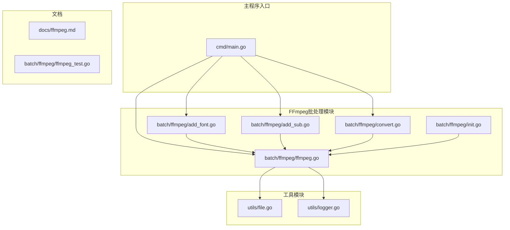
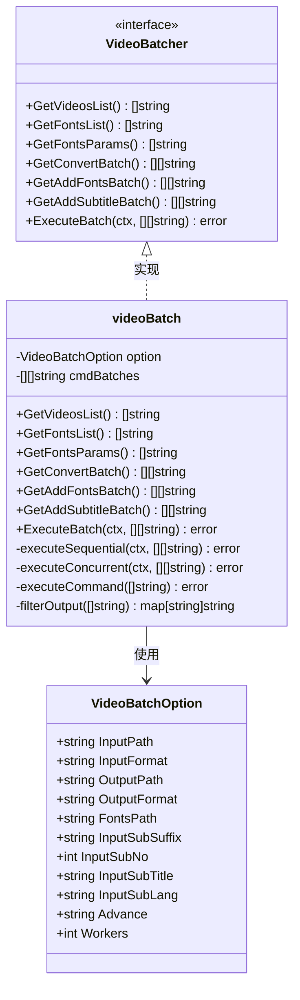
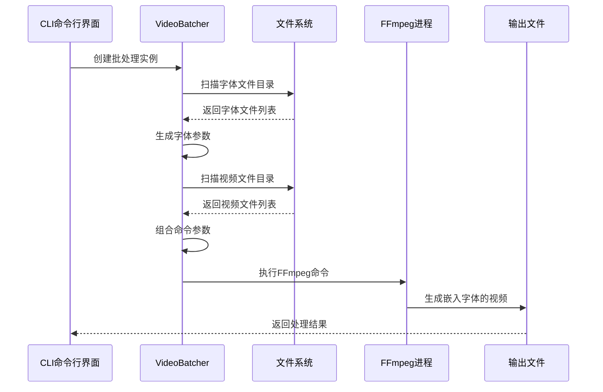
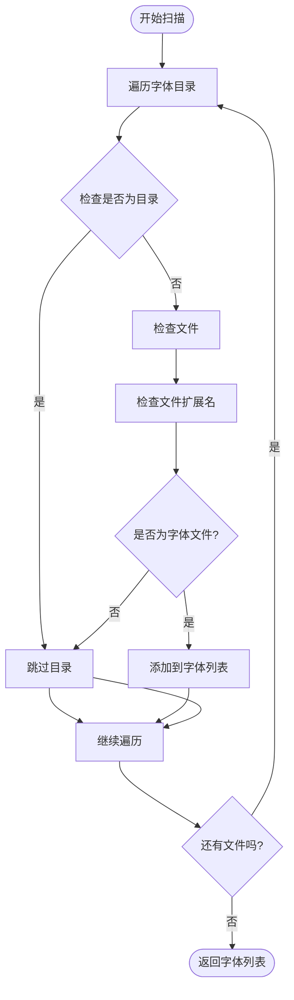
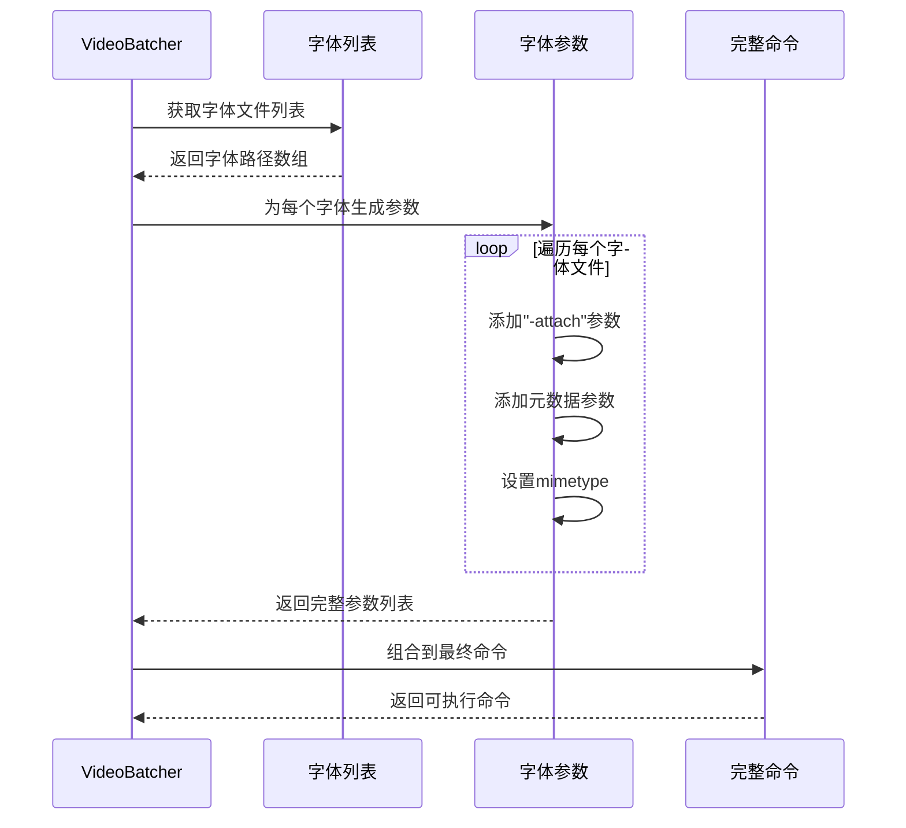
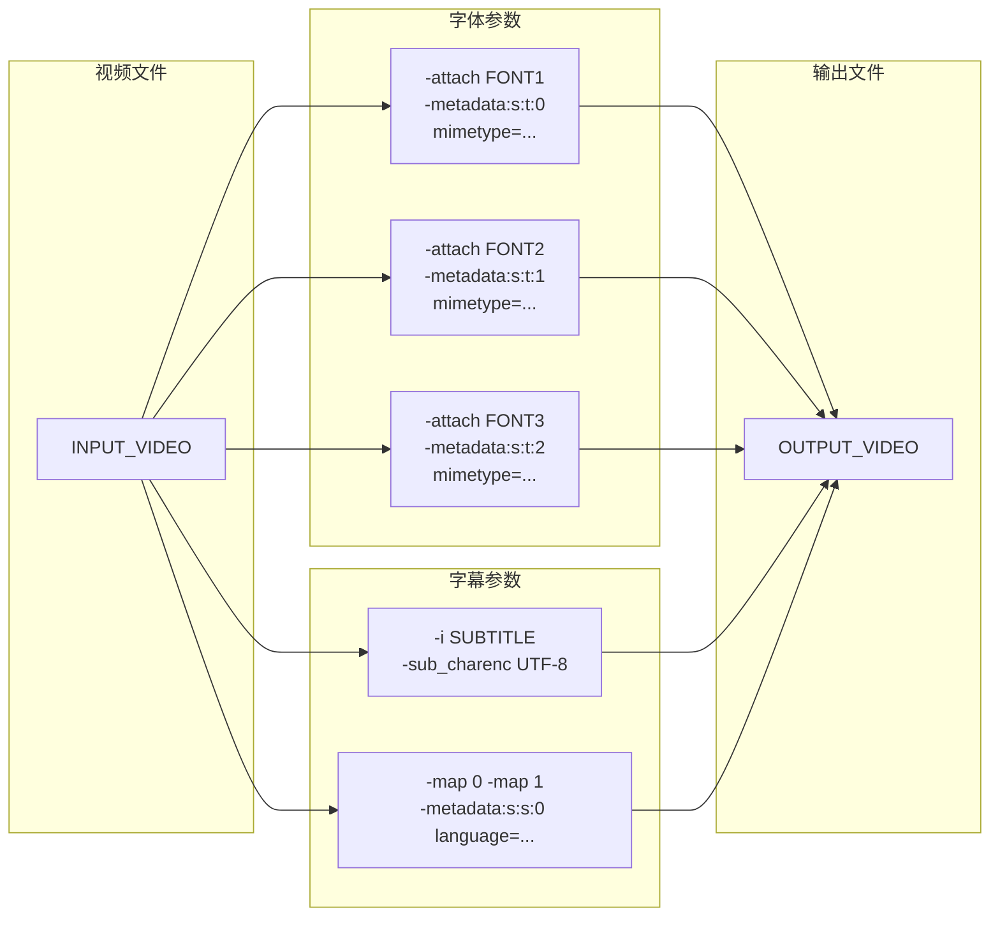
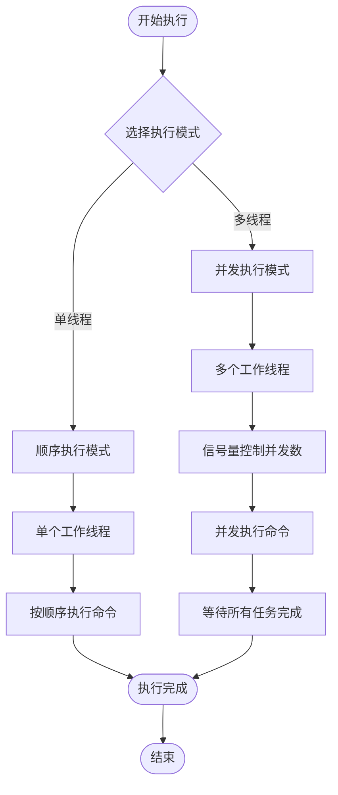
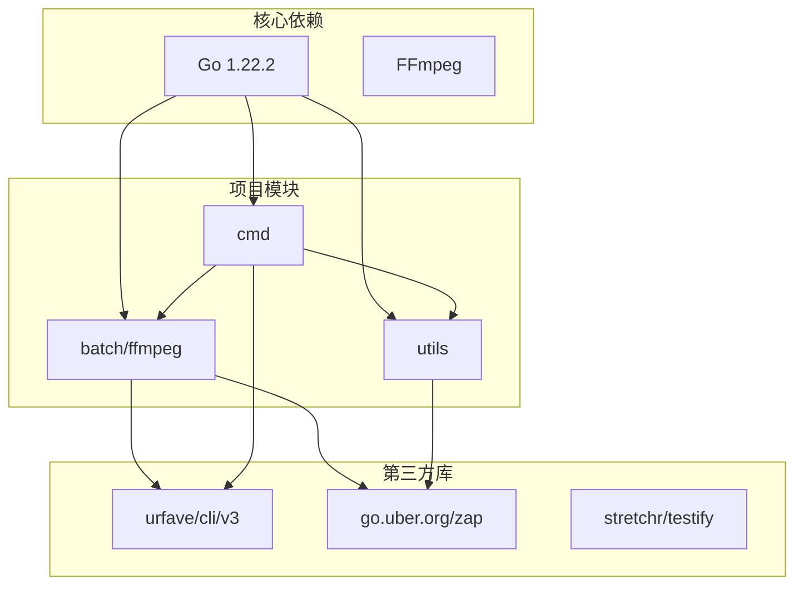
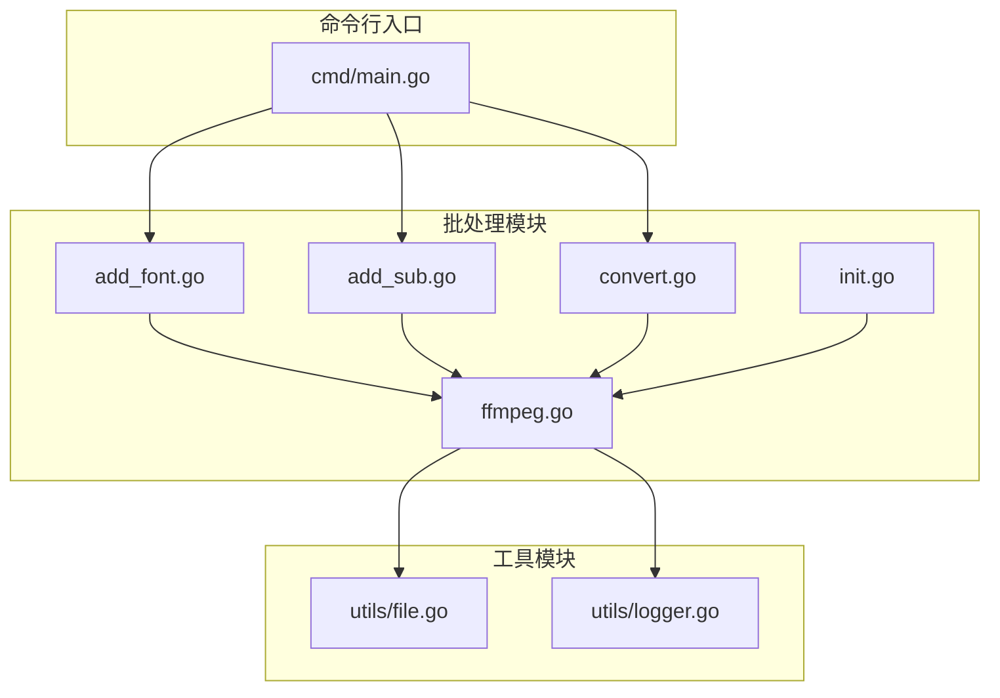

# 字体嵌入功能

<cite>
**本文档引用的文件**
- [add_font.go](file://batch/ffmpeg/add_font.go)
- [ffmpeg.go](file://batch/ffmpeg/ffmpeg.go)
- [init.go](file://batch/ffmpeg/init.go)
- [add_sub.go](file://batch/ffmpeg/add_sub.go)
- [convert.go](file://batch/ffmpeg/convert.go)
- [file.go](file://utils/file.go)
- [logger.go](file://utils/logger.go)
- [main.go](file://cmd/main.go)
- [ffmpeg.md](file://docs/ffmpeg.md)
- [ffmpeg_test.go](file://batch/ffmpeg/ffmpeg_test.go)
</cite>

## 目录
1. [简介](#简介)
2. [项目结构](#项目结构)
3. [核心组件](#核心组件)
4. [架构概览](#架构概览)
5. [详细组件分析](#详细组件分析)
6. [依赖关系分析](#依赖关系分析)
7. [性能考虑](#性能考虑)
8. [故障排除指南](#故障排除指南)
9. [结论](#结论)
10. [附录](#附录)

## 简介

本文档深入解析了批处理工具中的字体嵌入功能实现原理和技术细节。该功能允许用户将字体文件批量嵌入到视频文件中，确保视频在播放时能够正确显示文本内容，特别是在字幕渲染和特殊字符显示方面。

字体嵌入功能基于FFmpeg实现，支持多种字体格式（TTF、OTF、TTC），通过命令行参数构建和执行批处理任务。该功能与字幕添加功能协同工作，为视频内容提供完整的文本渲染支持。

## 项目结构

该项目采用模块化的Go语言架构，主要包含以下关键目录和文件：



**图表来源**
- [main.go:1-29](file://cmd/main.go#L1-L29)
- [ffmpeg.go:1-324](file://batch/ffmpeg/ffmpeg.go#L1-L324)
- [add_font.go:1-69](file://batch/ffmpeg/add_font.go#L1-L69)

**章节来源**
- [main.go:1-29](file://cmd/main.go#L1-L29)
- [ffmpeg.go:1-324](file://batch/ffmpeg/ffmpeg.go#L1-L324)

## 核心组件

### VideoBatcher接口设计

字体嵌入功能基于一个统一的批处理接口设计，该接口定义了所有批处理操作的标准方法：



**图表来源**
- [ffmpeg.go:16-38](file://batch/ffmpeg/ffmpeg.go#L16-L38)
- [ffmpeg.go:40-43](file://batch/ffmpeg/ffmpeg.go#L40-L43)

### 字体文件扫描机制

字体嵌入功能的核心在于对字体文件的精确扫描和过滤。系统支持以下字体格式：
- TTF (TrueType Font)
- OTF (OpenType Font)  
- TTC (TrueType Collection)

**章节来源**
- [ffmpeg.go:45](file://batch/ffmpeg/ffmpeg.go#L45)
- [ffmpeg.go:89-113](file://batch/ffmpeg/ffmpeg.go#L89-L113)

## 架构概览

字体嵌入功能在整个批处理系统中的位置和交互关系如下：



**图表来源**
- [add_font.go:30-67](file://batch/ffmpeg/add_font.go#L30-L67)
- [ffmpeg.go:158-178](file://batch/ffmpeg/ffmpeg.go#L158-L178)

## 详细组件分析

### 字体文件扫描与过滤

#### 目录遍历逻辑

字体扫描功能实现了递归目录遍历，支持深度搜索指定目录下的所有字体文件：



**图表来源**
- [ffmpeg.go:89-113](file://batch/ffmpeg/ffmpeg.go#L89-L113)

#### 支持的字体格式

系统明确支持以下字体格式：
- `.ttf` - TrueType Font格式
- `.otf` - OpenType Font格式  
- `.ttc` - TrueType Collection格式

这些格式的选择基于FFmpeg对字体文件的原生支持能力，确保嵌入的字体能够在各种播放器中正确识别和使用。

**章节来源**
- [ffmpeg.go:45](file://batch/ffmpeg/ffmpeg.go#L45)
- [ffmpeg.go:100-106](file://batch/ffmpeg/ffmpeg.go#L100-L106)

### FFmpeg命令构建过程

#### 字体参数生成逻辑

字体嵌入的核心在于正确构建FFmpeg命令参数。每个字体文件都会生成对应的命令参数：



**图表来源**
- [ffmpeg.go:115-135](file://batch/ffmpeg/ffmpeg.go#L115-L135)

#### 参数组合策略

字体参数的生成遵循特定的组合策略：

1. **-attach 参数**：每个字体文件对应一个 `-attach` 参数，指向具体的字体文件路径
2. **元数据参数**：使用 `-metadata:s:t:n` 格式，其中 `n` 是字体在序列中的索引
3. **mimetype设置**：所有字体都设置为 `application/x-truetype-font`

**章节来源**
- [ffmpeg.go:125-132](file://batch/ffmpeg/ffmpeg.go#L125-L132)

### 字体嵌入与字幕添加的协同机制

#### 共享参数传递

字体嵌入功能与字幕添加功能共享相同的参数传递机制：



**图表来源**
- [ffmpeg.go:180-216](file://batch/ffmpeg/ffmpeg.go#L180-L216)

#### 参数合并策略

当同时进行字体嵌入和字幕添加时，系统会自动合并所有参数：

1. **基础参数**：输入视频和复制编解码器参数
2. **字幕参数**：字幕文件输入和相关元数据设置
3. **字体参数**：所有字体文件的嵌入参数
4. **输出参数**：目标文件路径

**章节来源**
- [ffmpeg.go:208-210](file://batch/ffmpeg/ffmpeg.go#L208-L210)

### 执行流程控制

#### 并发执行机制

系统支持两种执行模式：



**图表来源**
- [ffmpeg.go:218-286](file://batch/ffmpeg/ffmpeg.go#L218-L286)

**章节来源**
- [ffmpeg.go:225-230](file://batch/ffmpeg/ffmpeg.go#L225-L230)
- [ffmpeg.go:248-286](file://batch/ffmpeg/ffmpeg.go#L248-L286)

## 依赖关系分析

### 外部依赖

项目的主要外部依赖包括：



**图表来源**
- [go.mod:1-17](file://go.mod#L1-L17)

### 内部模块依赖

各模块之间的依赖关系清晰明确：



**图表来源**
- [main.go:13-28](file://cmd/main.go#L13-L28)
- [add_font.go:11-68](file://batch/ffmpeg/add_font.go#L11-L68)

**章节来源**
- [go.mod:5-16](file://go.mod#L5-L16)

## 性能考虑

### 内存使用优化

字体嵌入功能在内存使用方面采用了多项优化策略：

1. **延迟加载**：字体文件只在需要时才被读取和处理
2. **流式处理**：大量文件处理时采用流式遍历而非一次性加载
3. **参数复用**：生成的命令参数在内存中复用，避免重复分配

### 并发性能

系统提供了灵活的并发控制机制：

- **默认单线程**：确保稳定性和资源占用最小化
- **可配置并发数**：通过 `workers` 参数控制最大并发数
- **信号量控制**：使用信号量精确控制同时执行的任务数量

### 文件系统性能

- **目录遍历优化**：使用 `filepath.Walk` 进行高效的递归遍历
- **缓存机制**：已扫描的文件信息在当前会话内缓存
- **错误处理**：对文件系统错误进行优雅处理，避免性能损失

## 故障排除指南

### 常见问题及解决方案

#### 字体文件未被识别

**问题描述**：字体文件虽然存在于目录中但未被系统识别

**可能原因**：
1. 字体文件扩展名不在支持列表中
2. 字体文件损坏或格式不正确
3. 权限问题导致无法访问文件

**解决方案**：
1. 检查字体文件扩展名是否为 `.ttf`、`.otf` 或 `.ttc`
2. 验证字体文件完整性
3. 确认有足够的文件系统权限

#### FFmpeg执行失败

**问题描述**：字体嵌入命令执行失败

**可能原因**：
1. FFmpeg未正确安装或配置
2. 输入视频文件路径错误
3. 输出目录权限不足

**解决方案**：
1. 确认FFmpeg已正确安装并可在系统PATH中找到
2. 检查输入视频文件路径的有效性
3. 确保输出目录存在且具有写入权限

#### 并发执行异常

**问题描述**：多线程执行时出现资源竞争或性能问题

**解决方案**：
1. 减少并发数设置
2. 检查系统资源使用情况
3. 考虑使用单线程模式进行调试

**章节来源**
- [ffmpeg.go:218-286](file://batch/ffmpeg/ffmpeg.go#L218-L286)

## 结论

字体嵌入功能通过精心设计的架构和实现，为视频处理提供了强大的字体管理能力。该功能的主要优势包括：

1. **格式支持广泛**：支持TTF、OTF、TTC三种主流字体格式
2. **自动化程度高**：自动扫描和参数生成，减少人工干预
3. **性能优化良好**：支持单线程和多线程执行模式
4. **错误处理完善**：提供详细的错误信息和恢复机制
5. **与其他功能集成**：与字幕添加功能无缝协作

该功能特别适用于需要批量处理视频文件并确保字体正确显示的场景，如字幕制作、视频本地化等应用场景。

## 附录

### 使用示例

#### 基本字体嵌入命令

```bash
# 基本字体嵌入
ffmpeg-batch add-fonts --input-path="videos" --input-fonts-path="fonts" --output-path="result"

# 预览命令而不执行
ffmpeg-batch add-fonts --input-path="videos" --input-fonts-path="fonts" --output-path="result" --dry-run

# 并发执行
ffmpeg-batch add-fonts --input-path="videos" --input-fonts-path="fonts" --output-path="result" --workers=4
```

#### 批量字体嵌入最佳实践

1. **字体文件组织**：将字体文件放在单独的目录中，便于管理和扫描
2. **命名规范**：使用清晰的字体文件命名，避免重复和混淆
3. **测试验证**：先使用 `--dry-run` 参数验证命令生成的正确性
4. **性能调优**：根据系统资源调整并发数设置

#### 字体参数优化建议

1. **字体选择**：优先选择开源字体以确保兼容性
2. **文件大小**：注意字体文件大小对最终视频文件的影响
3. **格式选择**：根据目标平台选择合适的字体格式
4. **版本管理**：维护字体版本记录，便于问题追踪

### 技术规格

#### 支持的字体格式
- TrueType Font (.ttf)
- OpenType Font (.otf)  
- TrueType Collection (.ttc)

#### 系统要求
- Go 1.22.2 或更高版本
- FFmpeg 4.0 或更高版本
- 足够的磁盘空间存储中间文件

#### 性能指标
- 单线程模式：适合小规模处理和调试
- 多线程模式：适合大规模批量处理
- 内存使用：与字体文件数量和大小成正比