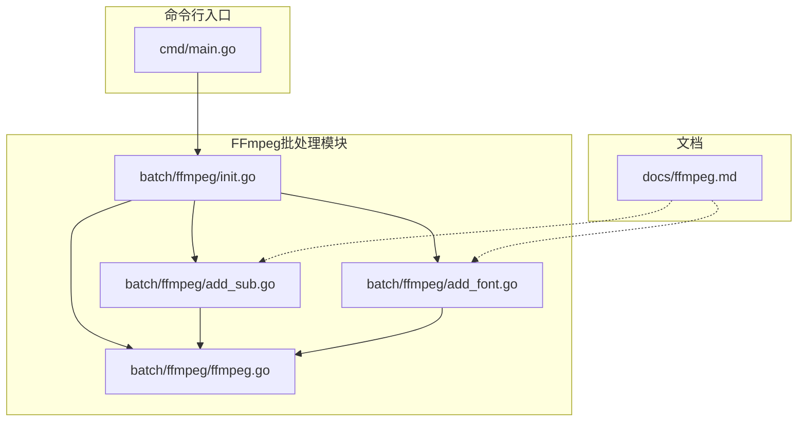
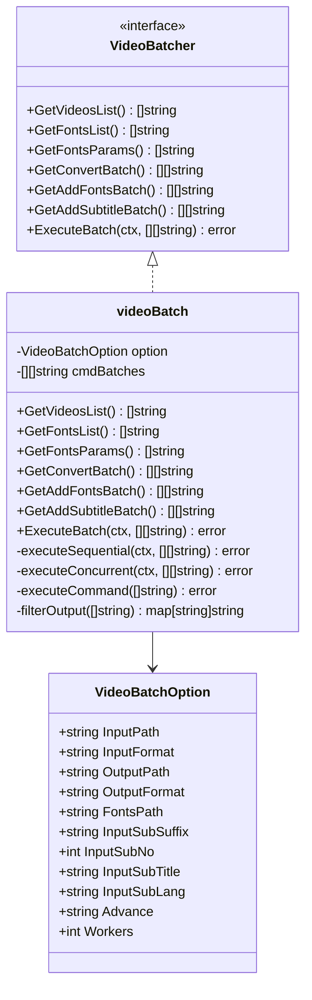
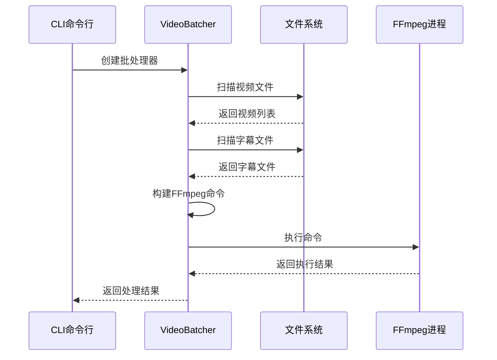
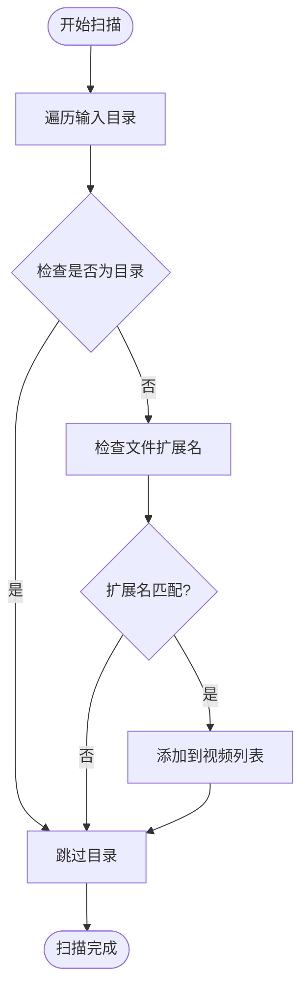
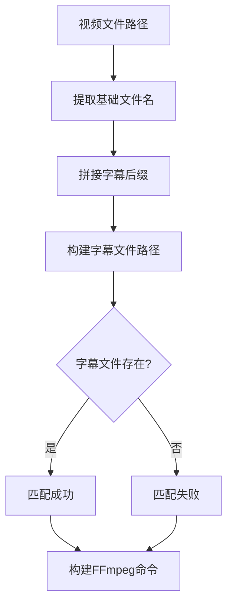
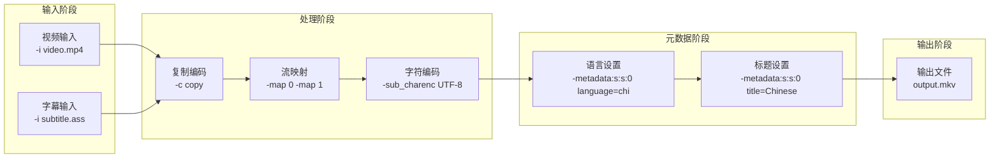
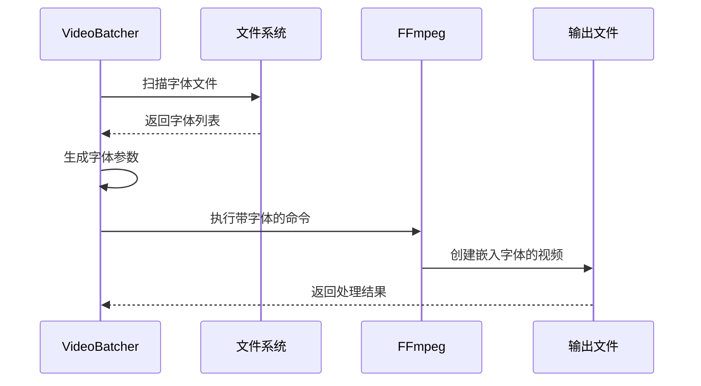
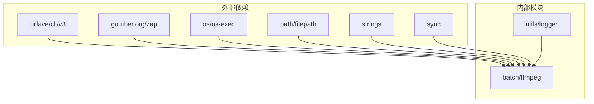
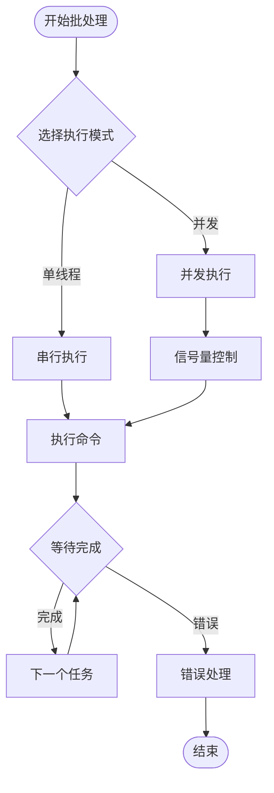

# 字幕添加功能

<cite>
**本文档引用的文件**
- [add_sub.go](file://batch/ffmpeg/add_sub.go)
- [ffmpeg.go](file://batch/ffmpeg/ffmpeg.go)
- [init.go](file://batch/ffmpeg/init.go)
- [add_font.go](file://batch/ffmpeg/add_font.go)
- [ffmpeg.md](file://docs/ffmpeg.md)
- [main.go](file://cmd/main.go)
- [ffmpeg_test.go](file://batch/ffmpeg/ffmpeg_test.go)
</cite>

## 目录
1. [简介](#简介)
2. [项目结构](#项目结构)
3. [核心组件](#核心组件)
4. [架构概览](#架构概览)
5. [详细组件分析](#详细组件分析)
6. [依赖关系分析](#依赖关系分析)
7. [性能考虑](#性能考虑)
8. [故障排除指南](#故障排除指南)
9. [结论](#结论)

## 简介

本项目是一个基于FFmpeg的视频批量处理工具，专门用于自动化视频文件的字幕添加、字体嵌入和格式转换。本文档专注于字幕添加功能的技术实现和配置方法，详细说明了字幕文件的扫描和匹配机制、FFmpeg命令构建过程以及相关的配置选项。

该工具通过命令行接口提供三种主要功能：
- 视频格式转换（convert）
- 批量添加字幕（add_sub）
- 批量添加字体（add_fonts）

## 项目结构

项目采用模块化的Go语言架构，主要包含以下关键目录和文件：

**图表来源**
- [main.go:13-28](file://cmd/main.go#L13-L28)
- [init.go:62-71](file://batch/ffmpeg/init.go#L62-L71)
- [add_sub.go:11-87](file://batch/ffmpeg/add_sub.go#L11-L87)
- [add_font.go:11-68](file://batch/ffmpeg/add_font.go#L11-L68)

**章节来源**
- [main.go:13-28](file://cmd/main.go#L13-L28)
- [init.go:62-71](file://batch/ffmpeg/init.go#L62-L71)

## 核心组件

### 视频批处理器接口

系统的核心是`VideoBatcher`接口，定义了所有批处理操作的标准方法：

**图表来源**
- [ffmpeg.go:30-43](file://batch/ffmpeg/ffmpeg.go#L30-L43)
- [ffmpeg.go:16-28](file://batch/ffmpeg/ffmpeg.go#L16-L28)
- [ffmpeg.go:40-43](file://batch/ffmpeg/ffmpeg.go#L40-L43)

### 字幕添加命令配置

字幕添加功能通过CLI命令实现，支持多种配置选项：

| 配置选项 | 类型 | 默认值 | 描述 |
|---------|------|--------|------|
| input_path | StringFlag | "./" | 源视频路径 |
| input_format | StringFlag | "mp4" | 源视频后缀 |
| output_path | StringFlag | "./result/" | 输出文件存储位置 |
| output_format | StringFlag | "mkv" | 输出视频后缀 |
| input_sub_suffix | StringFlag | "ass" | 字幕后缀 |
| input_sub_no | IntFlag | 0 | 字幕流位置 |
| input_sub_lang | StringFlag | "chi" | 字幕语言缩写 |
| input_sub_title | StringFlag | "Chinese" | 字幕标题 |
| input_fonts_path | StringFlag | 无 | 字体文件夹路径 |
| workers | IntFlag | 1 | 并发工作数 |

**章节来源**
- [add_sub.go:16-44](file://batch/ffmpeg/add_sub.go#L16-L44)
- [init.go:8-56](file://batch/ffmpeg/init.go#L8-L56)

## 架构概览

系统采用分层架构设计，实现了清晰的关注点分离：

**图表来源**
- [add_sub.go:45-86](file://batch/ffmpeg/add_sub.go#L45-L86)
- [ffmpeg.go:180-216](file://batch/ffmpeg/ffmpeg.go#L180-L216)

## 详细组件分析

### 字幕文件扫描和匹配机制

#### 文件扫描策略

系统通过递归遍历输入目录来发现视频文件：

**图表来源**
- [ffmpeg.go:66-87](file://batch/ffmpeg/ffmpeg.go#L66-L87)

#### 字幕文件匹配逻辑

字幕文件与视频文件的匹配基于文件名约定：

**图表来源**
- [ffmpeg.go:193-195](file://batch/ffmpeg/ffmpeg.go#L193-L195)

#### 字幕文件命名规则

系统遵循严格的命名约定来确保字幕文件能够正确匹配：
- 字幕文件名必须与对应视频文件同名
- 字幕文件扩展名由`input_sub_suffix`参数指定
- 支持的字幕格式包括ASS、SRT等

**章节来源**
- [ffmpeg.go:193-195](file://batch/ffmpeg/ffmpeg.go#L193-L195)
- [add_sub.go:24-28](file://batch/ffmpeg/add_sub.go#L24-L28)

### FFmpeg命令构建过程

#### 基础命令结构

字幕添加的核心FFmpeg命令包含以下关键部分：

**图表来源**
- [ffmpeg.go:197-212](file://batch/ffmpeg/ffmpeg.go#L197-L212)

#### 命令参数详解

| 参数 | 作用 | 示例值 | 说明 |
|------|------|--------|------|
| `-i` | 输入文件 | `INPUT.mp4` | 指定视频输入文件 |
| `-i` | 字幕输入 | `INPUT.ass` | 指定字幕输入文件 |
| `-sub_charenc` | 字符编码 | `UTF-8` | 指定字幕字符编码 |
| `-map` | 流映射 | `0, 1` | 指定要包含的媒体流 |
| `-c copy` | 复制编码 | `copy` | 直接复制而不重新编码 |
| `-metadata:s:s:0` | 字幕元数据 | `language=chi` | 设置字幕语言 |
| `-metadata:s:s:0` | 字幕标题 | `title=Chinese` | 设置字幕标题 |

**章节来源**
- [ffmpeg.go:197-212](file://batch/ffmpeg/ffmpeg.go#L197-L212)

### 字幕参数配置选项

#### InputSubSuffix（字幕后缀）

- **作用**：指定字幕文件的扩展名
- **默认值**：`ass`
- **支持格式**：ASS、SRT、VTT等
- **匹配机制**：与视频文件同名但扩展名为该值

#### InputSubNo（字幕编号）

- **作用**：指定字幕在媒体容器中的流位置
- **默认值**：`0`
- **取值范围**：非负整数
- **影响**：决定字幕在播放器中的显示顺序

#### InputSubTitle（字幕标题）

- **作用**：设置字幕的显示标题
- **默认值**：`Chinese`
- **用途**：在播放器界面中显示字幕名称
- **格式**：任意字符串

#### InputSubLang（字幕语言）

- **作用**：设置字幕的语言标识
- **默认值**：`chi`
- **标准**：遵循ISO 639-2标准
- **常见值**：`chi`（中文）、`eng`（英语）、`jpn`（日语）

**章节来源**
- [add_sub.go:24-43](file://batch/ffmpeg/add_sub.go#L24-L43)
- [ffmpeg.go:16-28](file://batch/ffmpeg/ffmpeg.go#L16-L28)

### 字体嵌入协同工作机制

#### 字体文件识别

系统自动扫描字体文件夹，支持的字体格式：
- `.ttf` - TrueType字体
- `.otf` - OpenType字体  
- `.ttc` - TrueType集合字体

#### 字体嵌入流程

**图表来源**
- [ffmpeg.go:115-135](file://batch/ffmpeg/ffmpeg.go#L115-L135)

#### 字体参数生成

每个字体文件生成对应的FFmpeg参数：
- `-attach`：嵌入字体文件
- `-metadata:s:t:n`：设置字体元数据
- `mimetype=application/x-truetype-font`：指定字体类型

**章节来源**
- [ffmpeg.go:115-135](file://batch/ffmpeg/ffmpeg.go#L115-L135)

## 依赖关系分析

### 组件耦合度

系统采用了良好的模块化设计，各组件之间的耦合度较低：

**图表来源**
- [ffmpeg.go:3-14](file://batch/ffmpeg/ffmpeg.go#L3-L14)

### 关键依赖关系

1. **CLI框架依赖**：使用urfave/cli/v3进行命令行解析
2. **日志系统依赖**：集成go.uber.org/zap进行结构化日志记录
3. **操作系统依赖**：依赖os和os/exec包执行FFmpeg命令
4. **文件系统依赖**：使用path/filepath和strings包处理文件路径

**章节来源**
- [ffmpeg.go:3-14](file://batch/ffmpeg/ffmpeg.go#L3-L14)

## 性能考虑

### 并发执行模型

系统支持两种执行模式：

#### 单线程模式
- **适用场景**：小规模批处理、内存受限环境
- **特点**：串行执行，资源占用低
- **优势**：简单可靠，易于调试

#### 并发模式
- **适用场景**：大规模批处理、高性能需求
- **特点**：多协程并行执行
- **优势**：显著提升处理速度

### 内存管理

- **文件列表缓存**：一次性加载所有待处理文件
- **命令参数缓存**：复用生成的FFmpeg参数
- **输出路径映射**：避免重复计算输出路径

### 执行优化

**图表来源**
- [ffmpeg.go:218-286](file://batch/ffmpeg/ffmpeg.go#L218-L286)

## 故障排除指南

### 常见问题及解决方案

#### 字幕文件未找到

**症状**：字幕添加失败，提示找不到字幕文件
**原因**：
- 字幕文件名与视频文件不匹配
- 字幕文件扩展名不正确
- 字幕文件不在同一目录下

**解决方法**：
1. 确认字幕文件与视频文件同名
2. 检查`input_sub_suffix`参数设置
3. 验证字幕文件路径正确性

#### FFmpeg命令执行失败

**症状**：FFmpeg返回错误码
**原因**：
- FFmpeg未正确安装或路径不可用
- 输入文件损坏
- 权限不足

**解决方法**：
1. 确认FFmpeg已正确安装
2. 检查输入文件完整性
3. 验证文件读写权限

#### 并发执行异常

**症状**：并发模式下出现资源竞争
**原因**：
- 并发数设置过高
- 系统资源不足

**解决方法**：
1. 降低`workers`参数值
2. 监控系统资源使用情况
3. 考虑使用单线程模式

### 调试技巧

#### 启用干运行模式

使用`--dry-run`标志可以预览将要执行的命令：
- 不实际执行FFmpeg命令
- 在日志中显示完整命令行
- 便于验证参数配置正确性

#### 日志分析

系统提供详细的日志输出：
- 错误级别日志：显示具体错误信息
- 信息级别日志：显示处理进度
- 调试级别日志：显示详细执行过程

**章节来源**
- [add_sub.go:71-76](file://batch/ffmpeg/add_sub.go#L71-L76)
- [ffmpeg.go:218-286](file://batch/ffmpeg/ffmpeg.go#L218-L286)

## 结论

本字幕添加功能通过精心设计的架构实现了高效、可靠的视频批处理能力。系统的主要优势包括：

### 技术优势

1. **模块化设计**：清晰的接口分离和依赖管理
2. **灵活配置**：丰富的参数选项满足不同需求
3. **性能优化**：支持并发执行和资源管理
4. **错误处理**：完善的错误检测和恢复机制

### 功能特性

1. **智能文件匹配**：基于文件名约定的字幕匹配
2. **元数据管理**：完整的字幕语言和标题设置
3. **字体嵌入**：自动字体文件扫描和嵌入
4. **批处理能力**：支持大规模视频文件处理

### 应用场景

- 影视作品批量字幕添加
- 在线教育视频字幕处理
- 多语言内容本地化
- 视频内容二次创作

该系统为视频内容创作者和处理者提供了强大而易用的工具，能够显著提高字幕处理的效率和质量。