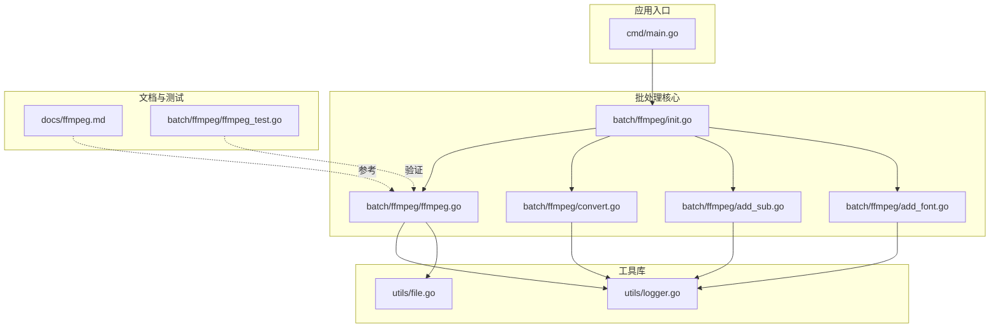
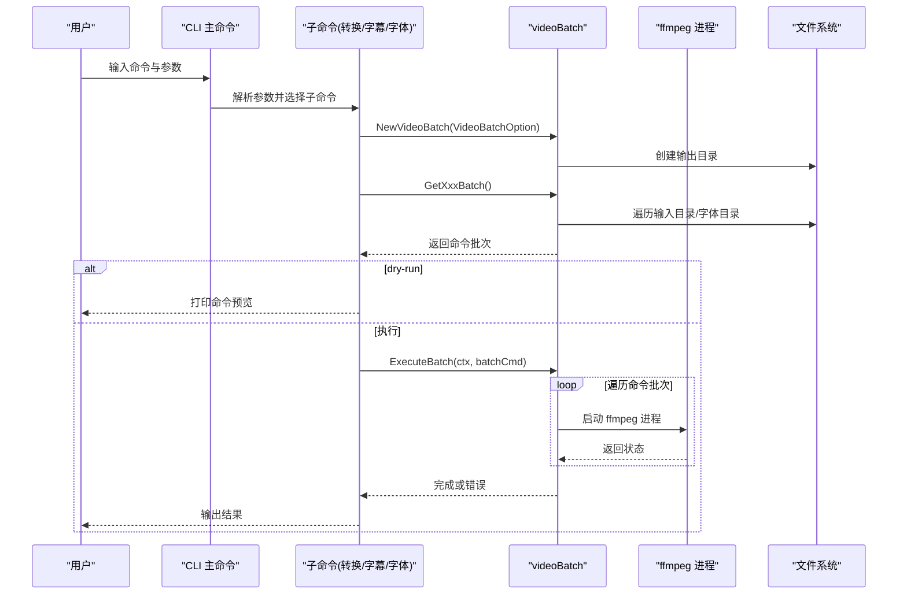
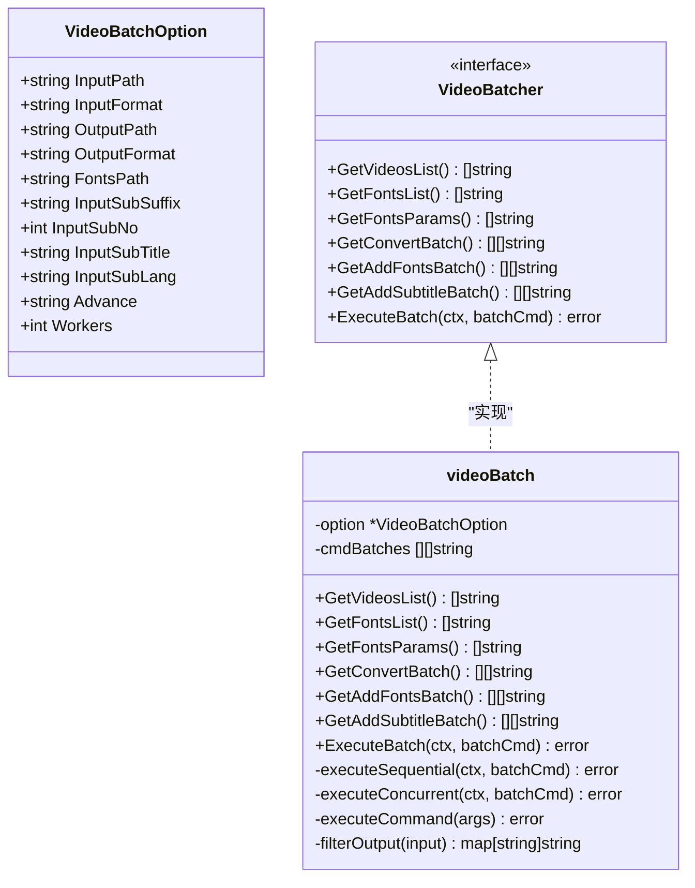
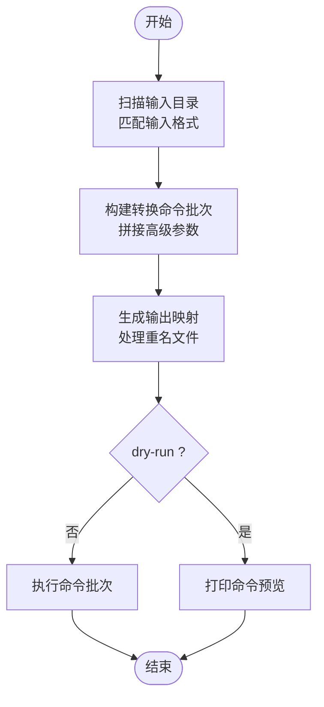
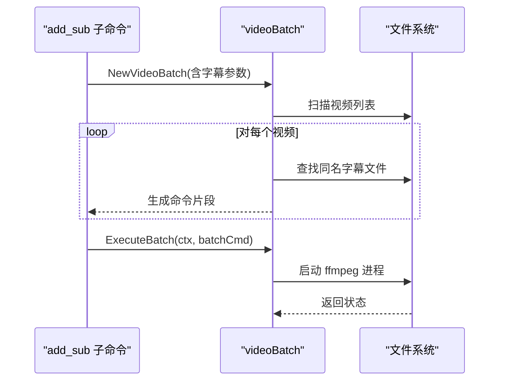
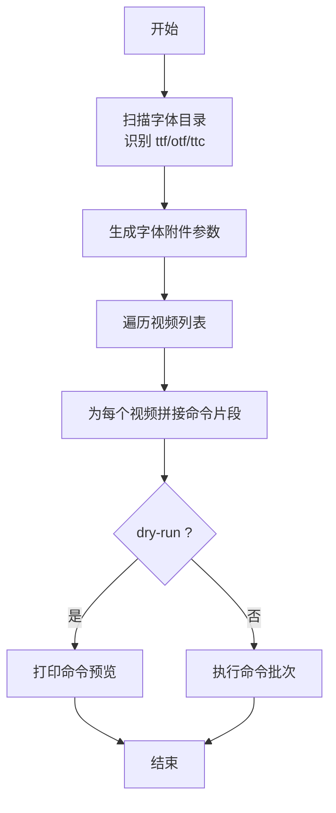
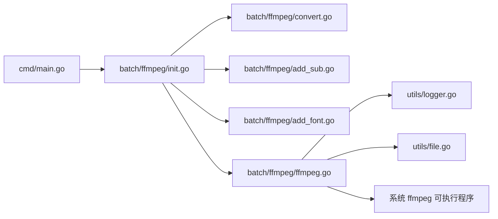

# 核心功能详解

<cite>
**本文引用的文件**
- [ffmpeg.go](file://batch/ffmpeg/ffmpeg.go)
- [convert.go](file://batch/ffmpeg/convert.go)
- [add_sub.go](file://batch/ffmpeg/add_sub.go)
- [add_font.go](file://batch/ffmpeg/add_font.go)
- [init.go](file://batch/ffmpeg/init.go)
- [main.go](file://cmd/main.go)
- [logger.go](file://utils/logger.go)
- [file.go](file://utils/file.go)
- [ffmpeg.md](file://docs/ffmpeg.md)
- [ffmpeg_test.go](file://batch/ffmpeg/ffmpeg_test.go)
</cite>

## 目录
1. [简介](#简介)
2. [项目结构](#项目结构)
3. [核心组件](#核心组件)
4. [架构总览](#架构总览)
5. [详细组件分析](#详细组件分析)
6. [依赖关系分析](#依赖关系分析)
7. [性能与并发策略](#性能与并发策略)
8. [故障排查指南](#故障排查指南)
9. [结论](#结论)
10. [附录：使用模式与示例](#附录使用模式与示例)

## 简介
本文件深入解析 batcher 工具中“视频批处理器”的核心功能实现，重点围绕以下方面展开：
- VideoBatcher 接口设计与职责边界
- videoBatch 的实现机制与命令构建策略
- 并发处理策略与上下文取消支持
- 视频转换、字幕添加、字体嵌入的完整流程与参数配置
- 性能优化建议与常见问题排查

该工具基于 CLI 架构，通过子命令分别提供“转换”、“添加字幕”、“添加字体”三种批处理能力，并以 ffmpeg 作为底层编解码引擎。

## 项目结构
整体采用按功能域分层的组织方式：
- cmd：应用入口，注册 CLI 命令树
- batch/ffmpeg：视频批处理核心实现，包含接口、命令构建、执行器等
- utils：通用工具（日志、文件操作）
- docs：使用文档与示例
- 测试：覆盖核心逻辑的行为测试

图表来源
- [main.go:13-28](file://cmd/main.go#L13-L28)
- [init.go:62-71](file://batch/ffmpeg/init.go#L62-L71)
- [ffmpeg.go:30-43](file://batch/ffmpeg/ffmpeg.go#L30-L43)
- [convert.go:11-63](file://batch/ffmpeg/convert.go#L11-L63)
- [add_sub.go:11-87](file://batch/ffmpeg/add_sub.go#L11-L87)
- [add_font.go:11-68](file://batch/ffmpeg/add_font.go#L11-L68)
- [logger.go:11-28](file://utils/logger.go#L11-L28)
- [file.go:8-31](file://utils/file.go#L8-L31)

章节来源
- [main.go:13-28](file://cmd/main.go#L13-L28)
- [init.go:62-71](file://batch/ffmpeg/init.go#L62-L71)

## 核心组件
- VideoBatchOption：批处理配置载体，包含输入/输出路径、格式、并发数、附加参数、字幕相关参数等
- VideoBatcher 接口：定义了获取视频列表、获取字体列表与参数、构建转换/添加字体/添加字幕命令批次、执行批次等方法
- videoBatch 结构体：VideoBatcher 的具体实现，负责扫描文件、构建命令、执行命令、并发控制与输出路径映射
- CLI 子命令：convert、add_sub、add_fonts，分别对应三种批处理场景

章节来源
- [ffmpeg.go:16-28](file://batch/ffmpeg/ffmpeg.go#L16-L28)
- [ffmpeg.go:30-38](file://batch/ffmpeg/ffmpeg.go#L30-L38)
- [ffmpeg.go:40-43](file://batch/ffmpeg/ffmpeg.go#L40-L43)

## 架构总览
下图展示了从 CLI 入口到具体批处理执行的调用链路与数据流。

图表来源
- [main.go:14-21](file://cmd/main.go#L14-L21)
- [convert.go:25-62](file://batch/ffmpeg/convert.go#L25-L62)
- [add_sub.go:45-86](file://batch/ffmpeg/add_sub.go#L45-L86)
- [add_font.go:30-67](file://batch/ffmpeg/add_font.go#L30-L67)
- [ffmpeg.go:47-64](file://batch/ffmpeg/ffmpeg.go#L47-L64)
- [ffmpeg.go:137-156](file://batch/ffmpeg/ffmpeg.go#L137-L156)
- [ffmpeg.go:158-178](file://batch/ffmpeg/ffmpeg.go#L158-L178)
- [ffmpeg.go:180-216](file://batch/ffmpeg/ffmpeg.go#L180-L216)
- [ffmpeg.go:218-286](file://batch/ffmpeg/ffmpeg.go#L218-L286)

## 详细组件分析

### VideoBatcher 接口与 videoBatch 实现
videoBatch 是 VideoBatcher 的唯一实现，其职责包括：
- 文件扫描：根据输入格式扫描视频文件；根据扩展名扫描字体文件
- 命令构建：将扫描结果映射为 ffmpeg 命令参数列表
- 执行器：支持串行与并发两种执行模式，支持 context 取消
- 输出路径映射：处理同名文件重名冲突，确保输出文件不覆盖

图表来源
- [ffmpeg.go:16-28](file://batch/ffmpeg/ffmpeg.go#L16-L28)
- [ffmpeg.go:30-38](file://batch/ffmpeg/ffmpeg.go#L30-L38)
- [ffmpeg.go:40-43](file://batch/ffmpeg/ffmpeg.go#L40-L43)

章节来源
- [ffmpeg.go:30-43](file://batch/ffmpeg/ffmpeg.go#L30-L43)
- [ffmpeg.go:40-43](file://batch/ffmpeg/ffmpeg.go#L40-L43)

### 视频转换流程（convert）
- 参数配置
  - 输入/输出路径与格式
  - 高级自定义参数（advance），可传入任意 ffmpeg 参数片段
  - 并发数（workers），默认串行
- 命令构建
  - 扫描输入目录中指定格式的视频
  - 为每个视频生成“输入文件 + 高级参数 + 输出文件”的命令片段
  - 输出文件名去重并映射到目标格式
- 执行
  - 支持 dry-run 预览命令
  - 串行或并发执行，支持 context 取消

图表来源
- [convert.go:25-62](file://batch/ffmpeg/convert.go#L25-L62)
- [ffmpeg.go:137-156](file://batch/ffmpeg/ffmpeg.go#L137-L156)
- [ffmpeg.go:301-318](file://batch/ffmpeg/ffmpeg.go#L301-L318)

章节来源
- [convert.go:11-63](file://batch/ffmpeg/convert.go#L11-L63)
- [ffmpeg.go:137-156](file://batch/ffmpeg/ffmpeg.go#L137-L156)
- [ffmpeg.go:301-318](file://batch/ffmpeg/ffmpeg.go#L301-L318)

### 字幕添加流程（add_sub）
- 参数配置
  - 字幕后缀（默认 ass）
  - 字幕编号（默认 0）
  - 字幕语言（默认 chi）
  - 字幕标题（默认 Chinese）
  - 字体路径（可选，用于同时嵌入字体）
- 命令构建
  - 为每个视频寻找同名字幕文件（基于输入格式推导）
  - 构建“主视频 + 字幕 + 映射 + 元数据 + 可选字体参数 + 输出”的命令
- 执行
  - 支持 dry-run 预览
  - 串行或并发执行

图表来源
- [add_sub.go:45-86](file://batch/ffmpeg/add_sub.go#L45-L86)
- [ffmpeg.go:180-216](file://batch/ffmpeg/ffmpeg.go#L180-L216)

章节来源
- [add_sub.go:11-87](file://batch/ffmpeg/add_sub.go#L11-L87)
- [ffmpeg.go:180-216](file://batch/ffmpeg/ffmpeg.go#L180-L216)

### 字体嵌入流程（add_font）
- 参数配置
  - 字体目录（必填）
  - 输出路径与格式
  - 并发数
- 命令构建
  - 扫描字体目录，识别 ttf/otf/ttc
  - 为每个字体生成“附件 + 元数据”参数
  - 为每个视频生成“复制流 + 字体附件 + 输出”的命令
- 执行
  - 支持 dry-run 预览
  - 串行或并发执行

图表来源
- [add_font.go:30-67](file://batch/ffmpeg/add_font.go#L30-L67)
- [ffmpeg.go:89-113](file://batch/ffmpeg/ffmpeg.go#L89-L113)
- [ffmpeg.go:115-135](file://batch/ffmpeg/ffmpeg.go#L115-L135)
- [ffmpeg.go:158-178](file://batch/ffmpeg/ffmpeg.go#L158-L178)

章节来源
- [add_font.go:11-68](file://batch/ffmpeg/add_font.go#L11-L68)
- [ffmpeg.go:89-113](file://batch/ffmpeg/ffmpeg.go#L89-L113)
- [ffmpeg.go:115-135](file://batch/ffmpeg/ffmpeg.go#L115-L135)
- [ffmpeg.go:158-178](file://batch/ffmpeg/ffmpeg.go#L158-L178)

### CLI 命令与入口
- 应用入口在 main 中注册 CLI 命令树，包含 ffmpeg 与 rename_file 两个顶级命令
- ffmpeg 命令下包含 convert、add_sub、add_font 三个子命令
- 子命令通过 urfave/cli 解析参数，构造 VideoBatchOption，调用 videoBatch 的相应方法

章节来源
- [main.go:14-21](file://cmd/main.go#L14-L21)
- [init.go:62-71](file://batch/ffmpeg/init.go#L62-L71)
- [convert.go:11-22](file://batch/ffmpeg/convert.go#L11-L22)
- [add_sub.go:11-44](file://batch/ffmpeg/add_sub.go#L11-L44)
- [add_font.go:11-28](file://batch/ffmpeg/add_font.go#L11-L28)

## 依赖关系分析
- 内部依赖
  - videoBatch 依赖 utils 包的日志与文件工具
  - CLI 子命令依赖 videoBatch 的接口方法
- 外部依赖
  - ffmpeg 可执行程序（系统环境需安装）
  - 日志库 zap
  - CLI 框架 urfave/cli/v3

图表来源
- [main.go:13-28](file://cmd/main.go#L13-L28)
- [init.go:62-71](file://batch/ffmpeg/init.go#L62-L71)
- [ffmpeg.go:13-14](file://batch/ffmpeg/ffmpeg.go#L13-L14)
- [logger.go:11-28](file://utils/logger.go#L11-L28)
- [file.go:8-31](file://utils/file.go#L8-L31)

章节来源
- [go.mod:5-16](file://go.mod#L5-L16)
- [ffmpeg.go:13-14](file://batch/ffmpeg/ffmpeg.go#L13-L14)

## 性能与并发策略
- 并发模型
  - 串行模式：Workers=1，顺序执行，适合资源受限或调试阶段
  - 并发模式：Workers>1，使用信号量控制并发度，避免过度占用系统资源
- 上下文取消
  - 在每次循环前检查 ctx.Done()，支持优雅退出
- 输出去重
  - filterOutput 会为重名文件追加序号，避免覆盖
- 日志与 Dry-run
  - 提供 dry-run 预览命令，便于验证参数正确性
  - 使用 zap 输出结构化日志，便于排障

章节来源
- [ffmpeg.go:218-286](file://batch/ffmpeg/ffmpeg.go#L218-L286)
- [ffmpeg.go:301-318](file://batch/ffmpeg/ffmpeg.go#L301-L318)
- [convert.go:47-52](file://batch/ffmpeg/convert.go#L47-L52)
- [add_sub.go:71-76](file://batch/ffmpeg/add_sub.go#L71-L76)
- [add_font.go:52-57](file://batch/ffmpeg/add_font.go#L52-L57)

## 故障排查指南
- 常见错误类型
  - 参数为空：NewVideoBatch 会在选项为空或输出路径无效时返回错误
  - 目录不存在：MakeDir 会尝试创建输出目录，若失败会返回错误
  - 文件遍历失败：Walk 函数在路径异常时返回错误
  - ffmpeg 执行失败：executeCommand 返回错误，包含底层执行失败原因
- 排查步骤
  - 使用 dry-run 验证命令是否符合预期
  - 检查输入/输出路径权限与格式
  - 逐步缩小范围：先单个文件验证，再扩大到批量
  - 关注日志输出，定位首个失败命令
- 单元测试参考
  - 测试覆盖了 NewVideoBatch、GetVideosList、GetFontsList、GetFontsParams、GetConvertBatch、GetAddFontsBatch、filterOutput、ExecuteBatch 等关键路径

章节来源
- [ffmpeg.go:47-64](file://batch/ffmpeg/ffmpeg.go#L47-L64)
- [file.go:8-31](file://utils/file.go#L8-L31)
- [ffmpeg_test.go:23-46](file://batch/ffmpeg/ffmpeg_test.go#L23-L46)
- [ffmpeg_test.go:48-85](file://batch/ffmpeg/ffmpeg_test.go#L48-L85)
- [ffmpeg_test.go:94-125](file://batch/ffmpeg/ffmpeg_test.go#L94-L125)
- [ffmpeg_test.go:134-163](file://batch/ffmpeg/ffmpeg_test.go#L134-L163)
- [ffmpeg_test.go:172-210](file://batch/ffmpeg/ffmpeg_test.go#L172-L210)
- [ffmpeg_test.go:235-273](file://batch/ffmpeg/ffmpeg_test.go#L235-L273)
- [ffmpeg_test.go:282-310](file://batch/ffmpeg/ffmpeg_test.go#L282-L310)
- [ffmpeg_test.go:329-356](file://batch/ffmpeg/ffmpeg_test.go#L329-L356)

## 结论
该批处理工具以 VideoBatcher 接口为核心抽象，videoBatch 为唯一实现，提供了清晰的职责划分与可扩展的命令构建机制。通过 CLI 子命令将不同场景封装为独立流程，结合并发执行与上下文取消，满足了批量视频处理的常见需求。配合 dry-run 与结构化日志，开发者可以高效地进行参数调试与问题定位。

## 附录：使用模式与示例
- 视频转换
  - 基本用法：指定输入/输出路径与格式，必要时通过 advance 传入自定义参数
  - 并发执行：设置 workers 提升吞吐
  - 预览命令：使用 dry-run 查看最终 ffmpeg 命令
- 添加字幕
  - 指定字幕后缀、编号、语言与标题
  - 若需字体随字幕一并嵌入，提供字体目录
- 添加字体
  - 指定字体目录，工具自动识别 ttf/otf/ttc
  - 输出为复制流并嵌入字体附件
- 文档参考
  - 官方文档提供了更多 ffmpeg 示例与硬件加速建议

章节来源
- [ffmpeg.md:18-43](file://docs/ffmpeg.md#L18-L43)
- [ffmpeg.md:45-66](file://docs/ffmpeg.md#L45-L66)
- [ffmpeg.md:68-82](file://docs/ffmpeg.md#L68-L82)
- [convert.go:25-62](file://batch/ffmpeg/convert.go#L25-L62)
- [add_sub.go:45-86](file://batch/ffmpeg/add_sub.go#L45-L86)
- [add_font.go:30-67](file://batch/ffmpeg/add_font.go#L30-L67)