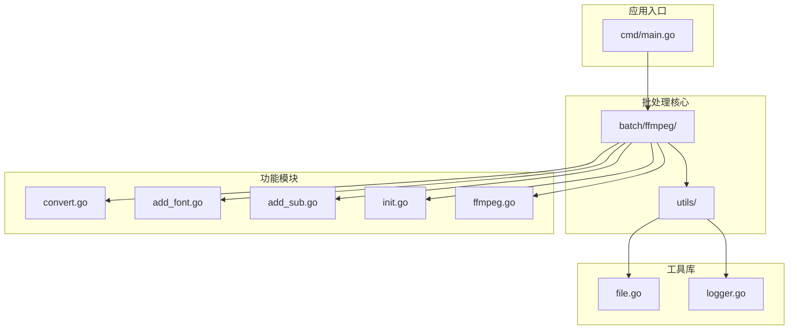
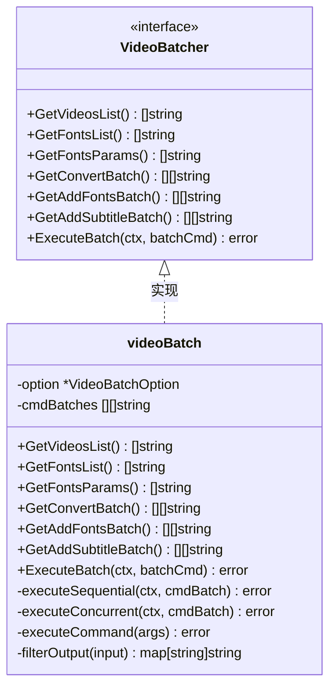
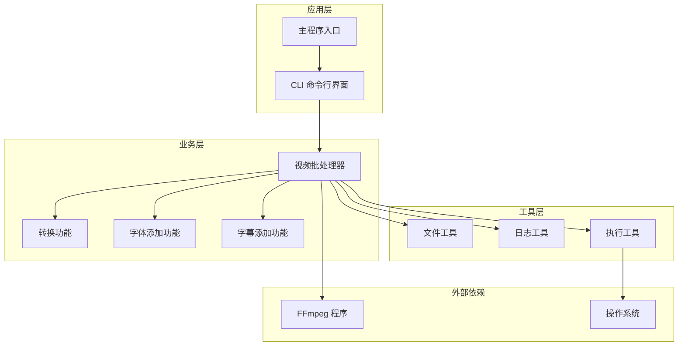
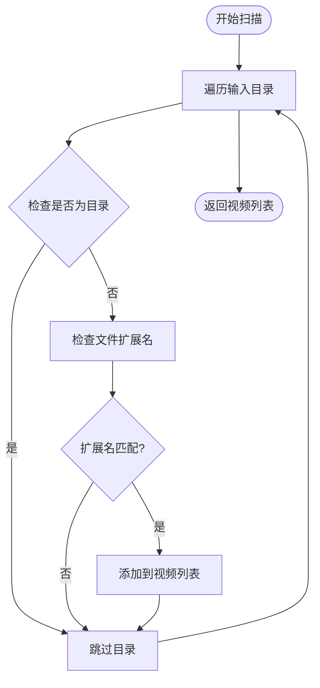
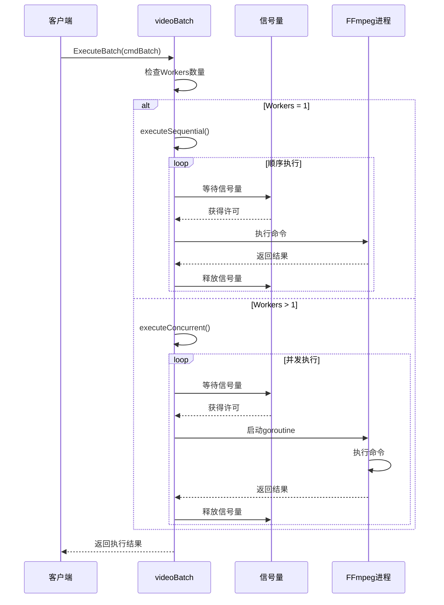
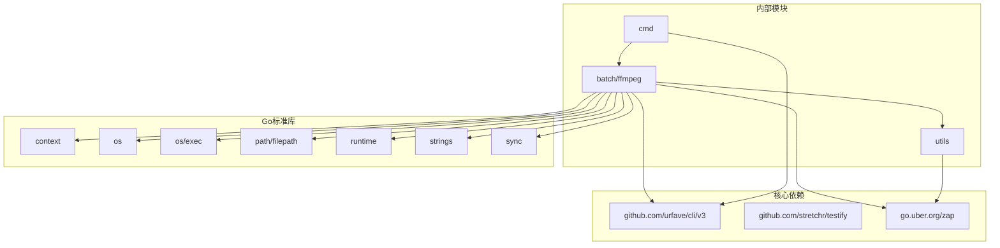

# 视频批处理器架构

<cite>
**本文档引用的文件**
- [ffmpeg.go](file://batch/ffmpeg/ffmpeg.go)
- [init.go](file://batch/ffmpeg/init.go)
- [convert.go](file://batch/ffmpeg/convert.go)
- [add_font.go](file://batch/ffmpeg/add_font.go)
- [add_sub.go](file://batch/ffmpeg/add_sub.go)
- [main.go](file://cmd/main.go)
- [file.go](file://utils/file.go)
- [logger.go](file://utils/logger.go)
- [ffmpeg_test.go](file://batch/ffmpeg/ffmpeg_test.go)
- [file_test.go](file://utils/file_test.go)
- [go.mod](file://go.mod)
</cite>

## 目录
1. [简介](#简介)
2. [项目结构](#项目结构)
3. [核心组件](#核心组件)
4. [架构概览](#架构概览)
5. [详细组件分析](#详细组件分析)
6. [依赖关系分析](#依赖关系分析)
7. [性能考虑](#性能考虑)
8. [故障排除指南](#故障排除指南)
9. [结论](#结论)

## 简介

视频批处理器是一个基于 Go 语言开发的命令行工具，专门用于批量处理视频文件。该系统提供了三种主要功能：视频格式转换、添加字幕和添加字体。它采用模块化设计，支持单线程和并发两种执行模式，并通过信号量机制精确控制并发数量。

该工具的核心设计理念是提供简单易用的接口，同时保持高度的可扩展性和可靠性。通过抽象出 VideoBatcher 接口，系统实现了统一的批处理流程，使得不同的处理任务可以共享相同的基础设施和工具。

## 项目结构

项目采用清晰的分层架构，按照功能模块进行组织：



**图表来源**
- [main.go:1-29](file://cmd/main.go#L1-L29)
- [ffmpeg.go:1-324](file://batch/ffmpeg/ffmpeg.go#L1-L324)
- [init.go:1-72](file://batch/ffmpeg/init.go#L1-L72)

**章节来源**
- [main.go:1-29](file://cmd/main.go#L1-L29)
- [go.mod:1-17](file://go.mod#L1-L17)

## 核心组件

### VideoBatchOption 配置结构体

VideoBatchOption 是视频批处理器的核心配置结构体，定义了所有必要的处理参数：

| 字段名 | 类型 | 描述 | 默认值 |
|--------|------|------|--------|
| InputPath | string | 输入视频文件路径 | 当前目录 |
| InputFormat | string | 输入视频格式后缀 | mp4 |
| OutputPath | string | 输出文件存储路径 | ./result/ |
| OutputFormat | string | 输出视频格式后缀 | mkv |
| FontsPath | string | 字体文件目录路径 | 空 |
| InputSubSuffix | string | 字幕文件后缀 | ass |
| InputSubNo | int | 字幕流编号 | 0 |
| InputSubTitle | string | 字幕标题 | Chinese |
| InputSubLang | string | 字幕语言代码 | chi |
| Advance | string | 高级自定义参数 | 空 |
| Workers | int | 并发工作线程数 | 1 |

### VideoBatcher 接口设计

VideoBatcher 接口定义了视频批处理的核心操作方法：



**图表来源**
- [ffmpeg.go:30-43](file://batch/ffmpeg/ffmpeg.go#L30-L43)
- [ffmpeg.go:40-43](file://batch/ffmpeg/ffmpeg.go#L40-L43)

**章节来源**
- [ffmpeg.go:16-28](file://batch/ffmpeg/ffmpeg.go#L16-L28)
- [ffmpeg.go:30-38](file://batch/ffmpeg/ffmpeg.go#L30-L38)

## 架构概览

视频批处理器采用分层架构设计，从上到下分为应用层、业务层和工具层：



**图表来源**
- [main.go:13-28](file://cmd/main.go#L13-L28)
- [ffmpeg.go:47-64](file://batch/ffmpeg/ffmpeg.go#L47-L64)

## 详细组件分析

### 视频批处理器核心实现

#### videoBatch 结构体详解

videoBatch 是 VideoBatcher 接口的具体实现，包含两个核心字段：

| 字段名 | 类型 | 作用 | 说明 |
|--------|------|------|------|
| option | *VideoBatchOption | 配置选项 | 存储所有处理参数和设置 |
| cmdBatches | [][]string | 命令批次 | 存储生成的 FFmpeg 命令序列 |

#### 文件扫描和过滤逻辑

视频批处理器实现了高效的文件扫描机制：



**图表来源**
- [ffmpeg.go:66-87](file://batch/ffmpeg/ffmpeg.go#L66-L87)

字体文件扫描使用固定扩展名列表：
- `.ttf` - TrueType 字体
- `.otf` - OpenType 字体  
- `.ttc` - TrueType Collection 字体

#### 输出路径映射算法

为了防止文件名冲突，系统实现了智能的输出路径映射：

```mermaid
flowchart TD
INPUT[输入文件列表] --> MAP[创建映射表]
MAP --> SCAN[扫描每个输入文件]
SCAN --> GETNAME[提取文件名(不含扩展名)]
GETNAME --> CHECKCOUNT{检查是否重复?}
CHECKCOUNT --> |否| CREATEPATH[创建基础输出路径]
CHECKCOUNT --> |是| ADDNUM[添加序号后缀]
ADDNUM --> CREATEPATH
CREATEPATH --> STORE[存储映射关系]
STORE --> SCAN
SCAN --> DONE[返回映射表]
```

**图表来源**
- [ffmpeg.go:301-318](file://batch/ffmpeg/ffmpeg.go#L301-L318)

#### 并发处理机制

系统支持两种执行模式：

**单线程模式 (Workers = 1)**
- 顺序执行所有命令
- 每个命令完成后才执行下一个
- 内存占用低，适合小规模处理

**并发模式 (Workers > 1)**
- 使用信号量控制并发数量
- 每个命令在独立 goroutine 中执行
- 支持上下文取消和错误传播



**图表来源**
- [ffmpeg.go:218-286](file://batch/ffmpeg/ffmpeg.go#L218-L286)

**章节来源**
- [ffmpeg.go:40-43](file://batch/ffmpeg/ffmpeg.go#L40-L43)
- [ffmpeg.go:301-318](file://batch/ffmpeg/ffmpeg.go#L301-L318)
- [ffmpeg.go:218-286](file://batch/ffmpeg/ffmpeg.go#L218-L286)

### 功能模块实现

#### 视频转换功能

GetConvertBatch 方法负责生成视频转换命令：

1. 获取所有输入视频文件
2. 过滤已存在的输出文件
3. 为每个视频生成转换命令
4. 应用高级自定义参数

#### 字体添加功能

GetAddFontsBatch 方法实现字体嵌入：

1. 获取字体文件列表
2. 生成字体参数数组
3. 为每个视频生成添加字体命令
4. 使用流复制避免重新编码

#### 字幕添加功能

GetAddSubtitleBatch 方法支持字幕嵌入：

1. 为每个视频查找对应的字幕文件
2. 设置字幕字符编码为 UTF-8
3. 配置字幕语言和标题
4. 支持可选的字体参数

**章节来源**
- [ffmpeg.go:137-156](file://batch/ffmpeg/ffmpeg.go#L137-L156)
- [ffmpeg.go:158-178](file://batch/ffmpeg/ffmpeg.go#L158-L178)
- [ffmpeg.go:180-216](file://batch/ffmpeg/ffmpeg.go#L180-L216)

## 依赖关系分析

项目的主要依赖关系如下：



**图表来源**
- [go.mod:5-16](file://go.mod#L5-L16)
- [ffmpeg.go:3-14](file://batch/ffmpeg/ffmpeg.go#L3-L14)

**章节来源**
- [go.mod:1-17](file://go.mod#L1-L17)

## 性能考虑

### 并发优化策略

1. **信号量控制**：使用固定大小的通道作为信号量，精确控制并发数量
2. **内存管理**：避免在内存中加载大文件，直接通过管道传递给 FFmpeg
3. **错误快速传播**：并发模式下第一个错误发生后立即停止后续执行

### 文件系统优化

1. **延迟创建目录**：在首次需要时才创建输出目录
2. **智能重命名**：自动处理文件名冲突，避免覆盖现有文件
3. **路径规范化**：统一使用绝对路径避免相对路径问题

### 资源管理

1. **上下文取消**：支持优雅的中断和清理
2. **资源释放**：确保所有 goroutine 正确退出
3. **错误恢复**：提供详细的错误信息便于调试

## 故障排除指南

### 常见问题及解决方案

**问题1：FFmpeg 未找到**
- 确保 FFmpeg 已正确安装并添加到系统 PATH
- 检查操作系统平台兼容性（Windows 使用 ffmpeg.exe）

**问题2：权限不足**
- 确保对输入和输出目录具有读写权限
- 检查磁盘空间是否充足

**问题3：文件格式不支持**
- 验证输入文件格式是否在支持列表中
- 检查 FFmpeg 是否支持目标格式

**问题4：并发执行异常**
- 减少 Workers 数量以降低系统负载
- 检查系统资源限制

### 调试技巧

1. **使用 dry-run 模式**：先预览生成的命令再执行
2. **查看详细日志**：利用 zap 日志库获取详细的执行信息
3. **分步验证**：单独测试每个功能模块

**章节来源**
- [ffmpeg.go:288-299](file://batch/ffmpeg/ffmpeg.go#L288-L299)
- [logger.go:11-28](file://utils/logger.go#L11-L28)

## 结论

视频批处理器是一个设计精良的批量视频处理工具，具有以下特点：

1. **模块化设计**：清晰的分层架构便于维护和扩展
2. **高性能执行**：支持并发处理和智能资源管理
3. **用户友好**：提供直观的命令行接口和详细的反馈信息
4. **可靠稳定**：完善的错误处理和恢复机制

该系统为视频处理任务提供了高效、可靠的解决方案，特别适合需要批量处理大量视频文件的场景。通过合理的架构设计和实现细节，系统在保证功能完整性的同时，也兼顾了性能和用户体验。