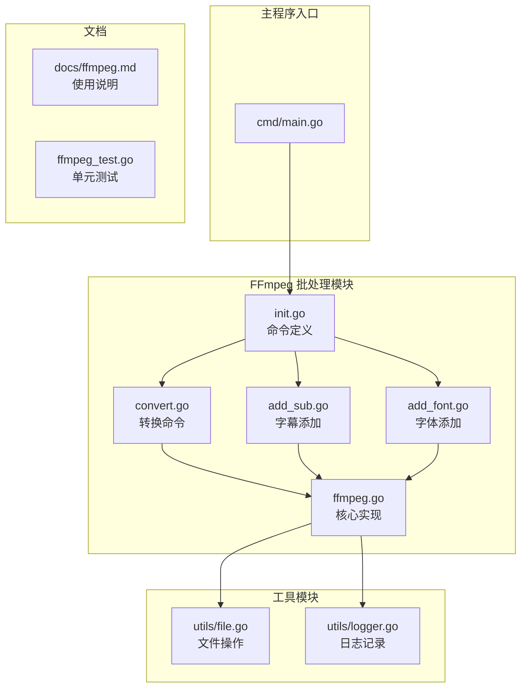
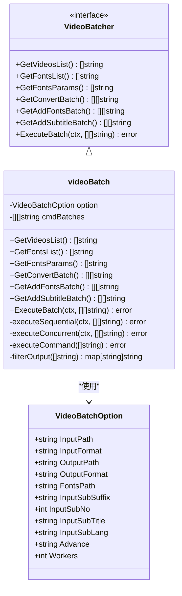
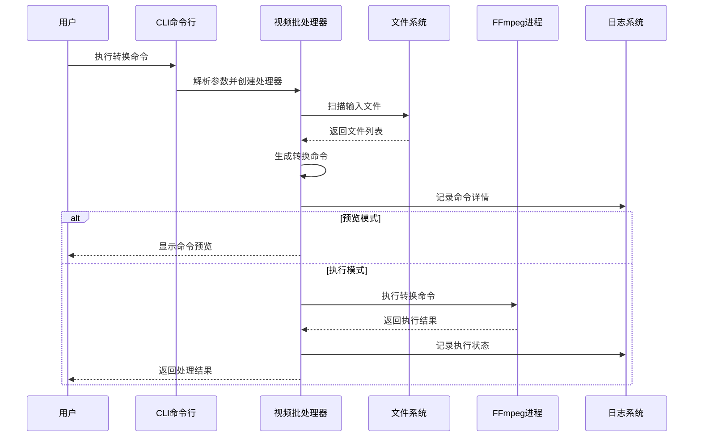
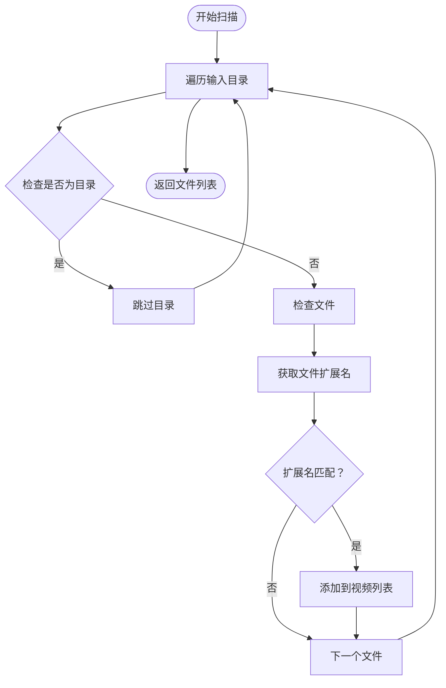
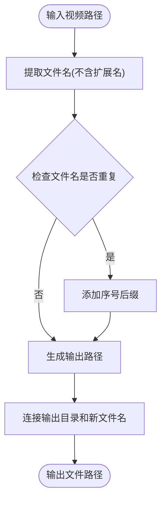
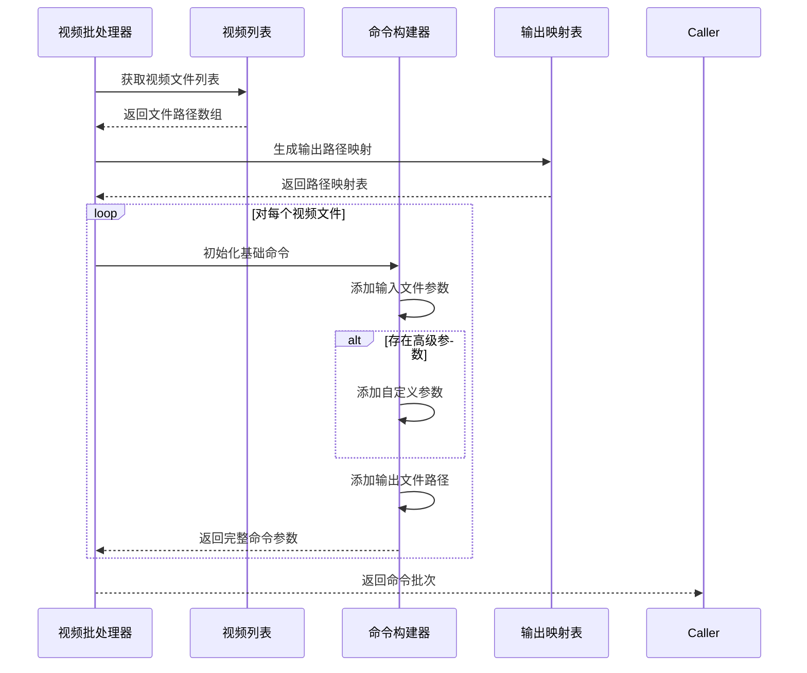
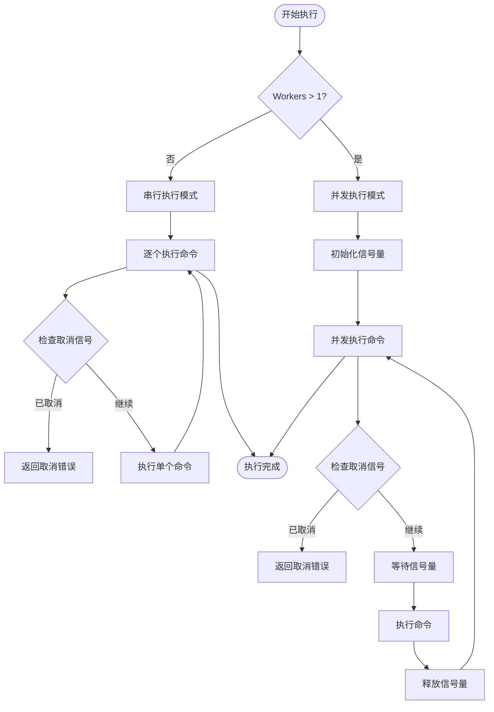
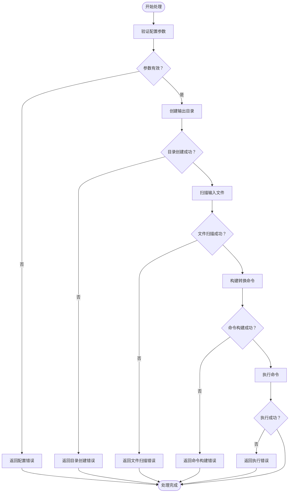
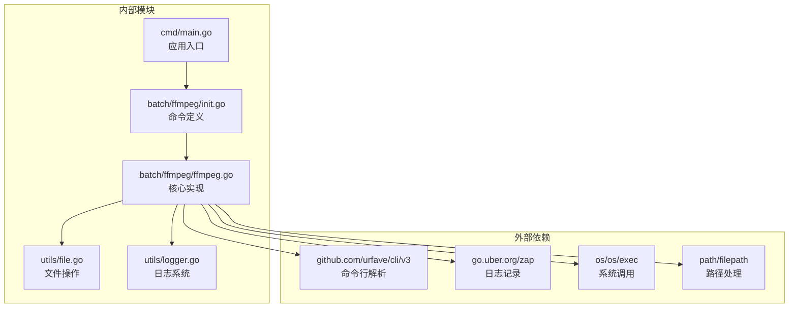

# 视频转换功能

<cite>
**本文档引用的文件**
- [convert.go](file://batch/ffmpeg/convert.go)
- [ffmpeg.go](file://batch/ffmpeg/ffmpeg.go)
- [init.go](file://batch/ffmpeg/init.go)
- [add_sub.go](file://batch/ffmpeg/add_sub.go)
- [add_font.go](file://batch/ffmpeg/add_font.go)
- [main.go](file://cmd/main.go)
- [ffmpeg.md](file://docs/ffmpeg.md)
- [file.go](file://utils/file.go)
- [logger.go](file://utils/logger.go)
- [ffmpeg_test.go](file://batch/ffmpeg/ffmpeg_test.go)
</cite>

## 目录
1. [简介](#简介)
2. [项目结构](#项目结构)
3. [核心组件](#核心组件)
4. [架构概览](#架构概览)
5. [详细组件分析](#详细组件分析)
6. [依赖关系分析](#依赖关系分析)
7. [性能考虑](#性能考虑)
8. [故障排除指南](#故障排除指南)
9. [结论](#结论)

## 简介

视频转换功能是基于 FFmpeg 的批量视频处理工具，提供了完整的视频格式转换、字幕添加和字体嵌入功能。该系统采用模块化设计，支持多种输入输出格式，具备并发处理能力和灵活的参数配置选项。

## 项目结构

视频转换功能主要位于 `batch/ffmpeg` 目录中，包含以下关键组件：

**图表来源**
- [main.go:1-29](file://cmd/main.go#L1-L29)
- [init.go:1-72](file://batch/ffmpeg/init.go#L1-L72)
- [ffmpeg.go:1-324](file://batch/ffmpeg/ffmpeg.go#L1-L324)

**章节来源**
- [main.go:1-29](file://cmd/main.go#L1-L29)
- [init.go:1-72](file://batch/ffmpeg/init.go#L1-L72)

## 核心组件

### 视频批处理器接口

视频批处理器实现了统一的接口定义，支持多种视频处理操作：

**图表来源**
- [ffmpeg.go:16-43](file://batch/ffmpeg/ffmpeg.go#L16-L43)
- [ffmpeg.go:30-38](file://batch/ffmpeg/ffmpeg.go#L30-L38)

### 命令行接口设计

系统通过 CLI 库提供统一的命令行接口，支持多种子命令：

| 命令 | 功能描述 | 主要参数 |
|------|----------|----------|
| `convert` | 视频格式转换 | input_path, input_format, output_path, output_format, advance, workers |
| `add_sub` | 添加字幕 | input_path, input_format, input_sub_suffix, input_sub_no, input_sub_lang, input_sub_title |
| `add_fonts` | 添加字体 | input_path, input_format, input_fonts_path, workers |

**章节来源**
- [convert.go:11-64](file://batch/ffmpeg/convert.go#L11-L64)
- [add_sub.go:11-88](file://batch/ffmpeg/add_sub.go#L11-L88)
- [add_font.go:11-69](file://batch/ffmpeg/add_font.go#L11-L69)

## 架构概览

视频转换系统采用分层架构设计，确保了良好的可扩展性和维护性：

**图表来源**
- [convert.go:25-62](file://batch/ffmpeg/convert.go#L25-L62)
- [ffmpeg.go:137-156](file://batch/ffmpeg/ffmpeg.go#L137-L156)

## 详细组件分析

### 输入文件扫描机制

视频转换系统通过递归遍历指定目录来发现待处理的视频文件：

**图表来源**
- [ffmpeg.go:66-87](file://batch/ffmpeg/ffmpeg.go#L66-L87)

系统支持多种视频格式检测，通过扩展名过滤确保只处理目标格式的文件。默认情况下会扫描整个输入目录树，包括所有子目录。

**章节来源**
- [ffmpeg.go:66-87](file://batch/ffmpeg/ffmpeg.go#L66-L87)

### 输出文件路径生成策略

系统实现了智能的输出文件命名策略，有效避免文件名冲突：

**图表来源**
- [ffmpeg.go:301-318](file://batch/ffmpeg/ffmpeg.go#L301-L318)

输出路径生成规则：
1. 保持原始文件名的完整性
2. 自动添加指定的输出格式扩展名
3. 通过数字后缀解决同名文件冲突
4. 将所有输出文件放置在统一的输出目录中

**章节来源**
- [ffmpeg.go:301-318](file://batch/ffmpeg/ffmpeg.go#L301-L318)

### FFmpeg 命令构建与执行

#### 基础转换命令构建

系统根据配置选项动态构建 FFmpeg 命令参数：

**图表来源**
- [ffmpeg.go:137-156](file://batch/ffmpeg/ffmpeg.go#L137-L156)

#### 并发执行机制

系统支持两种执行模式：串行和并发，通过信号量控制并发数量：

**图表来源**
- [ffmpeg.go:218-286](file://batch/ffmpeg/ffmpeg.go#L218-L286)

**章节来源**
- [ffmpeg.go:137-156](file://batch/ffmpeg/ffmpeg.go#L137-L156)
- [ffmpeg.go:218-286](file://batch/ffmpeg/ffmpeg.go#L218-L286)

### 参数配置选项详解

#### 基础参数配置

| 参数名称 | 类型 | 默认值 | 描述 |
|----------|------|--------|------|
| `input_path` | String | `"./"` | 输入视频文件或目录路径 |
| `input_format` | String | `"mp4"` | 输入视频文件扩展名 |
| `output_path` | String | `"./result/"` | 输出文件存储目录 |
| `output_format` | String | `"mkv"` | 输出视频文件扩展名 |
| `workers` | Int | `1` | 并发执行的工作线程数 |

#### 高级参数配置

| 参数名称 | 类型 | 默认值 | 描述 |
|----------|------|--------|------|
| `advance` | String | `""` | 自定义 FFmpeg 参数字符串 |
| `dry-run` | Bool | `false` | 预览模式，仅显示命令不执行 |
| `input_fonts_path` | String | `""` | 字体文件目录路径 |
| `input_sub_suffix` | String | `"ass"` | 字幕文件扩展名 |
| `input_sub_no` | Int | `0` | 字幕流编号 |
| `input_sub_lang` | String | `"chi"` | 字幕语言代码 |
| `input_sub_title` | String | `"Chinese"` | 字幕标题 |

**章节来源**
- [init.go:8-56](file://batch/ffmpeg/init.go#L8-L56)

### 错误处理机制

系统实现了多层次的错误处理策略：

**图表来源**
- [ffmpeg.go:47-64](file://batch/ffmpeg/ffmpeg.go#L47-L64)
- [convert.go:35-45](file://batch/ffmpeg/convert.go#L35-L45)

**章节来源**
- [ffmpeg.go:47-64](file://batch/ffmpeg/ffmpeg.go#L47-L64)
- [convert.go:35-45](file://batch/ffmpeg/convert.go#L35-L45)

## 依赖关系分析

视频转换功能的依赖关系清晰明确，遵循单一职责原则：

**图表来源**
- [main.go:3-11](file://cmd/main.go#L3-L11)
- [ffmpeg.go:3-14](file://batch/ffmpeg/ffmpeg.go#L3-L14)

**章节来源**
- [main.go:3-11](file://cmd/main.go#L3-L11)
- [ffmpeg.go:3-14](file://batch/ffmpeg/ffmpeg.go#L3-L14)

## 性能考虑

### 并发执行优化

系统通过信号量机制控制并发执行，避免资源竞争：

- **信号量控制**：使用固定大小的信号量限制同时执行的命令数量
- **上下文取消**：支持优雅的取消机制，及时响应用户中断
- **错误聚合**：并发模式下只记录第一个错误，避免大量重复错误输出

### 内存管理

- **流式处理**：FFmpeg 进程直接处理文件，避免将整个文件加载到内存
- **批量处理**：将命令按批次组织，减少内存占用峰值
- **延迟执行**：先生成命令列表再执行，避免不必要的内存分配

### I/O 优化

- **目录扫描**：使用 `filepath.Walk` 进行高效的目录遍历
- **文件检查**：通过扩展名快速过滤，减少不必要的文件检查
- **输出路径**：统一的输出目录结构，便于后续处理

## 故障排除指南

### 常见问题及解决方案

#### FFmpeg 未找到

**问题描述**：执行时报错提示找不到 FFmpeg 呺

**解决方案**：
1. 确保 FFmpeg 已正确安装并添加到系统 PATH
2. 在 Windows 系统上使用 `ffmpeg.exe`
3. 在 Linux/macOS 系统上使用 `ffmpeg`

#### 权限不足

**问题描述**：无法创建输出目录或读取输入文件

**解决方案**：
1. 检查输出目录的写入权限
2. 确认输入文件具有读取权限
3. 以管理员权限运行程序

#### 文件格式不支持

**问题描述**：某些视频格式转换失败

**解决方案**：
1. 确认 FFmpeg 安装了相应的编解码器支持
2. 检查输入文件的完整性
3. 尝试使用不同的输出格式

#### 并发执行异常

**问题描述**：并发模式下出现资源竞争或性能下降

**解决方案**：
1. 调整 `workers` 参数值
2. 检查系统资源使用情况
3. 考虑使用串行模式进行调试

**章节来源**
- [ffmpeg.go:288-299](file://batch/ffmpeg/ffmpeg.go#L288-L299)

## 结论

视频转换功能提供了完整的批量视频处理解决方案，具有以下特点：

### 技术优势
- **模块化设计**：清晰的接口分离和职责划分
- **灵活配置**：丰富的参数选项满足不同使用场景
- **高效执行**：支持并发处理提升整体性能
- **健壮性**：完善的错误处理和恢复机制

### 使用建议
1. **合理配置并发数**：根据系统资源调整 `workers` 参数
2. **预览命令**：使用 `dry-run` 模式验证命令正确性
3. **监控执行**：关注日志输出及时发现问题
4. **备份数据**：重要文件转换前做好备份

### 扩展方向
- 支持更多视频格式和编解码器
- 增加进度显示和统计信息
- 提供图形用户界面版本
- 实现自动化的质量评估功能

该系统为视频处理任务提供了可靠、高效的解决方案，适合个人用户和企业环境的各种应用场景。