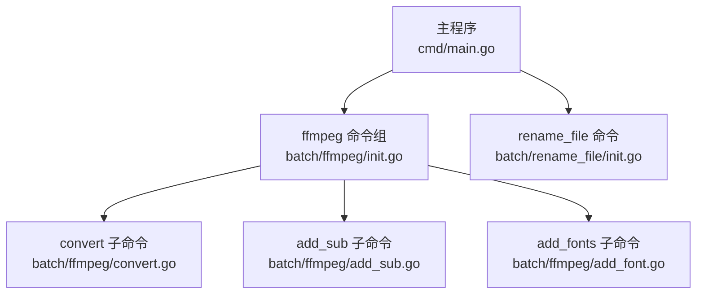
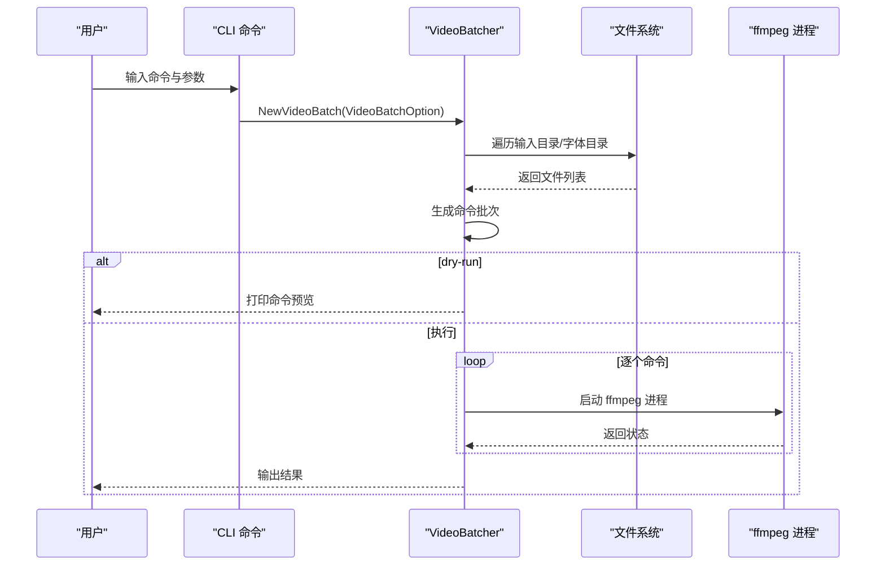
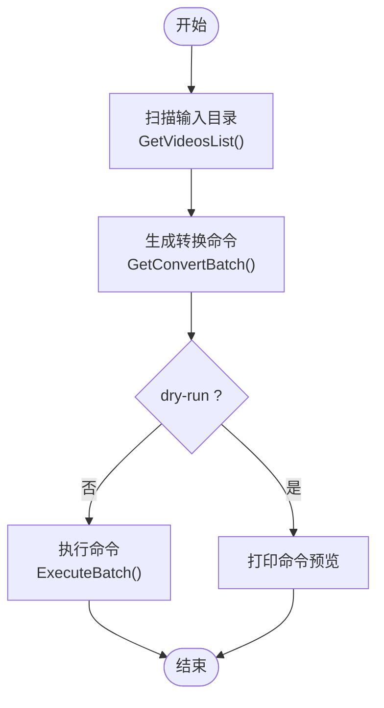
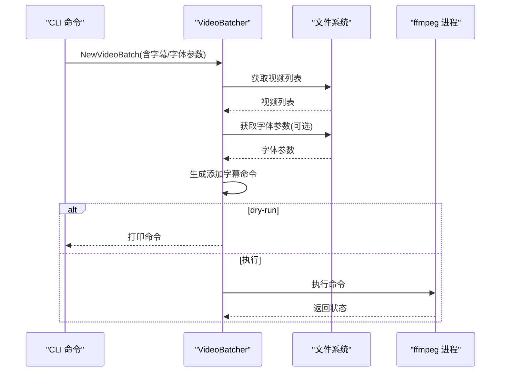
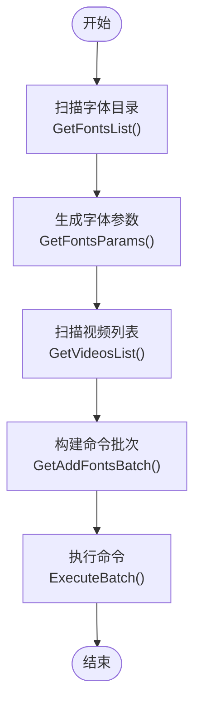
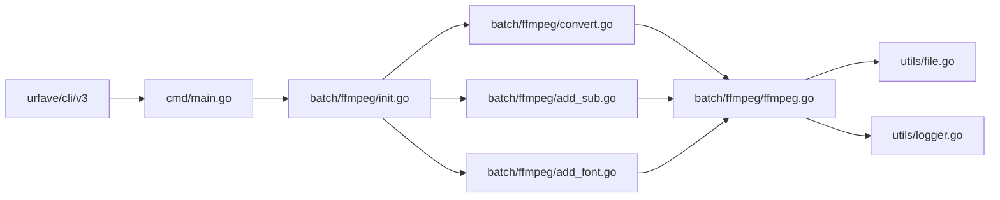

# 基础使用示例

<cite>
**本文引用的文件**
- [cmd/main.go](file://cmd/main.go)
- [batch/ffmpeg/ffmpeg.go](file://batch/ffmpeg/ffmpeg.go)
- [batch/ffmpeg/init.go](file://batch/ffmpeg/init.go)
- [batch/ffmpeg/convert.go](file://batch/ffmpeg/convert.go)
- [batch/ffmpeg/add_sub.go](file://batch/ffmpeg/add_sub.go)
- [batch/ffmpeg/add_font.go](file://batch/ffmpeg/add_font.go)
- [utils/file.go](file://utils/file.go)
- [utils/logger.go](file://utils/logger.go)
- [docs/ffmpeg.md](file://docs/ffmpeg.md)
</cite>

## 目录
1. [简介](#简介)
2. [项目结构](#项目结构)
3. [核心组件](#核心组件)
4. [架构总览](#架构总览)
5. [详细组件分析](#详细组件分析)
6. [依赖分析](#依赖分析)
7. [性能考虑](#性能考虑)
8. [故障排查指南](#故障排查指南)
9. [结论](#结论)
10. [附录：完整示例与最佳实践](#附录完整示例与最佳实践)

## 简介
本文件面向初学者，提供 batcher 工具的基础使用示例，重点围绕 ffmpeg 批处理子命令：
- convert：视频格式转换
- add_sub：为视频添加字幕
- add_fonts：为视频嵌入字体

内容涵盖：
- convert 子命令的基本用法、输入输出路径配置与格式转换参数设置
- 批量处理最佳实践：目录结构组织、文件格式筛选、输出目录管理
- 常见场景：常见视频格式转换、字幕添加标准流程、字体嵌入基础操作
- 完整命令行示例与预期结果说明，便于直接复制使用

## 项目结构
batcher 的 CLI 入口通过 urfave/cli 注册两个顶级命令：
- ffmpeg：包含 convert、add_sub、add_fonts 三个子命令
- rename_file：文件重命名工具（当前未实现具体逻辑）

图表来源
- [cmd/main.go:13-28](file://cmd/main.go#L13-L28)
- [batch/ffmpeg/init.go:61-71](file://batch/ffmpeg/init.go#L61-L71)

章节来源
- [cmd/main.go:13-28](file://cmd/main.go#L13-L28)
- [batch/ffmpeg/init.go:61-71](file://batch/ffmpeg/init.go#L61-L71)

## 核心组件
- VideoBatchOption：批处理选项，包含输入/输出路径、输入/输出格式、并发数、高级参数、字幕相关参数、字体路径等
- VideoBatcher 接口：定义获取视频列表、获取字体列表与参数、生成转换/添加字幕/添加字体的命令批次、执行批处理等方法
- videoBatch 实现：负责扫描输入目录、筛选目标文件、生成 ffmpeg 命令、执行命令（串行或并发）、输出去重命名与路径映射

章节来源
- [batch/ffmpeg/ffmpeg.go:16-64](file://batch/ffmpeg/ffmpeg.go#L16-L64)
- [batch/ffmpeg/ffmpeg.go:30-43](file://batch/ffmpeg/ffmpeg.go#L30-L43)

## 架构总览
整体调用链路如下：
- CLI 解析参数 -> 初始化 VideoBatchOption -> NewVideoBatch -> 生成命令批次 -> 执行命令（串行/并发）

图表来源
- [batch/ffmpeg/ffmpeg.go:47-64](file://batch/ffmpeg/ffmpeg.go#L47-L64)
- [batch/ffmpeg/ffmpeg.go:137-156](file://batch/ffmpeg/ffmpeg.go#L137-L156)
- [batch/ffmpeg/ffmpeg.go:218-231](file://batch/ffmpeg/ffmpeg.go#L218-L231)

## 详细组件分析

### convert 子命令
- 功能：批量进行视频格式转换
- 关键参数
  - input_path：输入目录（默认当前目录）
  - input_format：输入文件扩展名（默认 mp4）
  - output_path：输出目录（默认 result/）
  - output_format：输出文件扩展名（默认 mkv）
  - advance：高级自定义参数（透传给 ffmpeg）
  - workers：并发工作数（默认 1）
  - dry-run：仅打印命令不执行
- 行为
  - 扫描 input_path 下匹配 input_format 的文件
  - 生成 ffmpeg 命令，按 output_format 写入 output_path
  - 支持 dry-run 预览命令
  - 支持串行/并发执行

图表来源
- [batch/ffmpeg/convert.go:25-62](file://batch/ffmpeg/convert.go#L25-L62)
- [batch/ffmpeg/ffmpeg.go:137-156](file://batch/ffmpeg/ffmpeg.go#L137-L156)
- [batch/ffmpeg/ffmpeg.go:218-231](file://batch/ffmpeg/ffmpeg.go#L218-L231)

章节来源
- [batch/ffmpeg/convert.go:11-64](file://batch/ffmpeg/convert.go#L11-L64)
- [batch/ffmpeg/ffmpeg.go:137-156](file://batch/ffmpeg/ffmpeg.go#L137-L156)
- [batch/ffmpeg/ffmpeg.go:218-231](file://batch/ffmpeg/ffmpeg.go#L218-L231)

### add_sub 子命令
- 功能：为视频添加字幕（单条字幕），同时可选嵌入字体
- 关键参数
  - input_path/input_format/output_path/output_format/advance/workers/dry-run：同 convert
  - input_fonts_path：字体目录（可选）
  - input_sub_suffix：字幕后缀（默认 ass）
  - input_sub_no：字幕流编号（默认 0）
  - input_sub_lang：字幕语言（默认 chi）
  - input_sub_title：字幕标题（默认 Chinese）
- 行为
  - 与 convert 类似，但会根据视频名拼接字幕文件路径
  - 生成包含 -map、-metadata:s:s:n、-c copy 等参数的命令
  - 若提供字体目录，会附加字体参数

图表来源
- [batch/ffmpeg/add_sub.go:45-86](file://batch/ffmpeg/add_sub.go#L45-L86)
- [batch/ffmpeg/ffmpeg.go:180-216](file://batch/ffmpeg/ffmpeg.go#L180-L216)

章节来源
- [batch/ffmpeg/add_sub.go:11-88](file://batch/ffmpeg/add_sub.go#L11-L88)
- [batch/ffmpeg/ffmpeg.go:180-216](file://batch/ffmpeg/ffmpeg.go#L180-L216)

### add_fonts 子命令
- 功能：为视频嵌入字体（多字体）
- 关键参数
  - input_path/input_format/output_path/output_format/advance/workers/dry-run：同 convert
  - input_fonts_path：字体目录（必填）
- 行为
  - 扫描字体目录，过滤 ttf/otf/ttc
  - 为每个字体生成 -attach 与 -metadata:s:t:n 参数
  - 生成 -c copy 的封装命令

图表来源
- [batch/ffmpeg/add_font.go:30-67](file://batch/ffmpeg/add_font.go#L30-L67)
- [batch/ffmpeg/ffmpeg.go:89-135](file://batch/ffmpeg/ffmpeg.go#L89-L135)
- [batch/ffmpeg/ffmpeg.go:158-178](file://batch/ffmpeg/ffmpeg.go#L158-L178)

章节来源
- [batch/ffmpeg/add_font.go:11-69](file://batch/ffmpeg/add_font.go#L11-L69)
- [batch/ffmpeg/ffmpeg.go:89-135](file://batch/ffmpeg/ffmpeg.go#L89-L135)
- [batch/ffmpeg/ffmpeg.go:158-178](file://batch/ffmpeg/ffmpeg.go#L158-L178)

## 依赖分析
- CLI 层：urfave/cli/v3 提供命令注册与参数解析
- 日志层：go.uber.org/zap 提供彩色控制台日志
- 文件系统：标准库 os、os/exec、filepath、runtime
- 工具函数：utils 包提供目录创建与日志初始化

图表来源
- [cmd/main.go:8-10](file://cmd/main.go#L8-L10)
- [batch/ffmpeg/init.go:3-6](file://batch/ffmpeg/init.go#L3-L6)
- [batch/ffmpeg/convert.go:7-8](file://batch/ffmpeg/convert.go#L7-L8)
- [batch/ffmpeg/add_sub.go:7-8](file://batch/ffmpeg/add_sub.go#L7-L8)
- [batch/ffmpeg/add_font.go:7-8](file://batch/ffmpeg/add_font.go#L7-L8)
- [batch/ffmpeg/ffmpeg.go:3-14](file://batch/ffmpeg/ffmpeg.go#L3-L14)
- [utils/file.go:3-6](file://utils/file.go#L3-L6)
- [utils/logger.go:3-9](file://utils/logger.go#L3-L9)

章节来源
- [cmd/main.go:8-10](file://cmd/main.go#L8-L10)
- [batch/ffmpeg/init.go:3-6](file://batch/ffmpeg/init.go#L3-L6)
- [batch/ffmpeg/convert.go:7-8](file://batch/ffmpeg/convert.go#L7-L8)
- [batch/ffmpeg/add_sub.go:7-8](file://batch/ffmpeg/add_sub.go#L7-L8)
- [batch/ffmpeg/add_font.go:7-8](file://batch/ffmpeg/add_font.go#L7-L8)
- [batch/ffmpeg/ffmpeg.go:3-14](file://batch/ffmpeg/ffmpeg.go#L3-L14)
- [utils/file.go:3-6](file://utils/file.go#L3-L6)
- [utils/logger.go:3-9](file://utils/logger.go#L3-L9)

## 性能考虑
- 并发执行：通过 workers 控制并发度，建议根据 CPU/IO 资源调整；默认串行以保证稳定性
- 去重输出：当输入中存在同名文件时，自动追加序号避免覆盖
- 高级参数：通过 advance 透传自定义 ffmpeg 参数，可结合硬件加速或编码器特性提升性能

章节来源
- [batch/ffmpeg/ffmpeg.go:55-58](file://batch/ffmpeg/ffmpeg.go#L55-L58)
- [batch/ffmpeg/ffmpeg.go:301-318](file://batch/ffmpeg/ffmpeg.go#L301-L318)
- [batch/ffmpeg/ffmpeg.go:248-286](file://batch/ffmpeg/ffmpeg.go#L248-L286)

## 故障排查指南
- 未安装 ffmpeg：工具在运行时调用 ffmpeg，需确保系统环境已安装
- 权限问题：确保输入/输出目录具有读写权限
- 路径错误：确认 input_path 与 output_path 存在且有效
- 字体/字幕缺失：add_sub 会基于视频名拼接字幕后缀，若对应字幕文件不存在将导致映射失败
- 并发异常：并发执行时若某条命令失败，会记录首次错误并停止后续执行

章节来源
- [batch/ffmpeg/ffmpeg.go:288-299](file://batch/ffmpeg/ffmpeg.go#L288-L299)
- [utils/file.go:8-31](file://utils/file.go#L8-L31)
- [batch/ffmpeg/ffmpeg.go:193-195](file://batch/ffmpeg/ffmpeg.go#L193-L195)

## 结论
batcher 提供了简洁直观的 ffmpeg 批处理能力，适合初学者快速完成视频格式转换、字幕添加与字体嵌入等常见任务。通过合理的目录组织与参数配置，即可高效完成批量处理工作流。

## 附录：完整示例与最佳实践

### 目录结构组织建议
- 输入目录：存放待处理的视频文件（例如 mp4）
- 字体目录：存放字体文件（ttf/otf/ttc），用于 add_fonts 或 add_sub
- 输出目录：存放转换/添加字幕/嵌入字体后的结果（默认 result/）

章节来源
- [batch/ffmpeg/init.go:21-31](file://batch/ffmpeg/init.go#L21-L31)
- [batch/ffmpeg/init.go:45-49](file://batch/ffmpeg/init.go#L45-L49)
- [utils/file.go:8-31](file://utils/file.go#L8-L31)

### convert 子命令：基本用法与参数
- 基本示例
  - 将当前目录下所有 mp4 转换为 mkv，输出到 result/ 目录
  - 使用 dry-run 预览命令
- 常用参数
  - input_path：输入目录
  - input_format：输入格式（默认 mp4）
  - output_path：输出目录（默认 result/）
  - output_format：输出格式（默认 mkv）
  - advance：高级参数（透传给 ffmpeg）
  - workers：并发数（默认 1）
  - dry-run：仅打印命令不执行

章节来源
- [batch/ffmpeg/convert.go:11-64](file://batch/ffmpeg/convert.go#L11-L64)
- [batch/ffmpeg/init.go:8-56](file://batch/ffmpeg/init.go#L8-L56)
- [docs/ffmpeg.md:34-43](file://docs/ffmpeg.md#L34-L43)

### add_sub 子命令：字幕添加标准流程
- 前置条件
  - 视频与字幕文件同名（例如 video.mp4 与 video.ass）
  - 字幕文件编码为 UTF-8
- 基本示例
  - 将当前目录下所有 mkv 视频添加 ass 字幕，输出到 result/ 目录
  - 可选嵌入字体目录（input_fonts_path）
- 常用参数
  - input_sub_suffix：字幕后缀（默认 ass）
  - input_sub_no：字幕流编号（默认 0）
  - input_sub_lang：字幕语言（默认 chi）
  - input_sub_title：字幕标题（默认 Chinese）

章节来源
- [batch/ffmpeg/add_sub.go:11-88](file://batch/ffmpeg/add_sub.go#L11-L88)
- [batch/ffmpeg/ffmpeg.go:180-216](file://batch/ffmpeg/ffmpeg.go#L180-L216)
- [docs/ffmpeg.md:45-66](file://docs/ffmpeg.md#L45-L66)

### add_fonts 子命令：字体嵌入基础操作
- 基本示例
  - 将当前目录下所有 mkv 视频嵌入 fonts 目录中的字体，输出到 result/ 目录
- 常用参数
  - input_fonts_path：字体目录（必填）

章节来源
- [batch/ffmpeg/add_font.go:11-69](file://batch/ffmpeg/add_font.go#L11-L69)
- [batch/ffmpeg/ffmpeg.go:89-135](file://batch/ffmpeg/ffmpeg.go#L89-L135)
- [docs/ffmpeg.md:68-82](file://docs/ffmpeg.md#L68-L82)

### 批量处理最佳实践
- 目录组织
  - 输入目录只放目标视频，避免混杂其他类型文件
  - 字体目录集中存放字体文件，便于统一管理
- 文件格式筛选
  - 使用 input_format 精确筛选目标格式，避免误处理
- 输出目录管理
  - 使用 output_path 统一输出，避免污染原目录
  - 自动去重：同名文件会自动追加序号，避免覆盖
- 并发与稳定性
  - 默认串行执行，确保稳定性；大批量时可适当提高 workers
  - 使用 dry-run 先预览命令，确认无误后再执行

章节来源
- [batch/ffmpeg/ffmpeg.go:66-87](file://batch/ffmpeg/ffmpeg.go#L66-L87)
- [batch/ffmpeg/ffmpeg.go:301-318](file://batch/ffmpeg/ffmpeg.go#L301-L318)
- [batch/ffmpeg/ffmpeg.go:248-286](file://batch/ffmpeg/ffmpeg.go#L248-L286)

### 常见场景与命令示例
- 视频格式转换
  - 将 mp4 转为 mkv：指定 input_format=mp4，output_format=mkv
  - 使用 advance 传递自定义编码参数（例如指定编码器、像素格式、质量参数等）
- 字幕添加
  - 将 ass 字幕添加到 mkv：指定 input_format=mkv，input_sub_suffix=ass
  - 设置语言与标题：input_sub_lang、input_sub_title
- 字体嵌入
  - 将字体嵌入 mkv：指定 input_format=mkv，input_fonts_path=fonts
  - 注意：字体文件必须为 ttf/otf/ttc

章节来源
- [docs/ffmpeg.md:18-32](file://docs/ffmpeg.md#L18-L32)
- [docs/ffmpeg.md:45-66](file://docs/ffmpeg.md#L45-L66)
- [docs/ffmpeg.md:68-82](file://docs/ffmpeg.md#L68-L82)