# 示例和教程

<cite>
**本文档引用的文件**
- [main.go](file://cmd/main.go)
- [ffmpeg.go](file://batch/ffmpeg/ffmpeg.go)
- [convert.go](file://batch/ffmpeg/convert.go)
- [add_sub.go](file://batch/ffmpeg/add_sub.go)
- [add_font.go](file://batch/ffmpeg/add_font.go)
- [init.go](file://batch/ffmpeg/init.go)
- [logger.go](file://utils/logger.go)
- [file.go](file://utils/file.go)
- [ffmpeg.md](file://docs/ffmpeg.md)
- [ffmpeg_test.go](file://batch/ffmpeg/ffmpeg_test.go)
- [taskfile.yaml](file://taskfile.yaml)
- [go.mod](file://go.mod)
</cite>

## 目录
1. [简介](#简介)
2. [项目结构](#项目结构)
3. [基础使用示例](#基础使用示例)
4. [批量处理最佳实践](#批量处理最佳实践)
5. [常用场景解决方案](#常用场景解决方案)
6. [高级功能示例](#高级功能示例)
7. [复杂处理流程设计](#复杂处理流程设计)
8. [性能优化案例](#性能优化案例)
9. [生产环境使用指南](#生产环境使用指南)
10. [故障排除和调试技巧](#故障排除和调试技巧)
11. [结论](#结论)

## 简介

batcher 是一个基于 Go 语言开发的命令行工具，专门用于批量处理视频文件。它提供了多种视频处理功能，包括视频格式转换、字幕添加和字体嵌入等。该工具的核心优势在于其简洁的命令行接口、强大的并发处理能力和灵活的配置选项。

本教程旨在帮助用户全面掌握 batcher 工具的各种使用场景，从基础的视频转换任务到复杂的生产环境部署，涵盖从入门到高级的所有内容。

## 项目结构

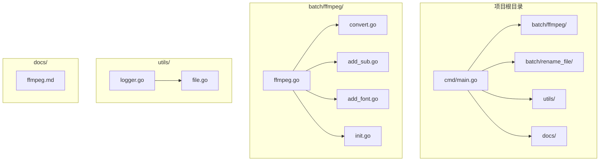

**图表来源**
- [main.go:1-29](file://cmd/main.go#L1-L29)
- [ffmpeg.go:1-324](file://batch/ffmpeg/ffmpeg.go#L1-L324)

**章节来源**
- [main.go:1-29](file://cmd/main.go#L1-L29)
- [go.mod:1-17](file://go.mod#L1-L17)

## 基础使用示例

### 安装和基本配置

在使用 batcher 之前，需要确保系统中已正确安装 FFmpeg。FFmpeg 是视频处理的核心依赖工具。

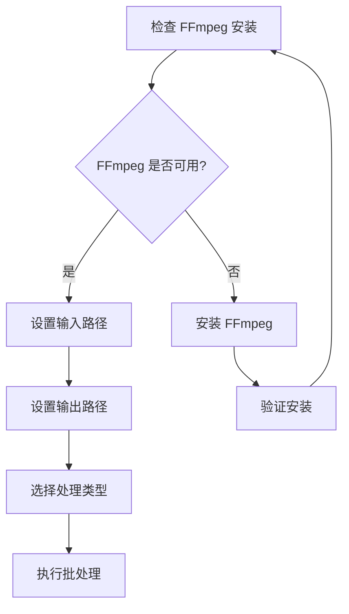

**图表来源**
- [ffmpeg.md:1-101](file://docs/ffmpeg.md#L1-L101)

### 简单视频转换任务

最基础的使用场景是将一批视频文件从一种格式转换为另一种格式。以下是一个完整的转换示例：

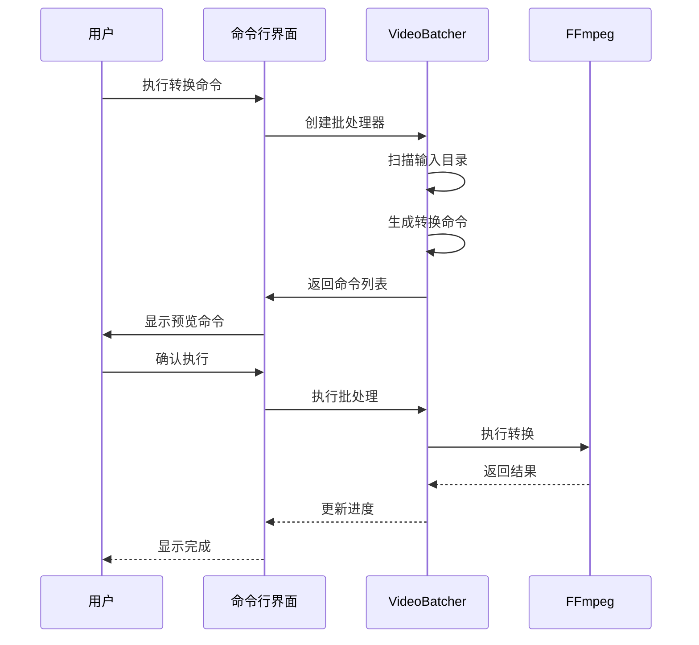

**图表来源**
- [convert.go:25-62](file://batch/ffmpeg/convert.go#L25-L62)
- [ffmpeg.go:137-156](file://batch/ffmpeg/ffmpeg.go#L137-L156)

### 基础转换命令示例

以下是一些常见的基础转换场景：

1. **基本格式转换**：将 MP4 文件转换为 MKV 格式
2. **硬件加速转换**：利用 GPU 进行视频编码加速
3. **质量控制转换**：通过 CRF 参数控制输出质量

**章节来源**
- [ffmpeg.md:18-32](file://docs/ffmpeg.md#L18-L32)
- [convert.go:25-62](file://batch/ffmpeg/convert.go#L25-L62)

## 批量处理最佳实践

### 目录结构组织

良好的目录结构是批量处理成功的关键。建议采用以下组织方式：

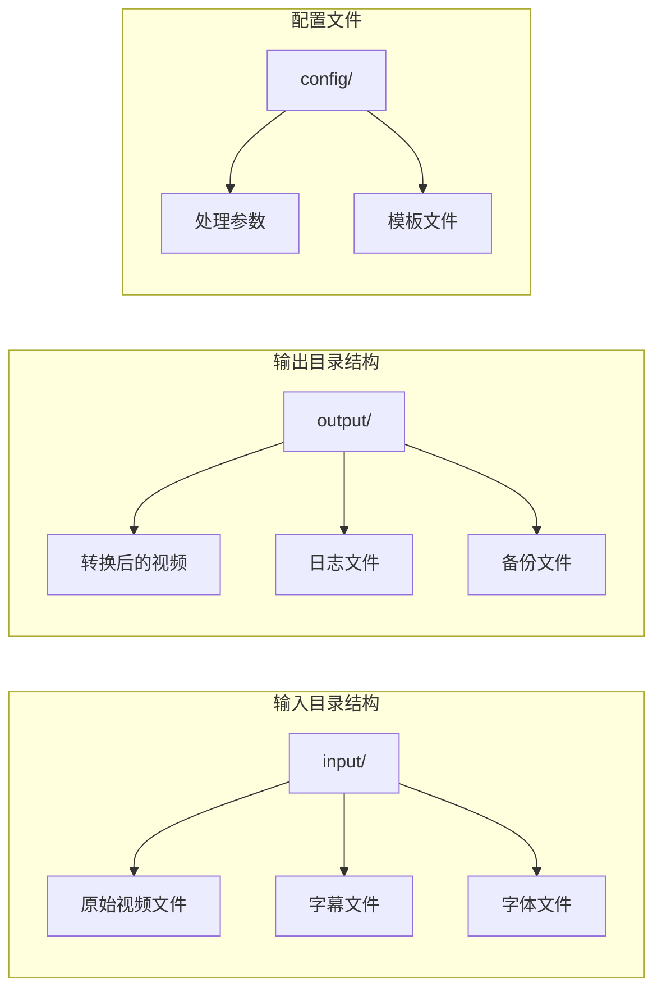

### 并发处理策略

batcher 支持多线程并发处理，合理配置并发数可以显著提升处理效率：

| 并发数 | CPU 使用率 | 内存占用 | 处理速度 |
|--------|------------|----------|----------|
| 1 | 低 | 低 | 慢 |
| 2-4 | 中等 | 中等 | 中等 |
| 8-16 | 高 | 高 | 快 |
| 32+ | 极高 | 极高 | 可能过载 |

**章节来源**
- [ffmpeg.go:248-286](file://batch/ffmpeg/ffmpeg.go#L248-L286)
- [init.go:51-55](file://batch/ffmpeg/init.go#L51-L55)

### 错误处理和恢复机制

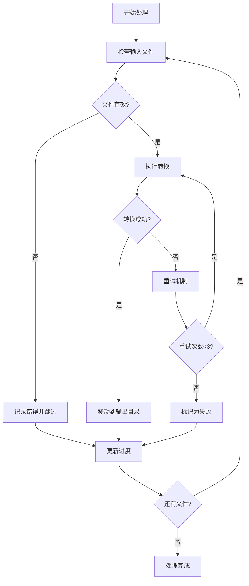

**图表来源**
- [ffmpeg.go:218-286](file://batch/ffmpeg/ffmpeg.go#L218-L286)

## 常用场景解决方案

### 字幕添加场景

字幕添加是最常用的批量处理场景之一。以下展示了如何批量为视频添加字幕：

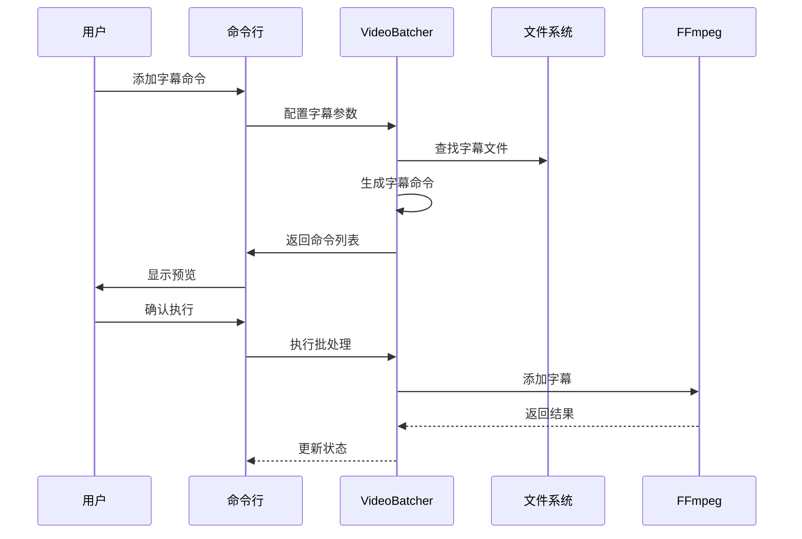

**图表来源**
- [add_sub.go:45-86](file://batch/ffmpeg/add_sub.go#L45-L86)
- [ffmpeg.go:180-216](file://batch/ffmpeg/ffmpeg.go#L180-L216)

### 字体嵌入场景

字体嵌入确保视频在不同设备上显示一致的字幕效果：

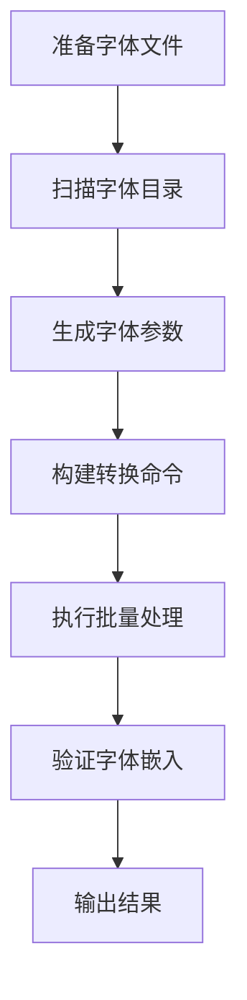

**图表来源**
- [add_font.go:30-67](file://batch/ffmpeg/add_font.go#L30-L67)
- [ffmpeg.go:158-178](file://batch/ffmpeg/ffmpeg.go#L158-L178)

**章节来源**
- [add_sub.go:11-88](file://batch/ffmpeg/add_sub.go#L11-L88)
- [add_font.go:1-69](file://batch/ffmpeg/add_font.go#L1-69)

## 高级功能示例

### 自定义 FFmpeg 参数

batcher 提供了灵活的参数定制功能，允许用户传入自定义的 FFmpeg 参数：

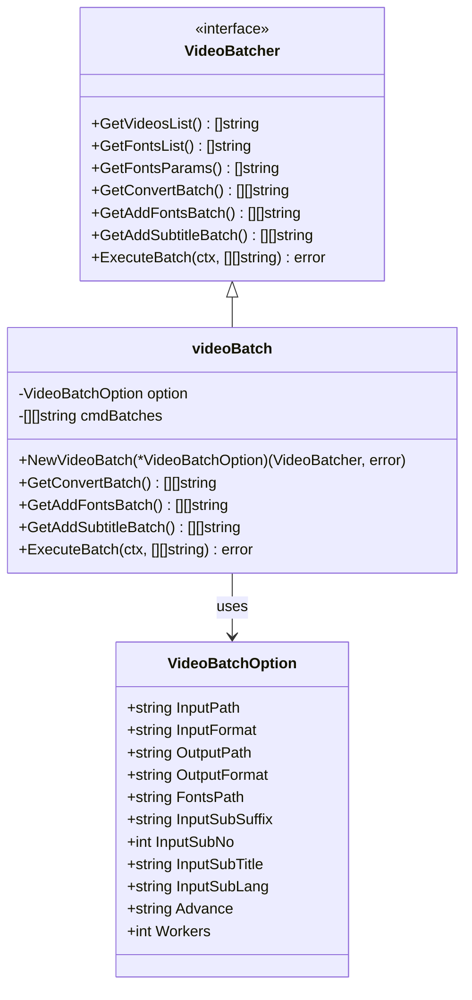

**图表来源**
- [ffmpeg.go:16-64](file://batch/ffmpeg/ffmpeg.go#L16-L64)
- [ffmpeg.go:30-43](file://batch/ffmpeg/ffmpeg.go#L30-L43)

### 复杂处理流程设计

对于复杂的视频处理需求，可以设计多步骤的处理流程：

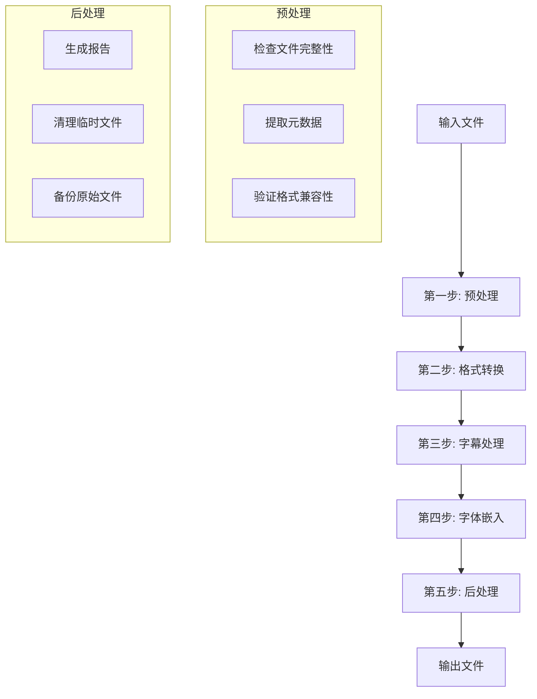

**图表来源**
- [ffmpeg.go:137-216](file://batch/ffmpeg/ffmpeg.go#L137-L216)

**章节来源**
- [ffmpeg.go:16-64](file://batch/ffmpeg/ffmpeg.go#L16-L64)
- [ffmpeg.go:137-216](file://batch/ffmpeg/ffmpeg.go#L137-L216)

## 性能优化案例

### 内存管理优化

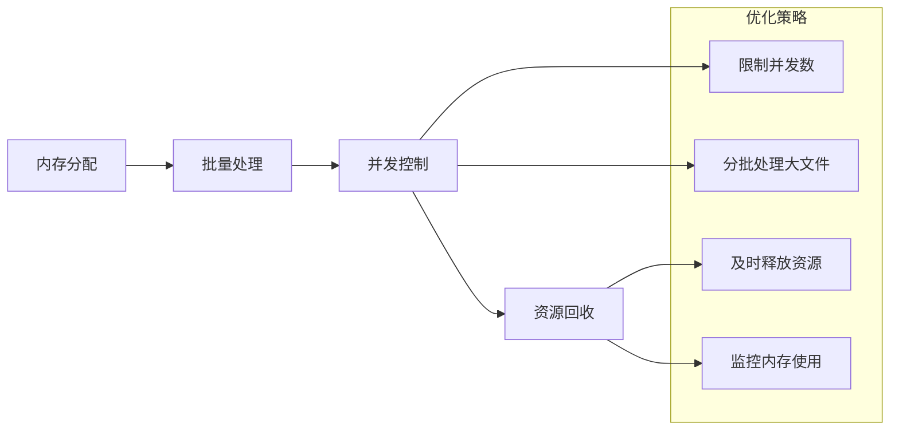

### 磁盘 I/O 优化

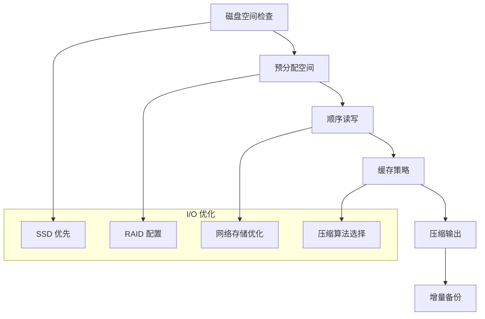

**章节来源**
- [ffmpeg.go:248-286](file://batch/ffmpeg/ffmpeg.go#L248-L286)
- [file.go:8-31](file://utils/file.go#L8-L31)

## 生产环境使用指南

### 环境准备

在生产环境中使用 batcher 需要特别注意以下几点：

1. **系统要求**：确保有足够的 CPU、内存和磁盘空间
2. **依赖管理**：正确安装和配置 FFmpeg 版本
3. **权限设置**：为批处理程序设置适当的文件系统权限
4. **监控配置**：建立日志记录和性能监控机制

### 部署架构

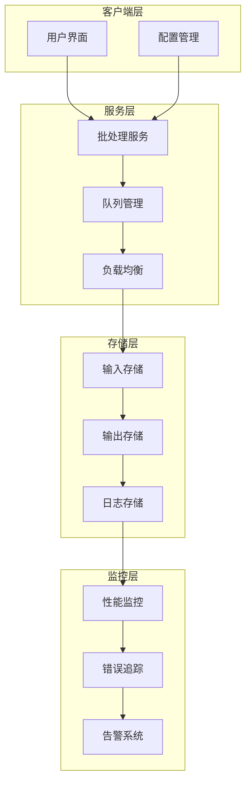

### 安全考虑

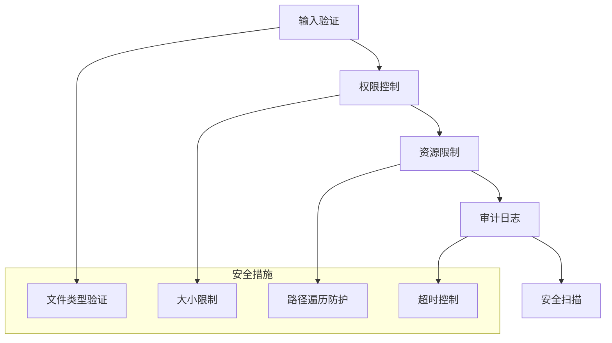

**章节来源**
- [ffmpeg.md:1-101](file://docs/ffmpeg.md#L1-L101)
- [logger.go:11-28](file://utils/logger.go#L11-L28)

## 故障排除和调试技巧

### 常见问题诊断

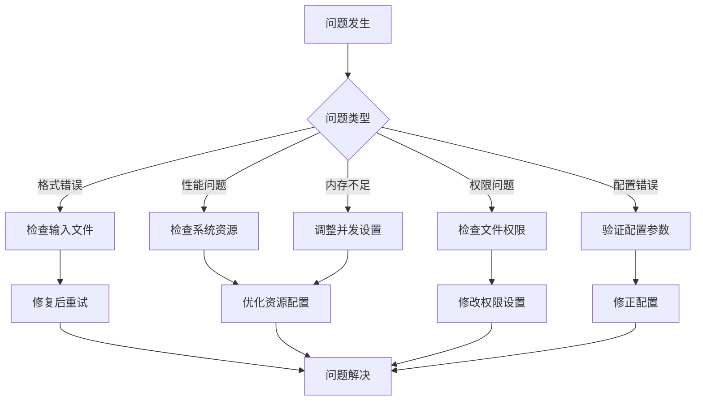

### 调试工具和方法

1. **日志分析**：利用内置的日志系统查看详细的处理过程
2. **Dry Run 模式**：先预览命令再执行，避免意外操作
3. **分步测试**：将复杂任务分解为简单步骤逐一测试
4. **性能监控**：监控 CPU、内存和磁盘使用情况

### 错误恢复策略

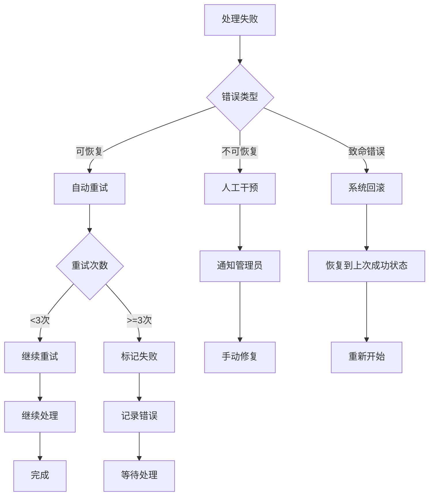

**章节来源**
- [ffmpeg.go:218-286](file://batch/ffmpeg/ffmpeg.go#L218-L286)
- [logger.go:11-28](file://utils/logger.go#L11-L28)

## 结论

batcher 工具为视频批量处理提供了强大而灵活的解决方案。通过本文档的学习，用户应该能够：

1. **掌握基础使用**：理解如何进行简单的视频转换和批量处理
2. **应用最佳实践**：学会合理的目录组织和并发处理策略
3. **解决常见问题**：具备故障排除和调试的基本技能
4. **设计复杂流程**：能够构建多步骤的视频处理管道
5. **优化性能表现**：在生产环境中实现高效的批量处理

随着对工具的深入理解和实践经验的积累，用户可以进一步探索更多高级功能和定制化选项，充分发挥 batcher 在视频处理领域的潜力。

建议在实际使用中：
- 先在小规模数据集上测试所有配置
- 建立完善的日志和监控体系
- 制定标准的操作流程和应急预案
- 定期评估和优化处理性能

通过这些实践，用户可以将 batcher 工具有效地集成到自己的视频处理工作流中，实现高效、可靠的批量视频处理能力。