# 高级功能示例

<cite>
**本文档引用的文件**
- [cmd/main.go](file://cmd/main.go)
- [batch/ffmpeg/ffmpeg.go](file://batch/ffmpeg/ffmpeg.go)
- [batch/ffmpeg/init.go](file://batch/ffmpeg/init.go)
- [batch/ffmpeg/convert.go](file://batch/ffmpeg/convert.go)
- [batch/ffmpeg/add_sub.go](file://batch/ffmpeg/add_sub.go)
- [batch/ffmpeg/add_font.go](file://batch/ffmpeg/add_font.go)
- [utils/logger.go](file://utils/logger.go)
- [utils/file.go](file://utils/file.go)
- [docs/ffmpeg.md](file://docs/ffmpeg.md)
- [batch/ffmpeg/ffmpeg_test.go](file://batch/ffmpeg/ffmpeg_test.go)
- [batch/rename_file/init.go](file://batch/rename_file/init.go)
- [go.mod](file://go.mod)
- [taskfile.yaml](file://taskfile.yaml)
</cite>

## 目录
1. [简介](#简介)
2. [项目架构概览](#项目架构概览)
3. [核心组件详解](#核心组件详解)
4. [高级功能实现](#高级功能实现)
5. [复杂处理流程设计](#复杂处理流程设计)
6. [性能优化策略](#性能优化策略)
7. [生产环境最佳实践](#生产环境最佳实践)
8. [故障排除指南](#故障排除指南)
9. [总结](#总结)

## 简介

batcher 是一个基于 Go 语言开发的命令行工具，专门用于批量处理视频文件。该工具提供了完整的视频格式转换、字幕添加和字体管理功能，支持多种硬件加速配置和复杂的自定义参数设置。本文档将深入探讨 batcher 的高级功能示例，展示如何在实际生产环境中高效地使用这些功能。

## 项目架构概览

batcher 采用模块化的架构设计，主要分为以下几个核心层次：

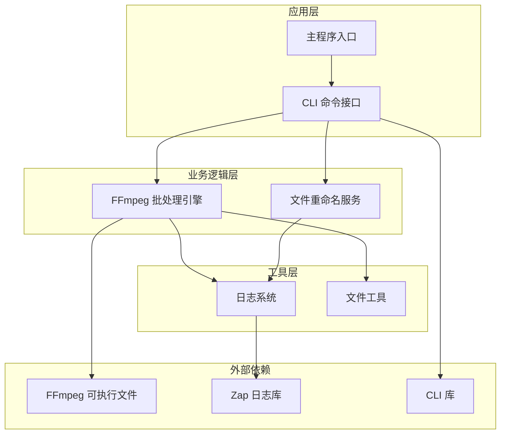

**图表来源**
- [cmd/main.go:13-28](file://cmd/main.go#L13-L28)
- [batch/ffmpeg/ffmpeg.go:16-64](file://batch/ffmpeg/ffmpeg.go#L16-L64)

**章节来源**
- [cmd/main.go:1-29](file://cmd/main.go#L1-29)
- [batch/ffmpeg/ffmpeg.go:1-324](file://batch/ffmpeg/ffmpeg.go#L1-L324)

## 核心组件详解

### 视频批处理器接口

视频批处理器是整个系统的核心抽象，定义了统一的批处理接口规范：

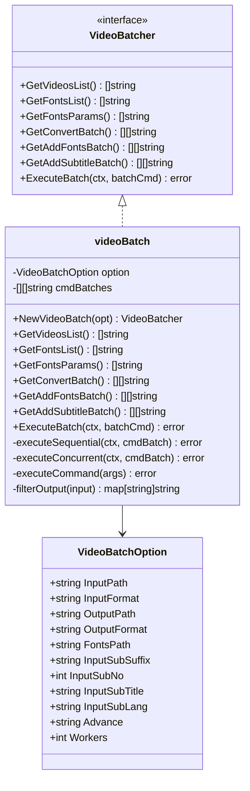

**图表来源**
- [batch/ffmpeg/ffmpeg.go:16-64](file://batch/ffmpeg/ffmpeg.go#L16-L64)
- [batch/ffmpeg/ffmpeg.go:40-64](file://batch/ffmpeg/ffmpeg.go#L40-L64)

### 执行引擎架构

批处理器实现了两种执行模式：串行执行和并发执行，以适应不同的性能需求：

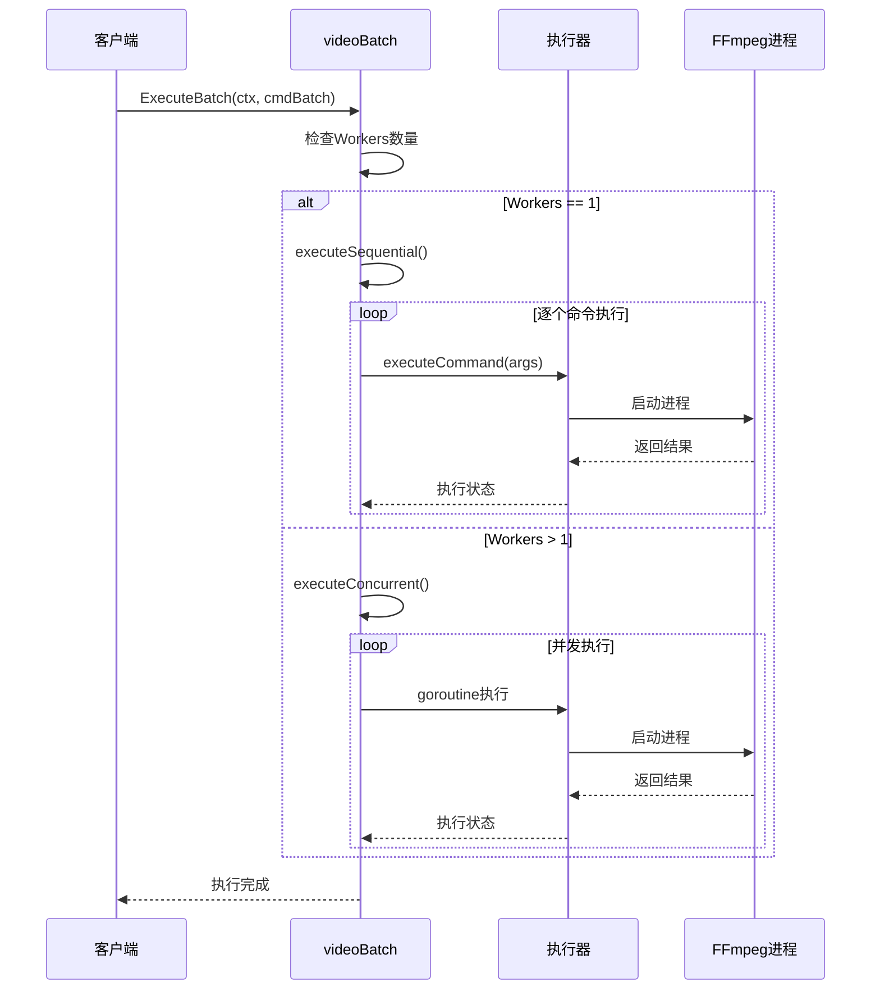

**图表来源**
- [batch/ffmpeg/ffmpeg.go:218-286](file://batch/ffmpeg/ffmpeg.go#L218-L286)
- [batch/ffmpeg/ffmpeg.go:248-286](file://batch/ffmpeg/ffmpeg.go#L248-L286)

**章节来源**
- [batch/ffmpeg/ffmpeg.go:16-324](file://batch/ffmpeg/ffmpeg.go#L1-L324)

## 高级功能实现

### 自定义 FFmpeg 参数配置

batcher 提供了灵活的自定义参数机制，允许用户通过 `advance` 参数传递任意 FFmpeg 命令行选项：

#### 硬件加速配置示例

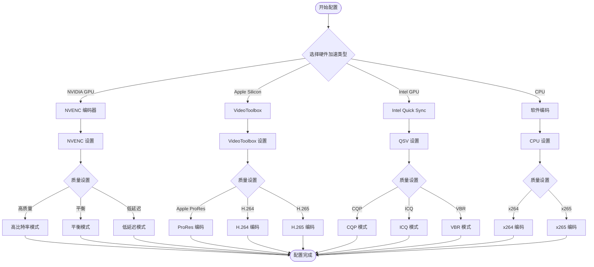

**图表来源**
- [docs/ffmpeg.md:21-32](file://docs/ffmpeg.md#L21-L32)

#### 编码器选择策略

根据不同的硬件条件和质量要求，可以选择最适合的编码器：

| 编码器 | 适用场景 | 性能特点 | 质量等级 |
|--------|----------|----------|----------|
| h264_nvenc | NVIDIA GPU, 实时转码 | 高性能, 低延迟 | 高质量 |
| hevc_nvenc | NVIDIA GPU, 10bit编码 | 高压缩比, 优秀质量 | 优秀 |
| h264_videotoolbox | Apple Silicon, macOS | 集成度高, 能耗低 | 高质量 |
| hevc_videotoolbox | Apple Silicon, 4K编码 | 4K支持, 高效率 | 优秀 |
| libx264 | CPU通用, 跨平台 | 兼容性好, 稳定 | 高质量 |
| libx265 | CPU高性能, 10bit编码 | 压缩比高, 质量优 | 优秀 |

#### 质量参数调优

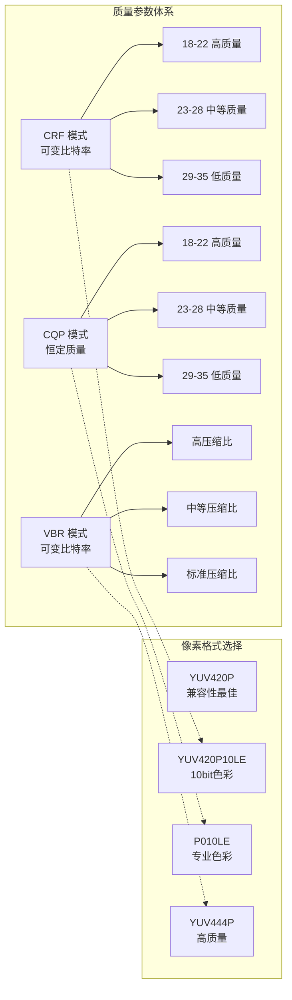

**图表来源**
- [docs/ffmpeg.md:24-31](file://docs/ffmpeg.md#L24-L31)

**章节来源**
- [docs/ffmpeg.md:18-101](file://docs/ffmpeg.md#L1-L101)
- [batch/ffmpeg/ffmpeg.go:147-150](file://batch/ffmpeg/ffmpeg.go#L147-L150)

### 字幕同步与管理

batcher 提供了完整的字幕处理功能，支持多语言字幕管理和字幕元数据配置：

#### 字幕处理流程

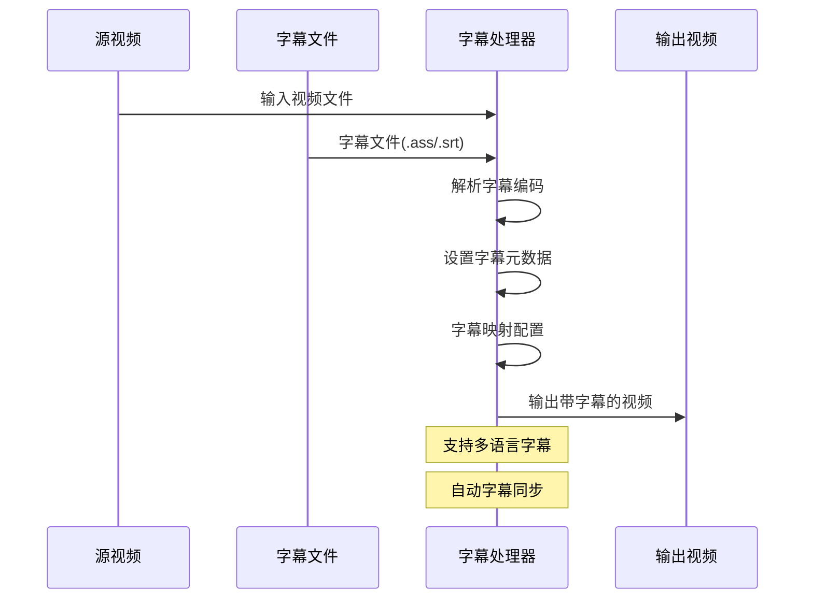

**图表来源**
- [batch/ffmpeg/add_sub.go:45-86](file://batch/ffmpeg/add_sub.go#L45-L86)

#### 字幕参数配置

| 参数名称 | 默认值 | 功能描述 | 使用场景 |
|----------|--------|----------|----------|
| input_sub_suffix | ass | 字幕后缀 | 支持 ass/srt/txt |
| input_sub_no | 0 | 字幕流编号 | 多字幕管理 |
| input_sub_lang | chi | 字幕语言代码 | 国际化支持 |
| input_sub_title | Chinese | 字幕标题 | 用户识别 |
| sub_charenc | UTF-8 | 字幕字符编码 | 多语言支持 |

**章节来源**
- [batch/ffmpeg/add_sub.go:24-44](file://batch/ffmpeg/add_sub.go#L24-L44)

### 字体管理系统

字体管理功能允许将自定义字体嵌入到视频文件中，确保在不同播放环境下的一致显示效果：

#### 字体嵌入流程

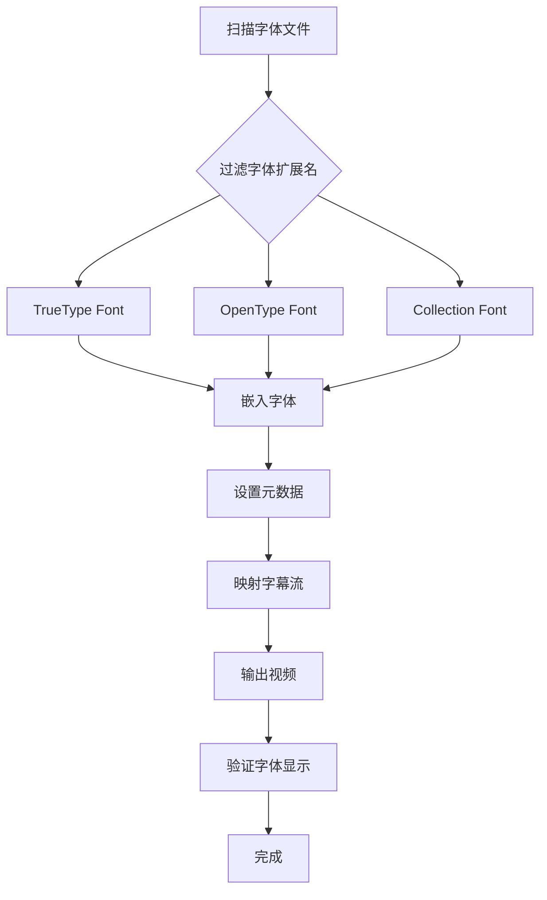

**图表来源**
- [batch/ffmpeg/ffmpeg.go:89-135](file://batch/ffmpeg/ffmpeg.go#L89-L135)

#### 字体支持格式

| 文件扩展名 | 字体类型 | 特点 | 使用场景 |
|------------|----------|------|----------|
| .ttf | TrueType Font | 兼容性好, 文件小 | 普通字体 |
| .otf | OpenType Font | 高质量, 支持高级特性 | 艺术字体 |
| .ttc | TrueType Collection | 多字体集合 | 字体包 |

**章节来源**
- [batch/ffmpeg/ffmpeg.go:45](file://batch/ffmpeg/ffmpeg.go#L45)
- [batch/ffmpeg/ffmpeg.go:115-135](file://batch/ffmpeg/ffmpeg.go#L115-L135)

## 复杂处理流程设计

### 多步骤视频处理管道

batcher 支持构建复杂的视频处理流水线，可以将多个处理步骤组合在一个批处理任务中：

#### 端到端处理流程

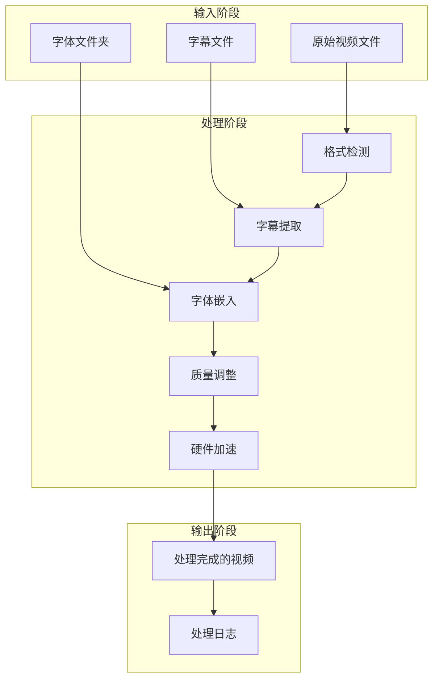

#### 流水线配置示例

一个典型的多步骤处理流程可能包括以下步骤：

1. **格式检测与验证**：自动识别输入视频格式和属性
2. **字幕处理**：提取、转换和嵌入字幕文件
3. **字体管理**：嵌入自定义字体以确保跨平台兼容性
4. **质量优化**：根据目标平台调整编码参数
5. **硬件加速**：利用可用的硬件资源提升处理速度

### 批量字幕同步策略

对于大规模字幕处理任务，batcher 提供了高效的批量同步机制：

#### 字幕同步算法

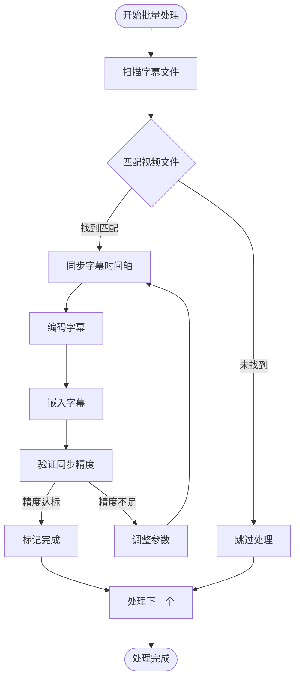

**图表来源**
- [batch/ffmpeg/add_sub.go:180-216](file://batch/ffmpeg/add_sub.go#L180-L216)

#### 字幕同步参数调优

| 参数 | 默认值 | 调优建议 | 影响范围 |
|------|--------|----------|----------|
| sub_charenc | UTF-8 | 根据字幕编码设置 | 字符显示正确性 |
| 字幕流映射 | 自动 | 手动指定以确保准确性 | 字幕显示位置 |
| 字幕元数据 | 自动生成 | 自定义以提高可读性 | 用户体验 |

**章节来源**
- [batch/ffmpeg/add_sub.go:180-216](file://batch/ffmpeg/add_sub.go#L180-L216)

### 字体管理策略

为了确保视频在不同设备上的字体显示一致性，batcher 提供了智能的字体管理策略：

#### 字体嵌入策略

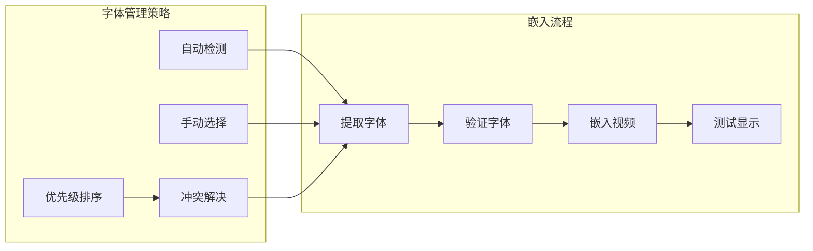

**图表来源**
- [batch/ffmpeg/ffmpeg.go:89-135](file://batch/ffmpeg/ffmpeg.go#L89-L135)

**章节来源**
- [batch/ffmpeg/ffmpeg.go:89-135](file://batch/ffmpeg/ffmpeg.go#L89-L135)

## 性能优化策略

### 并发处理配置

batcher 的并发执行机制是性能优化的关键，通过合理的并发配置可以显著提升处理速度：

#### 并发执行模型

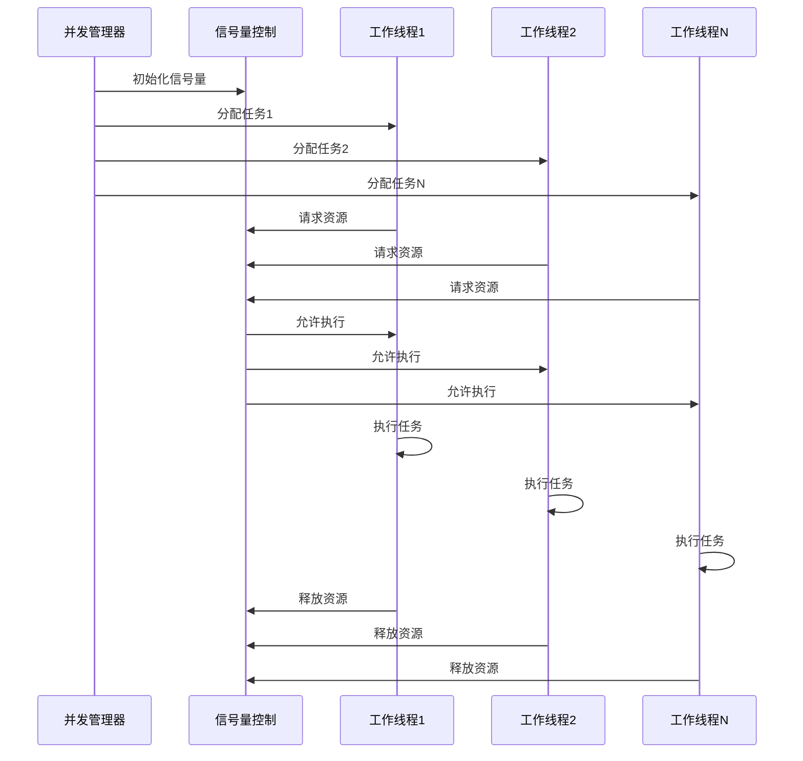

**图表来源**
- [batch/ffmpeg/ffmpeg.go:248-286](file://batch/ffmpeg/ffmpeg.go#L248-L286)

#### 并发参数调优

| Workers 数量 | 适用场景 | 性能特点 | 注意事项 |
|-------------|----------|----------|----------|
| 1 | 小规模处理, 内存受限 | 稳定, 资源占用少 | 处理速度慢 |
| 2-4 | 中等规模, 单核CPU | 平衡性能和资源 | 避免过度竞争 |
| 4-8 | 多核CPU, 有独立GPU | 高性能, 资源紧张 | 注意内存峰值 |
| 8+ | 大规模集群, 专用GPU | 最大化吞吐量 | 需要充足内存 |

### 内存管理优化

有效的内存管理是保证长时间运行稳定性的关键：

#### 内存使用监控

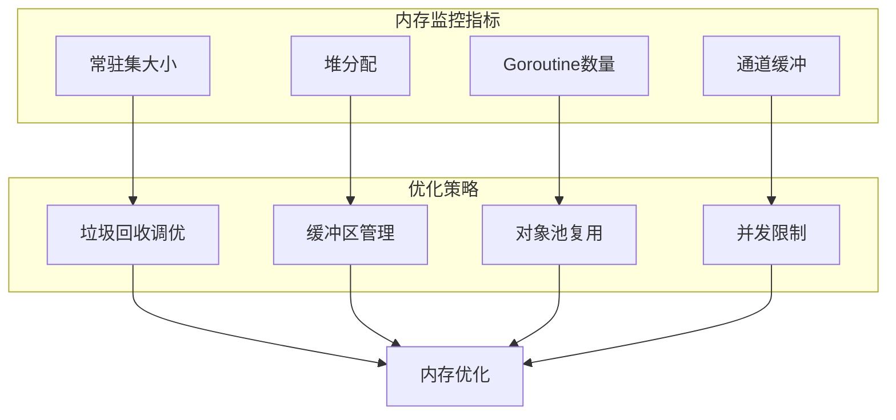

#### 内存优化技术

1. **分块处理**：将大文件分割成小块进行处理，减少内存峰值
2. **流式处理**：使用流式API避免一次性加载整个文件
3. **对象复用**：重用缓冲区和对象池减少GC压力
4. **及时释放**：确保不再使用的资源及时释放

### 处理速度提升技巧

通过合理的参数配置和算法优化，可以显著提升处理速度：

#### 速度优化策略

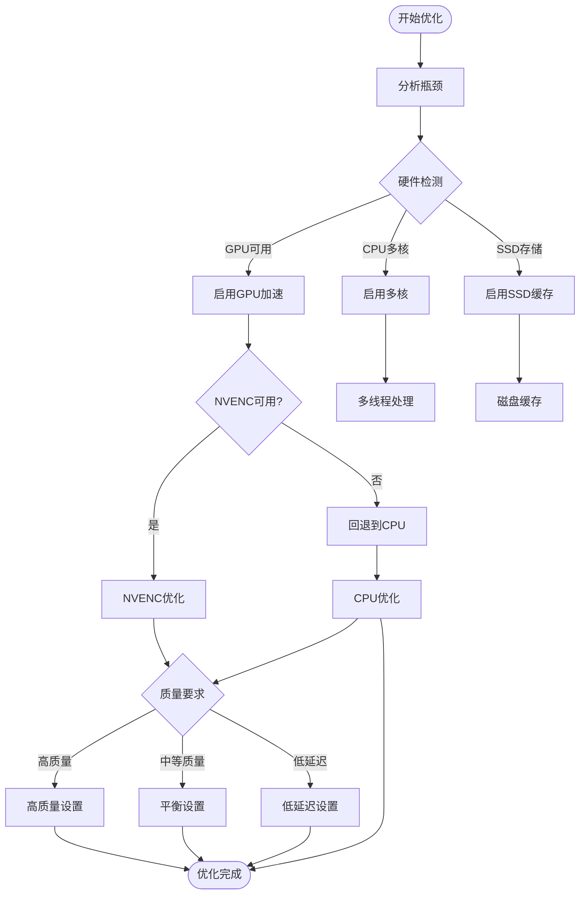

**图表来源**
- [docs/ffmpeg.md:21-32](file://docs/ffmpeg.md#L21-L32)

**章节来源**
- [batch/ffmpeg/ffmpeg.go:248-286](file://batch/ffmpeg/ffmpeg.go#L248-L286)
- [docs/ffmpeg.md:18-101](file://docs/ffmpeg.md#L1-L101)

## 生产环境最佳实践

### 错误处理策略

在生产环境中，健壮的错误处理是确保系统稳定性的关键：

#### 错误分类与处理

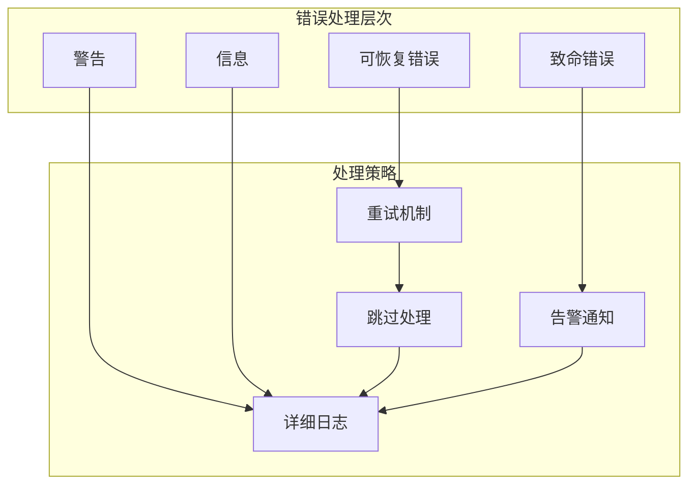

#### 错误处理最佳实践

1. **分级处理**：根据错误严重程度采取不同的处理策略
2. **重试机制**：对临时性错误实施有限次数的自动重试
3. **详细日志**：记录完整的错误上下文和调试信息
4. **优雅降级**：在部分功能失效时保持核心功能正常运行

### 日志记录与监控

完善的日志系统是运维监控的重要支撑：

#### 日志记录策略

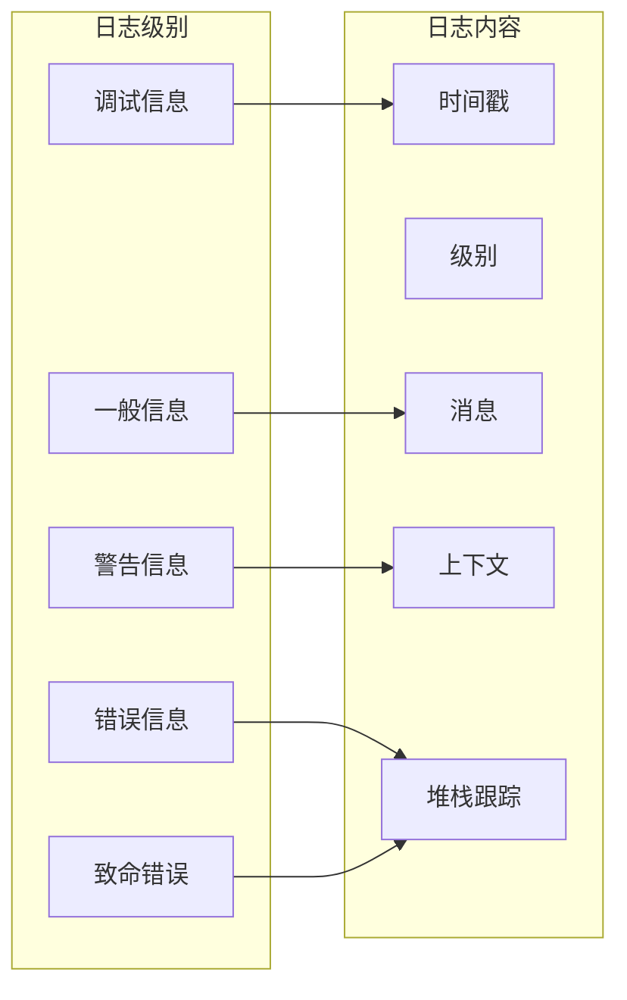

#### 监控指标设计

| 指标类型 | 监控项 | 目标值 | 告警阈值 |
|----------|--------|--------|----------|
| 性能指标 | 处理速度 | ≥ 100MB/s | < 50MB/s |
| 性能指标 | 并发度 | 80%利用率 | > 90% |
| 资源指标 | 内存使用 | ≤ 8GB | > 9GB |
| 资源指标 | CPU使用 | ≤ 90% | > 95% |
| 错误指标 | 失败率 | 0% | > 1% |
| 错误指标 | 重试率 | ≤ 5% | > 10% |

### 部署配置建议

#### 环境准备

1. **硬件要求**：
   - CPU：至少8核，推荐16核以上
   - 内存：16GB以上，推荐32GB以上
   - 存储：SSD至少500GB，建议1TB以上
   - GPU：NVIDIA GTX 1060以上或同等性能

2. **软件依赖**：
   - Go 1.22+
   - FFmpeg 4.4+
   - 操作系统：Linux/Windows/macOS

#### 配置优化

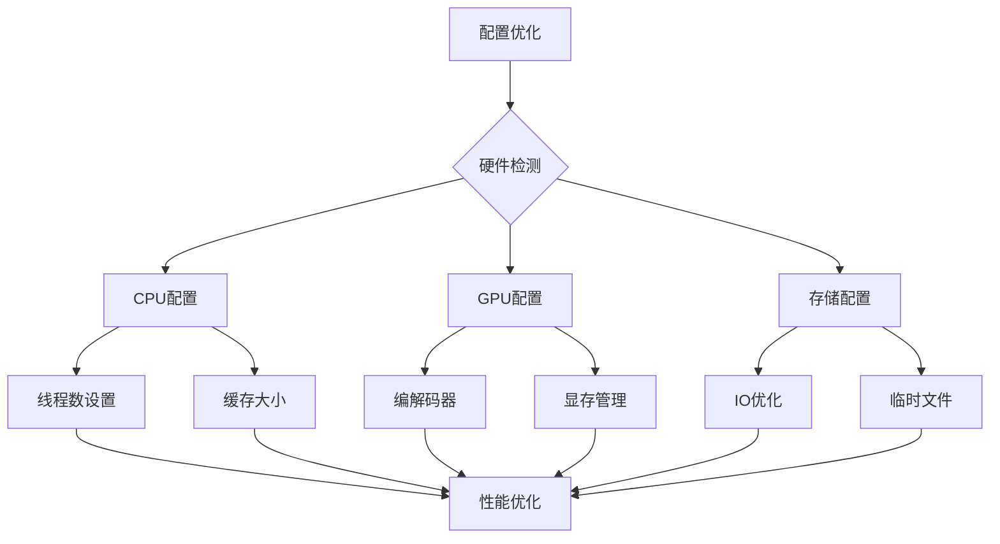

**图表来源**
- [batch/ffmpeg/ffmpeg.go:55-58](file://batch/ffmpeg/ffmpeg.go#L55-L58)

**章节来源**
- [utils/logger.go:11-28](file://utils/logger.go#L11-L28)
- [batch/ffmpeg/ffmpeg.go:55-58](file://batch/ffmpeg/ffmpeg.go#L55-L58)

## 故障排除指南

### 常见问题诊断

#### FFmpeg 相关问题

| 问题症状 | 可能原因 | 解决方案 |
|----------|----------|----------|
| 无法找到 FFmpeg | 程序不在 PATH 中 | 添加到系统 PATH 或使用绝对路径 |
| 编码器不可用 | 硬件不支持或驱动缺失 | 安装正确驱动或切换软件编码 |
| 内存不足 | 处理大文件导致内存溢出 | 减少并发数或增加系统内存 |
| 处理速度慢 | 硬件资源不足 | 优化参数配置或升级硬件 |

#### 批处理相关问题

| 问题症状 | 可能原因 | 解决方案 |
|----------|----------|----------|
| 文件未被识别 | 扩展名不匹配 | 检查输入格式设置 |
| 字幕不同步 | 时间轴偏移 | 调整字幕同步参数 |
| 字体显示异常 | 字体嵌入失败 | 验证字体文件完整性 |
| 并发处理崩溃 | 资源竞争 | 降低并发数或优化资源管理 |

### 调试技巧

1. **Dry Run 模式**：使用 `--dry-run` 参数预览即将执行的命令
2. **详细日志**：启用调试日志获取更详细的执行信息
3. **分步测试**：将复杂任务分解为简单的子任务逐一测试
4. **资源监控**：实时监控系统资源使用情况

### 性能调优建议

1. **参数验证**：定期验证和更新编码参数以适应新的硬件
2. **监控告警**：建立完善的监控和告警机制
3. **容量规划**：根据业务增长预留足够的系统资源
4. **备份策略**：建立数据备份和恢复机制

**章节来源**
- [batch/ffmpeg/ffmpeg_test.go:1-357](file://batch/ffmpeg/ffmpeg_test.go#L1-L357)
- [utils/logger.go:11-28](file://utils/logger.go#L11-L28)

## 总结

batcher 工具通过其模块化的设计和强大的功能，为视频批量处理提供了完整的解决方案。本文档深入介绍了以下关键方面：

### 核心优势

1. **灵活性**：支持自定义 FFmpeg 参数，适应各种复杂的处理需求
2. **性能**：提供并发执行和硬件加速支持，大幅提升处理效率
3. **可靠性**：完善的错误处理和监控机制，确保生产环境稳定运行
4. **易用性**：简洁的命令行接口和丰富的配置选项

### 技术特色

- **硬件加速集成**：支持 NVIDIA NVENC、Apple VideoToolbox、Intel QSV 等多种硬件加速
- **多格式支持**：完整的字幕和字体处理能力
- **智能并发**：动态的并发控制和资源管理
- **生产就绪**：完善的日志记录和监控体系

### 应用场景

batcher 适用于各种视频处理场景，包括但不限于：
- 在线视频平台的批量转码
- 影视制作公司的素材处理
- 教育机构的课程资源管理
- 个人用户的视频整理和优化

通过合理配置和优化，batcher 能够满足从个人用户到企业级应用的各种需求，是视频批量处理领域的优秀工具选择。