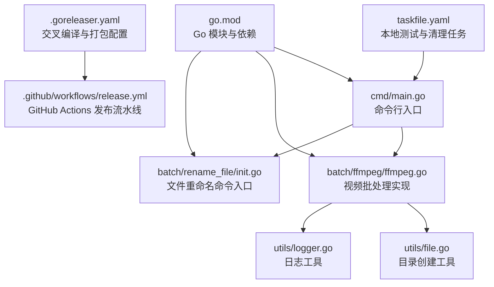
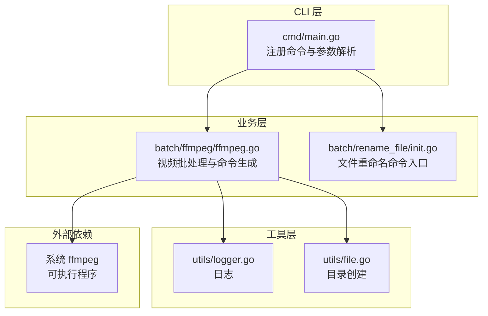
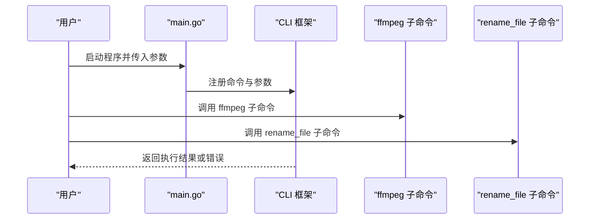
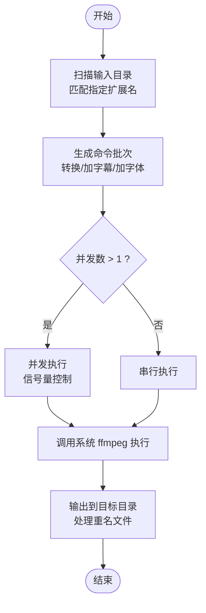
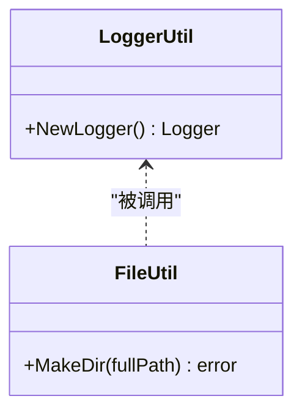
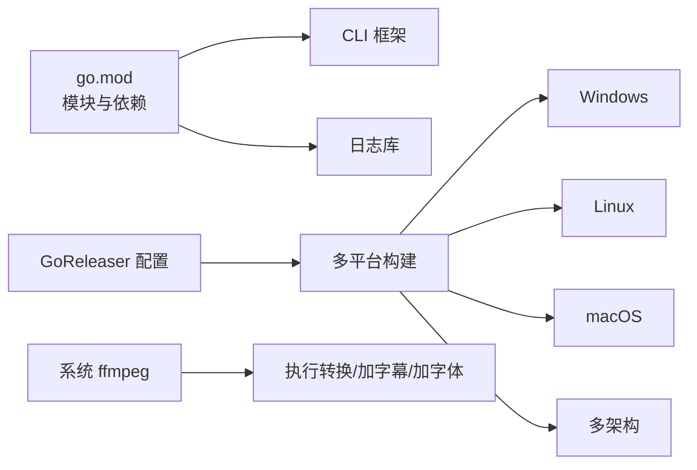

# 多平台部署

<cite>
**本文引用的文件**
- [cmd/main.go](file://cmd/main.go)
- [.goreleaser.yaml](file://.goreleaser.yaml)
- [taskfile.yaml](file://taskfile.yaml)
- [go.mod](file://go.mod)
- [.github/workflows/release.yml](file://.github/workflows/release.yml)
- [batch/ffmpeg/ffmpeg.go](file://batch/ffmpeg/ffmpeg.go)
- [batch/ffmpeg/init.go](file://batch/ffmpeg/init.go)
- [batch/rename_file/init.go](file://batch/rename_file/init.go)
- [utils/file.go](file://utils/file.go)
- [utils/logger.go](file://utils/logger.go)
- [docs/ffmpeg.md](file://docs/ffmpeg.md)
</cite>

## 目录
1. [简介](#简介)
2. [项目结构](#项目结构)
3. [核心组件](#核心组件)
4. [架构总览](#架构总览)
5. [详细组件分析](#详细组件分析)
6. [依赖分析](#依赖分析)
7. [性能考虑](#性能考虑)
8. [故障排除指南](#故障排除指南)
9. [结论](#结论)
10. [附录](#附录)

## 简介
本指南面向 batcher 工具在 Windows、Linux 和 macOS 的多平台部署与使用，覆盖安装与配置、交叉编译与构建、环境与前置条件、二进制分发与包管理器支持、Docker 容器化方案、平台特定优化建议、部署验证与故障排除等内容。batcher 提供基于命令行的批处理能力，当前主要通过调用系统中的 ffmpeg 实现视频格式转换、字幕添加与字体嵌入等任务。

## 项目结构
仓库采用模块化组织，核心入口位于命令行主程序，功能按子模块划分，工具类与日志封装在独立包中，构建与发布由 GoReleaser 驱动。

**图表来源**
- [cmd/main.go:1-29](file://cmd/main.go#L1-L29)
- [batch/ffmpeg/ffmpeg.go:1-324](file://batch/ffmpeg/ffmpeg.go#L1-L324)
- [batch/rename_file/init.go:1-35](file://batch/rename_file/init.go#L1-L35)
- [utils/file.go:1-32](file://utils/file.go#L1-L32)
- [utils/logger.go:1-29](file://utils/logger.go#L1-L29)
- [.goreleaser.yaml:1-75](file://.goreleaser.yaml#L1-L75)
- [.github/workflows/release.yml:1-32](file://.github/workflows/release.yml#L1-L32)
- [go.mod:1-17](file://go.mod#L1-L17)
- [taskfile.yaml:1-16](file://taskfile.yaml#L1-L16)

**章节来源**
- [cmd/main.go:1-29](file://cmd/main.go#L1-L29)
- [go.mod:1-17](file://go.mod#L1-L17)

## 核心组件
- 命令行入口：注册 ffmpeg 与 rename_file 两个子命令，统一通过 CLI 框架进行解析与执行。
- ffmpeg 批处理：负责扫描输入目录、生成转换/加字幕/加字体的命令批次，并支持串行与并发执行。
- 工具与日志：提供目录创建与基础日志输出能力，便于跨平台运行时的调试与排错。
- 构建与发布：通过 GoReleaser 在多平台多架构上生成压缩包，并由 GitHub Actions 自动触发发布。

**章节来源**
- [cmd/main.go:13-28](file://cmd/main.go#L13-L28)
- [batch/ffmpeg/ffmpeg.go:47-64](file://batch/ffmpeg/ffmpeg.go#L47-L64)
- [utils/file.go:8-31](file://utils/file.go#L8-L31)
- [utils/logger.go:11-28](file://utils/logger.go#L11-L28)
- [.goreleaser.yaml:14-58](file://.goreleaser.yaml#L14-L58)

## 架构总览
下图展示 batcher 的整体架构与数据流：CLI 入口解析参数，调用 ffmpeg 批处理模块生成命令批次，最终通过系统 ffmpeg 执行；日志与工具模块贯穿于执行过程。

**图表来源**
- [cmd/main.go:13-28](file://cmd/main.go#L13-L28)
- [batch/ffmpeg/ffmpeg.go:47-64](file://batch/ffmpeg/ffmpeg.go#L47-L64)
- [batch/rename_file/init.go:25-34](file://batch/rename_file/init.go#L25-L34)
- [utils/logger.go:11-28](file://utils/logger.go#L11-L28)
- [utils/file.go:8-31](file://utils/file.go#L8-L31)

## 详细组件分析

### 组件一：CLI 入口与命令注册
- 注册 ffmpeg 与 rename_file 两个子命令，统一由 CLI 框架驱动。
- 错误处理：遇到异常时向标准错误输出并退出非零状态，便于自动化脚本捕获。

**图表来源**
- [cmd/main.go:13-28](file://cmd/main.go#L13-L28)
- [batch/ffmpeg/init.go:61-71](file://batch/ffmpeg/init.go#L61-L71)
- [batch/rename_file/init.go:25-34](file://batch/rename_file/init.go#L25-L34)

**章节来源**
- [cmd/main.go:13-28](file://cmd/main.go#L13-L28)
- [batch/ffmpeg/init.go:61-71](file://batch/ffmpeg/init.go#L61-L71)
- [batch/rename_file/init.go:25-34](file://batch/rename_file/init.go#L25-L34)

### 组件二：ffmpeg 批处理模块
- 功能职责：扫描输入目录、生成命令批次、执行转换/加字幕/加字体等操作，支持串行与并发。
- 关键点：
  - 输入/输出路径与格式校验与默认值。
  - 命令生成与去重输出文件名策略。
  - 并发执行通过信号量控制，支持 context 取消。
  - 跨平台调用 ffmpeg，Windows 使用 ffmpeg.exe，其他平台使用 ffmpeg。

**图表来源**
- [batch/ffmpeg/ffmpeg.go:66-87](file://batch/ffmpeg/ffmpeg.go#L66-L87)
- [batch/ffmpeg/ffmpeg.go:137-156](file://batch/ffmpeg/ffmpeg.go#L137-L156)
- [batch/ffmpeg/ffmpeg.go:180-216](file://batch/ffmpeg/ffmpeg.go#L180-L216)
- [batch/ffmpeg/ffmpeg.go:218-286](file://batch/ffmpeg/ffmpeg.go#L218-L286)
- [batch/ffmpeg/ffmpeg.go:288-299](file://batch/ffmpeg/ffmpeg.go#L288-L299)
- [batch/ffmpeg/ffmpeg.go:301-318](file://batch/ffmpeg/ffmpeg.go#L301-L318)

**章节来源**
- [batch/ffmpeg/ffmpeg.go:47-64](file://batch/ffmpeg/ffmpeg.go#L47-L64)
- [batch/ffmpeg/ffmpeg.go:137-216](file://batch/ffmpeg/ffmpeg.go#L137-L216)
- [batch/ffmpeg/ffmpeg.go:218-299](file://batch/ffmpeg/ffmpeg.go#L218-L299)
- [batch/ffmpeg/ffmpeg.go:301-324](file://batch/ffmpeg/ffmpeg.go#L301-L324)

### 组件三：工具与日志
- 目录创建：确保输出目录存在，若路径非法或冲突返回错误。
- 日志：基于 zap 控制台输出，带时间、级别、调用者信息，便于跨平台排错。

**图表来源**
- [utils/logger.go:11-28](file://utils/logger.go#L11-L28)
- [utils/file.go:8-31](file://utils/file.go#L8-L31)

**章节来源**
- [utils/logger.go:11-28](file://utils/logger.go#L11-L28)
- [utils/file.go:8-31](file://utils/file.go#L8-L31)

## 依赖分析
- 模块与依赖：模块使用 CLI 框架与日志库，构建与发布由 GoReleaser 驱动。
- 平台与架构：GoReleaser 配置了多 OS/Arch 组合，包含 Windows、Linux、macOS 与多种 CPU 架构。
- 运行时依赖：系统需安装 ffmpeg，Windows 使用 ffmpeg.exe，其他平台使用 ffmpeg。

**图表来源**
- [go.mod:1-17](file://go.mod#L1-L17)
- [.goreleaser.yaml:27-40](file://.goreleaser.yaml#L27-L40)
- [batch/ffmpeg/ffmpeg.go:288-299](file://batch/ffmpeg/ffmpeg.go#L288-L299)

**章节来源**
- [go.mod:1-17](file://go.mod#L1-L17)
- [.goreleaser.yaml:14-58](file://.goreleaser.yaml#L14-L58)
- [batch/ffmpeg/ffmpeg.go:288-299](file://batch/ffmpeg/ffmpeg.go#L288-L299)

## 性能考虑
- 并发执行：通过并发工作数控制同时执行的命令数量，避免资源争用；默认串行以降低资源占用。
- 去重输出：对同名文件追加序号，避免覆盖与冲突。
- 轻量化构建：CGO 禁用、剥离符号与调试信息，减小二进制体积并提升启动速度。
- 外部依赖：合理选择硬件加速编码器（如 NVIDIA NVENC、Apple Silicon VideoToolbox），结合 ffmpeg 文档进行参数优化。

**章节来源**
- [batch/ffmpeg/ffmpeg.go:218-286](file://batch/ffmpeg/ffmpeg.go#L218-L286)
- [batch/ffmpeg/ffmpeg.go:301-318](file://batch/ffmpeg/ffmpeg.go#L301-L318)
- [.goreleaser.yaml:17-27](file://.goreleaser.yaml#L17-L27)
- [docs/ffmpeg.md:18-32](file://docs/ffmpeg.md#L18-L32)

## 故障排除指南
- 未找到 ffmpeg
  - 症状：执行时报错找不到 ffmpeg 或 ffmpeg.exe。
  - 排查：确认系统已安装 ffmpeg，并将其加入 PATH；Windows 使用 ffmpeg.exe，其他平台使用 ffmpeg。
  - 参考：[docs/ffmpeg.md:3](file://docs/ffmpeg.md#L3)
- 权限问题
  - 症状：无法写入输出目录或读取输入文件。
  - 排查：检查输出目录权限与磁盘空间；确保输入路径存在且可访问。
  - 参考：[utils/file.go:8-31](file://utils/file.go#L8-L31)
- 并发导致资源不足
  - 症状：CPU/内存占用过高，转换失败。
  - 排查：降低并发工作数；优先使用硬件加速编码器。
  - 参考：[batch/ffmpeg/ffmpeg.go:218-286](file://batch/ffmpeg/ffmpeg.go#L218-L286)
- 命令生成异常
  - 症状：生成的命令不正确或缺少必要参数。
  - 排查：核对输入/输出格式、字幕后缀、字体路径等参数；使用 dry-run 检查命令。
  - 参考：[batch/ffmpeg/init.go:8-56](file://batch/ffmpeg/init.go#L8-L56)
- 日志定位
  - 症状：难以定位错误来源。
  - 排查：启用详细日志，查看时间戳与调用者信息。
  - 参考：[utils/logger.go:11-28](file://utils/logger.go#L11-L28)

**章节来源**
- [docs/ffmpeg.md:3](file://docs/ffmpeg.md#L3)
- [utils/file.go:8-31](file://utils/file.go#L8-L31)
- [batch/ffmpeg/ffmpeg.go:218-286](file://batch/ffmpeg/ffmpeg.go#L218-L286)
- [batch/ffmpeg/init.go:8-56](file://batch/ffmpeg/init.go#L8-L56)
- [utils/logger.go:11-28](file://utils/logger.go#L11-L28)

## 结论
batcher 通过 CLI 简洁地整合了视频批处理能力，底层依赖系统 ffmpeg，具备良好的跨平台兼容性与可扩展性。借助 GoReleaser 的多平台构建与 GitHub Actions 的自动化发布，用户可在 Windows、Linux 与 macOS 上快速获得稳定可用的二进制版本。建议在生产环境中结合硬件加速与合理的并发策略，以获得更优的性能表现。

## 附录

### 平台安装与配置指南

- Windows
  - 前置条件
    - 安装 ffmpeg（可执行名为 ffmpeg.exe），并加入系统 PATH。
  - 安装方式
    - 二进制分发：从发布页下载对应 zip 包，解压后将可执行文件置于 PATH 中。
    - 包管理器：使用包管理器安装 ffmpeg（例如通过 Chocolatey 等）。
  - 验证
    - 在终端执行 ffmpeg -version，确认版本信息正常输出。
  - 参考
    - [docs/ffmpeg.md:3](file://docs/ffmpeg.md#L3)
    - [batch/ffmpeg/ffmpeg.go:288-299](file://batch/ffmpeg/ffmpeg.go#L288-L299)

- Linux
  - 前置条件
    - 安装 ffmpeg（可执行名为 ffmpeg），并加入 PATH。
  - 安装方式
    - 包管理器：使用 apt/yum/dnf 等安装 ffmpeg。
    - 二进制分发：从发布页下载对应 tar.gz 包，解压后将可执行文件置于 PATH 中。
  - 验证
    - 在终端执行 ffmpeg -version，确认版本信息正常输出。
  - 参考
    - [docs/ffmpeg.md:3](file://docs/ffmpeg.md#L3)
    - [batch/ffmpeg/ffmpeg.go:288-299](file://batch/ffmpeg/ffmpeg.go#L288-L299)

- macOS
  - 前置条件
    - 安装 ffmpeg（可执行名为 ffmpeg），并加入 PATH。
  - 安装方式
    - 包管理器：使用 Homebrew 安装 ffmpeg。
    - 二进制分发：从发布页下载对应 tar.gz 包，解压后将可执行文件置于 PATH 中。
  - 验证
    - 在终端执行 ffmpeg -version，确认版本信息正常输出。
  - 参考
    - [docs/ffmpeg.md:3](file://docs/ffmpeg.md#L3)
    - [batch/ffmpeg/ffmpeg.go:288-299](file://batch/ffmpeg/ffmpeg.go#L288-L299)

### 交叉编译与构建流程

- 本地构建
  - 使用 Go 模块与 GoReleaser 配置，支持多 OS/Arch 组合。
  - 参考
    - [.goreleaser.yaml:14-58](file://.goreleaser.yaml#L14-L58)
    - [go.mod:1-17](file://go.mod#L1-L17)

- GitHub Actions 自动发布
  - 当推送以 v 开头的标签时，自动拉取代码、设置 Go 版本、执行 GoReleaser 发布。
  - 参考
    - [.github/workflows/release.yml:1-32](file://.github/workflows/release.yml#L1-L32)

- 本地任务
  - 提供测试与清理任务，便于本地验证与环境清理。
  - 参考
    - [taskfile.yaml:4-16](file://taskfile.yaml#L4-L16)

**章节来源**
- [.goreleaser.yaml:14-58](file://.goreleaser.yaml#L14-L58)
- [.github/workflows/release.yml:1-32](file://.github/workflows/release.yml#L1-L32)
- [taskfile.yaml:4-16](file://taskfile.yaml#L4-L16)
- [go.mod:1-17](file://go.mod#L1-L17)

### 环境要求与前置条件

- Go 版本
  - 模块声明使用 Go 1.22.2。
  - 参考
    - [go.mod:3](file://go.mod#L3)

- 外部依赖
  - 必须安装 ffmpeg（Windows 使用 ffmpeg.exe，其他平台使用 ffmpeg）。
  - 参考
    - [docs/ffmpeg.md:3](file://docs/ffmpeg.md#L3)
    - [batch/ffmpeg/ffmpeg.go:288-299](file://batch/ffmpeg/ffmpeg.go#L288-L299)

### 包管理与分发

- 二进制分发
  - GoReleaser 生成 tar.gz（Linux/macOS）或 zip（Windows）压缩包，包含许可证与变更记录。
  - 参考
    - [.goreleaser.yaml:41-58](file://.goreleaser.yaml#L41-L58)

- 包管理器支持
  - Windows：可通过包管理器安装 ffmpeg。
  - Linux：可通过 apt/yum/dnf 等安装 ffmpeg。
  - macOS：可通过 Homebrew 安装 ffmpeg。
  - 参考
    - [docs/ffmpeg.md:3](file://docs/ffmpeg.md#L3)

### Docker 容器化部署方案

- 方案概述
  - 在容器内安装 ffmpeg，并将 batcher 二进制与输入/输出目录挂载到容器中运行。
  - 可参考官方 ffmpeg 官方镜像作为基础镜像，安装 batcher 并配置入口命令。
- 使用步骤（示例思路）
  - 准备 Dockerfile：复制 batcher 二进制与 ffmpeg 至镜像，设置工作目录与入口命令。
  - 构建镜像：docker build -t batcher .
  - 运行容器：docker run --rm -v /host/input:/input -v /host/output:/output batcher ffmpeg convert --input_path=/input --output_path=/output
- 注意事项
  - 确保容器内 ffmpeg 可用且与宿主机版本兼容。
  - 挂载卷时注意权限与路径映射。
- 参考
  - [docs/ffmpeg.md:3](file://docs/ffmpeg.md#L3)
  - [batch/ffmpeg/ffmpeg.go:288-299](file://batch/ffmpeg/ffmpeg.go#L288-L299)

### 平台特定配置与优化建议

- Windows
  - 使用 ffmpeg.exe 并确保 PATH 正确。
  - 可结合 PowerShell 脚本进行批处理自动化。
  - 参考
    - [batch/ffmpeg/ffmpeg.go:288-299](file://batch/ffmpeg/ffmpeg.go#L288-L299)

- Linux
  - 使用硬件加速编码器（如 NVENC/NVDEC）以提升性能。
  - 参考
    - [docs/ffmpeg.md:18-32](file://docs/ffmpeg.md#L18-L32)

- macOS
  - Apple Silicon 设备可使用 VideoToolbox 加速。
  - 参考
    - [docs/ffmpeg.md:28-31](file://docs/ffmpeg.md#L28-L31)

### 部署验证与故障排除

- 部署验证
  - 执行 ffmpeg -version 确认 ffmpeg 正常。
  - 运行 batcher ffmpeg convert --help 查看帮助信息。
  - 参考
    - [docs/ffmpeg.md:34-43](file://docs/ffmpeg.md#L34-L43)

- 常见问题
  - ffmpeg 未找到：检查 PATH 与可执行文件名称。
  - 权限不足：检查输入/输出目录权限。
  - 并发过高：降低 workers 数值或启用硬件加速。
  - 参考
    - [utils/file.go:8-31](file://utils/file.go#L8-L31)
    - [batch/ffmpeg/ffmpeg.go:218-286](file://batch/ffmpeg/ffmpeg.go#L218-L286)