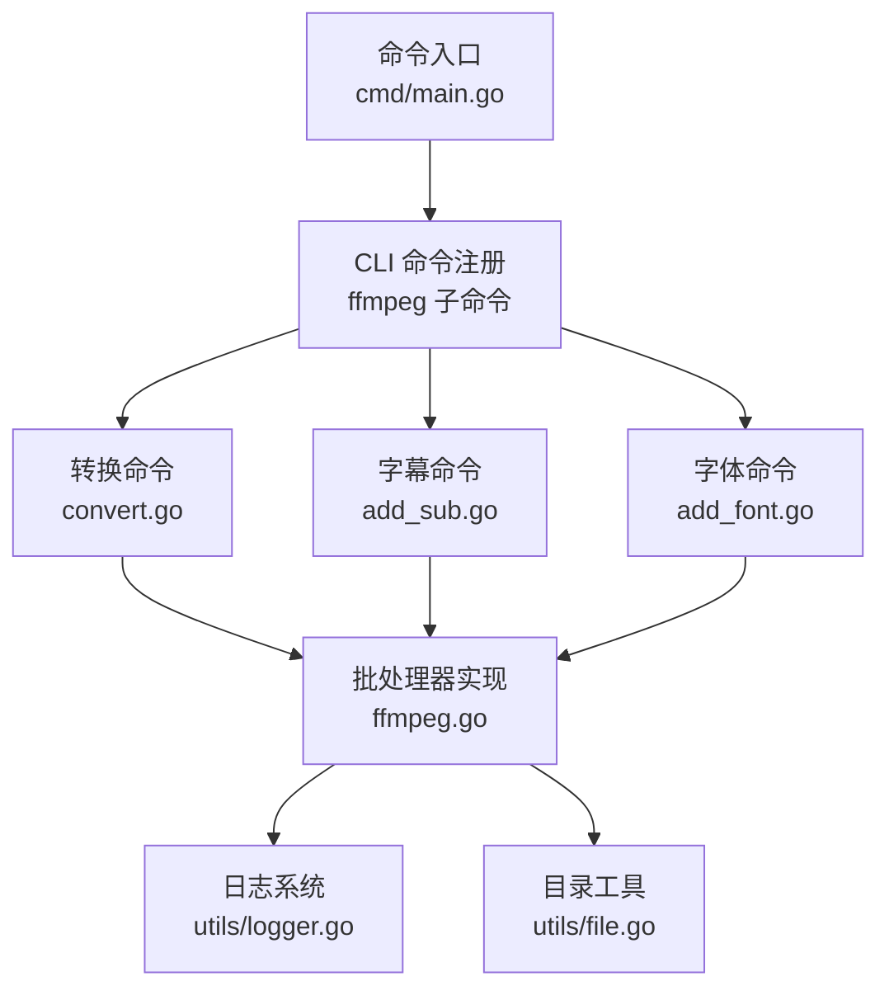
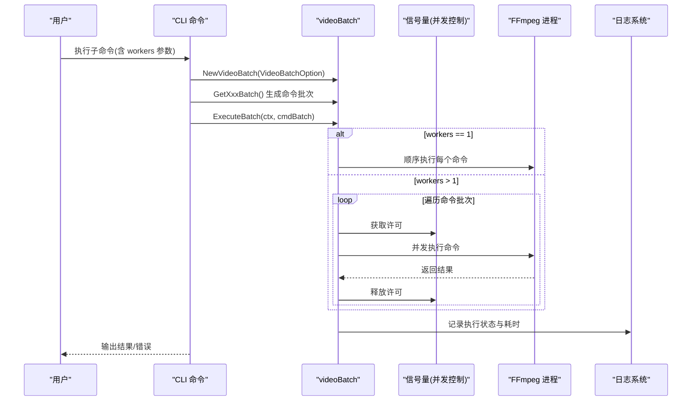
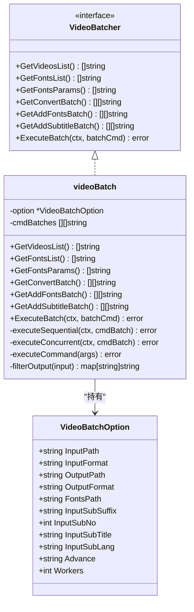
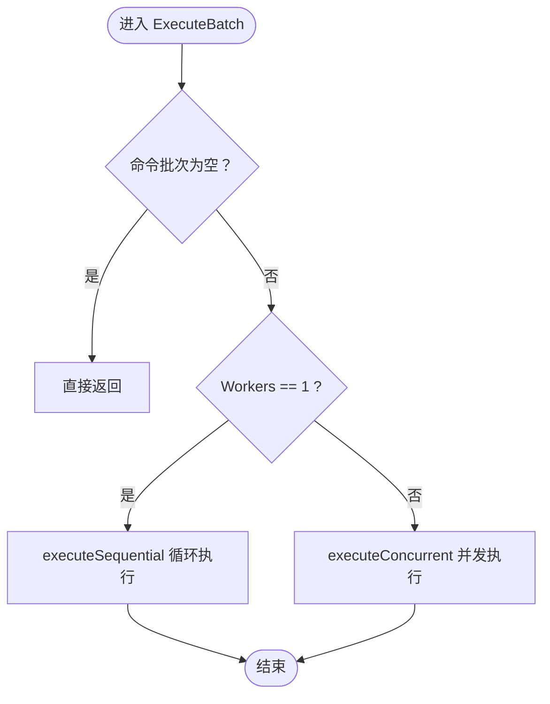
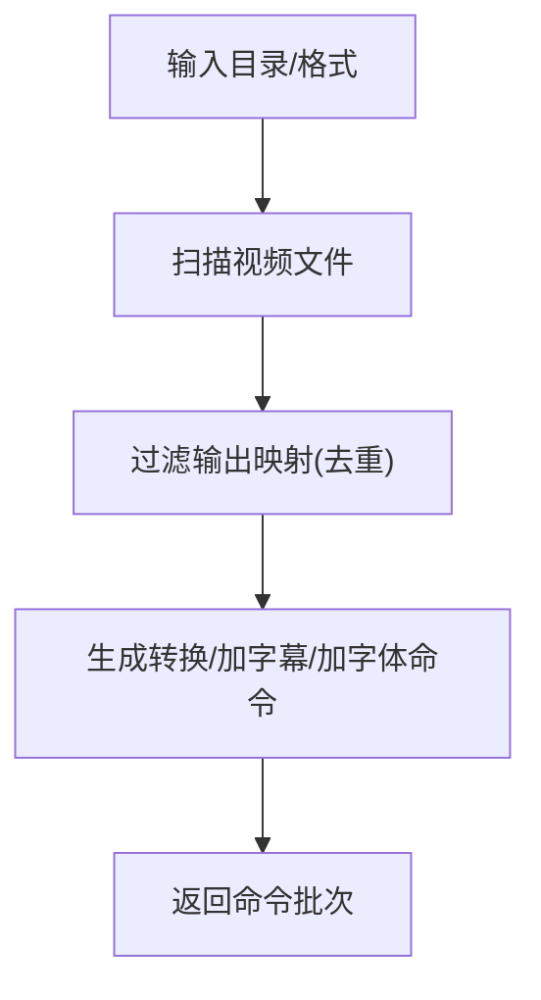
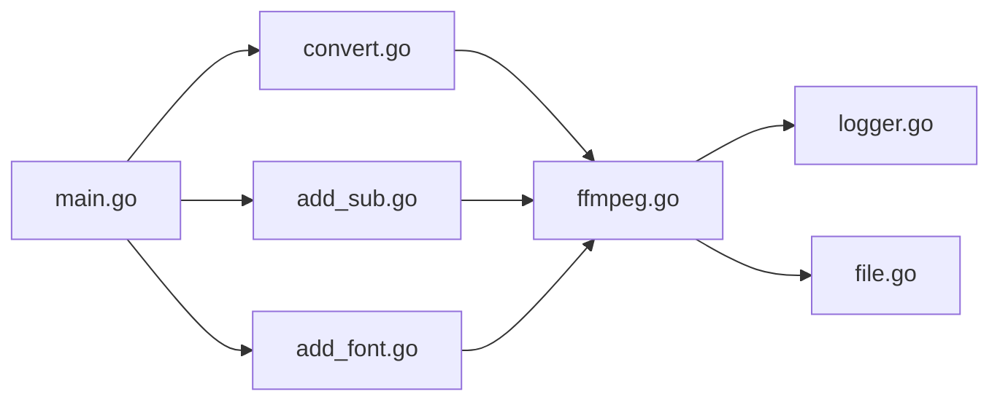

# 性能优化

<cite>
**本文引用的文件**
- [cmd/main.go](file://cmd/main.go)
- [batch/ffmpeg/ffmpeg.go](file://batch/ffmpeg/ffmpeg.go)
- [batch/ffmpeg/init.go](file://batch/ffmpeg/init.go)
- [batch/ffmpeg/convert.go](file://batch/ffmpeg/convert.go)
- [batch/ffmpeg/add_sub.go](file://batch/ffmpeg/add_sub.go)
- [batch/ffmpeg/add_font.go](file://batch/ffmpeg/add_font.go)
- [utils/logger.go](file://utils/logger.go)
- [utils/file.go](file://utils/file.go)
- [go.mod](file://go.mod)
- [docs/ffmpeg.md](file://docs/ffmpeg.md)
- [.github/workflows/test.yml](file://.github/workflows/test.yml)
</cite>

## 目录
1. [简介](#简介)
2. [项目结构](#项目结构)
3. [核心组件](#核心组件)
4. [架构总览](#架构总览)
5. [详细组件分析](#详细组件分析)
6. [依赖分析](#依赖分析)
7. [性能考虑](#性能考虑)
8. [故障排查指南](#故障排查指南)
9. [结论](#结论)
10. [附录](#附录)

## 简介
本指南围绕 batcher 工具在视频批处理场景下的性能优化展开，重点覆盖并发处理配置与资源管理、内存与垃圾回收调优、CPU 利用率与多核配置、磁盘 I/O 与缓存策略、日志系统性能影响与优化、FFmpeg 进程管理与资源限制、性能监控与基准测试方法，以及常见性能瓶颈的识别与解决建议。内容基于仓库现有实现进行提炼，并结合 FFmpeg 文档与最佳实践给出可操作的优化建议。

## 项目结构
- 命令入口：通过 CLI 注册 ffmpeg 批处理子命令，统一调度各功能模块。
- 批处理核心：封装视频列表扫描、命令生成、并发执行与上下文取消。
- 日志系统：基于 zap 的高性能日志记录，便于性能观测与问题定位。
- 工具函数：目录创建等基础能力，保障运行环境准备。

图表来源
- [cmd/main.go:13-28](file://cmd/main.go#L13-L28)
- [batch/ffmpeg/convert.go:11-63](file://batch/ffmpeg/convert.go#L11-L63)
- [batch/ffmpeg/add_sub.go:11-87](file://batch/ffmpeg/add_sub.go#L11-L87)
- [batch/ffmpeg/add_font.go:11-68](file://batch/ffmpeg/add_font.go#L11-L68)
- [batch/ffmpeg/ffmpeg.go:47-64](file://batch/ffmpeg/ffmpeg.go#L47-L64)
- [utils/logger.go:11-28](file://utils/logger.go#L11-L28)
- [utils/file.go:8-31](file://utils/file.go#L8-L31)

章节来源
- [cmd/main.go:13-28](file://cmd/main.go#L13-L28)
- [batch/ffmpeg/convert.go:11-63](file://batch/ffmpeg/convert.go#L11-L63)
- [batch/ffmpeg/add_sub.go:11-87](file://batch/ffmpeg/add_sub.go#L11-L87)
- [batch/ffmpeg/add_font.go:11-68](file://batch/ffmpeg/add_font.go#L11-L68)
- [batch/ffmpeg/ffmpeg.go:47-64](file://batch/ffmpeg/ffmpeg.go#L47-L64)
- [utils/logger.go:11-28](file://utils/logger.go#L11-L28)
- [utils/file.go:8-31](file://utils/file.go#L8-L31)

## 核心组件
- 批处理选项与接口
  - VideoBatchOption：包含输入/输出路径、格式、字幕参数、高级参数、并发工作数等。
  - VideoBatcher 接口：定义视频列表获取、命令批次生成、执行等能力。
- 批处理器实现
  - videoBatch：实现接口，负责扫描视频、生成命令、执行（串行/并发）。
  - 并发控制：使用信号量控制最大并发数；WaitGroup 等待全部任务完成；context 支持取消。
- CLI 子命令
  - convert、add_sub、add_fonts：分别对应不同批处理任务，均支持 workers 并发参数与 dry-run 预览。
- 日志系统
  - zap 控制台编码器，包含时间、级别、调用者信息，适合性能观测与问题定位。

章节来源
- [batch/ffmpeg/ffmpeg.go:16-38](file://batch/ffmpeg/ffmpeg.go#L16-L38)
- [batch/ffmpeg/ffmpeg.go:40-64](file://batch/ffmpeg/ffmpeg.go#L40-L64)
- [batch/ffmpeg/ffmpeg.go:218-286](file://batch/ffmpeg/ffmpeg.go#L218-L286)
- [batch/ffmpeg/init.go:8-71](file://batch/ffmpeg/init.go#L8-L71)
- [utils/logger.go:11-28](file://utils/logger.go#L11-L28)

## 架构总览
下图展示从 CLI 到批处理器再到 FFmpeg 进程的调用链路，以及并发控制与日志的关键节点。

图表来源
- [batch/ffmpeg/ffmpeg.go:218-286](file://batch/ffmpeg/ffmpeg.go#L218-L286)
- [batch/ffmpeg/convert.go:25-61](file://batch/ffmpeg/convert.go#L25-L61)
- [batch/ffmpeg/add_sub.go:45-85](file://batch/ffmpeg/add_sub.go#L45-L85)
- [batch/ffmpeg/add_font.go:30-66](file://batch/ffmpeg/add_font.go#L30-L66)
- [utils/logger.go:11-28](file://utils/logger.go#L11-L28)

## 详细组件分析

### 批处理器类图

图表来源
- [batch/ffmpeg/ffmpeg.go:16-38](file://batch/ffmpeg/ffmpeg.go#L16-L38)
- [batch/ffmpeg/ffmpeg.go:40-64](file://batch/ffmpeg/ffmpeg.go#L40-L64)

章节来源
- [batch/ffmpeg/ffmpeg.go:16-64](file://batch/ffmpeg/ffmpeg.go#L16-L64)

### 并发执行流程
- 单线程模式：逐个执行命令，适合小规模或调试。
- 多线程模式：使用信号量限制并发度，WaitGroup 等待所有 goroutine 完成，首个错误通过 sync.Once 记录并返回。

图表来源
- [batch/ffmpeg/ffmpeg.go:218-231](file://batch/ffmpeg/ffmpeg.go#L218-L231)
- [batch/ffmpeg/ffmpeg.go:233-246](file://batch/ffmpeg/ffmpeg.go#L233-L246)
- [batch/ffmpeg/ffmpeg.go:248-286](file://batch/ffmpeg/ffmpeg.go#L248-L286)

章节来源
- [batch/ffmpeg/ffmpeg.go:218-286](file://batch/ffmpeg/ffmpeg.go#L218-L286)

### 命令生成与输出路径映射
- 视频扫描：遍历输入目录，按扩展名筛选目标文件。
- 输出路径映射：根据输出目录与格式生成唯一输出文件名，自动处理重名冲突。
- 字体/字幕参数：按字体数量动态拼接附加参数，确保元数据正确。

图表来源
- [batch/ffmpeg/ffmpeg.go:66-87](file://batch/ffmpeg/ffmpeg.go#L66-L87)
- [batch/ffmpeg/ffmpeg.go:301-318](file://batch/ffmpeg/ffmpeg.go#L301-L318)
- [batch/ffmpeg/ffmpeg.go:137-216](file://batch/ffmpeg/ffmpeg.go#L137-L216)

章节来源
- [batch/ffmpeg/ffmpeg.go:66-87](file://batch/ffmpeg/ffmpeg.go#L66-L87)
- [batch/ffmpeg/ffmpeg.go:301-318](file://batch/ffmpeg/ffmpeg.go#L301-L318)
- [batch/ffmpeg/ffmpeg.go:137-216](file://batch/ffmpeg/ffmpeg.go#L137-L216)

### CLI 子命令与参数
- convert：支持 input_path、input_format、output_path、output_format、advance、dry-run、workers。
- add_sub：支持 input_path、input_format、output_path、output_format、advance、input_fonts_path、workers，以及字幕后缀、编号、语言、标题等。
- add_fonts：支持 input_path、input_format、output_path、output_format、input_fonts_path、dry-run、workers。

章节来源
- [batch/ffmpeg/convert.go:11-63](file://batch/ffmpeg/convert.go#L11-L63)
- [batch/ffmpeg/add_sub.go:11-87](file://batch/ffmpeg/add_sub.go#L11-L87)
- [batch/ffmpeg/add_font.go:11-68](file://batch/ffmpeg/add_font.go#L11-L68)
- [batch/ffmpeg/init.go:8-71](file://batch/ffmpeg/init.go#L8-L71)

## 依赖分析
- 外部依赖
  - urfvave/cli/v3：命令行框架，提供 flag、Action、Command 等能力。
  - go.uber.org/zap：高性能日志库，支持结构化日志与编码器定制。
  - testify：单元测试断言库。
- 内部依赖
  - utils/logger：日志初始化与封装。
  - utils/file：目录创建等基础能力。

图表来源
- [cmd/main.go:13-28](file://cmd/main.go#L13-L28)
- [batch/ffmpeg/convert.go:11-63](file://batch/ffmpeg/convert.go#L11-L63)
- [batch/ffmpeg/add_sub.go:11-87](file://batch/ffmpeg/add_sub.go#L11-L87)
- [batch/ffmpeg/add_font.go:11-68](file://batch/ffmpeg/add_font.go#L11-L68)
- [batch/ffmpeg/ffmpeg.go:47-64](file://batch/ffmpeg/ffmpeg.go#L47-L64)
- [utils/logger.go:11-28](file://utils/logger.go#L11-L28)
- [utils/file.go:8-31](file://utils/file.go#L8-L31)

章节来源
- [go.mod:5-16](file://go.mod#L5-L16)
- [cmd/main.go:8-10](file://cmd/main.go#L8-L10)
- [batch/ffmpeg/ffmpeg.go:3-14](file://batch/ffmpeg/ffmpeg.go#L3-L14)
- [utils/logger.go:3-8](file://utils/logger.go#L3-L8)

## 性能考虑

### 并发处理配置与资源管理
- 并发工作数
  - 默认串行（workers=1），可通过 workers 参数提升吞吐。
  - 并发上限由信号量控制，避免过多 goroutine 导致上下文切换开销增大。
- 上下文取消
  - 执行过程中检查 ctx.Done，及时响应取消信号，避免资源泄漏。
- 错误收敛
  - 首个错误通过 sync.Once 记录并返回，保证任务失败时尽快退出。

优化建议
- 根据 CPU 核心数设置 workers，通常不超过 CPU 物理核数，避免过度竞争。
- 对于 I/O 密集型任务，可适度提高 workers；对于 CPU 密集型任务，需谨慎调优。
- 结合 dry-run 预览命令，减少无效执行带来的资源浪费。

章节来源
- [batch/ffmpeg/ffmpeg.go:256](file://batch/ffmpeg/ffmpeg.go#L256)
- [batch/ffmpeg/ffmpeg.go:259-281](file://batch/ffmpeg/ffmpeg.go#L259-L281)
- [batch/ffmpeg/ffmpeg.go:235-244](file://batch/ffmpeg/ffmpeg.go#L235-L244)
- [batch/ffmpeg/convert.go:21](file://batch/ffmpeg/convert.go#L21)
- [batch/ffmpeg/add_sub.go:23](file://batch/ffmpeg/add_sub.go#L23)
- [batch/ffmpeg/add_font.go:27](file://batch/ffmpeg/add_font.go#L27)

### 内存使用优化与垃圾回收调优
- 数据结构
  - 视频列表与命令批次在内存中暂存，建议分批处理大目录，避免一次性加载过多文件。
  - 输出映射表按需生成，注意重名处理逻辑的键值构造成本。
- 日志开销
  - zap 控制台编码器包含时间、调用者等字段，建议在高吞吐场景降低日志级别或减少结构化字段。
- 建议
  - 对超大目录采用分页/分批扫描策略，逐步生成命令批次。
  - 在生产环境使用较低日志级别，仅在调试阶段开启详细日志。

章节来源
- [batch/ffmpeg/ffmpeg.go:66-87](file://batch/ffmpeg/ffmpeg.go#L66-L87)
- [batch/ffmpeg/ffmpeg.go:301-318](file://batch/ffmpeg/ffmpeg.go#L301-L318)
- [utils/logger.go:11-28](file://utils/logger.go#L11-L28)

### CPU 利用率优化与多核处理配置
- FFmpeg 编解码器选择
  - 参考 FFmpeg 文档中的硬件加速方案，如 NVIDIA NVENC、Apple Silicon VideoToolbox 等，显著降低 CPU 占用。
- 参数建议
  - 使用 advance 参数传入硬件加速编码器与像素格式，例如 hevc_nvenc、h264_videotoolbox 等。
  - 合理设置 CRF、RC 模式与像素格式，平衡质量与性能。
- 并发策略
  - workers 与 FFmpeg 线程池配合使用，避免同时过度占用 CPU。

章节来源
- [docs/ffmpeg.md:21-32](file://docs/ffmpeg.md#L21-L32)
- [batch/ffmpeg/convert.go:19](file://batch/ffmpeg/convert.go#L19)

### 磁盘 I/O 优化与缓存策略
- I/O 路径
  - 输入/输出路径需提前创建，避免运行时阻塞。
  - 输出目录与格式映射确保不覆盖同名文件，减少重试与冲突。
- 建议
  - 使用 SSD 或高速存储作为输出介质。
  - 对于大量小文件，尽量合并命令批次，减少打开/关闭文件的次数。
  - 避免在同一目录下同时进行读写操作，防止锁争用。

章节来源
- [utils/file.go:8-31](file://utils/file.go#L8-L31)
- [batch/ffmpeg/ffmpeg.go:301-318](file://batch/ffmpeg/ffmpeg.go#L301-L318)

### 日志系统的性能影响与优化
- 影响因素
  - zap 控制台编码器包含时间、调用者等字段，打印频率高时会增加 CPU 与 I/O 开销。
- 优化方法
  - 生产环境使用 Info 级别或更高，避免 Debug/Trace 级别的高频日志。
  - 减少结构化字段数量，避免在热路径中频繁格式化。
  - 将日志输出到文件而非控制台，减少终端渲染开销。

章节来源
- [utils/logger.go:11-28](file://utils/logger.go#L11-L28)

### FFmpeg 进程管理与资源限制配置
- 进程启动
  - 通过 exec.Command 启动 ffmpeg，标准输出与错误直接透传至当前进程。
- 资源限制
  - 建议在系统层面设置 ulimit、cgroup 等，限制单个进程的内存/CPU 时间。
  - 在命令行中加入 FFmpeg 的资源限制参数（如 -threads、-preset 等），结合 advance 参数传入。
- 取消与超时
  - 使用 context.WithTimeout 包装执行上下文，避免长时间阻塞导致资源占用。

章节来源
- [batch/ffmpeg/ffmpeg.go:288-299](file://batch/ffmpeg/ffmpeg.go#L288-L299)
- [batch/ffmpeg/ffmpeg.go:235-244](file://batch/ffmpeg/ffmpeg.go#L235-L244)

### 性能监控与基准测试方法
- 监控指标
  - 执行耗时、并发数、错误率、CPU/内存占用、磁盘 I/O 吞吐。
- 基准测试
  - 使用 Go 内置 testing 包，结合 -run/-bench/-benchtime 等参数进行基准测试。
  - 可参考现有测试用例结构，扩展更多场景（如不同 workers 数、不同输入规模）。
- CI 集成
  - GitHub Actions 中已包含测试步骤，可在此基础上增加覆盖率与性能回归检测。

章节来源
- [.github/workflows/test.yml:35-36](file://.github/workflows/test.yml#L35-L36)
- [batch/ffmpeg/ffmpeg_test.go:329-356](file://batch/ffmpeg/ffmpeg_test.go#L329-L356)

### 常见性能瓶颈与解决方案
- 瓶颈类型
  - CPU 密集：编解码器未启用硬件加速。
  - I/O 密集：磁盘写入慢、目录过大。
  - 并发过度：goroutine 数过多导致上下文切换开销上升。
  - 日志过量：Debug 级别日志频繁输出。
- 解决方案
  - 启用硬件加速编码器，合理设置像素格式与 CRF。
  - 分批处理大目录，使用 SSD 存储，避免同一目录读写冲突。
  - 调整 workers 至 CPU 核心数附近，观察吞吐变化。
  - 降低日志级别与字段数量，必要时输出到文件。

章节来源
- [docs/ffmpeg.md:21-32](file://docs/ffmpeg.md#L21-L32)
- [batch/ffmpeg/ffmpeg.go:256](file://batch/ffmpeg/ffmpeg.go#L256)
- [utils/logger.go:11-28](file://utils/logger.go#L11-L28)

## 故障排查指南
- 常见错误
  - 输入/输出路径不存在或非目录：创建输出目录或修正路径。
  - FFmpeg 命令执行失败：检查 advance 参数与硬件加速配置。
  - 并发执行中断：确认 ctx 是否被取消，或 workers 设置是否过高。
- 定位手段
  - 使用 dry-run 预览命令，验证参数组合。
  - 降低日志级别，聚焦关键信息。
  - 在 CI 中运行测试，观察覆盖率与稳定性。

章节来源
- [utils/file.go:8-31](file://utils/file.go#L8-L31)
- [batch/ffmpeg/ffmpeg.go:288-299](file://batch/ffmpeg/ffmpeg.go#L288-L299)
- [batch/ffmpeg/convert.go:47-51](file://batch/ffmpeg/convert.go#L47-L51)
- [batch/ffmpeg/add_sub.go:65-71](file://batch/ffmpeg/add_sub.go#L65-L71)
- [batch/ffmpeg/add_font.go:46-52](file://batch/ffmpeg/add_font.go#L46-L52)

## 结论
batcher 工具通过清晰的 CLI 分层与可插拔的批处理实现，提供了良好的扩展性与可观测性。结合硬件加速、合理的并发配置、I/O 优化与日志调优，可在保证稳定性的前提下显著提升吞吐与资源利用率。建议在实际部署中以基准测试为依据，持续迭代 workers 与 FFmpeg 参数，形成符合自身业务场景的最优配置。

## 附录
- FFmpeg 硬件加速示例与参数参考见文档说明。
- 测试与覆盖率已在 CI 中集成，可作为回归与性能基线。

章节来源
- [docs/ffmpeg.md:21-32](file://docs/ffmpeg.md#L21-L32)
- [.github/workflows/test.yml:35-36](file://.github/workflows/test.yml#L35-L36)