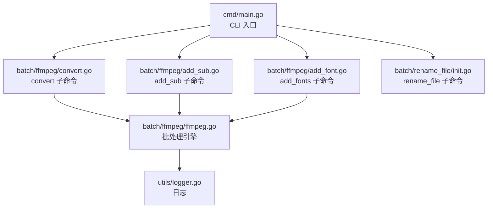
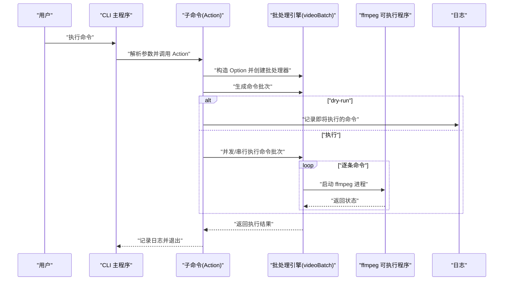
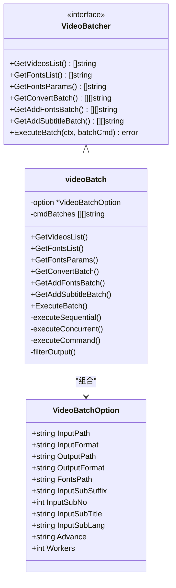
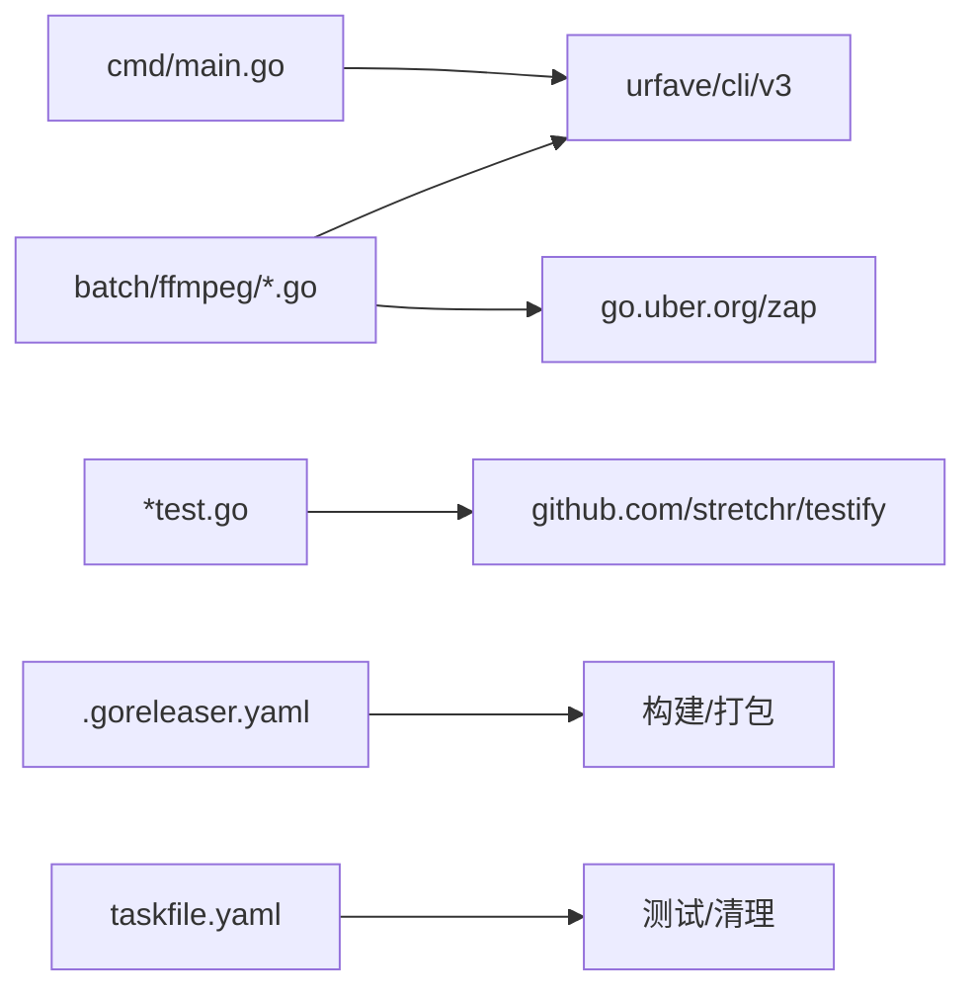

# 配置和部署

<cite>
**本文引用的文件**
- [cmd/main.go](file://cmd/main.go)
- [batch/ffmpeg/ffmpeg.go](file://batch/ffmpeg/ffmpeg.go)
- [batch/ffmpeg/init.go](file://batch/ffmpeg/init.go)
- [batch/ffmpeg/convert.go](file://batch/ffmpeg/convert.go)
- [batch/ffmpeg/add_sub.go](file://batch/ffmpeg/add_sub.go)
- [batch/ffmpeg/add_font.go](file://batch/ffmpeg/add_font.go)
- [batch/rename_file/init.go](file://batch/rename_file/init.go)
- [utils/logger.go](file://utils/logger.go)
- [.goreleaser.yaml](file://.goreleaser.yaml)
- [taskfile.yaml](file://taskfile.yaml)
- [go.mod](file://go.mod)
- [docs/ffmpeg.md](file://docs/ffmpeg.md)
- [CHANGELOG.md](file://CHANGELOG.md)
</cite>

## 目录
1. [简介](#简介)
2. [项目结构](#项目结构)
3. [核心组件](#核心组件)
4. [架构总览](#架构总览)
5. [详细组件分析](#详细组件分析)
6. [依赖分析](#依赖分析)
7. [性能考虑与资源管理](#性能考虑与资源管理)
8. [多平台部署指南](#多平台部署指南)
9. [容器化部署方案](#容器化部署方案)
10. [故障排除指南](#故障排除指南)
11. [结论](#结论)
12. [附录：命令与参数速查](#附录命令与参数速查)

## 简介
本文件面向 batcher 工具的使用者与运维人员，提供从配置到部署的完整指南。内容涵盖：
- 命令行参数与行为说明
- 日志与运行时行为
- 多平台编译与发布
- 容器化部署思路
- 性能调优与资源管理最佳实践
- 常见问题与故障排除

## 项目结构
batcher 采用模块化的命令组织方式，主程序通过 CLI 注册子命令；视频批处理功能集中在 ffmpeg 包中，文件重命名功能在独立包中；日志统一由 utils 提供。

图表来源
- [cmd/main.go:13-28](file://cmd/main.go#L13-L28)
- [batch/ffmpeg/convert.go:11-63](file://batch/ffmpeg/convert.go#L11-L63)
- [batch/ffmpeg/add_sub.go:11-88](file://batch/ffmpeg/add_sub.go#L11-L88)
- [batch/ffmpeg/add_font.go:11-69](file://batch/ffmpeg/add_font.go#L11-L69)
- [batch/ffmpeg/ffmpeg.go:40-64](file://batch/ffmpeg/ffmpeg.go#L40-L64)
- [utils/logger.go:11-28](file://utils/logger.go#L11-L28)

章节来源
- [cmd/main.go:13-28](file://cmd/main.go#L13-L28)
- [batch/ffmpeg/convert.go:11-63](file://batch/ffmpeg/convert.go#L11-L63)
- [batch/ffmpeg/add_sub.go:11-88](file://batch/ffmpeg/add_sub.go#L11-L88)
- [batch/ffmpeg/add_font.go:11-69](file://batch/ffmpeg/add_font.go#L11-L69)
- [batch/ffmpeg/ffmpeg.go:40-64](file://batch/ffmpeg/ffmpeg.go#L40-L64)
- [utils/logger.go:11-28](file://utils/logger.go#L11-L28)

## 核心组件
- CLI 入口与命令注册：主程序注册 ffmpeg 与 rename_file 两大命令族，并在各子命令中实现具体逻辑。
- 批处理引擎：封装视频扫描、命令生成、并发执行与输出路径映射等能力。
- 日志系统：基于 zap 提供带时间、调用者信息的日志输出，便于排障与审计。
- 发布与任务：通过 GoReleaser 进行跨平台构建与打包；Taskfile 提供测试与清理任务。

章节来源
- [cmd/main.go:13-28](file://cmd/main.go#L13-L28)
- [batch/ffmpeg/ffmpeg.go:40-64](file://batch/ffmpeg/ffmpeg.go#L40-L64)
- [utils/logger.go:11-28](file://utils/logger.go#L11-L28)
- [.goreleaser.yaml:14-40](file://.goreleaser.yaml#L14-L40)
- [taskfile.yaml:4-16](file://taskfile.yaml#L4-L16)

## 架构总览
下图展示 CLI 调用到批处理执行的关键流程，以及日志与外部 ffmpeg 的交互。

图表来源
- [cmd/main.go:13-28](file://cmd/main.go#L13-L28)
- [batch/ffmpeg/convert.go:25-62](file://batch/ffmpeg/convert.go#L25-L62)
- [batch/ffmpeg/add_sub.go:45-86](file://batch/ffmpeg/add_sub.go#L45-L86)
- [batch/ffmpeg/add_font.go:30-67](file://batch/ffmpeg/add_font.go#L30-L67)
- [batch/ffmpeg/ffmpeg.go:218-299](file://batch/ffmpeg/ffmpeg.go#L218-L299)
- [utils/logger.go:11-28](file://utils/logger.go#L11-L28)

## 详细组件分析

### CLI 与命令组织
- 主程序注册 ffmpeg 与 rename_file 两个命令族，子命令在各自包内定义。
- ffmpeg 命令族包含 convert、add_sub、add_fonts 三个子命令，均通过 urfave/cli/v3 实现参数解析与 Action 执行。
- rename_file 命令当前 Action 为空，保留扩展空间。

章节来源
- [cmd/main.go:13-28](file://cmd/main.go#L13-L28)
- [batch/ffmpeg/init.go:61-71](file://batch/ffmpeg/init.go#L61-L71)
- [batch/rename_file/init.go:25-34](file://batch/rename_file/init.go#L25-L34)

### 批处理引擎（videoBatch）
- 数据结构：VideoBatchOption 描述输入/输出路径、格式、字幕参数、并发度等；videoBatch 内部维护 option 与命令批次。
- 功能点：
  - 扫描输入目录，按扩展名筛选目标视频。
  - 生成转换、添加字幕、添加字体的命令批次。
  - 支持并发执行，使用信号量控制并发度；支持 context 取消。
  - 输出路径去重与映射，避免同名覆盖。
  - 调用系统 ffmpeg 可执行程序执行命令。

图表来源
- [batch/ffmpeg/ffmpeg.go:16-43](file://batch/ffmpeg/ffmpeg.go#L16-L43)
- [batch/ffmpeg/ffmpeg.go:47-64](file://batch/ffmpeg/ffmpeg.go#L47-L64)
- [batch/ffmpeg/ffmpeg.go:137-178](file://batch/ffmpeg/ffmpeg.go#L137-L178)
- [batch/ffmpeg/ffmpeg.go:218-299](file://batch/ffmpeg/ffmpeg.go#L218-L299)
- [batch/ffmpeg/ffmpeg.go:301-318](file://batch/ffmpeg/ffmpeg.go#L301-L318)

章节来源
- [batch/ffmpeg/ffmpeg.go:16-64](file://batch/ffmpeg/ffmpeg.go#L16-L64)
- [batch/ffmpeg/ffmpeg.go:137-178](file://batch/ffmpeg/ffmpeg.go#L137-L178)
- [batch/ffmpeg/ffmpeg.go:218-299](file://batch/ffmpeg/ffmpeg.go#L218-L299)
- [batch/ffmpeg/ffmpeg.go:301-318](file://batch/ffmpeg/ffmpeg.go#L301-L318)

### convert 子命令
- 参数要点：input_path、input_format、output_path、output_format、advance、dry-run、workers。
- 行为：生成转换命令批次，可 dry-run 预览，或实际执行；执行前会确保输出目录存在。

章节来源
- [batch/ffmpeg/convert.go:11-63](file://batch/ffmpeg/convert.go#L11-L63)
- [batch/ffmpeg/ffmpeg.go:137-156](file://batch/ffmpeg/ffmpeg.go#L137-L156)

### add_sub 子命令
- 参数要点：除通用参数外，新增 input_sub_suffix、input_sub_no、input_sub_lang、input_sub_title。
- 行为：根据输入视频与同名字幕后缀拼接字幕文件，生成添加字幕的命令批次。

章节来源
- [batch/ffmpeg/add_sub.go:11-88](file://batch/ffmpeg/add_sub.go#L11-L88)
- [batch/ffmpeg/ffmpeg.go:180-216](file://batch/ffmpeg/ffmpeg.go#L180-L216)

### add_fonts 子命令
- 参数要点：input_fonts_path（必填）、input_path、input_format、output_path、output_format、dry-run、workers。
- 行为：扫描字体目录，生成附加字体的命令批次。

章节来源
- [batch/ffmpeg/add_font.go:11-69](file://batch/ffmpeg/add_font.go#L11-L69)
- [batch/ffmpeg/ffmpeg.go:158-178](file://batch/ffmpeg/ffmpeg.go#L158-L178)

### 日志系统
- 使用 zap 控制台编码器输出，包含时间、级别、调用者与耗时，便于定位问题与审计。

章节来源
- [utils/logger.go:11-28](file://utils/logger.go#L11-L28)

## 依赖分析
- CLI 框架：urfave/cli/v3，负责命令注册、参数解析与 Action 调用。
- 日志：go.uber.org/zap，提供高性能日志输出。
- 测试：github.com/stretchr/testify，用于断言与测试辅助。
- 发布：GoReleaser，跨平台构建与打包。
- 任务：Taskfile，提供测试与清理任务。

图表来源
- [go.mod:5-16](file://go.mod#L5-L16)
- [cmd/main.go:10](file://cmd/main.go#L10)
- [batch/ffmpeg/ffmpeg.go:13](file://batch/ffmpeg/ffmpeg.go#L13)
- [.goreleaser.yaml:14-40](file://.goreleaser.yaml#L14-L40)
- [taskfile.yaml:4-16](file://taskfile.yaml#L4-L16)

章节来源
- [go.mod:5-16](file://go.mod#L5-L16)
- [cmd/main.go:10](file://cmd/main.go#L10)
- [batch/ffmpeg/ffmpeg.go:13](file://batch/ffmpeg/ffmpeg.go#L13)
- [.goreleaser.yaml:14-40](file://.goreleaser.yaml#L14-L40)
- [taskfile.yaml:4-16](file://taskfile.yaml#L4-L16)

## 性能考虑与资源管理
- 并发策略：通过 workers 控制并发度；默认串行（1），可根据 CPU/IO 能力调整；高并发时注意磁盘与内存占用。
- 执行模型：支持 context 取消，便于在大量任务中优雅中断。
- 输出去重：自动对重名文件追加序号，避免覆盖与冲突。
- ffmpeg 调用：按命令参数逐条执行，标准输出/错误直接透传，便于实时观察进度与异常。
- 建议：
  - CPU 密集型转换建议降低并发度，避免过载。
  - IO 密集型场景可适度提高并发，但需监控磁盘队列深度。
  - 使用 dry-run 预估任务规模与耗时，再决定并发度。

章节来源
- [batch/ffmpeg/ffmpeg.go:218-299](file://batch/ffmpeg/ffmpeg.go#L218-L299)
- [batch/ffmpeg/ffmpeg.go:301-318](file://batch/ffmpeg/ffmpeg.go#L301-L318)

## 多平台部署指南

### Windows
- 安装 ffmpeg：确保系统 PATH 中可找到 ffmpeg 或 ffmpeg.exe。
- 下载二进制：从发布页下载对应 Windows 平台压缩包，解压后将可执行文件置于 PATH 或项目目录。
- 运行示例：使用 convert 子命令进行格式转换，结合 dry-run 验证命令。

章节来源
- [.goreleaser.yaml:27-31](file://.goreleaser.yaml#L27-L31)
- [docs/ffmpeg.md:3](file://docs/ffmpeg.md#L3)

### Linux
- 安装 ffmpeg：通过发行版包管理器安装 ffmpeg。
- 下载二进制：选择对应 Linux 架构的压缩包，解压后赋予执行权限。
- 运行：直接执行可执行文件，按需指定参数。

章节来源
- [.goreleaser.yaml:27-31](file://.goreleaser.yaml#L27-L31)
- [docs/ffmpeg.md:3](file://docs/ffmpeg.md#L3)

### macOS
- 安装 ffmpeg：使用 Homebrew 安装 ffmpeg。
- 下载二进制：选择 Darwin 架构压缩包，解压后可直接运行。
- Apple Silicon：可结合硬件加速编码器进行高效转码。

章节来源
- [.goreleaser.yaml:27-31](file://.goreleaser.yaml#L27-L31)
- [docs/ffmpeg.md:28](file://docs/ffmpeg.md#L28)

## 容器化部署方案
- 基础镜像：选择包含 ffmpeg 的基础镜像（如官方 ffmpeg 镜像或包含 ffmpeg 的 alpine/ubuntu 镜像）。
- 镜像构建步骤建议：
  - 复制可执行文件与必要资源（字体、字幕等）。
  - 设置工作目录与入口命令。
  - 挂载数据卷以接收输入与输出。
- 运行示例：挂载宿主机输入/输出目录，以 convert/add_sub/add_fonts 子命令执行批处理。
- 注意事项：
  - 确保容器内 ffmpeg 可用且版本满足需求。
  - 合理设置 CPU/内存限制，避免与宿主机资源争抢。
  - 使用只读挂载保护输入数据，输出单独挂载写入。

（本节为概念性指导，不直接对应具体源文件）

## 故障排除指南
- ffmpeg 不可用
  - 现象：执行时报错提示找不到 ffmpeg。
  - 排查：确认系统已安装 ffmpeg，且可执行文件在 PATH 中。
  - 参考：文档明确要求系统环境需预先安装 ffmpeg。
- 输入/输出路径错误
  - 现象：无法扫描到视频或创建输出目录失败。
  - 排查：检查 input_path 与 output_path 权限与存在性；确认扩展名匹配。
- 字体/字幕路径错误
  - 现象：添加字体或字幕后未生效。
  - 排查：确认 input_fonts_path 与字幕后缀、语言、标题等参数正确。
- 并发导致资源不足
  - 现象：CPU/IO 抖动或任务卡顿。
  - 排查：降低 workers 数值，观察系统负载变化。
- 任务中断
  - 现象：中途取消或超时。
  - 排查：检查 context 是否被取消；适当延长超时或分批执行。

章节来源
- [docs/ffmpeg.md:3](file://docs/ffmpeg.md#L3)
- [batch/ffmpeg/ffmpeg.go:51](file://batch/ffmpeg/ffmpeg.go#L51)
- [batch/ffmpeg/add_font.go:22-27](file://batch/ffmpeg/add_font.go#L22-L27)
- [batch/ffmpeg/add_sub.go:24-44](file://batch/ffmpeg/add_sub.go#L24-L44)

## 结论
batcher 提供了简洁而强大的视频批处理能力，通过 CLI 参数即可完成转换、添加字幕与字体等操作。配合 GoReleaser 的跨平台构建与 Taskfile 的本地任务，可快速落地到多平台与 CI 环境。生产使用中建议结合 dry-run 与合理的并发度，确保稳定性与性能平衡。

## 附录：命令与参数速查

- ffmpeg convert
  - 用途：批量视频格式转换
  - 关键参数：input_path、input_format、output_path、output_format、advance、dry-run、workers
  - 参考：[batch/ffmpeg/convert.go:14-21](file://batch/ffmpeg/convert.go#L14-L21)，[docs/ffmpeg.md:35-43](file://docs/ffmpeg.md#L35-L43)

- ffmpeg add_sub
  - 用途：批量视频添加字幕
  - 关键参数：input_path、input_format、output_path、output_format、advance、input_fonts_path、workers、input_sub_suffix、input_sub_no、input_sub_lang、input_sub_title
  - 参考：[batch/ffmpeg/add_sub.go:16-44](file://batch/ffmpeg/add_sub.go#L16-L44)，[docs/ffmpeg.md:54-66](file://docs/ffmpeg.md#L54-L66)

- ffmpeg add_fonts
  - 用途：批量视频添加字体
  - 关键参数：input_path、input_format、output_path、output_format、dry-run、workers、input_fonts_path（必填）
  - 参考：[batch/ffmpeg/add_font.go:15-27](file://batch/ffmpeg/add_font.go#L15-L27)，[docs/ffmpeg.md:75-82](file://docs/ffmpeg.md#L75-L82)

- rename_file
  - 用途：文件重命名工具（当前 Action 为空）
  - 关键参数：input_path、md5
  - 参考：[batch/rename_file/init.go:10-19](file://batch/rename_file/init.go#L10-L19)

- 日志
  - 输出：控制台彩色日志，包含时间、级别、调用者与耗时
  - 参考：[utils/logger.go:11-28](file://utils/logger.go#L11-L28)

- 发布与构建
  - 平台：linux/freebsd/windows/darwin
  - 架构：amd64/386/arm/arm64（含 armv6/7）
  - 参考：[.goreleaser.yaml:27-40](file://.goreleaser.yaml#L27-L40)

- 版本变更
  - 参考：[CHANGELOG.md:3-6](file://CHANGELOG.md#L3-L6)