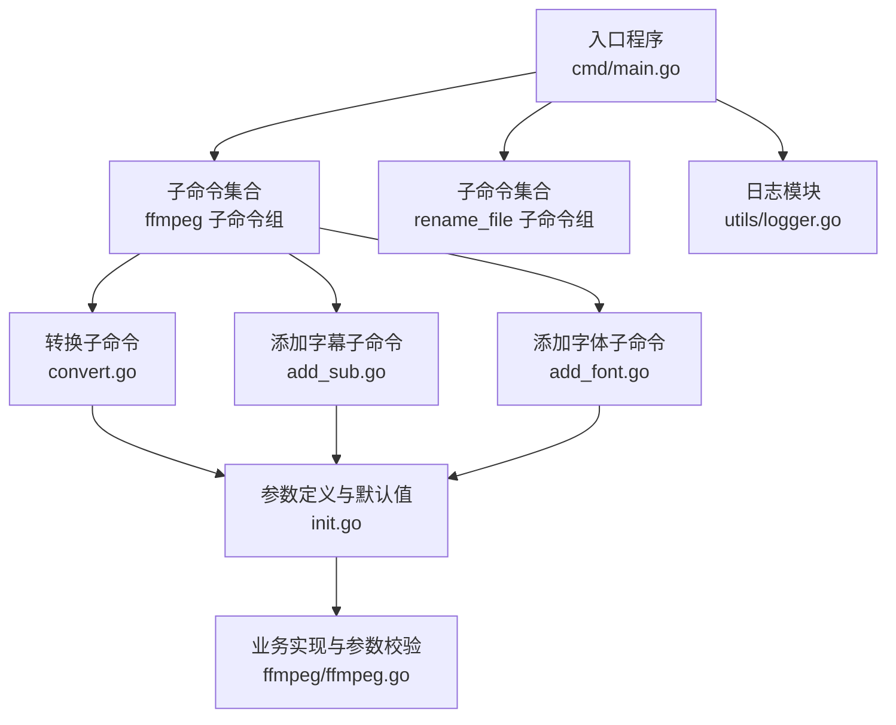
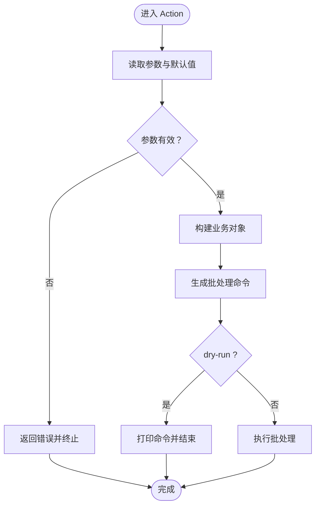
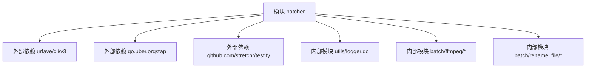

# 配置管理

<cite>
**本文引用的文件**
- [cmd/main.go](file://cmd/main.go)
- [batch/ffmpeg/init.go](file://batch/ffmpeg/init.go)
- [batch/ffmpeg/convert.go](file://batch/ffmpeg/convert.go)
- [batch/ffmpeg/add_sub.go](file://batch/ffmpeg/add_sub.go)
- [batch/ffmpeg/add_font.go](file://batch/ffmpeg/add_font.go)
- [batch/ffmpeg/ffmpeg.go](file://batch/ffmpeg/ffmpeg.go)
- [batch/rename_file/init.go](file://batch/rename_file/init.go)
- [utils/logger.go](file://utils/logger.go)
- [utils/file.go](file://utils/file.go)
- [go.mod](file://go.mod)
- [taskfile.yaml](file://taskfile.yaml)
</cite>

## 目录
1. [简介](#简介)
2. [项目结构](#项目结构)
3. [核心组件](#核心组件)
4. [架构总览](#架构总览)
5. [详细组件分析](#详细组件分析)
6. [依赖分析](#依赖分析)
7. [性能考虑](#性能考虑)
8. [故障排查指南](#故障排查指南)
9. [结论](#结论)
10. [附录](#附录)

## 简介
本文件系统性说明 batcher 工具的配置管理方式，涵盖命令行参数、环境变量、配置文件与参数验证/错误处理机制，并提供典型场景的配置示例与最佳实践。当前仓库采用 urfave/cli/v3 构建 CLI 子命令体系，参数以 flag 的形式在各子命令中声明与解析；日志由 zap 提供；未发现内置配置文件解析逻辑或环境变量读取代码。

## 项目结构
- 入口程序负责注册顶层命令与子命令，并统一处理错误输出。
- ffmpeg 子命令组提供“转换”“添加字幕”“添加字体”三类批处理能力，参数在各自子命令中声明。
- rename_file 子命令提供基础文件重命名能力，参数较少。
- 日志模块提供控制台彩色日志输出；文件工具提供目录创建等辅助能力。



**图示来源**
- [cmd/main.go:13-28](file://cmd/main.go#L13-L28)
- [batch/ffmpeg/init.go:8-71](file://batch/ffmpeg/init.go#L8-L71)
- [batch/ffmpeg/convert.go:11-63](file://batch/ffmpeg/convert.go#L11-L63)
- [batch/ffmpeg/add_sub.go:11-87](file://batch/ffmpeg/add_sub.go#L11-L87)
- [batch/ffmpeg/add_font.go:11-68](file://batch/ffmpeg/add_font.go#L11-L68)
- [batch/ffmpeg/ffmpeg.go:46-64](file://batch/ffmpeg/ffmpeg.go#L46-L64)
- [utils/logger.go:11-28](file://utils/logger.go#L11-L28)

**章节来源**
- [cmd/main.go:13-28](file://cmd/main.go#L13-L28)
- [batch/ffmpeg/init.go:8-71](file://batch/ffmpeg/init.go#L8-L71)
- [batch/rename_file/init.go:25-34](file://batch/rename_file/init.go#L25-L34)
- [utils/logger.go:11-28](file://utils/logger.go#L11-L28)

## 核心组件
- 命令注册与错误处理：入口程序注册顶层命令与子命令，并在发生错误时输出到标准错误并退出。
- ffmpeg 子命令组：包含转换、添加字幕、添加字体三个子命令，均通过 cli.Flag 定义参数与默认值。
- rename_file 子命令组：包含输入路径与是否使用 MD5 重命名两个参数。
- 日志系统：基于 zap 提供带调用者信息与时间编码的日志输出。
- 参数校验与默认值：在 NewVideoBatch 中对并发工作数进行兜底校验；部分子命令对必需参数进行 Required 标记。

**章节来源**
- [cmd/main.go:13-28](file://cmd/main.go#L13-L28)
- [batch/ffmpeg/init.go:8-71](file://batch/ffmpeg/init.go#L8-L71)
- [batch/ffmpeg/convert.go:25-62](file://batch/ffmpeg/convert.go#L25-L62)
- [batch/ffmpeg/add_sub.go:45-85](file://batch/ffmpeg/add_sub.go#L45-L85)
- [batch/ffmpeg/add_font.go:30-66](file://batch/ffmpeg/add_font.go#L30-L66)
- [batch/ffmpeg/ffmpeg.go:55-64](file://batch/ffmpeg/ffmpeg.go#L55-L64)
- [batch/rename_file/init.go:25-34](file://batch/rename_file/init.go#L25-L34)
- [utils/logger.go:11-28](file://utils/logger.go#L11-L28)

## 架构总览
下图展示 CLI 参数从定义到执行的关键流程：参数在子命令中声明，Action 中读取参数并构造业务对象，随后生成批处理命令列表并在 dry-run 模式下预览或实际执行。

```mermaid
sequenceDiagram
participant U as "用户"
participant CLI as "CLI 命令"
participant Sub as "子命令 Action"
participant Opt as "参数读取"
participant Biz as "业务对象"
participant Exec as "执行器"
U->>CLI : "执行子命令 + 参数"
CLI->>Sub : "调用 Action"
Sub->>Opt : "读取参数与默认值"
Opt-->>Sub : "返回参数值"
Sub->>Biz : "根据参数创建业务对象"
Biz-->>Sub : "返回可执行命令列表"
Sub->>Exec : "按需执行或预览"
Exec-->>U : "输出结果/日志"
```

**图示来源**
- [batch/ffmpeg/convert.go:25-62](file://batch/ffmpeg/convert.go#L25-L62)
- [batch/ffmpeg/add_sub.go:45-85](file://batch/ffmpeg/add_sub.go#L45-L85)
- [batch/ffmpeg/add_font.go:30-66](file://batch/ffmpeg/add_font.go#L30-L66)
- [batch/ffmpeg/ffmpeg.go:46-64](file://batch/ffmpeg/ffmpeg.go#L46-L64)

## 详细组件分析

### 命令行参数与默认值
- 顶层命令
  - 名称与用途：顶层命令用于组织子命令，隐藏版本信息，提供通用使用说明。
  - 子命令注册：注册 ffmpeg 与 rename_file 两类子命令。
  - 错误处理：捕获运行时错误并输出到标准错误，退出码 1。

- ffmpeg 子命令组
  - 组名称与描述：提供视频批处理能力，包含转换、添加字幕、添加字体三个子命令。
  - 共享参数（在 init.go 中定义）：
    - 输入路径：默认当前目录
    - 输入格式：默认 mp4
    - 输出路径：默认当前目录下的 result 子目录
    - 输出格式：默认 mkv
    - 高级自定义参数：字符串，用于拼接 ffmpeg 命令片段
    - 并发工作数：整型，默认 1（串行）
    - 是否仅预览：布尔，默认 false
    - 字体文件夹：字符串，添加字体时必填
  - 各子命令参数覆盖与新增：
    - 转换子命令：读取共享参数，生成转换命令列表；支持 dry-run 预览。
    - 添加字幕子命令：在共享参数基础上新增字幕后缀、字幕编号、语言、标题等默认值。
    - 添加字体子命令：在共享参数基础上新增字体文件夹参数（必填），默认值为 fonts。

- rename_file 子命令组
  - 输入路径：默认当前目录
  - 是否使用 MD5：布尔，开启后以 MD5 作为文件名

- 参数读取与默认值来源
  - 所有参数均通过 cli.Flag 在子命令 Action 中以 c.String/c.Int/c.Bool 读取。
  - 默认值来源于 cli.Flag 的 Value 字段；必要参数通过 Required 标记强制。

**章节来源**
- [cmd/main.go:13-28](file://cmd/main.go#L13-L28)
- [batch/ffmpeg/init.go:8-71](file://batch/ffmpeg/init.go#L8-L71)
- [batch/ffmpeg/convert.go:14-22](file://batch/ffmpeg/convert.go#L14-L22)
- [batch/ffmpeg/add_sub.go:16-44](file://batch/ffmpeg/add_sub.go#L16-L44)
- [batch/ffmpeg/add_font.go:15-28](file://batch/ffmpeg/add_font.go#L15-L28)
- [batch/rename_file/init.go:10-20](file://batch/rename_file/init.go#L10-L20)

### 环境变量配置方法与最佳实践
- 当前实现未发现内置的环境变量读取逻辑。建议在需要时扩展：
  - 在 Action 中显式读取环境变量并与 cli 参数合并，明确优先级顺序。
  - 对于敏感参数（如密钥、令牌），优先使用环境变量注入，避免明文写入配置文件。
  - 对于路径类参数，建议结合环境变量与 CLI 参数，便于容器化部署与多环境切换。
- 最佳实践
  - 将环境变量映射到 CLI 的同名参数，保持一致性。
  - 在 Action 开始处统一读取并校验，避免分散处理。
  - 对于路径参数，确保末尾不带多余分隔符，必要时进行规范化处理。

**章节来源**
- [batch/ffmpeg/convert.go:25-62](file://batch/ffmpeg/convert.go#L25-L62)
- [batch/ffmpeg/add_sub.go:45-85](file://batch/ffmpeg/add_sub.go#L45-L85)
- [batch/ffmpeg/add_font.go:30-66](file://batch/ffmpeg/add_font.go#L30-L66)

### 配置文件管理（格式、优先级与覆盖规则）
- 当前实现未发现内置的配置文件解析逻辑（如 YAML/JSON）。建议在需要时扩展：
  - 支持的格式：YAML（推荐），JSON。
  - 文件位置：优先查找工作目录下的 .batcherrc 或 config.yaml，其次考虑 XDG 配置目录。
  - 解析策略：先加载默认值，再按顺序覆盖（命令行 > 环境变量 > 配置文件）。
  - 覆盖规则：命令行参数具有最高优先级；环境变量次之；配置文件最低。
- 实施要点
  - 在 Action 之前解析配置文件，将键映射到对应 CLI 参数。
  - 对路径、布尔、整数等类型进行严格校验与转换。
  - 提供“配置文件示例”与“参数对照表”，便于用户迁移。

**章节来源**
- [batch/ffmpeg/convert.go:25-62](file://batch/ffmpeg/convert.go#L25-L62)
- [batch/ffmpeg/add_sub.go:45-85](file://batch/ffmpeg/add_sub.go#L45-L85)
- [batch/ffmpeg/add_font.go:30-66](file://batch/ffmpeg/add_font.go#L30-L66)

### 参数验证与错误处理机制
- 参数默认值与兜底
  - 并发工作数小于等于 0 时自动设为 1，保证至少串行执行。
- 必填参数
  - 添加字体子命令的字体文件夹参数标记为必填，若未提供将触发 CLI 层面的校验与提示。
- 行为开关
  - dry-run 模式下仅打印将要执行的命令，不实际执行，便于预检。
- 错误传播
  - Action 内部对创建批处理、生成命令、执行批处理等阶段的错误进行封装并返回，由入口程序统一输出到标准错误并退出。
- 日志记录
  - 使用 zap 记录关键事件与错误上下文，便于定位问题。



**图示来源**
- [batch/ffmpeg/ffmpeg.go:55-64](file://batch/ffmpeg/ffmpeg.go#L55-L64)
- [batch/ffmpeg/add_font.go:26-27](file://batch/ffmpeg/add_font.go#L26-L27)
- [batch/ffmpeg/convert.go:47-52](file://batch/ffmpeg/convert.go#L47-L52)
- [batch/ffmpeg/add_sub.go:71-76](file://batch/ffmpeg/add_sub.go#L71-L76)
- [batch/ffmpeg/add_font.go:52-57](file://batch/ffmpeg/add_font.go#L52-L57)

**章节来源**
- [batch/ffmpeg/ffmpeg.go:55-64](file://batch/ffmpeg/ffmpeg.go#L55-L64)
- [batch/ffmpeg/add_font.go:26-27](file://batch/ffmpeg/add_font.go#L26-L27)
- [batch/ffmpeg/convert.go:47-52](file://batch/ffmpeg/convert.go#L47-L52)
- [batch/ffmpeg/add_sub.go:71-76](file://batch/ffmpeg/add_sub.go#L71-L76)
- [cmd/main.go:23-27](file://cmd/main.go#L23-L27)
- [utils/logger.go:11-28](file://utils/logger.go#L11-L28)

### 具体配置示例与常见场景
- 示例一：批量转换视频格式
  - 场景：将当前目录下所有 mp4 视频转为 mkv，输出到 result 子目录，启用 dry-run 预览。
  - 关键参数：input_path、input_format、output_path、output_format、dry-run。
  - 参考路径：[batch/ffmpeg/convert.go:14-22](file://batch/ffmpeg/convert.go#L14-L22)
- 示例二：为视频添加字幕
  - 场景：为指定字幕后缀、语言与标题的字幕添加到视频，同时可指定字体文件夹。
  - 关键参数：input_sub_suffix、input_sub_no、input_sub_lang、input_sub_title、input_fonts_path。
  - 参考路径：[batch/ffmpeg/add_sub.go:16-44](file://batch/ffmpeg/add_sub.go#L16-L44)
- 示例三：为视频附加字体
  - 场景：将字体文件夹中的字体附加到视频，输出到目标目录。
  - 关键参数：input_fonts_path（必填）、workers。
  - 参考路径：[batch/ffmpeg/add_font.go:15-28](file://batch/ffmpeg/add_font.go#L15-L28)
- 示例四：重命名文件
  - 场景：对指定目录下的文件进行重命名，可选择使用 MD5 作为新文件名。
  - 关键参数：input_path、md5。
  - 参考路径：[batch/rename_file/init.go:10-20](file://batch/rename_file/init.go#L10-L20)

**章节来源**
- [batch/ffmpeg/convert.go:14-22](file://batch/ffmpeg/convert.go#L14-L22)
- [batch/ffmpeg/add_sub.go:16-44](file://batch/ffmpeg/add_sub.go#L16-L44)
- [batch/ffmpeg/add_font.go:15-28](file://batch/ffmpeg/add_font.go#L15-L28)
- [batch/rename_file/init.go:10-20](file://batch/rename_file/init.go#L10-L20)

## 依赖分析
- 外部依赖
  - CLI：urfave/cli/v3，提供命令注册、参数解析与帮助信息。
  - 日志：go.uber.org/zap，提供高性能日志输出。
  - 测试：github.com/stretchr/testify，提供断言与测试工具。
- 内部依赖
  - ffmpeg 子命令组依赖 utils/logger 进行日志输出。
  - rename_file 子命令组依赖 utils/logger 进行日志输出。
  - ffmpeg 子命令组内部通过参数校验与默认值保障健壮性。



**图示来源**
- [go.mod:5-9](file://go.mod#L5-L9)
- [utils/logger.go:11-28](file://utils/logger.go#L11-L28)
- [batch/ffmpeg/init.go:3-6](file://batch/ffmpeg/init.go#L3-L6)
- [batch/rename_file/init.go:6-8](file://batch/rename_file/init.go#L6-L8)

**章节来源**
- [go.mod:5-9](file://go.mod#L5-L9)
- [utils/logger.go:11-28](file://utils/logger.go#L11-L28)
- [batch/ffmpeg/init.go:3-6](file://batch/ffmpeg/init.go#L3-L6)
- [batch/rename_file/init.go:6-8](file://batch/rename_file/init.go#L6-L8)

## 性能考虑
- 并发控制
  - 默认串行（workers=1），适合稳定性和资源占用可控的场景。
  - 建议在 CPU/IO 富余且输入文件较多时适度提高 workers，但需关注磁盘与网络带宽瓶颈。
- 命令生成与执行
  - 批处理命令在内存中生成，注意避免一次性生成过多命令导致内存压力。
  - 执行阶段建议结合进度日志与超时控制，提升可观测性与稳定性。
- I/O 优化
  - 输出目录建议与输入目录分离，避免在同一分区造成写放大。
  - 使用 dry-run 预览可减少无效写操作。

**章节来源**
- [batch/ffmpeg/ffmpeg.go:55-64](file://batch/ffmpeg/ffmpeg.go#L55-L64)
- [batch/ffmpeg/convert.go:47-52](file://batch/ffmpeg/convert.go#L47-L52)
- [batch/ffmpeg/add_sub.go:71-76](file://batch/ffmpeg/add_sub.go#L71-L76)
- [batch/ffmpeg/add_font.go:52-57](file://batch/ffmpeg/add_font.go#L52-L57)

## 故障排查指南
- 常见问题与定位
  - 参数缺失：检查 Required 标记的参数是否传入；确认 CLI 帮助信息与默认值。
  - 路径错误：确认输入/输出路径存在且具备读写权限；必要时使用绝对路径。
  - 并发异常：当 workers<=0 时会回退为 1；检查传入值是否合理。
  - 字体文件夹为空：添加字体子命令要求提供字体文件夹；确认路径正确。
- 日志与调试
  - 使用 zap 输出关键步骤与错误上下文；在 dry-run 模式下核对命令列表。
  - 在 Action 开始处打印参数快照，便于复现问题。
- 目录与文件
  - 使用 utils/file.go 的目录创建能力确保输出目录存在；避免空路径导致的错误。

**章节来源**
- [batch/ffmpeg/ffmpeg.go:55-64](file://batch/ffmpeg/ffmpeg.go#L55-L64)
- [batch/ffmpeg/add_font.go:26-27](file://batch/ffmpeg/add_font.go#L26-L27)
- [utils/file.go:9-31](file://utils/file.go#L9-L31)
- [utils/logger.go:11-28](file://utils/logger.go#L11-L28)

## 结论
- 当前实现以 CLI Flag 为核心配置手段，参数默认值清晰、行为开关明确，错误处理集中在 Action 与入口层，日志系统完善。
- 若需进一步增强配置管理，建议引入配置文件解析与环境变量读取，明确优先级与覆盖规则，并在 Action 早期完成参数归一化。
- 建议补充配置示例与最佳实践文档，帮助用户在不同场景下快速上手。

## 附录
- 任务与测试
  - Taskfile 提供测试数据准备与清理任务，便于本地验证。
  - 单元测试覆盖了目录创建、字体参数生成、转换命令生成与执行等关键路径。

**章节来源**
- [taskfile.yaml:4-16](file://taskfile.yaml#L4-L16)
- [utils/file_test.go:10-53](file://utils/file_test.go#L10-L53)
- [batch/ffmpeg/ffmpeg_test.go:87-163](file://batch/ffmpeg/ffmpeg_test.go#L87-L163)
- [batch/ffmpeg/ffmpeg_test.go:172-210](file://batch/ffmpeg/ffmpeg_test.go#L172-L210)
- [batch/ffmpeg/ffmpeg_test.go:329-356](file://batch/ffmpeg/ffmpeg_test.go#L329-L356)