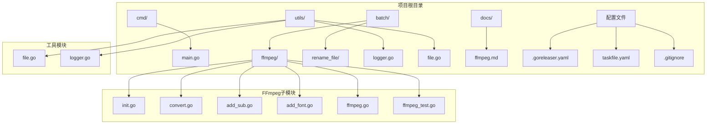
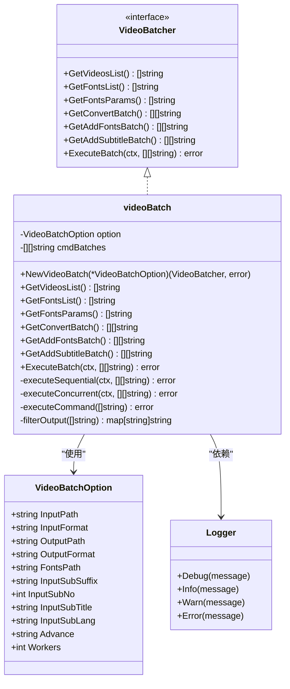
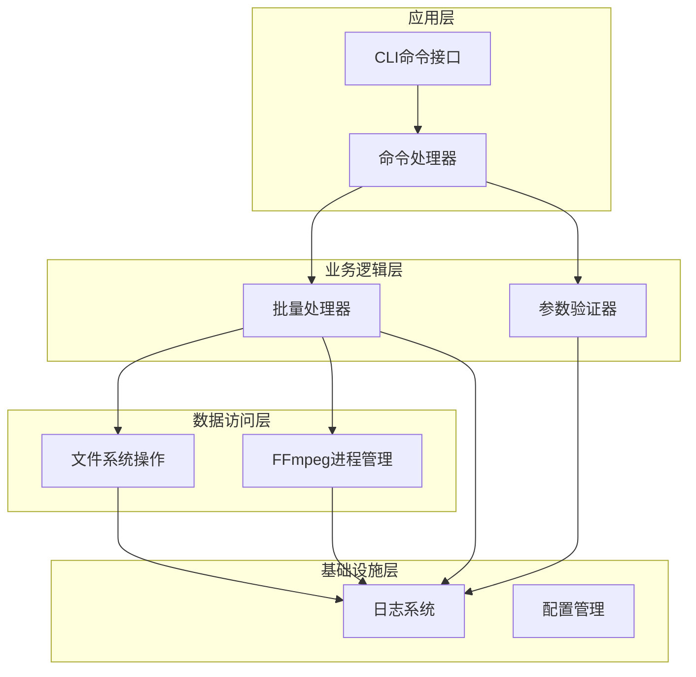
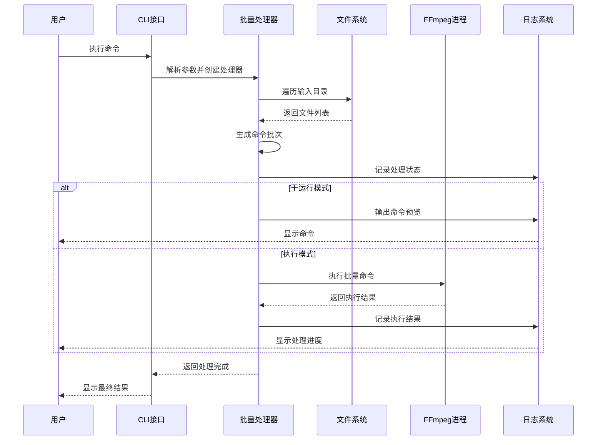
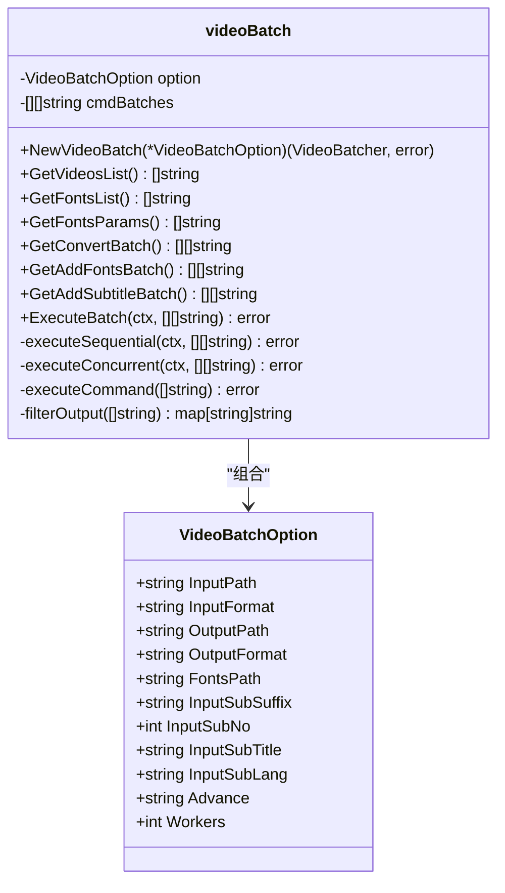
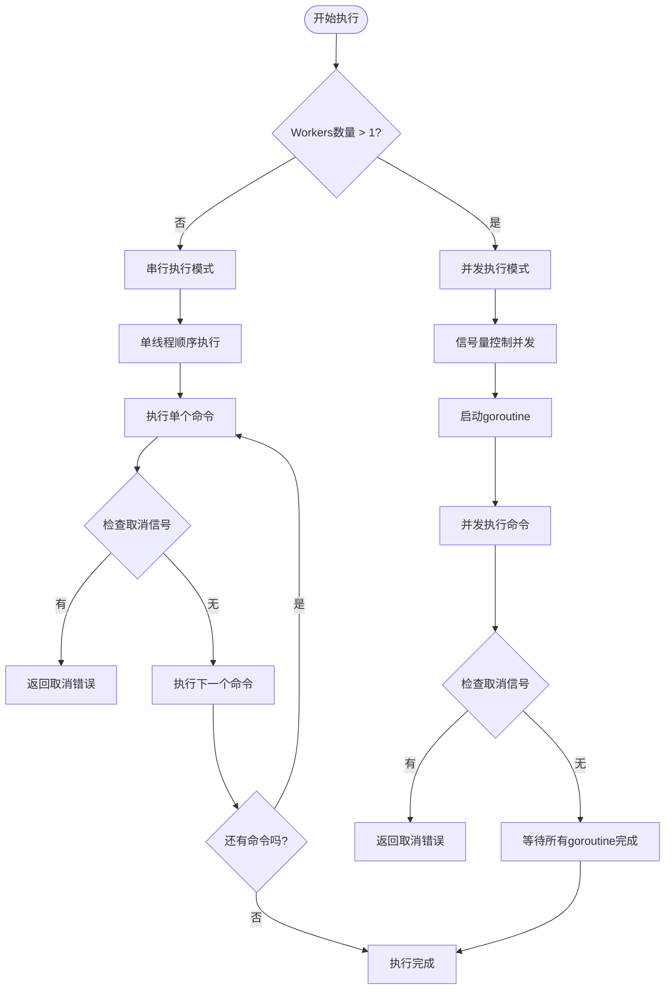
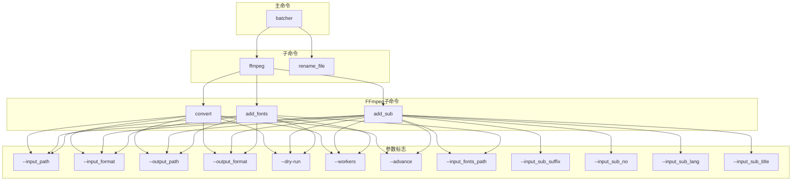
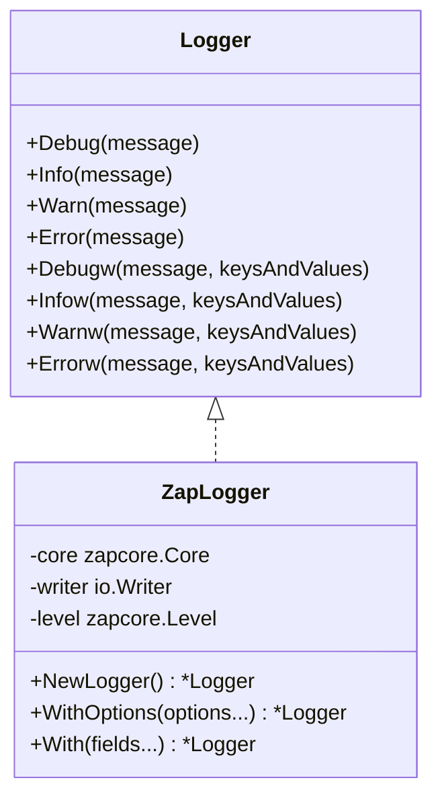
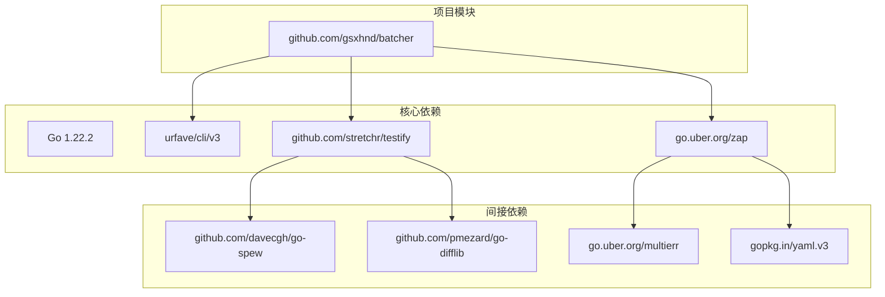
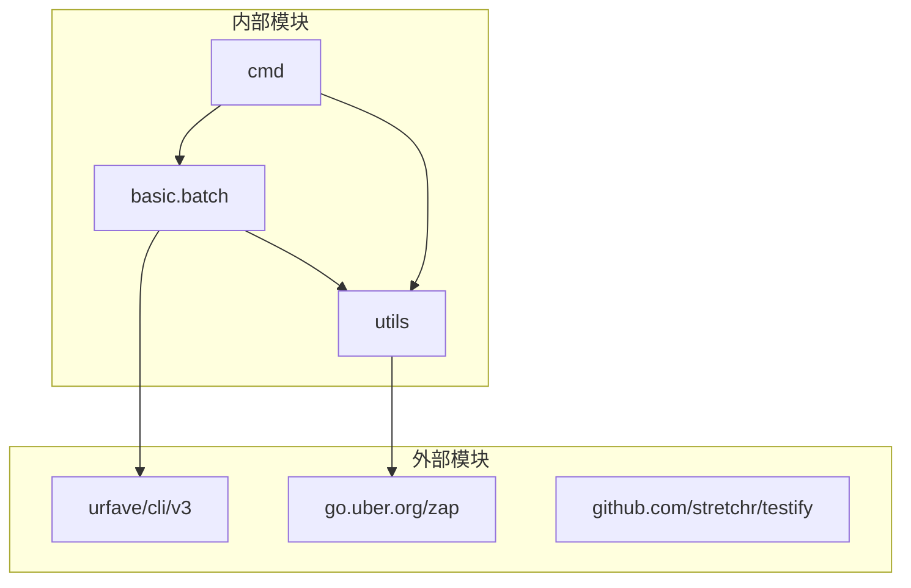

# 项目概述

<cite>
**本文档引用的文件**
- [cmd/main.go](file://cmd/main.go)
- [batch/ffmpeg/ffmpeg.go](file://batch/ffmpeg/ffmpeg.go)
- [batch/ffmpeg/init.go](file://batch/ffmpeg/init.go)
- [batch/ffmpeg/convert.go](file://batch/ffmpeg/convert.go)
- [batch/ffmpeg/add_sub.go](file://batch/ffmpeg/add_sub.go)
- [batch/ffmpeg/add_font.go](file://batch/ffmpeg/add_font.go)
- [batch/rename_file/init.go](file://batch/rename_file/init.go)
- [utils/logger.go](file://utils/logger.go)
- [utils/file.go](file://utils/file.go)
- [docs/ffmpeg.md](file://docs/ffmpeg.md)
- [.goreleaser.yaml](file://.goreleaser.yaml)
- [taskfile.yaml](file://taskfile.yaml)
- [go.mod](file://go.mod)
</cite>

## 目录
1. [简介](#简介)
2. [项目结构](#项目结构)
3. [核心组件](#核心组件)
4. [架构概览](#架构概览)
5. [详细组件分析](#详细组件分析)
6. [依赖分析](#依赖分析)
7. [性能考虑](#性能考虑)
8. [故障排除指南](#故障排除指南)
9. [结论](#结论)

## 简介

batcher 是一个基于 Go 语言开发的命令行批量处理工具，专为媒体文件处理而设计。该项目的核心价值在于为用户提供高效、可靠的批量视频处理解决方案，特别是基于 FFmpeg 的视频批量处理能力。该工具主要面向以下用户群体：

- **内容创作者**：需要批量转换视频格式、添加字幕和字体的个人或工作室
- **媒体处理团队**：需要自动化批量视频处理流程的企业用户
- **系统管理员**：需要在服务器环境中批量处理大量视频文件的技术人员
- **开发者**：需要集成批量视频处理功能的应用程序

项目的主要功能特性包括：
- 基于 FFmpeg 的视频批量转换
- 字幕批量添加功能
- 字体批量嵌入功能
- 文件重命名工具
- 支持并发执行和上下文取消
- 完整的日志记录和错误处理机制

## 项目结构

batcher 采用模块化的项目组织结构，遵循 Go 语言的标准目录约定。项目结构清晰地分离了不同功能模块，便于维护和扩展。

**图表来源**
- [cmd/main.go:1-29](file://cmd/main.go#L1-L29)
- [batch/ffmpeg/ffmpeg.go:1-324](file://batch/ffmpeg/ffmpeg.go#L1-L324)
- [batch/ffmpeg/init.go:1-72](file://batch/ffmpeg/init.go#L1-L72)

**章节来源**
- [cmd/main.go:1-29](file://cmd/main.go#L1-L29)
- [go.mod:1-17](file://go.mod#L1-L17)

## 核心组件

### 主要架构组件

batcher 项目由以下几个核心组件构成：

1. **CLI入口点**：位于 `cmd/main.go`，负责初始化应用程序和命令解析
2. **FFmpeg批量处理器**：核心处理引擎，实现视频批量转换、字幕添加和字体嵌入
3. **文件重命名工具**：提供文件重命名功能
4. **工具模块**：包含日志记录和文件操作工具
5. **配置管理**：通过 CLI 参数和环境变量进行配置

### 组件关系图

**图表来源**
- [batch/ffmpeg/ffmpeg.go:16-64](file://batch/ffmpeg/ffmpeg.go#L16-L64)
- [batch/ffmpeg/ffmpeg.go:30-43](file://batch/ffmpeg/ffmpeg.go#L30-L43)
- [utils/logger.go:11-28](file://utils/logger.go#L11-L28)

**章节来源**
- [batch/ffmpeg/ffmpeg.go:16-64](file://batch/ffmpeg/ffmpeg.go#L16-L64)
- [utils/logger.go:11-28](file://utils/logger.go#L11-L28)

## 架构概览

### 整体架构设计

batcher 采用了分层架构设计，将功能按层次组织，确保各层职责明确且松耦合：

**图表来源**
- [cmd/main.go:13-28](file://cmd/main.go#L13-L28)
- [batch/ffmpeg/ffmpeg.go:47-64](file://batch/ffmpeg/ffmpeg.go#L47-L64)
- [utils/logger.go:11-28](file://utils/logger.go#L11-L28)

### 数据流架构

**图表来源**
- [batch/ffmpeg/convert.go:25-62](file://batch/ffmpeg/convert.go#L25-L62)
- [batch/ffmpeg/ffmpeg.go:218-231](file://batch/ffmpeg/ffmpeg.go#L218-L231)

**章节来源**
- [batch/ffmpeg/convert.go:25-62](file://batch/ffmpeg/convert.go#L25-L62)
- [batch/ffmpeg/ffmpeg.go:218-231](file://batch/ffmpeg/ffmpeg.go#L218-L231)

## 详细组件分析

### FFmpeg批量处理引擎

#### 核心处理类

videoBatch 是 FFmpeg 批量处理的核心实现，提供了完整的视频处理功能：

**图表来源**
- [batch/ffmpeg/ffmpeg.go:40-64](file://batch/ffmpeg/ffmpeg.go#L40-L64)
- [batch/ffmpeg/ffmpeg.go:16-28](file://batch/ffmpeg/ffmpeg.go#L16-L28)

#### 批处理执行策略

系统支持两种执行模式：串行执行和并发执行，以适应不同的性能需求：

**图表来源**
- [batch/ffmpeg/ffmpeg.go:218-286](file://batch/ffmpeg/ffmpeg.go#L218-L286)

**章节来源**
- [batch/ffmpeg/ffmpeg.go:40-64](file://batch/ffmpeg/ffmpeg.go#L40-L64)
- [batch/ffmpeg/ffmpeg.go:218-286](file://batch/ffmpeg/ffmpeg.go#L218-L286)

### CLI命令系统

#### 命令结构设计

batcher 使用 urfave/cli 库构建命令行界面，支持多级命令结构：

**图表来源**
- [batch/ffmpeg/init.go:62-71](file://batch/ffmpeg/init.go#L62-L71)
- [batch/ffmpeg/convert.go:11-22](file://batch/ffmpeg/convert.go#L11-L22)
- [batch/ffmpeg/add_sub.go:11-44](file://batch/ffmpeg/add_sub.go#L11-L44)
- [batch/ffmpeg/add_font.go:11-28](file://batch/ffmpeg/add_font.go#L11-L28)

**章节来源**
- [batch/ffmpeg/init.go:62-71](file://batch/ffmpeg/init.go#L62-L71)
- [batch/ffmpeg/convert.go:11-22](file://batch/ffmpeg/convert.go#L11-L22)
- [batch/ffmpeg/add_sub.go:11-44](file://batch/ffmpeg/add_sub.go#L11-L44)
- [batch/ffmpeg/add_font.go:11-28](file://batch/ffmpeg/add_font.go#L11-L28)

### 工具模块

#### 日志系统

项目使用 zap 日志库提供高性能的日志记录功能：

**图表来源**
- [utils/logger.go:11-28](file://utils/logger.go#L11-L28)

**章节来源**
- [utils/logger.go:11-28](file://utils/logger.go#L11-L28)

## 依赖分析

### 外部依赖

batcher 项目使用了现代化的 Go 依赖管理，主要依赖包括：

**图表来源**
- [go.mod:5-16](file://go.mod#L5-L16)

### 内部模块依赖

**图表来源**
- [cmd/main.go:8-10](file://cmd/main.go#L8-L10)
- [batch/ffmpeg/ffmpeg.go:13](file://batch/ffmpeg/ffmpeg.go#L13)

**章节来源**
- [go.mod:5-16](file://go.mod#L5-L16)
- [cmd/main.go:8-10](file://cmd/main.go#L8-L10)

## 性能考虑

### 并发执行优化

batcher 在设计上充分考虑了性能优化，特别是在批量处理场景中：

1. **信号量控制**：使用信号量限制并发 goroutine 数量，避免资源耗尽
2. **上下文取消**：支持优雅的取消机制，允许用户中断长时间运行的任务
3. **内存管理**：采用流式处理方式，避免一次性加载大量数据到内存
4. **I/O优化**：通过合理的文件系统遍历和命令生成策略减少磁盘 I/O

### 执行模式选择

根据不同的使用场景，系统提供了灵活的执行模式：

- **串行模式**：适合小规模处理或需要精确控制的场景
- **并发模式**：适合大规模批量处理，充分利用多核 CPU 性能

## 故障排除指南

### 常见问题诊断

#### FFmpeg相关问题

1. **FFmpeg未安装**：确保系统已正确安装 FFmpeg，并将其添加到 PATH 环境变量中
2. **权限问题**：检查输入和输出目录的读写权限
3. **文件格式不支持**：确认输入文件格式被 FFmpeg 正确识别

#### 性能问题

1. **处理速度慢**：检查 Workers 参数设置，适当增加并发数
2. **内存占用高**：考虑分批处理大文件集合
3. **CPU利用率低**：检查是否有其他进程占用大量系统资源

#### 日志分析

系统提供了详细的日志记录功能，可以通过日志分析定位问题：

- **调试级别**：详细的操作步骤和参数信息
- **信息级别**：处理进度和结果摘要
- **错误级别**：异常情况和错误详情

**章节来源**
- [utils/logger.go:11-28](file://utils/logger.go#L11-L28)
- [batch/ffmpeg/ffmpeg.go:288-299](file://batch/ffmpeg/ffmpeg.go#L288-L299)

## 结论

batcher 项目是一个设计精良的命令行批量处理工具，具有以下显著特点：

### 技术优势

1. **模块化设计**：清晰的模块划分和职责分离，便于维护和扩展
2. **高性能执行**：支持并发处理和优雅的取消机制
3. **完善的错误处理**：全面的错误捕获和用户友好的错误信息
4. **可扩展性**：良好的架构设计支持未来功能扩展

### 应用价值

- **提高工作效率**：自动化批量处理减少人工干预
- **保证处理质量**：标准化的处理流程确保一致性
- **降低学习成本**：直观的命令行接口和详细的帮助文档
- **跨平台兼容**：支持多种操作系统和硬件架构

### 发展前景

随着多媒体内容需求的增长，batcher 项目具有广阔的发展空间。未来可以考虑的功能增强包括：

- 更多的视频处理算法支持
- 图形用户界面版本
- Web API 接口
- 云端分布式处理能力

对于初学者来说，batcher 提供了友好的入门体验；对于有经验的开发者，其清晰的架构和丰富的功能特性提供了充足的技术深度和扩展空间。